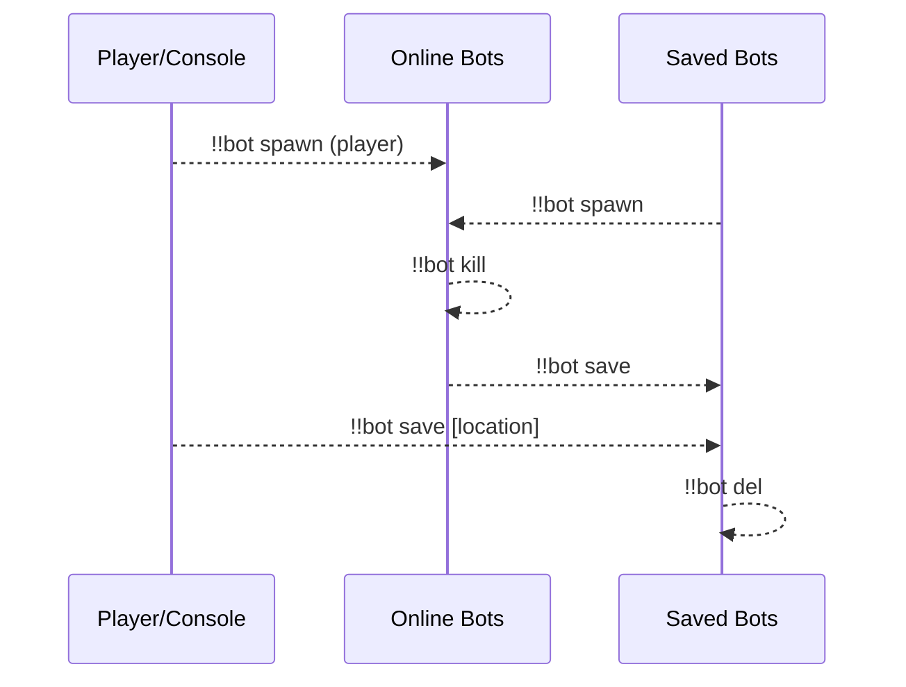
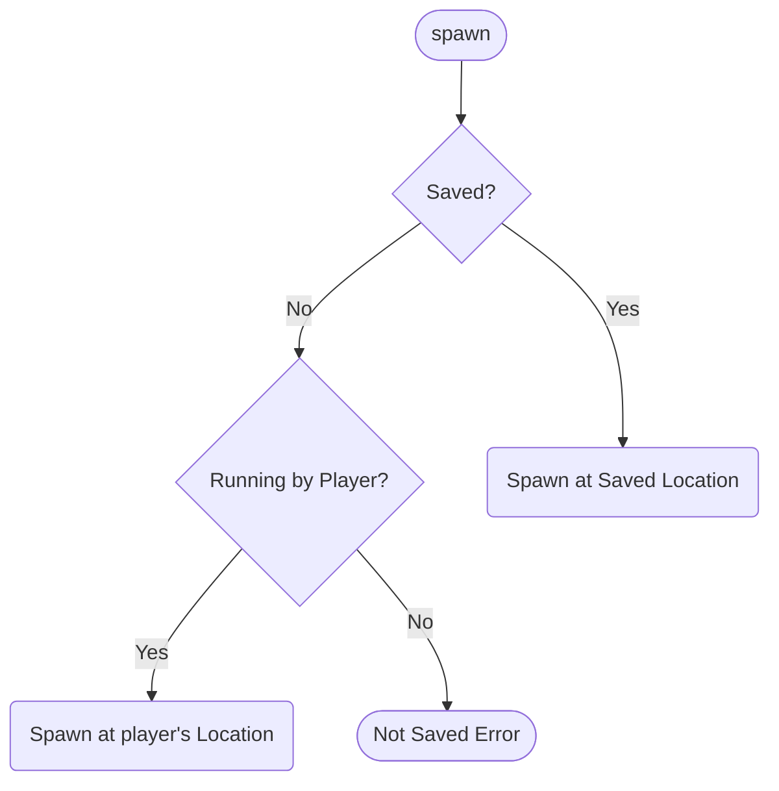
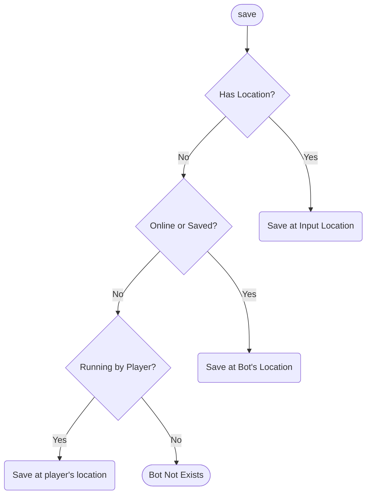
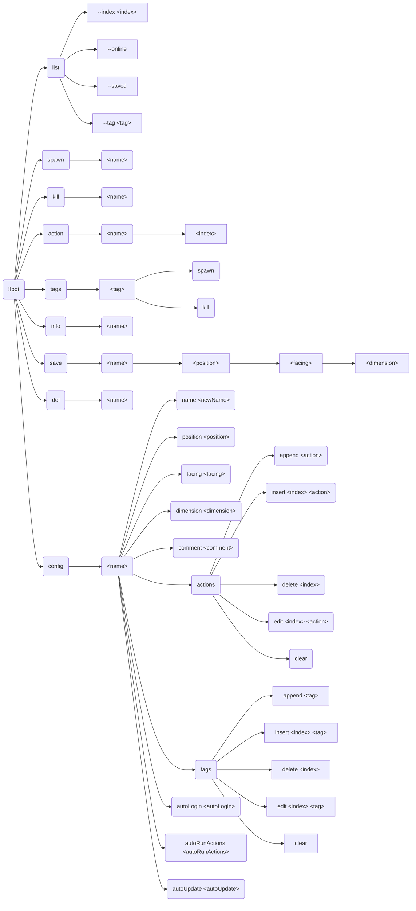
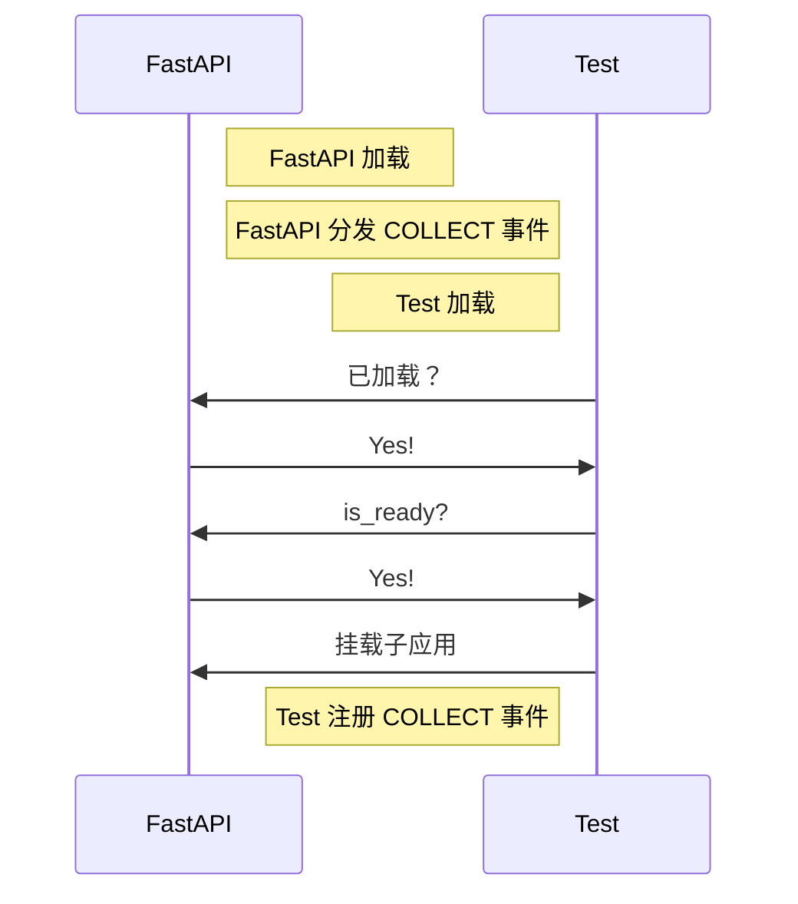
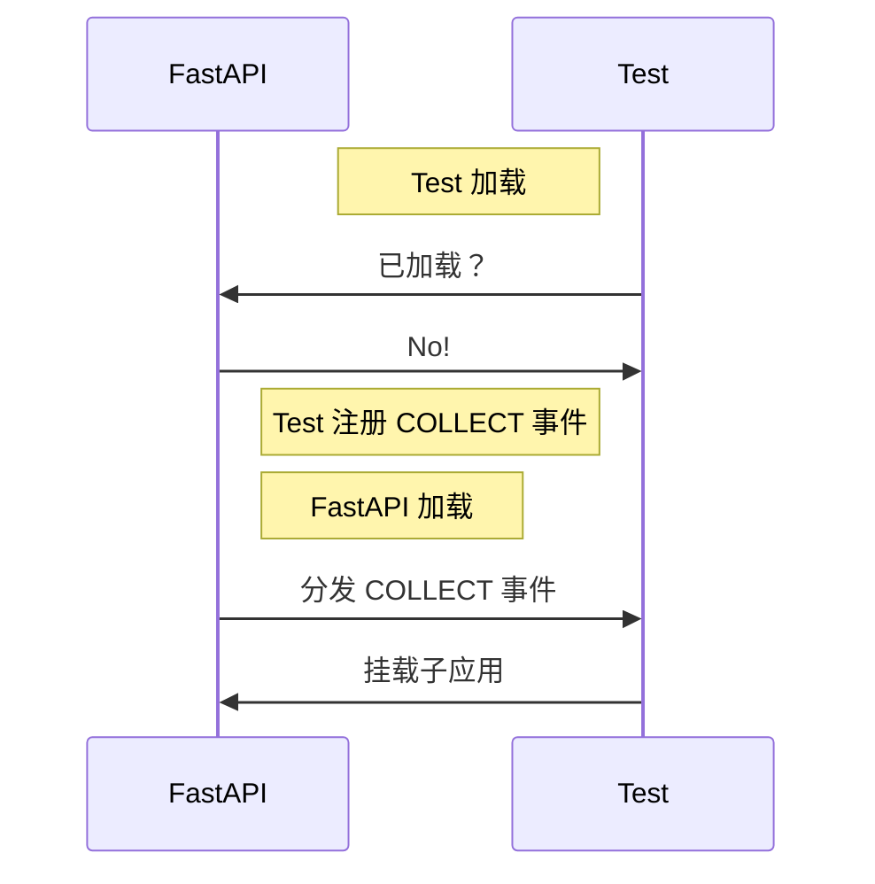
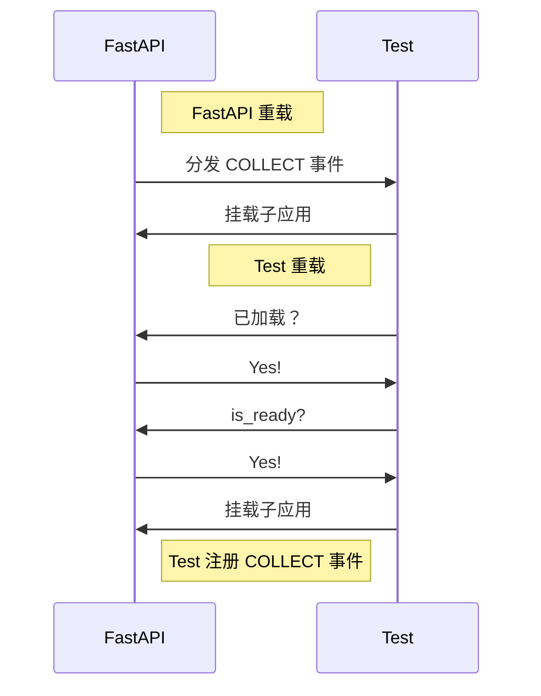
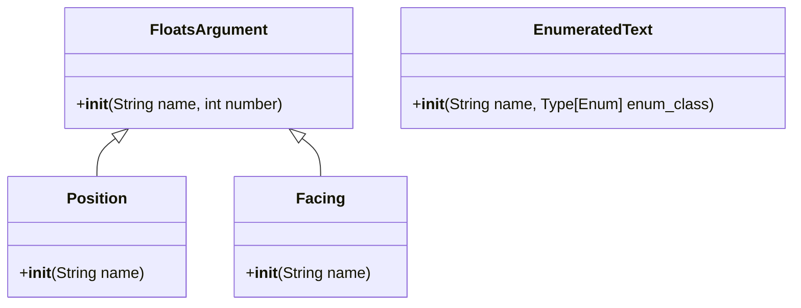

[English](full.md) | **中文**

\>\>\> [回到索引](/readme-zh_cn.md)

# 全插件信息集合

使用 `ctrl-f` 来进行页面中全文搜索，从而找到你感兴趣的东西

## advanced_calculator

### 基本信息

- 插件 ID: `advanced_calculator`
- 插件名: AdvancedCalculator
- 版本: 0.3.1
  - 元数据版本: 0.3.1
  - 发布版本: 0.3.1
- 总下载量: 1943
- 作者: [Andy Zhang](https://github.com/AnzhiZhang)
- 仓库: https://github.com/AnzhiZhang/MCDReforgedPlugins
- 仓库插件页: https://github.com/AnzhiZhang/MCDReforgedPlugins/tree/master/src/advanced_calculator
- 标签: [`工具`](/labels/tool/readme-zh_cn.md)
- 描述: 提供游戏内多种便捷计算

### 插件依赖

| 插件 ID | 依赖需求 |
| --- | --- |

### 包依赖

| Python 包 | 依赖需求 |
| --- | --- |

### 介绍

# AdvancedCalculator

> 提供游戏内多种便捷计算

## 使用

您可以使用 `=<expression>` 直接计算表达式，或使用 `==<count/expression>` 将物品数转换堆叠数。

| 指令 | 用途 | 示例 | 结果 |
| - | - | - | - |
| !!calc \<expression> | 计算表达式 | !!calc 1+1 | 1+1=2 |
| !!calc item \<count/expression> | 物品数转换堆叠数 | !!calc item 1794 | 1794个物品为1盒2组3个 |
| !!calc item \<box> \<stack> \<single> | 堆叠数转换物品数 | !!calc item 1 10 32 | 1盒10组32个为2400个物品 |
| !!calc color \<red> \<green> \<blue> | 10进制RGB转16进制 | !!calc color 255 0 255 | (255, 0, 255) -> #FF00FF |
| !!calc color \<#HEX> | 16十进制RGB转10进制 | !!calc color #00FF00 | #00FF00 -> (0, 255, 0) |

### 下载

> [!IMPORTANT]
> 使用插件之前，先阅读仓库中的 README。

| 文件 | 版本 | 上传时间 (UTC) | 大小 | 下载数 | 操作 |
| --- | --- | --- | --- | --- | --- |
| [AdvancedCalculator-v0.3.1.mcdr](https://github.com/AnzhiZhang/MCDReforgedPlugins/releases/tag/advanced_calculator-v0.3.1) | 0.3.1 | 2023/01/19 17:01:07 | 2.46KB | 1314 | [下载](https://github.com/AnzhiZhang/MCDReforgedPlugins/releases/download/advanced_calculator-v0.3.1/AdvancedCalculator-v0.3.1.mcdr) |
| [AdvancedCalculator-v0.3.0.mcdr](https://github.com/AnzhiZhang/MCDReforgedPlugins/releases/tag/advanced_calculator-v0.3.0) | 0.3.0 | 2022/10/21 20:03:33 | 2.42KB | 297 | [下载](https://github.com/AnzhiZhang/MCDReforgedPlugins/releases/download/advanced_calculator-v0.3.0/AdvancedCalculator-v0.3.0.mcdr) |
| [AdvancedCalculator-v0.2.1.mcdr](https://github.com/AnzhiZhang/MCDReforgedPlugins/releases/tag/advanced_calculator-v0.2.1) | 0.2.1 | 2022/07/21 13:20:06 | 2.38KB | 230 | [下载](https://github.com/AnzhiZhang/MCDReforgedPlugins/releases/download/advanced_calculator-v0.2.1/AdvancedCalculator-v0.2.1.mcdr) |

## advanced_whitelist_r

### 基本信息

- 插件 ID: `advanced_whitelist_r`
- 插件名: AdvancedWhitelistR
- 版本: 1.0.3
  - 元数据版本: 1.0.3
  - 发布版本: 1.0.3
- 总下载量: 717
- 作者: [noionion](https://github.com/2X-ercha), [GamerNoTitle](https://github.com/GamerNoTitle)
- 仓库: https://github.com/EMUnion/AdvancedWhitelistR
- 仓库插件页: https://github.com/EMUnion/AdvancedWhitelistR/tree/master
- 标签: [`管理`](/labels/management/readme-zh_cn.md)
- 描述: For outline-model Whitelist

### 插件依赖

| 插件 ID | 依赖需求 |
| --- | --- |
| [mcdreforged](https://github.com/Fallen-Breath/MCDReforged) | \>=2.1.0 |

### 包依赖

| Python 包 | 依赖需求 |
| --- | --- |

### 介绍

离线服务器白名单管理

### 下载

> [!IMPORTANT]
> 使用插件之前，先阅读仓库中的 README。

| 文件 | 版本 | 上传时间 (UTC) | 大小 | 下载数 | 操作 |
| --- | --- | --- | --- | --- | --- |
| [AdvancedWhitelistR-v1.0.3.mcdr](https://github.com/EMUnion/AdvancedWhitelistR/releases/tag/1.0.3) | 1.0.3 | 2023/01/04 02:59:30 | 3.73KB | 325 | [下载](https://github.com/EMUnion/AdvancedWhitelistR/releases/download/1.0.3/AdvancedWhitelistR-v1.0.3.mcdr) |
| [AdvancedWhitelistR-v1.0.2.mcdr](https://github.com/EMUnion/AdvancedWhitelistR/releases/tag/1.0.2) | 1.0.2 | 2022/01/24 15:38:16 | 3.5KB | 304 | [下载](https://github.com/EMUnion/AdvancedWhitelistR/releases/download/1.0.2/AdvancedWhitelistR-v1.0.2.mcdr) |
| [AdvancedWhitelistR-v1.0.1.mcdr](https://github.com/EMUnion/AdvancedWhitelistR/releases/tag/1.0.1) | 1.0.1 | 2022/01/24 11:46:47 | 3.5KB | 88 | [下载](https://github.com/EMUnion/AdvancedWhitelistR/releases/download/1.0.1/AdvancedWhitelistR-v1.0.1.mcdr) |

## allow_suicide

### 基本信息

- 插件 ID: `allow_suicide`
- 插件名: allow_suicide
- 版本: 1.0.0
  - 元数据版本: 1.0.0
  - 发布版本: 1.0.0
- 总下载量: 1219
- 作者: [JAs0n](https://github.com/JAs0n319)
- 仓库: https://github.com/JAs0n319/allow_suicide
- 仓库插件页: https://github.com/JAs0n319/allow_suicide/tree/master
- 标签: [`工具`](/labels/tool/readme-zh_cn.md)
- 描述: 允许玩家在没有op权限时自杀

### 插件依赖

| 插件 ID | 依赖需求 |
| --- | --- |
| [mcdreforged](https://github.com/Fallen-Breath/MCDReforged) | \>=2.1.0 |

### 包依赖

| Python 包 | 依赖需求 |
| --- | --- |

### 介绍

允许没有op权限的玩家自杀

### 下载

> [!IMPORTANT]
> 使用插件之前，先阅读仓库中的 README。

| 文件 | 版本 | 上传时间 (UTC) | 大小 | 下载数 | 操作 |
| --- | --- | --- | --- | --- | --- |
| [allow_suicide-v1.0.0.mcdr](https://github.com/JAs0n319/allow_suicide/releases/tag/allow_suicide-v1.0.0) | 1.0.0 | 2023/02/03 18:58:31 | 880B | 1219 | [下载](https://github.com/JAs0n319/allow_suicide/releases/download/allow_suicide-v1.0.0/allow_suicide-v1.0.0.mcdr) |

## auto_backup

### 基本信息

- 插件 ID: `auto_backup`
- 插件名: AutoBackup
- 版本: 0.2.0
  - 元数据版本: 0.2.0
  - 发布版本: 0.2.0
- 总下载量: 45
- 作者: [Kongtu5i](https://github.com/Kongtu5i)
- 仓库: https://github.com/Kongtu5i/AutoBackup
- 仓库插件页: https://github.com/Kongtu5i/AutoBackup/tree/main
- 标签: [`管理`](/labels/management/readme-zh_cn.md)
- 描述: 当自动备份名单中的玩家加入服务器时自动备份

### 插件依赖

| 插件 ID | 依赖需求 |
| --- | --- |
| [mcdreforged](https://github.com/Fallen-Breath/MCDReforged) | \>=2.6.0 |

### 包依赖

| Python 包 | 依赖需求 |
| --- | --- |

### 介绍

当名单中的玩家加入我的世界服务器时进行自动备份

### 下载

> [!IMPORTANT]
> 使用插件之前，先阅读仓库中的 README。

| 文件 | 版本 | 上传时间 (UTC) | 大小 | 下载数 | 操作 |
| --- | --- | --- | --- | --- | --- |
| [AutoBackup-v0.2.0.mcdr](https://github.com/Kongtu5i/AutoBackup/releases/tag/v0.2.0) | 0.2.0 | 2024/04/30 10:42:09 | 2.44KB | 45 | [下载](https://github.com/Kongtu5i/AutoBackup/releases/download/v0.2.0/AutoBackup-v0.2.0.mcdr) |

## auto_command

### 基本信息

- 插件 ID: `auto_command`
- 插件名: Auto Command
- 版本: 1.3.0
  - 元数据版本: 1.3.0
  - 发布版本: 1.3.0
- 总下载量: 226
- 作者: [bzyyyyyyyy](https://github.com/bzyyyyyyyy)
- 仓库: https://github.com/bzyyyyyyyy/MCDR-AutoCommand
- 仓库插件页: https://github.com/bzyyyyyyyy/MCDR-AutoCommand/tree/master
- 标签: [`工具`](/labels/tool/readme-zh_cn.md)
- 描述: 自动发送指令的插件

### 插件依赖

| 插件 ID | 依赖需求 |
| --- | --- |
| [mcdreforged](https://github.com/Fallen-Breath/MCDReforged) | \>=2.1.0 |
| [minecraft_data_api](/plugins/minecraft_data_api/readme-zh_cn.md) | * |

### 包依赖

| Python 包 | 依赖需求 |
| --- | --- |
| [mcdreforged](https://pypi.org/project/mcdreforged) | \>=2.1.0 |

```
pip install "mcdreforged>=2.1.0"
```

### 介绍

编辑/发送指令堆&自动发送指令
### 下载

> [!IMPORTANT]
> 使用插件之前，先阅读仓库中的 README。

| 文件 | 版本 | 上传时间 (UTC) | 大小 | 下载数 | 操作 |
| --- | --- | --- | --- | --- | --- |
| [AutoCommand-v1.3.0.mcdr](https://github.com/bzyyyyyyyy/MCDR-AutoCommand/releases/tag/v1.3.0) | 1.3.0 | 2023/06/15 17:14:11 | 22.25KB | 215 | [下载](https://github.com/bzyyyyyyyy/MCDR-AutoCommand/releases/download/v1.3.0/AutoCommand-v1.3.0.mcdr) |
| [AutoCommand-v1.0.0.mcdr](https://github.com/bzyyyyyyyy/MCDR-AutoCommand/releases/tag/v1.0.0) | 1.0.0 | 2023/06/08 06:30:33 | 21.45KB | 11 | [下载](https://github.com/bzyyyyyyyy/MCDR-AutoCommand/releases/download/v1.0.0/AutoCommand-v1.0.0.mcdr) |

## auto_execute

### 基本信息

- 插件 ID: `auto_execute`
- 插件名: Auto-Execute
- 版本: 1.1.0
  - 元数据版本: 1.1.0
  - 发布版本: 1.1.0
- 总下载量: 72
- 作者: [FRUITS-CANDY](https://github.com/FRUITS-CANDY)
- 仓库: https://github.com/Passion-Never-Dissipate/Auto-Execute
- 仓库插件页: https://github.com/Passion-Never-Dissipate/Auto-Execute/tree/master
- 标签: [`工具`](/labels/tool/readme-zh_cn.md)
- 描述: 一个以脚本为单位存储各类指令多模式执行的MCDR插件

### 插件依赖

| 插件 ID | 依赖需求 |
| --- | --- |
| [mcdreforged](https://github.com/Fallen-Breath/MCDReforged) | \>=2.6.0 |

### 包依赖

| Python 包 | 依赖需求 |
| --- | --- |
| [mcdreforged](https://pypi.org/project/mcdreforged) | \>=2.6.0 |

```
pip install "mcdreforged>=2.6.0"
```

### 介绍

一个以脚本为单位存储各类指令多模式执行的MCDR插件

### 下载

> [!IMPORTANT]
> 使用插件之前，先阅读仓库中的 README。

| 文件 | 版本 | 上传时间 (UTC) | 大小 | 下载数 | 操作 |
| --- | --- | --- | --- | --- | --- |
| [Auto-Execute-v1.1.0.mcdr](https://github.com/Passion-Never-Dissipate/Auto-Execute/releases/tag/v1.1) | 1.1.0 | 2024/03/26 14:34:38 | 20.42KB | 66 | [下载](https://github.com/Passion-Never-Dissipate/Auto-Execute/releases/download/v1.1/Auto-Execute-v1.1.0.mcdr) |
| [Auto-Execute-v1.0.0.mcdr](https://github.com/Passion-Never-Dissipate/Auto-Execute/releases/tag/v1.0) | 1.0.0 | 2024/03/26 14:34:10 | 20.4KB | 6 | [下载](https://github.com/Passion-Never-Dissipate/Auto-Execute/releases/download/v1.0/Auto-Execute-v1.0.0.mcdr) |

## auto_msg_title

### 基本信息

- 插件 ID: `auto_msg_title`
- 插件名: AutoMsgTitle
- 版本: 0.1.3
  - 元数据版本: 0.1.3
  - 发布版本: 0.1.3
- 总下载量: 141
- 作者: [zhongbai233](https://github.com/zhongbai2333)
- 仓库: https://github.com/zhongbai2333/AutoMsgTitle
- 仓库插件页: https://github.com/zhongbai2333/AutoMsgTitle/tree/master
- 标签: [`信息`](/labels/information/readme-zh_cn.md)
- 描述: 在游戏某些区域自动弹出消息。

### 插件依赖

| 插件 ID | 依赖需求 |
| --- | --- |

### 包依赖

| Python 包 | 依赖需求 |
| --- | --- |
| [mcdreforged](https://pypi.org/project/mcdreforged) | \>=2.12.0 |

```
pip install "mcdreforged>=2.12.0"
```

### 介绍

此插件可以为玩家自动弹出标题或消息，如同插件服进入主城后的标题

同时此插件可为一块区域提供自动的说明，如服务器被参观时，参观者进入某区域、机器之后自动弹出此区域、机器的制造者、名字、功能之类的；在玩家进入某一机器时自动为玩家弹出机器说明书……

### 下载

> [!IMPORTANT]
> 使用插件之前，先阅读仓库中的 README。

| 文件 | 版本 | 上传时间 (UTC) | 大小 | 下载数 | 操作 |
| --- | --- | --- | --- | --- | --- |
| [AutoMsgTitle-v0.1.3.mcdr](https://github.com/zhongbai2333/AutoMsgTitle/releases/tag/v0.1.3) | 0.1.3 | 2024/09/20 13:03:35 | 8.2KB | 25 | [下载](https://github.com/zhongbai2333/AutoMsgTitle/releases/download/v0.1.3/AutoMsgTitle-v0.1.3.mcdr) |
| [AutoMsgTitle-v0.1.2.mcdr](https://github.com/zhongbai2333/AutoMsgTitle/releases/tag/v0.1.2) | 0.1.2 | 2024/06/27 20:21:52 | 8.19KB | 63 | [下载](https://github.com/zhongbai2333/AutoMsgTitle/releases/download/v0.1.2/AutoMsgTitle-v0.1.2.mcdr) |
| [AutoMsgTitle-v0.1.1.mcdr](https://github.com/zhongbai2333/AutoMsgTitle/releases/tag/v0.1.1) | 0.1.1 | 2024/05/09 14:54:29 | 8.2KB | 45 | [下载](https://github.com/zhongbai2333/AutoMsgTitle/releases/download/v0.1.1/AutoMsgTitle-v0.1.1.mcdr) |

## auto_plugin_reloader

### 基本信息

- 插件 ID: `auto_plugin_reloader`
- 插件名: Auto Plugin Reloader
- 版本: 2.0.0
  - 元数据版本: 2.0.0
  - 发布版本: 2.0.0
- 总下载量: 6506
- 作者: [Fallen_Breath](https://github.com/Fallen-Breath)
- 仓库: https://github.com/TISUnion/AutoPluginReloader
- 仓库插件页: https://github.com/TISUnion/AutoPluginReloader/tree/master
- 标签: [`管理`](/labels/management/readme-zh_cn.md)
- 描述: 在文件变更时自动重载插件

### 插件依赖

| 插件 ID | 依赖需求 |
| --- | --- |
| [mcdreforged](https://github.com/Fallen-Breath/MCDReforged) | \>=2.13.0 |

### 包依赖

| Python 包 | 依赖需求 |
| --- | --- |
| [mcdreforged](https://pypi.org/project/mcdreforged) |  |

```
pip install mcdreforged
```

### 介绍

它是一个可以自动检测 MCDR 插件文件夹中发生的变更并触发插件重载的插件

它是厌倦了插件文件更新后需要手动执行插件重载的懒人的救星！

### 下载

> [!IMPORTANT]
> 使用插件之前，先阅读仓库中的 README。

| 文件 | 版本 | 上传时间 (UTC) | 大小 | 下载数 | 操作 |
| --- | --- | --- | --- | --- | --- |
| [AutoPluginReloader-v2.0.0.mcdr](https://github.com/TISUnion/AutoPluginReloader/releases/tag/v2.0.0) | 2.0.0 | 2024/06/30 05:12:37 | 18.57KB | 423 | [下载](https://github.com/TISUnion/AutoPluginReloader/releases/download/v2.0.0/AutoPluginReloader-v2.0.0.mcdr) |
| [AutoPluginReloader-v1.1.3.mcdr](https://github.com/TISUnion/AutoPluginReloader/releases/tag/v1.1.3) | 1.1.3 | 2021/10/01 18:23:47 | 17.58KB | 2242 | [下载](https://github.com/TISUnion/AutoPluginReloader/releases/download/v1.1.3/AutoPluginReloader-v1.1.3.mcdr) |
| [AutoPluginReloader-v1.1.2.mcdr](https://github.com/TISUnion/AutoPluginReloader/releases/tag/v1.1.2) | 1.1.2 | 2021/09/30 10:02:54 | 17.59KB | 174 | [下载](https://github.com/TISUnion/AutoPluginReloader/releases/download/v1.1.2/AutoPluginReloader-v1.1.2.mcdr) |

## battery_saver

### 基本信息

- 插件 ID: `battery_saver`
- 插件名: BatterySaver
- 版本: 0.0.1
  - 元数据版本: 0.0.2
  - 发布版本: 0.0.1
- 总下载量: 18
- 作者: [Mooling0602](https://github.com/Mooling0602)
- 仓库: https://github.com/Mooling0602/BatterySaver-MCDR
- 仓库插件页: https://github.com/Mooling0602/BatterySaver-MCDR/tree/main
- 标签: [`工具`](/labels/tool/readme-zh_cn.md), [`信息`](/labels/information/readme-zh_cn.md)
- 描述: 检查主机的电量并在其低位时自动关闭服务器。

### 插件依赖

| 插件 ID | 依赖需求 |
| --- | --- |
| [mcdreforged](https://github.com/Fallen-Breath/MCDReforged) | \>=2.1.0 |

### 包依赖

| Python 包 | 依赖需求 |
| --- | --- |
| [psutil](https://pypi.org/project/psutil) |  |

```
pip install psutil
```

### 介绍

检查主机的电量并在其低位时自动关闭服务器。

### 下载

> [!IMPORTANT]
> 使用插件之前，先阅读仓库中的 README。

| 文件 | 版本 | 上传时间 (UTC) | 大小 | 下载数 | 操作 |
| --- | --- | --- | --- | --- | --- |
| [BatterySaver.mcdr](https://github.com/Mooling0602/BatterySaver-MCDR/releases/tag/0.0.1) | 0.0.1 | 2024/05/30 17:01:11 | 2.13KB | 18 | [下载](https://github.com/Mooling0602/BatterySaver-MCDR/releases/download/0.0.1/BatterySaver.mcdr) |

## beep

### 基本信息

- 插件 ID: `beep`
- 插件名: Beep
- 版本: 1.1.0
  - 元数据版本: 1.1.0
  - 发布版本: 1.1.0
- 总下载量: 6282
- 作者: [Fallen_Breath](https://github.com/Fallen-Breath), [LucunJi](https://github.com/LucunJi)
- 仓库: https://github.com/TISUnion/Beep
- 仓库插件页: https://github.com/TISUnion/Beep/tree/master
- 标签: [`工具`](/labels/tool/readme-zh_cn.md)
- 描述: @某人，@ all可作用于所有玩家。使用两个@@小心被打

### 插件依赖

| 插件 ID | 依赖需求 |
| --- | --- |
| [mcdreforged](https://github.com/Fallen-Breath/MCDReforged) | \>=2.1.0 |

### 包依赖

| Python 包 | 依赖需求 |
| --- | --- |

### 介绍

# Beep

Beeps when someone is mentioned in text with an `@`

Leave a space before and after name when you use a @, for example `@ Lucun_Ji Hello!`

`@ all ` represents all players in game

Use two `@` for more powerful ping

### 下载

> [!IMPORTANT]
> 使用插件之前，先阅读仓库中的 README。

| 文件 | 版本 | 上传时间 (UTC) | 大小 | 下载数 | 操作 |
| --- | --- | --- | --- | --- | --- |
| [Beep-v1.1.0.mcdr](https://github.com/TISUnion/Beep/releases/tag/v1.1.0) | 1.1.0 | 2021/08/26 14:01:49 | 1.74KB | 4867 | [下载](https://github.com/TISUnion/Beep/releases/download/v1.1.0/Beep-v1.1.0.mcdr) |
| [Beep-v1.0.0.mcdr](https://github.com/TISUnion/Beep/releases/tag/v1.0.0) | 1.0.0 | 2021/08/21 15:35:36 | 1.67KB | 1415 | [下载](https://github.com/TISUnion/Beep/releases/download/v1.0.0/Beep-v1.0.0.mcdr) |

## better_backup

### 基本信息

- 插件 ID: `better_backup`
- 插件名: Better Backup
- 版本: 2.1.6
  - 元数据版本: 2.1.7
  - 发布版本: 2.1.6
- 总下载量: 398
- 作者: [z0z0r4](https://github.com/z0z0r4)
- 仓库: https://github.com/z0z0r4/better_backup
- 仓库插件页: https://github.com/z0z0r4/better_backup/tree/master
- 标签: [`管理`](/labels/management/readme-zh_cn.md)
- 描述: 支持文件去重的高效备份/回档插件

### 插件依赖

| 插件 ID | 依赖需求 |
| --- | --- |

### 包依赖

| Python 包 | 依赖需求 |
| --- | --- |
| [mcdreforged](https://pypi.org/project/mcdreforged) | \>=2.1.2 |
| [pydal](https://pypi.org/project/pydal) | ~=20230521.1 |
| [pyzstd](https://pypi.org/project/pyzstd) | ~=0.15.9 |
| [xxhash](https://pypi.org/project/xxhash) | ~=3.4.1 |

```
pip install "mcdreforged>=2.1.2" pydal~=20230521.1 pyzstd~=0.15.9 xxhash~=3.4.1
```

### 介绍

⚠️ **已停止维护**：建议用 PrimeBackup 替代

支持文件去重的高效备份/回档插件

一些特性：

- 带注释的备份
- 所有文件只留一份不重复，节省硬盘空间
- 备份大小显示，信息清晰
- 理论上无限制的备份点，只取决于存档改动
### 下载

> [!IMPORTANT]
> 使用插件之前，先阅读仓库中的 README。

| 文件 | 版本 | 上传时间 (UTC) | 大小 | 下载数 | 操作 |
| --- | --- | --- | --- | --- | --- |
| [Better_Backup-v2.1.6.mcdr](https://github.com/z0z0r4/better_backup/releases/tag/v2.1.6) | 2.1.6 | 2023/08/30 12:35:29 | 17.57KB | 398 | [下载](https://github.com/z0z0r4/better_backup/releases/download/v2.1.6/Better_Backup-v2.1.6.mcdr) |

## bili_live_helper

### 基本信息

- 插件 ID: `bili_live_helper`
- 插件名: BiliLiveHelper
- 版本: 1.3.1
  - 元数据版本: 1.3.1
  - 发布版本: 1.3.1
- 总下载量: 56
- 作者: [Aimerny](https://github.com/Aimerny)
- 仓库: https://github.com/Aimerny/MCDRPlugins
- 仓库插件页: https://github.com/Aimerny/MCDRPlugins/tree/main/src/bili_live_helper
- 标签: [`信息`](/labels/information/readme-zh_cn.md)
- 描述: 一个基于MCDR的b站直播助手

### 插件依赖

| 插件 ID | 依赖需求 |
| --- | --- |
| [mcdreforged](https://github.com/Fallen-Breath/MCDReforged) | \>=2.12.0 |

### 包依赖

| Python 包 | 依赖需求 |
| --- | --- |
| [mcdreforged](https://pypi.org/project/mcdreforged) | \>=2.13.0 |
| [bilibili-api-python](https://pypi.org/project/bilibili-api-python) | \>=16.3.0 |

```
pip install "mcdreforged>=2.13.0" "bilibili-api-python>=16.3.0"
```

### 介绍

# BiliLiveHelper | B站直播助手-弹幕姬

---

支持将b站直播间的弹幕同步到mc中

> [!important]
> 此插件仅用于学习交流,请勿用于违法犯罪或其他不良用途.

# :sparkles: 功能

**BiliLiveHelper**是一款~~功能丰富的~~MCDR插件,能够实现将[bilibili](https://bilibili.com)(以下简称"B站)
直播间中的弹幕信息实时同步到MC聊天板中.

- [x] 全异步拉取B站弹幕
- [x] 支持多个玩家订阅各自的直播间,弹幕消息单独发送,互不干扰
- [x] 玩家可以随时启停弹幕姬
- [ ] 支持查询订阅的直播间的状态
- [ ] admin轻松管理所有玩家的订阅信息
- [x] 游戏内通过直播姬账号发送弹幕,即时回应

# :robot: 指令
```
 ---------- BiliLiveHelper ----------
 >> !!blh [help] - | - 获取帮助
 >> !!blh bind <rid> - | - 绑定直播间id
 >> !!blh on - | - 启动直播弹幕姬
 >> !!blh off - | - 停止直播弹幕姬
 >> !!blh info - | - 查看我的直播间信息
 >> !!blh query - | - 查看其他玩家的直播间信息
 >> !!blh send <danmu> - | - 向直播间发送弹幕
 >> !!blh s <danmu> - | - 向直播间发送弹幕
 ------- Authored by Aimerny --------

```

# :pushpin: 依赖

| python依赖项           | 版本      |
| ------------------- | ------- |
| mcdreforged         | ^2.12.0 |
| bilibili-python-api | ^16.3.0 |

| mcdr依赖项     | 版本      |
| ----------- | ------- |
| mcdreforged | ^2.13.0 |

# :wrench: 配置
```json5
{
    "enable": true,
    "data_file_path": "data.json",
    "console_output": true,
    "account": {
        "uid": 3546688564234249,
        "sessdata": "",
        "bili_jct": "",
        "buvid3": "",
        "ac_time_value": ""
    },
   "send":true
}
```
## 配置说明

1. `data_file_path`: 数据文件的路径.持久化的信息会保存到这个文件
2. `console_output`: 是否将接收到的弹幕输出到服务器控制台,如果设为false则需要在debug模式才能看到
3. `account`: 使用此插件需要一个真实的B站账号.`account`中是一些鉴权信息
   1. `uid`: 你的B站账号UID
   2. 其他: 参考 [获取 Credential 类所需信息](https://nemo2011.github.io/bilibili-api/#/get-credential)
4. `send`: 是否允许服务器成员使用上述配置中的`account`发送消息到对应直播间,默认为true

> [!note]
> B站的账号如果没有在其他地方登录基本不会过期,建议开一个小号做这件事情

# :art: 功能预览

## 消息同步


## MC发送弹幕


### 下载

> [!IMPORTANT]
> 使用插件之前，先阅读仓库中的 README。

| 文件 | 版本 | 上传时间 (UTC) | 大小 | 下载数 | 操作 |
| --- | --- | --- | --- | --- | --- |
| [BiliLiveHelper-v1.3.1.mcdr](https://github.com/Aimerny/MCDRPlugins/releases/tag/bili_live_helper-v1.3.1) | 1.3.1 | 2024/09/25 11:48:30 | 12.73KB | 26 | [下载](https://github.com/Aimerny/MCDRPlugins/releases/download/bili_live_helper-v1.3.1/BiliLiveHelper-v1.3.1.mcdr) |
| [BiliLiveHelper-v1.3.0.mcdr](https://github.com/Aimerny/MCDRPlugins/releases/tag/bili_live_helper-v1.3.0) | 1.3.0 | 2024/09/23 18:24:29 | 12.8KB | 5 | [下载](https://github.com/Aimerny/MCDRPlugins/releases/download/bili_live_helper-v1.3.0/BiliLiveHelper-v1.3.0.mcdr) |
| [BiliLiveHelper-v1.2.0.mcdr](https://github.com/Aimerny/MCDRPlugins/releases/tag/bili_live_helper-v1.2.0) | 1.2.0 | 2024/09/22 17:30:27 | 12.31KB | 3 | [下载](https://github.com/Aimerny/MCDRPlugins/releases/download/bili_live_helper-v1.2.0/BiliLiveHelper-v1.2.0.mcdr) |

## bingo

### 基本信息

- 插件 ID: `bingo`
- 插件名: Bingo
- 版本: 0.0.3
  - 元数据版本: 0.0.3
  - 发布版本: 0.0.3
- 总下载量: 106
- 作者: [Andy Zhang](https://github.com/AnzhiZhang)
- 仓库: https://github.com/AnzhiZhang/MCDReforgedPlugins
- 仓库插件页: https://github.com/AnzhiZhang/MCDReforgedPlugins/tree/master/src/bingo
- 标签: [`工具`](/labels/tool/readme-zh_cn.md)
- 描述: Bingo 游戏实用工具

### 插件依赖

| 插件 ID | 依赖需求 |
| --- | --- |

### 包依赖

| Python 包 | 依赖需求 |
| --- | --- |

### 介绍

# Bingo

> [Bingo](https://www.flytre.net/bingo) 游戏实用工具

## 使用

| 指令 | 用途 |
| - | - |
| !!bingo team \<num> | 随机分组 |
| !!bingo end | 结束游戏 |

### 下载

> [!IMPORTANT]
> 使用插件之前，先阅读仓库中的 README。

| 文件 | 版本 | 上传时间 (UTC) | 大小 | 下载数 | 操作 |
| --- | --- | --- | --- | --- | --- |
| [Bingo-v0.0.3.mcdr](https://github.com/AnzhiZhang/MCDReforgedPlugins/releases/tag/bingo-v0.0.3) | 0.0.3 | 2023/02/26 00:14:39 | 1.3KB | 106 | [下载](https://github.com/AnzhiZhang/MCDReforgedPlugins/releases/download/bingo-v0.0.3/Bingo-v0.0.3.mcdr) |

## bkchat_manager

### 基本信息

- 插件 ID: `bkchat_manager`
- 插件名: BukkitChatManager
- 版本: 0.2.0
  - 元数据版本: 0.2.0
  - 发布版本: 0.2.0
- 总下载量: 24
- 作者: [Mooling0602](https://github.com/Mooling0602)
- 仓库: https://github.com/Mooling0602/BukkitChatManager-MCDR
- 仓库插件页: https://github.com/Mooling0602/BukkitChatManager-MCDR/tree/main
- 标签: [`信息`](/labels/information/readme-zh_cn.md), [`管理`](/labels/management/readme-zh_cn.md)
- 描述: 接管BukkitAPI服务端的游戏内聊天

### 插件依赖

| 插件 ID | 依赖需求 |
| --- | --- |
| [mcdreforged](https://github.com/Fallen-Breath/MCDReforged) | \>=2.1.0 |

### 包依赖

| Python 包 | 依赖需求 |
| --- | --- |
| [strip_ansi](https://pypi.org/project/strip_ansi) |  |

```
pip install strip_ansi
```

### 介绍

# BukkitChatManager-MCDR
---
- [en_US]

Manage chat in game for BukkitAPI servers in MCDR.

## Dependency
- BukkitAPI Plugin: [PlayerLog](https://github.com/Mooling0602/BukkitChatManager-MCDR/blob/main/extra/PlayerLog-1.0-SNAPSHOT.jar)

## Usage
Install need BukkitAPI plugin in **Dependency** first,
> Install this to disable server sent chat messages to clients by default, then the MCDR plugin can manage these messages after.

then install this MCDR plugin from release.

## Configuration
Located in `config/bkchat_manager/config.json`, default config is written by zh_CN, you can edit it to feat your language.

Among them, `%player%` represents the playername; `%message%` represents the chat content or commands player executed; `%src_prefix%` represents the command source, e.g. `MCDR`, `Server`.

## NOTE
Conflicts with similar BukkitAPI chat management plugins, please do not use these same type of plugins!

---
- [zh_CN]

在MCDR接管BukkitAPI服务端的游戏内聊天。

## 依赖
- BukkitAPI 插件：[PlayerLog](https://github.com/Mooling0602/BukkitChatManager-MCDR/blob/main/extra/PlayerLog-1.0-SNAPSHOT.jar)

## 用法
先安装**依赖**部分中的BukkitAPI插件，
> 以禁止服务端默认地向客户端发送聊天消息，然后此MCDR插件就可以接管这些消息并进行处理。

然后从Release中安装此MCDR插件。

## 配置
配置文件位于`config/bkchat_manager/config.json`，你可以在里面修改聊天消息的格式等。

其中，`%player%`表示玩家名；`%message%`表示聊天消息内容或玩家执行的指令内容；`%src_prefix%`表示指令源。

## 注意事项
和类似的BukkitAPI插件冲突，请不要使用这些同类型的插件。

另外，如果有和依赖中作用相同的替代品插件，此MCDR插件可无缝迁移到其他类型的服务端上；Mohist等支持BukkitAPI的混合端也可以使用。

经过测试的服务端：Mohist、Paper

### 下载

> [!IMPORTANT]
> 使用插件之前，先阅读仓库中的 README。

| 文件 | 版本 | 上传时间 (UTC) | 大小 | 下载数 | 操作 |
| --- | --- | --- | --- | --- | --- |
| [BukkitChatManager-v0.2.0.mcdr](https://github.com/Mooling0602/BukkitChatManager-MCDR/releases/tag/0.2.0) | 0.2.0 | 2024/11/22 12:06:32 | 18.83KB | 7 | [下载](https://github.com/Mooling0602/BukkitChatManager-MCDR/releases/download/0.2.0/BukkitChatManager-v0.2.0.mcdr) |
| [BukkitChatManager-v0.1.0.mcdr](https://github.com/Mooling0602/BukkitChatManager-MCDR/releases/tag/0.1.0) | 0.1.0 | 2024/11/17 10:28:30 | 17.35KB | 4 | [下载](https://github.com/Mooling0602/BukkitChatManager-MCDR/releases/download/0.1.0/BukkitChatManager-v0.1.0.mcdr) |
| [BukkitChatManager-v0.0.2.mcdr](https://github.com/Mooling0602/BukkitChatManager-MCDR/releases/tag/0.0.2) | 0.0.2 | 2024/10/31 10:53:39 | 14.35KB | 9 | [下载](https://github.com/Mooling0602/BukkitChatManager-MCDR/releases/download/0.0.2/BukkitChatManager-v0.0.2.mcdr) |

## bot

### 基本信息

- 插件 ID: `bot`
- 插件名: Bot
- 版本: 1.2.4
  - 元数据版本: 1.2.4
  - 发布版本: 1.2.4
- 总下载量: 4594
- 作者: [Andy Zhang](https://github.com/AnzhiZhang)
- 仓库: https://github.com/AnzhiZhang/MCDReforgedPlugins
- 仓库插件页: https://github.com/AnzhiZhang/MCDReforgedPlugins/tree/master/src/bot
- 标签: [`工具`](/labels/tool/readme-zh_cn.md), [`管理`](/labels/management/readme-zh_cn.md)
- 描述: 最好用的地毯模组假人管理器！

### 插件依赖

| 插件 ID | 依赖需求 |
| --- | --- |
| [mcdreforged](https://github.com/Fallen-Breath/MCDReforged) | ^2.6.0 |
| [minecraft_data_api](/plugins/minecraft_data_api/readme-zh_cn.md) | ^1.4.1 |
| [more_command_nodes](/plugins/more_command_nodes/readme-zh_cn.md) | ^1.1.0 |

### 包依赖

| Python 包 | 依赖需求 |
| --- | --- |

### 介绍

# Bot

[English](https://github.com/AnzhiZhang/MCDReforgedPlugins/tree/master/src/bot/readme.md)

> 最好用的地毯模组假人管理器！

## 依赖

- [MinecraftDataAPI](https://github.com/MCDReforged/MinecraftDataAPI)
- [MoreCommandNodes](https://github.com/AnzhiZhang/MCDReforgedPlugins/tree/master/src/bot/../more_command_nodes)

## 使用方法

`!!bot` 查看帮助

`!!bot list [--index <index>] [filters]` 显示假人列表

`!!bot spawn <name>` 上线假人

`!!bot kill <name>` 下线假人

`!!bot action <name> [index]` 执行假人动作

`!!bot tags` 查看可用标签

`!!bot tags <tag> spawn/kill` 上线/下线带有标签的假人

`!!bot info <name>` 查看假人信息

`!!bot save <name> [position] [facing] [dimension]` 保存假人

`!!bot del <name>` 删除保存的假人

`!!bot config <name> <option> <value>` 配置假人

### 工作流



### list

**--index \<index\>**：页码，例如 `--index 1`，默认为 0

**--online**：显示在线假人

**--saved**：显示保存的假人

**--tag \<tag\>**：按标签过滤

### spawn

上线假人



### kill

下线假人

### action

执行假人动作

当指定 `index` 时，执行特定动作而不是全部动作

### tags

查看可用标签和上线/下线带有标签的假人

`!!bot tags` 查看可用标签

`!!bot tags <tag> spawn` 上线带有标签的假人

`!!bot tags <tag> kill` 下线带有标签的假人

### info

查看假人信息

### save

保存假人



### del

删除保存的假人

### config

配置假人

### 完整指令树



## 配置

### gamemode

默认值: `survival`

生成假人的游戏模式

### force_gamemode

默认值: `false`

是否强制所有假人使用 `gamemode` 配置的游戏模式，如果为 `false`，只有已保存的假人会使用 `gamemode` 配置的游戏模式。

### name_prefix

默认值: `bot_`

假人名称前缀

### name_suffix

默认值: 无

假人名称后缀

### permissions

使用对应指令的最低权限

## FastAPI MCDR

该插件支持 [FastAPI MCDR](https://github.com/AnzhiZhang/MCDReforgedPlugins/tree/master/src/bot/../fastapi_mcdr) 插件（>=2.0.0），当安装 FastAPI MCDR 插件后，该插件会自动注册端点，您可以通过 FastAPI 查看接口定义。

Python 包要求：

```text
pydantic>=2.0
```

您可以利用该功能实现外部控制，例如一个管理假人的网页：


### 下载

> [!IMPORTANT]
> 使用插件之前，先阅读仓库中的 README。

| 文件 | 版本 | 上传时间 (UTC) | 大小 | 下载数 | 操作 |
| --- | --- | --- | --- | --- | --- |
| [Bot-v1.2.4.mcdr](https://github.com/AnzhiZhang/MCDReforgedPlugins/releases/tag/bot-v1.2.4) | 1.2.4 | 2024/09/15 01:24:41 | 17.87KB | 371 | [下载](https://github.com/AnzhiZhang/MCDReforgedPlugins/releases/download/bot-v1.2.4/Bot-v1.2.4.mcdr) |
| [Bot-v1.2.3.mcdr](https://github.com/AnzhiZhang/MCDReforgedPlugins/releases/tag/bot-v1.2.3) | 1.2.3 | 2024/08/28 23:51:55 | 17.88KB | 103 | [下载](https://github.com/AnzhiZhang/MCDReforgedPlugins/releases/download/bot-v1.2.3/Bot-v1.2.3.mcdr) |
| [Bot-v1.2.2.mcdr](https://github.com/AnzhiZhang/MCDReforgedPlugins/releases/tag/bot-v1.2.2) | 1.2.2 | 2024/08/27 17:06:16 | 17.83KB | 23 | [下载](https://github.com/AnzhiZhang/MCDReforgedPlugins/releases/download/bot-v1.2.2/Bot-v1.2.2.mcdr) |

## bot_plugin

### 基本信息

- 插件 ID: `bot_plugin`
- 插件名: Bot Plugin
- 版本: 1.0.0
  - 元数据版本: 1.1.0
  - 发布版本: 1.0.0
- 总下载量: 832
- 作者: [DancingSnow0517](https://github.com/DancingSnow0517)
- 仓库: https://github.com/DancingSnow0517/Bot_Manager
- 仓库插件页: https://github.com/DancingSnow0517/Bot_Manager/tree/master
- 标签: [`管理`](/labels/management/readme-zh_cn.md), [`工具`](/labels/tool/readme-zh_cn.md)
- 描述: 管理 carpet 机器人

### 插件依赖

| 插件 ID | 依赖需求 |
| --- | --- |
| [mcdreforged](https://github.com/Fallen-Breath/MCDReforged) | \>=2.3.0 |
| [minecraft_data_api](/plugins/minecraft_data_api/readme-zh_cn.md) | \>=1.4.0 |

### 包依赖

| Python 包 | 依赖需求 |
| --- | --- |

### 介绍

# 一个 MCDR bot管理器。

:warning: **务必在使用前阅读仓库中的 README！**

### 下载

> [!IMPORTANT]
> 使用插件之前，先阅读仓库中的 README。

| 文件 | 版本 | 上传时间 (UTC) | 大小 | 下载数 | 操作 |
| --- | --- | --- | --- | --- | --- |
| [BotPlugin-v1.0.0.mcdr](https://github.com/DancingSnow0517/Bot_Manager/releases/tag/1.0.0) | 1.0.0 | 2022/01/09 04:38:06 | 17.24KB | 832 | [下载](https://github.com/DancingSnow0517/Bot_Manager/releases/download/1.0.0/BotPlugin-v1.0.0.mcdr) |

## carpet_bot_manager

### 基本信息

- 插件 ID: `carpet_bot_manager`
- 插件名: Carpet Bot Manager
- 版本: 0.3.5
  - 元数据版本: 0.3.5
  - 发布版本: 0.3.5
- 总下载量: 2480
- 作者: [YehowahLiu](https://github.com/YehowahLiu)
- 仓库: https://github.com/FAS-Server/CarpetBotManager
- 仓库插件页: https://github.com/FAS-Server/CarpetBotManager/tree/main
- 标签: [`工具`](/labels/tool/readme-zh_cn.md)
- 描述: 一个地毯端bot管理插件, 可以点击召唤bot并让其执行系列动作

### 插件依赖

| 插件 ID | 依赖需求 |
| --- | --- |
| [mcdreforged](https://github.com/Fallen-Breath/MCDReforged) | \>=2.6.0 |
| [minecraft_data_api](/plugins/minecraft_data_api/readme-zh_cn.md) | \>=1.4.0 |

### 包依赖

| Python 包 | 依赖需求 |
| --- | --- |
| [mcdreforged](https://pypi.org/project/mcdreforged) | \>=2.6.0 |

```
pip install "mcdreforged>=2.6.0"
```

### 介绍

一个地毯端 bot 管理插件，可以点击召唤 bot 并让其执行系列动作

### 下载

> [!IMPORTANT]
> 使用插件之前，先阅读仓库中的 README。

| 文件 | 版本 | 上传时间 (UTC) | 大小 | 下载数 | 操作 |
| --- | --- | --- | --- | --- | --- |
| [CarpetBotManager-v0.3.5.pyz](https://github.com/FAS-Server/CarpetBotManager/releases/tag/v0.3.5) | 0.3.5 | 2023/08/17 15:39:44 | 10.32KB | 448 | [下载](https://github.com/FAS-Server/CarpetBotManager/releases/download/v0.3.5/CarpetBotManager-v0.3.5.pyz) |
| [CarpetBotManager-v0.3.4.pyz](https://github.com/FAS-Server/CarpetBotManager/releases/tag/v0.3.4) | 0.3.4 | 2023/07/29 15:54:33 | 10.43KB | 66 | [下载](https://github.com/FAS-Server/CarpetBotManager/releases/download/v0.3.4/CarpetBotManager-v0.3.4.pyz) |
| [CarpetBotManager-v0.3.3.pyz](https://github.com/FAS-Server/CarpetBotManager/releases/tag/v0.3.3) | 0.3.3 | 2023/07/29 15:55:20 | 10.35KB | 15 | [下载](https://github.com/FAS-Server/CarpetBotManager/releases/download/v0.3.3/CarpetBotManager-v0.3.3.pyz) |

## carpet_tick

### 基本信息

- 插件 ID: `carpet_tick`
- 插件名: Carpet Tick
- 版本: 1.1.1
  - 元数据版本: 1.1.1
  - 发布版本: 1.1.1
- 总下载量: 704
- 作者: [Ivan1F](https://github.com/Ivan-1F)
- 仓库: https://github.com/Ivan-1F/CarpetTick
- 仓库插件页: https://github.com/Ivan-1F/CarpetTick/tree/master
- 标签: [`信息`](/labels/information/readme-zh_cn.md)
- 描述: 使用 Carpet Mod 的 /tick 指令获取服务器信息

### 插件依赖

| 插件 ID | 依赖需求 |
| --- | --- |
| [mcdreforged](https://github.com/Fallen-Breath/MCDReforged) | \>=2.1.0-beta |

### 包依赖

| Python 包 | 依赖需求 |
| --- | --- |

### 介绍

CarpetTick
-----

A [MCDReforged](https://github.com/Fallen-Breath/MCDReforged) (>=2.x) plugin

Get server status using carpet `/tick` command without enabling `/tick rate` and `/tick wrap`

Designed for carpet mod for 1.13 since there's no `/profile` command

If you are using fabric-carpet, just go ahead and use `/profile` command

## Config

Configure file: `config/carpet_tick/config.json`

`permission`: the minimum permission level to use the command, default: `4`

## Command

`!!tick`: Display help message

`!!tick health [ticks]`: Run `/tick health [ticks]`

`!!tick entities [ticks]`: Run `/tick entities [ticks]`

`!!tick h [ticks]`: Run `/tick health [ticks]`

`!!tick e [ticks]`: Run `/tick entities [ticks]`

---

一个 [MCDReforged](https://github.com/Fallen-Breath/MCDReforged) (>=2.x) 插件

在不启用 `/tick rate` 和 `/tick wrap` 的情况下使用 Carpet Mod 的 `/tick` 指令获取服务器信息

为 1.13 的 carpet mod 设计，因为没有 `/profile` 指令

如果你在使用 fabric-carpet，只需继续使用 `/profile` 命令即可

## 配置

配置文件: `config/carpet_tick/config.json`

`permission`: 执行指令所需要的最小权限等级，默认值：`4`

## Command

`!!tick`: 显示帮助信息

`!!tick health [ticks]`: 执行 `/tick health [ticks]`

`!!tick entities [ticks]`: 执行 `/tick entities [tic`ks]

`!!tick h [ticks]`: 执行 `/tick health [ticks]`

`!!tick e [ticks]`: 执行 `/tick entities [ticks]`

### 下载

> [!IMPORTANT]
> 使用插件之前，先阅读仓库中的 README。

| 文件 | 版本 | 上传时间 (UTC) | 大小 | 下载数 | 操作 |
| --- | --- | --- | --- | --- | --- |
| [CarpetTick-v1.1.1.mcdr](https://github.com/Ivan-1F/CarpetTick/releases/tag/v1.1.1) | 1.1.1 | 2022/08/27 16:04:57 | 3.46KB | 446 | [下载](https://github.com/Ivan-1F/CarpetTick/releases/download/v1.1.1/CarpetTick-v1.1.1.mcdr) |
| [CarpetTick-v1.1.0.mcdr](https://github.com/Ivan-1F/CarpetTick/releases/tag/v1.1.0) | 1.1.0 | 2022/04/07 09:28:18 | 3.48KB | 170 | [下载](https://github.com/Ivan-1F/CarpetTick/releases/download/v1.1.0/CarpetTick-v1.1.0.mcdr) |
| [CarpetTick-v1.0.0.mcdr](https://github.com/Ivan-1F/CarpetTick/releases/tag/v1.0.0) | 1.0.0 | 2022/03/11 14:50:05 | 3.35KB | 88 | [下载](https://github.com/Ivan-1F/CarpetTick/releases/download/v1.0.0/CarpetTick-v1.0.0.mcdr) |

## carpetbotlist

### 基本信息

- 插件 ID: `carpetbotlist`
- 插件名: CarpetBotList
- 版本: 2.1.1
  - 元数据版本: 2.1.1
  - 发布版本: 2.1.1
- 总下载量: 5002
- 作者: [ZeroKelvin](https://github.com/BelowZeroKelvin)
- 仓库: https://github.com/BelowZeroKelvin/MCDR-CarpetBotList
- 仓库插件页: https://github.com/BelowZeroKelvin/MCDR-CarpetBotList/tree/MCDR-2.x
- 标签: [`工具`](/labels/tool/readme-zh_cn.md)
- 描述: 帮助你管理地毯端假人

### 插件依赖

| 插件 ID | 依赖需求 |
| --- | --- |
| [mcdreforged](https://github.com/Fallen-Breath/MCDReforged) | ^2.0.0-beta.1 |
| [minecraft_data_api](/plugins/minecraft_data_api/readme-zh_cn.md) | * |

### 包依赖

| Python 包 | 依赖需求 |
| --- | --- |

### 介绍

帮助你管理地毯端的假人

### 下载

> [!IMPORTANT]
> 使用插件之前，先阅读仓库中的 README。

| 文件 | 版本 | 上传时间 (UTC) | 大小 | 下载数 | 操作 |
| --- | --- | --- | --- | --- | --- |
| [CarpetBotList-v2.1.1.mcdr](https://github.com/BelowZeroKelvin/MCDR-CarpetBotList/releases/tag/v2.1.1) | 2.1.1 | 2021/08/23 06:17:05 | 1.89KB | 2206 | [下载](https://github.com/BelowZeroKelvin/MCDR-CarpetBotList/releases/download/v2.1.1/CarpetBotList-v2.1.1.mcdr) |
| [CarpetBotList-v2.1.0.mcdr](https://github.com/BelowZeroKelvin/MCDR-CarpetBotList/releases/tag/v2.1.0) | 2.1.0 | 2021/08/16 11:33:40 | 4.08KB | 1394 | [下载](https://github.com/BelowZeroKelvin/MCDR-CarpetBotList/releases/download/v2.1.0/CarpetBotList-v2.1.0.mcdr) |
| [CarpetBotList-v2.0.0.mcdr](https://github.com/BelowZeroKelvin/MCDR-CarpetBotList/releases/tag/v2.0.0) | 2.0.0 | 2021/08/12 07:45:32 | 3.6KB | 1402 | [下载](https://github.com/BelowZeroKelvin/MCDR-CarpetBotList/releases/download/v2.0.0/CarpetBotList-v2.0.0.mcdr) |

## cato

### 基本信息

- 插件 ID: `cato`
- 插件名: Cato Plugin
- 版本: 1.1.0
  - 元数据版本: 1.1.0
  - 发布版本: 1.1.0
- 总下载量: 668
- 作者: [Harry-zklcdc](https://github.com/Harry-zklcdc)
- 仓库: https://github.com/Harry-zklcdc/MCDR-Cato
- 仓库插件页: https://github.com/Harry-zklcdc/MCDR-Cato/tree/main
- 标签: [`工具`](/labels/tool/readme-zh_cn.md)
- 描述: Plugin Cato

### 插件依赖

| 插件 ID | 依赖需求 |
| --- | --- |
| [mcdreforged](https://github.com/Fallen-Breath/MCDReforged) | \>=2.0.0-alpha.1 |

### 包依赖

| Python 包 | 依赖需求 |
| --- | --- |

### 介绍

使服务器启动时, 自动使用 cato (P2P 连接工具)进行端口映射, 并支持生成 HMCL 联机码

# 特性:

- Cato 官方支持
- 无感 P2P 连接
- HMCl 多人游戏支持
- Cato 崩溃/临时 ID 到期自动重启
- API 接口获取 Cato 连接 ID、HMCL 联机码
- Cato Token 动态更换
- 游戏内获取 Cato 连接 ID、HMCL 联机码

### 下载

> [!IMPORTANT]
> 使用插件之前，先阅读仓库中的 README。

| 文件 | 版本 | 上传时间 (UTC) | 大小 | 下载数 | 操作 |
| --- | --- | --- | --- | --- | --- |
| [Cato-v1.1.0.mcdr](https://github.com/Harry-zklcdc/MCDR-Cato/releases/tag/cato-v1.1.0) | 1.1.0 | 2021/10/31 08:31:03 | 2.9KB | 564 | [下载](https://github.com/Harry-zklcdc/MCDR-Cato/releases/download/cato-v1.1.0/Cato-v1.1.0.mcdr) |
| [Cato-v1.0.0.mcdr](https://github.com/Harry-zklcdc/MCDR-Cato/releases/tag/cato-v1.0.0) | 1.0.0 | 2021/10/14 12:15:08 | 2.93KB | 104 | [下载](https://github.com/Harry-zklcdc/MCDR-Cato/releases/download/cato-v1.0.0/Cato-v1.0.0.mcdr) |

## chatbridge

### 基本信息

- 插件 ID: `chatbridge`
- 插件名: ChatBridge v2 for MCDR
- 版本: 2.6.3
  - 元数据版本: 2.6.3
  - 发布版本: 2.6.3
- 总下载量: 3626
- 作者: [Fallen_Breath](https://github.com/Fallen-Breath)
- 仓库: https://github.com/TISUnion/ChatBridge
- 仓库插件页: https://github.com/TISUnion/ChatBridge/tree/master
- 标签: [`工具`](/labels/tool/readme-zh_cn.md)
- 描述: 跨服聊天

### 插件依赖

| 插件 ID | 依赖需求 |
| --- | --- |
| [mcdreforged](https://github.com/Fallen-Breath/MCDReforged) | \>=2.2.0- |

### 包依赖

| Python 包 | 依赖需求 |
| --- | --- |
| [mcdreforged](https://pypi.org/project/mcdreforged) | \>=2.2.0 |
| [pycryptodome](https://pypi.org/project/pycryptodome) |  |
| [colorlog](https://pypi.org/project/colorlog) |  |

```
pip install "mcdreforged>=2.2.0" pycryptodome colorlog
```

### 介绍

跨服聊天 v2

### 下载

> [!IMPORTANT]
> 使用插件之前，先阅读仓库中的 README。

| 文件 | 版本 | 上传时间 (UTC) | 大小 | 下载数 | 操作 |
| --- | --- | --- | --- | --- | --- |
| [ChatBridge.pyz](https://github.com/TISUnion/ChatBridge/releases/tag/v2.6.3) | 2.6.3 | 2024/07/19 15:11:11 | 44.58KB | 312 | [下载](https://github.com/TISUnion/ChatBridge/releases/download/v2.6.3/ChatBridge.pyz) |
| [ChatBridge.pyz](https://github.com/TISUnion/ChatBridge/releases/tag/v2.6.1) | 2.6.1 | 2024/06/15 19:53:00 | 44.47KB | 139 | [下载](https://github.com/TISUnion/ChatBridge/releases/download/v2.6.1/ChatBridge.pyz) |
| [ChatBridge.pyz](https://github.com/TISUnion/ChatBridge/releases/tag/v2.5.3) | 2.5.3 | 2023/12/23 10:31:21 | 41.18KB | 378 | [下载](https://github.com/TISUnion/ChatBridge/releases/download/v2.5.3/ChatBridge.pyz) |

## chatbridgereforged_mc

### 基本信息

- 插件 ID: `chatbridgereforged_mc`
- 插件名: ChatBridgeReforged_MC
- 版本: 0.2.7-dev032
  - 元数据版本: 0.2.7-dev032
  - 发布版本: 0.2.7-dev032
- 总下载量: 592
- 作者: [Ricky](https://github.com/R1ckyH)
- 仓库: https://github.com/R1ckyH/ChatBridgeReforged
- 仓库插件页: https://github.com/R1ckyH/ChatBridgeReforged/tree/master/./ChatBridgeReforged_MC
- 标签: [`工具`](/labels/tool/readme-zh_cn.md)
- 描述: ChatBridge 重制, 用于各个客户端（服务器或者其他bot）之间的交互桥梁，多服互联（不是）

### 插件依赖

| 插件 ID | 依赖需求 |
| --- | --- |
| [mcdreforged](https://github.com/Fallen-Breath/MCDReforged) | \>=2.0.0 |

### 包依赖

| Python 包 | 依赖需求 |
| --- | --- |
| [mcdreforged](https://pypi.org/project/mcdreforged) |  |
| [pycryptodomex](https://pypi.org/project/pycryptodomex) |  |

```
pip install mcdreforged pycryptodomex
```

### 介绍

ChatBridge 重制, 用于各个客户端（服务器或者其他bot）之间的交互桥梁，多物互联（不是）

### 下载

> [!IMPORTANT]
> 使用插件之前，先阅读仓库中的 README。

| 文件 | 版本 | 上传时间 (UTC) | 大小 | 下载数 | 操作 |
| --- | --- | --- | --- | --- | --- |
| [ChatBridgeReforged_MC.pyz](https://github.com/R1ckyH/ChatBridgeReforged/releases/tag/0.2.7) | 0.2.7-dev032 | 2022/12/20 09:53:31 | 49.35KB | 417 | [下载](https://github.com/R1ckyH/ChatBridgeReforged/releases/download/0.2.7/ChatBridgeReforged_MC.pyz) |
| [ChatBridgeReforged_MC.pyz](https://github.com/R1ckyH/ChatBridgeReforged/releases/tag/0.1.1) | 0.1.1-dev024 | 2022/03/04 06:12:36 | 46.96KB | 95 | [下载](https://github.com/R1ckyH/ChatBridgeReforged/releases/download/0.1.1/ChatBridgeReforged_MC.pyz) |
| [ChatBridgeReforged_MC.pyz](https://github.com/R1ckyH/ChatBridgeReforged/releases/tag/0.0.2) | 0.0.2-dev022 | 2022/01/15 16:33:44 | 44.9KB | 80 | [下载](https://github.com/R1ckyH/ChatBridgeReforged/releases/download/0.0.2/ChatBridgeReforged_MC.pyz) |

## cleanroom_handler

### 基本信息

- 插件 ID: `cleanroom_handler`
- 插件名: CleanRoom Server Handler
- 版本: 1.0.0
  - 元数据版本: 1.0.0
  - 发布版本: 1.0.0
- 总下载量: 7
- 作者: [Cmmmmmm](https://github.com/CmmmmmmLau)
- 仓库: https://github.com/CmmmmmmLau/CleanroomHandler
- 仓库插件页: https://github.com/CmmmmmmLau/CleanroomHandler/tree/master
- 标签: [`服务端处理器`](/labels/handler/readme-zh_cn.md)
- 描述: A Server Handler for CleanRoom in Minecraft 1.12.2 on Java21

### 插件依赖

| 插件 ID | 依赖需求 |
| --- | --- |

### 包依赖

| Python 包 | 依赖需求 |
| --- | --- |
| [mcdreforged](https://pypi.org/project/mcdreforged) | \>=2.10.2 |

```
pip install "mcdreforged>=2.10.2"
```

### 介绍

Cleanroom Handler
---------

添加对Cleanroom的服务端处理器支持

Adding server handler support for Cleanroom on Minecraft 1.12.2 with Java 21.

### 下载

> [!IMPORTANT]
> 使用插件之前，先阅读仓库中的 README。

| 文件 | 版本 | 上传时间 (UTC) | 大小 | 下载数 | 操作 |
| --- | --- | --- | --- | --- | --- |
| [CleanRoomServerHandler-v1.0.0.mcdr](https://github.com/CmmmmmmLau/CleanroomHandler/releases/tag/v1.0.0) | 1.0.0 | 2024/11/04 11:29:04 | 1.63KB | 7 | [下载](https://github.com/CmmmmmmLau/CleanroomHandler/releases/download/v1.0.0/CleanRoomServerHandler-v1.0.0.mcdr) |

## colored_chat

### 基本信息

- 插件 ID: `colored_chat`
- 插件名: ColoredChat
- 版本: 0.0.3
  - 元数据版本: 0.0.3
  - 发布版本: 0.0.3
- 总下载量: 431
- 作者: [Andy Zhang](https://github.com/AnzhiZhang)
- 仓库: https://github.com/AnzhiZhang/MCDReforgedPlugins
- 仓库插件页: https://github.com/AnzhiZhang/MCDReforgedPlugins/tree/master/src/.archived/ColoredChat
- 标签: [`工具`](/labels/tool/readme-zh_cn.md)
- 描述: 支持原版显示格式化代码

### 插件依赖

| 插件 ID | 依赖需求 |
| --- | --- |

### 包依赖

| Python 包 | 依赖需求 |
| --- | --- |

### 介绍

# ColoredChat

> 支持原版显示 [格式化代码](https://minecraft.fandom.com/zh/wiki/%E6%A0%BC%E5%BC%8F%E5%8C%96%E4%BB%A3%E7%A0%81)

## 使用

与正常聊天没有区别, 需要格式化时使用 `&` 符号

## 配置

`force_refresh`

是否刷新聊天栏的所有内容, 某些无法被记录的信息可能会被覆盖

默认值: `True`

## API

可以使用 `append_msg(msg)` 方法来插件的广播消息

### 下载

> [!IMPORTANT]
> 使用插件之前，先阅读仓库中的 README。

| 文件 | 版本 | 上传时间 (UTC) | 大小 | 下载数 | 操作 |
| --- | --- | --- | --- | --- | --- |
| [ColoredChat-v0.0.3.mcdr](https://github.com/AnzhiZhang/MCDReforgedPlugins/releases/tag/colored_chat-v0.0.3) | 0.0.3 | 2023/02/26 00:06:36 | 1.54KB | 431 | [下载](https://github.com/AnzhiZhang/MCDReforgedPlugins/releases/download/colored_chat-v0.0.3/ColoredChat-v0.0.3.mcdr) |

## colorful_id

### 基本信息

- 插件 ID: `colorful_id`
- 插件名: Colorful ID
- 版本: 1.0.0
  - 元数据版本: 1.0.0
  - 发布版本: 1.0.0
- 总下载量: 130
- 作者: [Apricityx_](https://github.com/Apricityx)
- 仓库: https://github.com/Apricityx/ColorfulID
- 仓库插件页: https://github.com/Apricityx/ColorfulID/tree/master
- 标签: [`工具`](/labels/tool/readme-zh_cn.md)
- 描述: 让玩家的名字五颜六色！

### 插件依赖

| 插件 ID | 依赖需求 |
| --- | --- |

### 包依赖

| Python 包 | 依赖需求 |
| --- | --- |

### 介绍

### 这是一个简单的插件，可以让玩家通过以下命令来选择自己的名字颜色：

## 注意：此插件原理是通过让玩家加入不同颜色的队伍来实现，请注意你的服务器是否依赖/team命令。

## 在启用插件后需要执行以下命令来初始化：

```
!!color install
```

这会新增若干个队伍，通过加入队伍来调整名字的颜色。

当不在需要此插件时，执行以下命令来删除队伍：

```
!!color uninstall
```

### 下载

> [!IMPORTANT]
> 使用插件之前，先阅读仓库中的 README。

| 文件 | 版本 | 上传时间 (UTC) | 大小 | 下载数 | 操作 |
| --- | --- | --- | --- | --- | --- |
| [Colorful_ID-v1.0.1.mcdr](https://github.com/Apricityx/ColorfulID/releases/tag/1.0.0) | 1.0.0 | 2024/01/21 14:55:52 | 7.91MB | 130 | [下载](https://github.com/Apricityx/ColorfulID/releases/download/1.0.0/Colorful_ID-v1.0.1.mcdr) |

## command_aliases

### 基本信息

- 插件 ID: `command_aliases`
- 插件名: Command Aliases
- 版本: 1.0.0
  - 元数据版本: 1.0.0
  - 发布版本: 1.0.0
- 总下载量: 75
- 作者: [Andy Zhang](https://github.com/AnzhiZhang)
- 仓库: https://github.com/AnzhiZhang/MCDReforgedPlugins
- 仓库插件页: https://github.com/AnzhiZhang/MCDReforgedPlugins/tree/master/src/command_aliases
- 标签: [`工具`](/labels/tool/readme-zh_cn.md)
- 描述: 为命令添加别名

### 插件依赖

| 插件 ID | 依赖需求 |
| --- | --- |

### 包依赖

| Python 包 | 依赖需求 |
| --- | --- |

### 介绍

# Command Aliases

> 根据配置文件为命令添加别名

## 使用

您需要在配置文件中添加所有您想要别名的命令，其中键是别名，值是原始命令。

```json
{
  "alias": {
    "!!mcdr": "!!MCDR"
  }
}
```

现在您可以使用 `!!mcdr` 作为 `!!MCDR` 的别名。

> [!NOTE]
> 命令别名不会有自动补全。如果您需要使用自动补全，您需要使用原始命令。在有自动补全的环境中使用别名是没有意义的。

### 下载

> [!IMPORTANT]
> 使用插件之前，先阅读仓库中的 README。

| 文件 | 版本 | 上传时间 (UTC) | 大小 | 下载数 | 操作 |
| --- | --- | --- | --- | --- | --- |
| [CommandAliases-v1.0.0.mcdr](https://github.com/AnzhiZhang/MCDReforgedPlugins/releases/tag/command_aliases-v1.0.0) | 1.0.0 | 2024/07/22 11:54:39 | 947B | 75 | [下载](https://github.com/AnzhiZhang/MCDReforgedPlugins/releases/download/command_aliases-v1.0.0/CommandAliases-v1.0.0.mcdr) |

## command_exporter

### 基本信息

- 插件 ID: `command_exporter`
- 插件名: MCDR Command Exporter
- 版本: 1.2.0
  - 元数据版本: 1.2.0
  - 发布版本: 1.2.0
- 总下载量: 462
- 作者: [DancingSnow](https://github.com/DancingSnow0517)
- 仓库: https://github.com/DancingSnow0517/MCDR-Command-Exporter
- 仓库插件页: https://github.com/DancingSnow0517/MCDR-Command-Exporter/tree/master/command_exporter
- 标签: [`工具`](/labels/tool/readme-zh_cn.md)
- 描述: A plugin is used to export the MCDR command tree

### 插件依赖

| 插件 ID | 依赖需求 |
| --- | --- |
| [mcdreforged](https://github.com/Fallen-Breath/MCDReforged) | \>=2.7.0 |

### 包依赖

| Python 包 | 依赖需求 |
| --- | --- |

### 介绍

[English](https://github.com/DancingSnow0517/MCDR-Command-Exporter/tree/master/command_exporter/README.MD) | 中文

# MCDR Command Exporter

一个插件用于导出 MCDR 命令树。

与 mod [MCDR-Completion](https://github.com/DancingSnow0517/MCDR-Completion) 配合使用获得游戏内 MCDR 命令补全。

## 用法
1. 去 [release page](https://github.com/DancingSnow0517/MCDR-Command-Exporter/releases) 下载 `MCDRCommandExporter-vX.X.X.mcdr` 插件

   将插件放入 MCDR 的插件文件夹中并重新加载

2. 下载 fabric mod [MCDR-Completion](https://github.com/DancingSnow0517/MCDR-Completion/releases) 并且安装到 `服务端` 和 `客户端` 上

   这个 mod 依赖 [fabric-api](https://modrinth.com/mod/fabric-api)

3. 加入到服务器中并享受它！

### 下载

> [!IMPORTANT]
> 使用插件之前，先阅读仓库中的 README。

| 文件 | 版本 | 上传时间 (UTC) | 大小 | 下载数 | 操作 |
| --- | --- | --- | --- | --- | --- |
| [MCDRCommandExporter-v1.2.0.mcdr](https://github.com/DancingSnow0517/MCDR-Command-Exporter/releases/tag/1.2.0) | 1.2.0 | 2023/02/04 17:28:11 | 1.85KB | 279 | [下载](https://github.com/DancingSnow0517/MCDR-Command-Exporter/releases/download/1.2.0/MCDRCommandExporter-v1.2.0.mcdr) |
| [MCDRCommandExporter-v1.1.0.mcdr](https://github.com/DancingSnow0517/MCDR-Command-Exporter/releases/tag/1.1.0) | 1.1.0 | 2023/01/22 02:25:45 | 1.85KB | 87 | [下载](https://github.com/DancingSnow0517/MCDR-Command-Exporter/releases/download/1.1.0/MCDRCommandExporter-v1.1.0.mcdr) |
| [MCDRCommandExporter-v1.0.0.mcdr](https://github.com/DancingSnow0517/MCDR-Command-Exporter/releases/tag/1.0.0) | 1.0.0 | 2023/01/18 13:25:58 | 1.83KB | 96 | [下载](https://github.com/DancingSnow0517/MCDR-Command-Exporter/releases/download/1.0.0/MCDRCommandExporter-v1.0.0.mcdr) |

## cpu_temp

### 基本信息

- 插件 ID: `cpu_temp`
- 插件名: cpu_temp
- 版本: 3.0.2
  - 元数据版本: 3.0.2
  - 发布版本: 3.0.2
- 总下载量: 652
- 作者: [Ricky](https://github.com/R1ckyH)
- 仓库: https://github.com/R1ckyH/cpu_temp
- 仓库插件页: https://github.com/R1ckyH/cpu_temp/tree/master
- 标签: [`信息`](/labels/information/readme-zh_cn.md)
- 描述: 服务器温度警报插件。

### 插件依赖

| 插件 ID | 依赖需求 |
| --- | --- |
| [mcdreforged](https://github.com/Fallen-Breath/MCDReforged) | \>=2.0.0 |

### 包依赖

| Python 包 | 依赖需求 |
| --- | --- |
| [psutil](https://pypi.org/project/psutil) |  |
| [mcdreforged](https://pypi.org/project/mcdreforged) |  |
| [APScheduler](https://pypi.org/project/APScheduler) |  |

```
pip install psutil mcdreforged APScheduler
```

### 介绍

服务器温度警报插件。

### 下载

> [!IMPORTANT]
> 使用插件之前，先阅读仓库中的 README。

| 文件 | 版本 | 上传时间 (UTC) | 大小 | 下载数 | 操作 |
| --- | --- | --- | --- | --- | --- |
| [cpu_temp-3.0.2.mcdr](https://github.com/R1ckyH/cpu_temp/releases/tag/v3.0.2) | 3.0.2 | 2021/10/26 07:30:51 | 8.42KB | 652 | [下载](https://github.com/R1ckyH/cpu_temp/releases/download/v3.0.2/cpu_temp-3.0.2.mcdr) |

## cq_qq_api

### 基本信息

- 插件 ID: `cq_qq_api`
- 插件名: cq_qq_api
- 版本: 1.0.5
  - 元数据版本: 1.0.5
  - 发布版本: 1.0.5
- 总下载量: 222
- 作者: [XueK66](https://github.com/XueK66), [LoosePrince](https://github.com/LoosePrince)
- 仓库: https://github.com/XueK66/PF-cq_qq_api
- 仓库插件页: https://github.com/XueK66/PF-cq_qq_api/tree/master/src
- 标签: [`API`](/labels/api/readme-zh_cn.md)
- 描述: 处理QQ通信的websocket应用

### 插件依赖

| 插件 ID | 依赖需求 |
| --- | --- |

### 包依赖

| Python 包 | 依赖需求 |
| --- | --- |
| [websocket-client](https://pypi.org/project/websocket-client) |  |

```
pip install websocket-client
```

### 介绍


# PF-cq_qq_api

[](https://github.com/XueK66/PF-cq_qq_api/tree/master/src//)
[](https://github.com/XueK66/PF-cq_qq_api/releases/latest/download/YourRepoName.mcdr)
[](https://github.com/XueK66/PF-cq_qq_api/issues)
[](https://github.com/XueK66/PF-cq_qq_api/issues?q=is%3Aissue+is%3Aclosed)
[](https://github.com/XueK66/PF-cq_qq_api/releases)
[](https://github.com/XueK66/PF-cq_qq_api/releases/latest)


> PFingan服务器MCDRQQ机器人插件
> 
> 基于CQ码的**正向Websocket**QQ连接机器人
> 
> 提供MCDR机器人插件接口，方便聊天类机器人的构建

技术支持：XueK__ [前往主页](https://github.com/XueK66)

使用方式：
* 将Release里面的cq_qq_api.mcdr放入`/plugins`
* 加载后，在`/config/cq_qq_api/config.yml`中配置机器人

## 依赖
#### Python
- [Python™](https://www.python.org/)
#### Python模块
- 已存储在插件对应的文件夹内的 [requirements.txt](https://github.com/XueK66/PF-cq_qq_api/tree/master/src/requirements.txt) 中, 可以使用 `pip install -r requirements.txt` 安装

基本功能：聊天互相转发

## 使用方式
#### 调用机器人
```
bot = server.get_plugin_instance("cq_qq_api").get_bot()
```

#### 调用例子 - 发送群聊消息
更多接口详情可查看`bot.py`或查看[Onebot_11_API_标准](https://github.com/botuniverse/onebot-11/blob/master/api/public.md)
```
bot = server.get_plugin_instance("cq_qq_api").get_bot()
bot.send_group_msg(group_id, message)
```


## 配置

#### 服务端配置 - Server
- config.json

> | 配置项 | 默认值 | 说明 |
> | - | - | - |
> | host | `127.0.0.1` | 接收数据上报的地址 |
> | port | `8080` | 对应数据上报的端口 | 
> | post_path | "" | 对应数据上报的终点名 |
> | token | "" | 对应数据上报的token，用于加密信息 |
> | language | "zh" | 语言包[zh/en] |
> | max_wait_time | 10 | 最长等待QQAPI的时间（秒） |
```
{
    "host": "127.0.0.1",
    "port": 8080,
    "post_path": "",
    "token": "",
    "language": "zh",
    "max_wait_time": 10
}
```

#### QQ机器人配置
**以下为必要配置！**
> | 配置项 | 默认值 | 说明 |
> | - | - | - |
> | 正向websocket服务端口 | `8080` | 接收数据上报的端口 |
> | 消息上报格式 | CQ码 | 机器人基于CQ码进行解析 |

# 有BUG或是新的IDEA
如果需要更多联动或提交想法和问题请提交 [issues](https://github.com/LoosePrince/PF-GUGUBot/issues) 或 QQ [1377820366](http://wpa.qq.com/msgrd?v=3&uin=1377820366&site=qq&menu=yes) 提交！ <br />
视情况添加，请勿联系他人（开发者：[雪开](https://github.com/XueK66)）

# 致谢
- 消息格式参考 from [go-cqhttp](https://docs.go-cqhttp.org/)
- 接口参考 from [Onebot_11_API](https://github.com/botuniverse/onebot-11/blob/master/api/public.md)
- 消息解析参考 from [qq_api](https://github.com/AnzhiZhang/MCDReforgedPlugins/tree/6049c6a6808383b2d5fb219598a79b975905fa84/qq_api) 作者 [AnzhiZhang](https://github.com/AnzhiZhang)

### 下载

> [!IMPORTANT]
> 使用插件之前，先阅读仓库中的 README。

| 文件 | 版本 | 上传时间 (UTC) | 大小 | 下载数 | 操作 |
| --- | --- | --- | --- | --- | --- |
| [cq_qq_api-v1.0.5.mcdr](https://github.com/XueK66/PF-cq_qq_api/releases/tag/v1.0.5) | 1.0.5 | 2024/11/08 05:11:50 | 10.09KB | 49 | [下载](https://github.com/XueK66/PF-cq_qq_api/releases/download/v1.0.5/cq_qq_api-v1.0.5.mcdr) |
| [cq_qq_api-v1.0.4.mcdr](https://github.com/XueK66/PF-cq_qq_api/releases/tag/v1.0.4) | 1.0.4 | 2024/11/01 00:16:07 | 10.08KB | 12 | [下载](https://github.com/XueK66/PF-cq_qq_api/releases/download/v1.0.4/cq_qq_api-v1.0.4.mcdr) |
| [cq_qq_api-v1.0.3.mcdr](https://github.com/XueK66/PF-cq_qq_api/releases/tag/v1.0.3) | 1.0.3 | 2024/10/05 18:24:19 | 9.75KB | 45 | [下载](https://github.com/XueK66/PF-cq_qq_api/releases/download/v1.0.3/cq_qq_api-v1.0.3.mcdr) |

## crash_restart

### 基本信息

- 插件 ID: `crash_restart`
- 插件名: Crash Restart
- 版本: 1.0.0
  - 元数据版本: 1.0.0
  - 发布版本: 1.0.0
- 总下载量: 5212
- 作者: [Fallen_Breath](https://github.com/Fallen-Breath)
- 仓库: https://github.com/TISUnion/CrashRestart
- 仓库插件页: https://github.com/TISUnion/CrashRestart/tree/master
- 标签: [`工具`](/labels/tool/readme-zh_cn.md)
- 描述: 在服务端崩溃后自动重启服务器的插件

### 插件依赖

| 插件 ID | 依赖需求 |
| --- | --- |

### 包依赖

| Python 包 | 依赖需求 |
| --- | --- |

### 介绍

A simple plugin to automatically restart the server after the server crashed.

It will stop restarting if the server crashes too frequently. By default maximum allowance is 3 crashes in 5min

The config file is `config/CrashRestart.json`. It will be generated automatically if you forget to create it

Required MCDReorged 0.9.6+

---------

一个简单的在服务端崩溃后自动重启服务器的插件

在服务端崩溃太频繁时将会停止重启。默认情况下最大容忍度为 5 分钟内 3 次崩溃

配置文件为`config/CrashRestart.json`，如果你忘了创建它，它会自动生成

需要 MCDReorged 0.9.6+

### 下载

> [!IMPORTANT]
> 使用插件之前，先阅读仓库中的 README。

| 文件 | 版本 | 上传时间 (UTC) | 大小 | 下载数 | 操作 |
| --- | --- | --- | --- | --- | --- |
| [CrashRestart-v1.0.0.mcdr](https://github.com/TISUnion/CrashRestart/releases/tag/v1.0.0) | 1.0.0 | 2021/08/22 04:31:25 | 13.33KB | 5212 | [下载](https://github.com/TISUnion/CrashRestart/releases/download/v1.0.0/CrashRestart-v1.0.0.mcdr) |

## database_api

### 基本信息

- 插件 ID: `database_api`
- 插件名: DatabaseAPI
- 版本: 0.1.1
  - 元数据版本: 0.1.1
  - 发布版本: 0.1.1
- 总下载量: 309
- 作者: [Andy Zhang](https://github.com/AnzhiZhang)
- 仓库: https://github.com/AnzhiZhang/MCDReforgedPlugins
- 仓库插件页: https://github.com/AnzhiZhang/MCDReforgedPlugins/tree/master/src/database_api
- 标签: [`API`](/labels/api/readme-zh_cn.md)
- 描述: 访问数据库 API

### 插件依赖

| 插件 ID | 依赖需求 |
| --- | --- |

### 包依赖

| Python 包 | 依赖需求 |
| --- | --- |
| [sqlalchemy](https://pypi.org/project/sqlalchemy) |  |

```
pip install sqlalchemy
```

### 介绍

# DatabaseAPI

> 数据库API
> 
> 提供了数据库操作的便捷API

## 环境要求

### Python包

- sqlalchemy

## 开发文档

查看 [Valut](https://github.com/AnzhiZhang/MCDReforgedPlugins/tree/master/src/database_api/../.archived/vault/vault.py) 参考使用方法

提供了以下两个类:

- TableBase
- DataManager

### TableBase

一个数据库表的基类, 写一个你的数据库表并继承这个类来创建一张表

### DataManager

使用本API需要自行实例化这个类

实例化: `__init__(self, file_path: str)`

#### get_session

获取一个数据库会话的上下文管理器, 更多信息请自行查找资料

### 下载

> [!IMPORTANT]
> 使用插件之前，先阅读仓库中的 README。

| 文件 | 版本 | 上传时间 (UTC) | 大小 | 下载数 | 操作 |
| --- | --- | --- | --- | --- | --- |
| [DatabaseAPI-v0.1.1.mcdr](https://github.com/AnzhiZhang/MCDReforgedPlugins/releases/tag/database_api-v0.1.1) | 0.1.1 | 2022/06/30 06:31:33 | 1.25KB | 220 | [下载](https://github.com/AnzhiZhang/MCDReforgedPlugins/releases/download/database_api-v0.1.1/DatabaseAPI-v0.1.1.mcdr) |
| [DatabaseAPI-v0.1.0.mcdr](https://github.com/AnzhiZhang/MCDReforgedPlugins/releases/tag/database_api-v0.1.0) | 0.1.0 | 2022/06/30 04:17:28 | 1.13KB | 89 | [下载](https://github.com/AnzhiZhang/MCDReforgedPlugins/releases/download/database_api-v0.1.0/DatabaseAPI-v0.1.0.mcdr) |

## daycount_nbt

### 基本信息

- 插件 ID: `daycount_nbt`
- 插件名: DayCount NBT
- 版本: 2.2.1
  - 元数据版本: 2.2.1
  - 发布版本: 2.2.1
- 总下载量: 6686
- 作者: [Alex3236](https://github.com/alex3236)
- 仓库: https://github.com/alex3236/daycount-NBT
- 仓库插件页: https://github.com/alex3236/daycount-NBT/tree/main/src
- 标签: [`信息`](/labels/information/readme-zh_cn.md), [`API`](/labels/api/readme-zh_cn.md)
- 描述: :calendar: 获取和输出服务器开服时间。

### 插件依赖

| 插件 ID | 依赖需求 |
| --- | --- |
| [mcdreforged](https://github.com/Fallen-Breath/MCDReforged) | \>=2.2.0 |

### 包依赖

| Python 包 | 依赖需求 |
| --- | --- |

### 介绍

获取和输出服务器开服时间。

特色功能：
- NBT 模式

:warning: **务必在使用前阅读仓库中的 README！**

### 下载

> [!IMPORTANT]
> 使用插件之前，先阅读仓库中的 README。

| 文件 | 版本 | 上传时间 (UTC) | 大小 | 下载数 | 操作 |
| --- | --- | --- | --- | --- | --- |
| [DayCountNBT-v2.2.1.mcdr](https://github.com/alex3236/daycount-NBT/releases/tag/v2.2.1) | 2.2.1 | 2022/10/01 02:10:09 | 1.48KB | 2349 | [下载](https://github.com/alex3236/daycount-NBT/releases/download/v2.2.1/DayCountNBT-v2.2.1.mcdr) |
| [DayCountNBT-v2.1.1.mcdr](https://github.com/alex3236/daycount-NBT/releases/tag/v2.1.1) | 2.1.1 | 2021/11/08 14:26:50 | 1.33KB | 229 | [下载](https://github.com/alex3236/daycount-NBT/releases/download/v2.1.1/DayCountNBT-v2.1.1.mcdr) |
| [DayCountNBT-v2.1.0.mcdr](https://github.com/alex3236/daycount-NBT/releases/tag/v2.1) | 2.1.0 | 2021/10/01 06:12:46 | 1.31KB | 225 | [下载](https://github.com/alex3236/daycount-NBT/releases/download/v2.1/DayCountNBT-v2.1.0.mcdr) |

## daytime

### 基本信息

- 插件 ID: `daytime`
- 插件名: Daytime
- 版本: 1.1.0
  - 元数据版本: 1.1.0
  - 发布版本: 1.1.0
- 总下载量: 2352
- 作者: [ZeroKelvin](https://github.com/BelowZeroKelvin)
- 仓库: https://github.com/BelowZeroKelvin/MCDR-Daytime
- 仓库插件页: https://github.com/BelowZeroKelvin/MCDR-Daytime/tree/MCDR-2.x
- 标签: [`工具`](/labels/tool/readme-zh_cn.md)
- 描述: 显示游戏中的时间

### 插件依赖

| 插件 ID | 依赖需求 |
| --- | --- |
| [mcdreforged](https://github.com/Fallen-Breath/MCDReforged) | ^2.0.0-beta.1 |

### 包依赖

| Python 包 | 依赖需求 |
| --- | --- |

### 介绍

查看游戏中的时间

### 下载

> [!IMPORTANT]
> 使用插件之前，先阅读仓库中的 README。

| 文件 | 版本 | 上传时间 (UTC) | 大小 | 下载数 | 操作 |
| --- | --- | --- | --- | --- | --- |
| [Daytime-v1.1.0.mcdr](https://github.com/BelowZeroKelvin/MCDR-Daytime/releases/tag/v1.1.0) | 1.1.0 | 2021/08/18 04:36:17 | 1.07KB | 2352 | [下载](https://github.com/BelowZeroKelvin/MCDR-Daytime/releases/download/v1.1.0/Daytime-v1.1.0.mcdr) |

## delayexe

### 基本信息

- 插件 ID: `delayexe`
- 插件名: Delay Exe
- 版本: 1.3.2
  - 元数据版本: 1.3.2
  - 发布版本: 1.3.2
- 总下载量: 683
- 作者: [zyxkad](https://github.com/zyxkad)
- 仓库: https://github.com/kmcsr/delayexe_mcdr
- 仓库插件页: https://github.com/kmcsr/delayexe_mcdr/tree/master
- 标签: [`工具`](/labels/tool/readme-zh_cn.md), [`API`](/labels/api/readme-zh_cn.md)
- 描述: 延迟执行命令, 直到所有玩家都离开游戏

### 插件依赖

| 插件 ID | 依赖需求 |
| --- | --- |
| [mcdreforged](https://github.com/Fallen-Breath/MCDReforged) | \>=2.0.0 |
| [kpi](/plugins/kpi/readme-zh_cn.md) | ~1.4.6 |

### 包依赖

| Python 包 | 依赖需求 |
| --- | --- |

### 介绍


- [English](https://github.com/kmcsr/delayexe_mcdr/tree/master/README.MD)
- 中文

# Delay ExE

- 一个延迟直到服务器**没有玩家**后执行指定命令的插件
- 可以当做*API*用
- ~~原理非常简单, 就不多介绍了~~

### API示例

```python

import delayexe

def a_method():
	delayexe.add_delay_task('say There are no player online') # 执行minecraft命令
	delayexe.add_delay_task('kill @a') # 不会有任何东西被杀死, 在任何时候
	delayexe.add_delay_task(lambda: print('There are no player online')) # 可以执行python无参函数

	# ...

	delayexe.clear_delay_task() # 清除所有任务

# ...

a_method()

# ...

```

### 下载

> [!IMPORTANT]
> 使用插件之前，先阅读仓库中的 README。

| 文件 | 版本 | 上传时间 (UTC) | 大小 | 下载数 | 操作 |
| --- | --- | --- | --- | --- | --- |
| [DelayExe-v1.3.2.mcdr](https://github.com/kmcsr/delayexe_mcdr/releases/tag/v1.3.2) | 1.3.2 | 2023/08/27 01:27:19 | 4.77KB | 136 | [下载](https://github.com/kmcsr/delayexe_mcdr/releases/download/v1.3.2/DelayExe-v1.3.2.mcdr) |
| [DelayExe-v1.3.0.mcdr](https://github.com/kmcsr/delayexe_mcdr/releases/tag/v1.3.0) | 1.3.0 | 2022/11/25 07:59:57 | 4.77KB | 224 | [下载](https://github.com/kmcsr/delayexe_mcdr/releases/download/v1.3.0/DelayExe-v1.3.0.mcdr) |
| [DelayExe-v1.2.2.mcdr](https://github.com/kmcsr/delayexe_mcdr/releases/tag/v1.2.2) | 1.2.2 | 2022/10/23 06:19:23 | 4.78KB | 48 | [下载](https://github.com/kmcsr/delayexe_mcdr/releases/download/v1.2.2/DelayExe-v1.2.2.mcdr) |

## diamond_calc

### 基本信息

- 插件 ID: `diamond_calc`
- 插件名: Diamond Calculator
- 版本: 1.0.0
  - 元数据版本: 1.0.0
  - 发布版本: N/A
- 总下载量: 0
- 作者: [Huaji_MUR233](https://github.com/HuajiMUR233)
- 仓库: https://github.com/HuajiMURsMC/DiamondCalc
- 仓库插件页: https://github.com/HuajiMURsMC/DiamondCalc/tree/master
- 标签: [`工具`](/labels/tool/readme-zh_cn.md)
- 描述: *无*

### 插件依赖

| 插件 ID | 依赖需求 |
| --- | --- |

### 包依赖

| Python 包 | 依赖需求 |
| --- | --- |

### 介绍

# Diamond Calculator

Use: !!diamond \<seed\> \<x\> \<z\>


### 下载

> [!IMPORTANT]
> 使用插件之前，先阅读仓库中的 README。

| 文件 | 版本 | 上传时间 (UTC) | 大小 | 下载数 | 操作 |
| --- | --- | --- | --- | --- | --- |

## dict_command_registration

### 基本信息

- 插件 ID: `dict_command_registration`
- 插件名: Dict Command Registration
- 版本: 1.1.0
  - 元数据版本: 1.1.0
  - 发布版本: 1.1.0
- 总下载量: 1334
- 作者: [Andy Zhang](https://github.com/AnzhiZhang)
- 仓库: https://github.com/AnzhiZhang/MCDReforgedPlugins
- 仓库插件页: https://github.com/AnzhiZhang/MCDReforgedPlugins/tree/master/src/dict_command_registration
- 标签: [`API`](/labels/api/readme-zh_cn.md)
- 描述: 用 Python 字典注册您的指令

### 插件依赖

| 插件 ID | 依赖需求 |
| --- | --- |
| [mcdreforged](https://github.com/Fallen-Breath/MCDReforged) | ^2.7.0 |

### 包依赖

| Python 包 | 依赖需求 |
| --- | --- |

### 介绍

# Dict Command Registration

> Register your command with a python dict.

MCDReforged implements a command system like [brigadier](https://github.com/Mojang/brigadier), but it is too difficult to use and not intuitive enough. When the tree becomes large, maintainability and readability become extremely poor. Then you have to split it into multiple child nodes, but when the child nodes become large you need to keep splitting them and end up in an infinite loop.

This plugin provides an API that allows you to register MCDR command trees with python dict, which is also a tree structure - a more intuitive structure, isn't it? It takes the python dict you provide, generates the MCDR Command Node, then register it. You do not have to bother with the huge code tree, just maintain your dict tree.

Incidentally, it can register the [help message](https://mcdreforged.readthedocs.io/en/latest/code_references/PluginServerInterface.html#mcdreforged.plugin.server_interface.PluginServerInterface.register_help_message) for you.

## Quick Start

Let's register this example command in MCDR doc:

```text
Literal('!!email'). \
then(Literal('list')). \
then(Literal('remove'). \
    then(Integer('email_id'))
). \
then(Literal('send'). \
    then(Text('player'). \
        then(GreedyText('message'))
    )
)
```

Write the command dict and call register method.

```python
from dict_command_registration import NodeType, register

command = {
    "name": "!!email",
    "children": [
        {
            "name": "list"
        },
        {
            "name": "remove",
            "children": [
                {
                    "name": "email_id",
                    "type": NodeType.INTEGER
                }
            ]
        },
        {
            "name": "send",
            "children": [
                {
                    "name": "player",
                    "type": NodeType.TEXT,
                    "children": [
                        {
                            "name": "email_id",
                            "type": NodeType.GREEDY_TEXT
                        }
                    ]
                }
            ]
        }
    ]
}

def on_load(server, prev_module):
    register(server, command)
```

All done!

If you want register help message together:

```python
register(server, command, "Email command")
```

## Concepts

### Node

In this plugin, `Node` means a dict which contains data of a MCDR
command node.

See also: [Node](#node-dict)

## API Reference

### Exceptions

#### MissingRequiredAttribute

Raise when missing required attribute in [Node](#node-dict).

### NodeType

MCDR Origin Command Nodes.

| Key | Class |
| - | - |
| LITERAL | [Literal](https://mcdreforged.readthedocs.io/en/latest/code_references/command.html#mcdreforged.command.builder.nodes.basic.Literal) |
| NUMBER | [Number](https://mcdreforged.readthedocs.io/en/latest/code_references/command.html#mcdreforged.command.builder.nodes.arguments.Number) |
| INTEGER | [Integer](https://mcdreforged.readthedocs.io/en/latest/code_references/command.html#mcdreforged.command.builder.nodes.arguments.Integer) |
| FLOAT | [Float](https://mcdreforged.readthedocs.io/en/latest/code_references/command.html#mcdreforged.command.builder.nodes.arguments.Float) |
| TEXT | [Text](https://mcdreforged.readthedocs.io/en/latest/code_references/command.html#mcdreforged.command.builder.nodes.arguments.Text) |
| QUOTABLE_TEXT | [QuotableText](https://mcdreforged.readthedocs.io/en/latest/code_references/command.html#mcdreforged.command.builder.nodes.arguments.QuotableText) |
| GREEDY_TEXT | [GreedyText](https://mcdreforged.readthedocs.io/en/latest/code_references/command.html#mcdreforged.command.builder.nodes.arguments.GreedyText) |
| BOOLEAN | [Boolean](https://mcdreforged.readthedocs.io/en/latest/code_references/command.html#mcdreforged.command.builder.nodes.arguments.Boolean) |
| ENUMERATION | [Enumeration](https://mcdreforged.readthedocs.io/en/latest/code_references/command.html#mcdreforged.command.builder.nodes.arguments.Enumeration) |

### Node (class)

Parse a [Node (dict)](#node-dict), and can cast to MCDR node.

#### __init__(data: Dict[str, Any])

Accept a dict.

#### literal: Union[str, Iterable[str]]

Get literal string or Iterable.

#### to_mcdr_node() -> Union[Literal, ArgumentNode]

To MCDR Node.

### Node (dict)

#### name

> Name of the node.

- Type: `str`

This value is required.

#### node

> MCDR node if you want use exist node.

- Type: [Literal](https://mcdreforged.readthedocs.io/en/latest/code_references/command.html#mcdreforged.command.builder.nodes.basic.Literal) or [ArgumentNode](https://mcdreforged.readthedocs.io/en/latest/code_references/command.html#mcdreforged.command.builder.nodes.basic.ArgumentNode)

#### literal

> Text of a literal node.

- Type: `str` or `Iterable[str]`
- Default: [name](#name) value

You have to set this value if you want use multiple literals (Iterable).

#### type

> Type of this node.

- Type: [NodeType](#nodetype) or [ArgumentNode](https://mcdreforged.readthedocs.io/en/latest/code_references/command.html#mcdreforged.command.builder.nodes.basic.ArgumentNode)
- Default: [NodeType.LITERAL](#literal)

#### enumeration

> Value of [Enumeration](https://mcdreforged.readthedocs.io/en/latest/code_references/command.html#mcdreforged.command.builder.nodes.arguments.Enumeration) node.

- Type: `Dict[str, Any]`
- Default: `[]`

#### args

> Args to create Node if using customize node.

- Type: `List[Any]`
- Default: `[]`

#### kwargs

> Kwargs to create Node if using customize node.

- Type: `Dict[str, Any]`
- Default: `{}`

#### runs

> Set the callback function of this node.

- Type: `Callable`

See also: [AbstractNode.runs()](https://mcdreforged.readthedocs.io/en/latest/code_references/command.html#mcdreforged.command.builder.nodes.basic.AbstractNode.runs).

#### requires

> Set the requirement tester callback of the node.

- Type: `Union[Callable, List[Callable]]`

See also: [AbstractNode.requires()](https://mcdreforged.readthedocs.io/en/latest/code_references/command.html#mcdreforged.command.builder.nodes.basic.AbstractNode.requires).

#### redirects

> Redirect all further child nodes command parsing to another given node.

- Type: [AbstractNode](https://mcdreforged.readthedocs.io/en/latest/code_references/command.html#mcdreforged.command.builder.nodes.basic.AbstractNode)

See also: [AbstractNode.redirects()](https://mcdreforged.readthedocs.io/en/latest/code_references/command.html#mcdreforged.command.builder.nodes.basic.AbstractNode.redirects).

#### suggests

> Set the provider for command suggestions of this node.

- Type: `Callable`

See also: [AbstractNode.suggests()](https://mcdreforged.readthedocs.io/en/latest/code_references/command.html#mcdreforged.command.builder.nodes.basic.AbstractNode.suggests).

#### on_error

> When a command error occurs, the given will invoke the given handler to handle with the error.

- Type: `Dict[str, Any]`

See also: [AbstractNode.on_error()](https://mcdreforged.readthedocs.io/en/latest/code_references/command.html#mcdreforged.command.builder.nodes.basic.AbstractNode.on_error).

Accept three keys in the dict, which are three arguments listed in the doc.

#### on_child_error

> Similar to `on_error()`, but it gets triggered only when the node receives a command error from one of the node’s direct or indirect child.

- Type: `Dict[str, Any]`

See also: [AbstractNode.on_child_error()](https://mcdreforged.readthedocs.io/en/latest/code_references/command.html#mcdreforged.command.builder.nodes.basic.AbstractNode.on_child_error).

Accept three keys in the dict, which are three arguments listed in the doc.

#### children

> Children of this node.

- Type: `List[Dict[str, Any]]`
- Default: `[]`

You can put node in the array to add a child node.

### register

Method to register command.

Params:

- PluginServerInterface server: the PluginServerInterface instance of your plugin, to ensure that this command is registered by your plugin.
- dict command: Command, please find more information in the document.
- str help_message: Provide a string value if you want register
- int help_message_permission: The minimum permission level to see this help message. See also in MCDReforged document.

### 下载

> [!IMPORTANT]
> 使用插件之前，先阅读仓库中的 README。

| 文件 | 版本 | 上传时间 (UTC) | 大小 | 下载数 | 操作 |
| --- | --- | --- | --- | --- | --- |
| [DictCommandRegistration-v1.1.0.mcdr](https://github.com/AnzhiZhang/MCDReforgedPlugins/releases/tag/dict_command_registration-v1.1.0) | 1.1.0 | 2023/01/15 11:00:37 | 3.11KB | 1019 | [下载](https://github.com/AnzhiZhang/MCDReforgedPlugins/releases/download/dict_command_registration-v1.1.0/DictCommandRegistration-v1.1.0.mcdr) |
| [DictCommandRegistration-v1.0.2.mcdr](https://github.com/AnzhiZhang/MCDReforgedPlugins/releases/tag/dict_command_registration-v1.0.2) | 1.0.2 | 2022/12/29 14:27:40 | 3.03KB | 191 | [下载](https://github.com/AnzhiZhang/MCDReforgedPlugins/releases/download/dict_command_registration-v1.0.2/DictCommandRegistration-v1.0.2.mcdr) |
| [DictCommandRegistration-v1.0.1.mcdr](https://github.com/AnzhiZhang/MCDReforgedPlugins/releases/tag/dict_command_registration-v1.0.1) | 1.0.1 | 2022/12/29 11:10:08 | 3.01KB | 89 | [下载](https://github.com/AnzhiZhang/MCDReforgedPlugins/releases/download/dict_command_registration-v1.0.1/DictCommandRegistration-v1.0.1.mcdr) |

## easy_bot_manager

### 基本信息

- 插件 ID: `easy_bot_manager`
- 插件名: Easy Bot Manager
- 版本: 0.2
  - 元数据版本: 0.2
  - 发布版本: 0.2
- 总下载量: 290
- 作者: [LiuTed](https://github.com/LiuTed)
- 仓库: https://github.com/LiuTed/EasyBotManager
- 仓库插件页: https://github.com/LiuTed/EasyBotManager/tree/main
- 标签: [`工具`](/labels/tool/readme-zh_cn.md)
- 描述: Easy-to-use Carpet Bot Manager Plugin

### 插件依赖

| 插件 ID | 依赖需求 |
| --- | --- |
| [mcdreforged](https://github.com/Fallen-Breath/MCDReforged) | \>=2.0.0 |
| [minecraft_data_api](/plugins/minecraft_data_api/readme-zh_cn.md) | \>=1.4.0 |

### 包依赖

| Python 包 | 依赖需求 |
| --- | --- |
| [mcdreforged ](https://pypi.org/project/mcdreforged ) | \>= 2.0.0 |

```
pip install "mcdreforged >= 2.0.0"
```

### 介绍

# EasyBotManager

[English](https://github.com/LiuTed/EasyBotManager/tree/main/README_en.md)

---

基于[MCDR](https://github.com/Fallen-Breath/MCDReforged)的支持简单操作carpet端假人的插件

## 为什么使用该插件
---
目前MCDR的Bot管理插件，要么没有建议的在指定位置生成Bot的功能，要么没有存储Bot的功能，并且操作也往往不够简单。本插件相对来说有以下优点：
- 可以在任意指定位置生成Bot并记录，而不需要玩家亲自跑到对应位置。在已知坐标或想加载对应位置区块时可以简化操作。
- 可以在记录的位置处直接生成Bot。可以简化加载的操作。
- 良好的操作界面，可以在`!!bot list`的结果处点击直接召唤，踢出，删除，修改Bot，并可追加注释。

## 如何使用该插件
---
### 控制台/游戏内命令

在游戏或MCDR控制台中输入`!!bot help`来查看帮助

本插件约定以下表示方式：
- []内为可选参数，且只有该参数指定后，该参数之后的可选参数才可以被指定（也就是说不能跳过某个可选参数，直接指定后面的可选参数）
- <>内为非字面量参数名，请不要直接按照字面输入，而是输入对应的数据，如坐标等
- here, online, offline等不被<>包裹的是字面量，请按照字面量直接输入
- | 分割多个可能的选项，请选择其中一个输入
- 位置坐标为一组三个数字（浮点数），中间用空格隔开，如 `1 64.5 -2.5` 代表Minecraft中坐标`[X=1, Y=64.5, Z=-2.5]`对应的位置
- 视线坐标为一组两个数字（浮点数），中间用空格隔开。第一个数字为水平旋转角，第二个数字为俯仰角。如 `180 -45` 代表看向正南方顺时针旋转`180°`（即正北方），向上方`45°`仰视。（详见[实体格式 - Minecraft Wiki](https://minecraft.fandom.com/zh/wiki/%E5%AE%9E%E4%BD%93%E6%A0%BC%E5%BC%8F)中对`Rotation`的解释

```
!!bot或!!bot help: 显示帮助

!!bot list [all]: 列出所有Bot
!!bot list [online|offline]: 只列出在线/离线的Bot

!!bot add <bot> <pos> <view> <dim> [<comment>]: 添加一个名为<bot>的Bot，将其位置设置为<dim>维度下的<pos>，将其视线设置为看向<view>，并为其添加注释<comment>。其中<pos> <view> <dim>既可以是具体的值如'1 64.5 -2.5', '180 -45', 'minecraft:overworld'，也可以是'here'，用来指代玩家当前所在的位置/所看方向/所处维度（缺省值）。注意：如果在控制台输入则不能使用'here'。

!!bot remove <bot>：删除名为<bot>的Bot
!!bot remove <bot> comment: 删除<bot>的注释（不删除<bot>自身）

!!bot set <bot> <pos> <view> <dim> [<comment>]: 将名为<bot>的Bot的位置等参数设置到对应位置，如果<comment>存在则修改注释为<comment>。<pos> <view> <dim>除了如add中一样可以输入具体值或'here'以外，还可以输入'keep'用来表示不改变该项的值。'keep'可以在输入台中使用（'here'仍然不行）
!!bot set <bot> comment <comment>: 修改<bot>的注释为<comment>，该注释不应为空。这是'!!bot set <bot> keep keep keep <comment>'的方便版。

!!bot spawn [<bot>|all]: 召唤名为<bot>的Bot上线到对应位置，或召唤全部Bot上线
!!bot kill [<bot>|all]: 下线名为<bot>的Bot，或下线全部Bot

!!bot refresh: 刷新所有Bot的在线状态（一般不需要手动刷新）
```

---
### 可视化界面

在游戏内输入`!!bot list`后，可以获得如下的Bot列表：


每个Bot一行，以
`<bot>: <dim>: <pos> 看向: <view>[△][▽][☒][▷][?]`
格式表示
```
"<bot>": Bot名称，绿色为在线，灰色为离线
"<dim>: <pos>": Bot的维度与位置，不同的维度对应不同的颜色，点击可以生成传送到该位置的tp命令
"看向: <view>": Bot的视线方向
"[△]": 点击以召唤该Bot
"[▽]": 点击以下线该Bot
"[☒]": 点击以生成删除该Bot的指令，再次按下回车则删除该Bot
"[▷]": 点击以生成将该Bot的位置等参数设置到当前位置的指令，再次按下回车来确认
"[?]": 指向该图标来查看对该Bot的注释，灰色为无注释，紫色为有注释
```

### 下载

> [!IMPORTANT]
> 使用插件之前，先阅读仓库中的 README。

| 文件 | 版本 | 上传时间 (UTC) | 大小 | 下载数 | 操作 |
| --- | --- | --- | --- | --- | --- |
| [EasyBotManager-v0.2.mcdr](https://github.com/LiuTed/EasyBotManager/releases/tag/v0.2) | 0.2 | 2022/06/23 07:16:44 | 9.15KB | 214 | [下载](https://github.com/LiuTed/EasyBotManager/releases/download/v0.2/EasyBotManager-v0.2.mcdr) |
| [EasyBotManager-v0.1.mcdr](https://github.com/LiuTed/EasyBotManager/releases/tag/v0.1) | 0.1 | 2022/06/23 07:15:45 | 7.37KB | 76 | [下载](https://github.com/LiuTed/EasyBotManager/releases/download/v0.1/EasyBotManager-v0.1.mcdr) |

## ender_pearl_tp

### 基本信息

- 插件 ID: `ender_pearl_tp`
- 插件名: Ender Pearl TP
- 版本: 0.1.0
  - 元数据版本: 0.1.0
  - 发布版本: 0.1.0
- 总下载量: 5
- 作者: [Mooling0602](https://github.com/Mooling0602)
- 仓库: https://github.com/Mooling0602/Ender-Pearl-TP-MCDR
- 仓库插件页: https://github.com/Mooling0602/Ender-Pearl-TP-MCDR/tree/main
- 标签: [`工具`](/labels/tool/readme-zh_cn.md)
- 描述: 花费一定数量的末影珍珠传送到任意坐标！

### 插件依赖

| 插件 ID | 依赖需求 |
| --- | --- |
| [mcdreforged](https://github.com/Fallen-Breath/MCDReforged) | \>=2.0 |
| [minecraft_data_api](/plugins/minecraft_data_api/readme-zh_cn.md) | \>=1.4 |
| [more_command_nodes](/plugins/more_command_nodes/readme-zh_cn.md) | \>=1.0 |

### 包依赖

| Python 包 | 依赖需求 |
| --- | --- |

### 介绍

- [English](https://github.com/Mooling0602/Ender-Pearl-TP-MCDR/blob/main/README.md)

# Ender Pearl TP-MCDR
花费一定数量的末影珍珠传送到任何你想去的地方，可指定到坐标或者其他玩家。

本插件理论上适用于所有MCDR支持的服务端。

## Usage
使用 `!!etp <玩家名>` 以传送到其他玩家。
> 目前使用Rcon或OnlinePlayerAPI判定玩家是否在线，若两种方法都无法检测到要传送到的目标玩家是否在线，则插件会拒绝进行传送。
> 可能会在后续增加`!!etp confirm <玩家名>`使玩家可以强制运行传送，但仍然建议配置好MCDR环境。

使用 `!!etp pos <x> <y> <z>` 以传送到指定坐标。

使用 `!!etp back` 以返回传送前所在的位置，但已经花费的末影珍珠不会退还。

## Config
服主可在配置文件`config/ender_pearl_tp/config.json`中将"cost"设置为整数以决定玩家该花多少末影珍珠以传送到他们想去的地方。

默认的花费设置为4末影珍珠。

### 下载

> [!IMPORTANT]
> 使用插件之前，先阅读仓库中的 README。

| 文件 | 版本 | 上传时间 (UTC) | 大小 | 下载数 | 操作 |
| --- | --- | --- | --- | --- | --- |
| [Ender-Pearl-TP-v0.1.0.mcdr](https://github.com/Mooling0602/Ender-Pearl-TP-MCDR/releases/tag/0.1.0) | 0.1.0 | 2024/11/21 12:29:59 | 8.83KB | 4 | [下载](https://github.com/Mooling0602/Ender-Pearl-TP-MCDR/releases/download/0.1.0/Ender-Pearl-TP-v0.1.0.mcdr) |
| [Ender-Pearl-TP-v0.0.1.mcdr](https://github.com/Mooling0602/Ender-Pearl-TP-MCDR/releases/tag/0.0.1) | 0.0.1 | 2024/11/20 17:35:06 | 1.68KB | 1 | [下载](https://github.com/Mooling0602/Ender-Pearl-TP-MCDR/releases/download/0.0.1/Ender-Pearl-TP-v0.0.1.mcdr) |

## eulagree

### 基本信息

- 插件 ID: `eulagree`
- 插件名: EULAgree
- 版本: 1.0.0
  - 元数据版本: 1.0.0
  - 发布版本: 1.0.0
- 总下载量: 367
- 作者: [Huaji_MUR233](https://github.com/HuajiMUR233)
- 仓库: https://github.com/HuajiMURsMC/EULAgree
- 仓库插件页: https://github.com/HuajiMURsMC/EULAgree/tree/main
- 标签: [`工具`](/labels/tool/readme-zh_cn.md)
- 描述: 我总是同意EULA，不要问我

### 插件依赖

| 插件 ID | 依赖需求 |
| --- | --- |

### 包依赖

| Python 包 | 依赖需求 |
| --- | --- |
| [ruamel.yaml](https://pypi.org/project/ruamel.yaml) | ~=0.17 |

```
pip install ruamel.yaml~=0.17
```

### 介绍

我总是同意EULA，不要问我
### 下载

> [!IMPORTANT]
> 使用插件之前，先阅读仓库中的 README。

| 文件 | 版本 | 上传时间 (UTC) | 大小 | 下载数 | 操作 |
| --- | --- | --- | --- | --- | --- |
| [EULAgree-v1.0.0.mcdr](https://github.com/HuajiMURsMC/EULAgree/releases/tag/1.0.0) | 1.0.0 | 2022/12/09 01:21:21 | 899B | 367 | [下载](https://github.com/HuajiMURsMC/EULAgree/releases/download/1.0.0/EULAgree-v1.0.0.mcdr) |

## fastapi_mcdr

### 基本信息

- 插件 ID: `fastapi_mcdr`
- 插件名: FastAPI MCDR
- 版本: 2.0.0
  - 元数据版本: 2.0.0
  - 发布版本: 2.0.0
- 总下载量: 98
- 作者: [Andy Zhang](https://github.com/AnzhiZhang)
- 仓库: https://github.com/AnzhiZhang/MCDReforgedPlugins
- 仓库插件页: https://github.com/AnzhiZhang/MCDReforgedPlugins/tree/master/src/fastapi_mcdr
- 标签: [`API`](/labels/api/readme-zh_cn.md)
- 描述: 提供 HTTP API。

### 插件依赖

| 插件 ID | 依赖需求 |
| --- | --- |

### 包依赖

| Python 包 | 依赖需求 |
| --- | --- |
| [fastapi](https://pypi.org/project/fastapi) |  |
| [uvicorn](https://pypi.org/project/uvicorn) |  |

```
pip install fastapi uvicorn
```

### 介绍

# FastAPI

[English](https://github.com/AnzhiZhang/MCDReforgedPlugins/tree/master/src/fastapi_mcdr/readme.md)

> 提供 HTTP API。
> 
> 允许插件通过挂载 [子应用](https://fastapi.tiangolo.com/zh/advanced/sub-applications/) 的方式，提供统一的接口。

## 快速开始

总地来说，您需要在您的插件中做两件事：

1. 加载时检查 FastAPI 状态，如已准备好，则直接挂载子应用。
2. 注册 COLLECT 事件的监听器，以便准备好时挂载子应用。

具体地说，您需要添加以下代码：

```python
from fastapi import FastAPI

app = FastAPI()


@app.get("/test")
async def test():
    return "Hello, world!"


def on_load(server, prev_module):
    # mount if fastapi_mcdr is ready
    fastapi_mcdr = server.get_plugin_instance('fastapi_mcdr')
    if fastapi_mcdr is not None and fastapi_mcdr.is_ready():
        mount_app(server)

    # register event listener
    server.register_event_listener(
        fastapi_mcdr.COLLECT_EVENT,
        mount_app
    )


def on_unload(server):
    # save plugin id and fastapi_mcdr instance
    id_ = server.get_self_metadata().id
    fastapi_mcdr = server.get_plugin_instance('fastapi_mcdr')

    # unmount app
    fastapi_mcdr.unmount(id_)


def mount_app(server):
    # save plugin id and fastapi_mcdr instance
    id_ = server.get_self_metadata().id
    fastapi_mcdr = server.get_plugin_instance('fastapi_mcdr')

    # mount app
    fastapi_mcdr.mount(id_, app)
```

访问 <http://localhost:8080/docs> 即可查看 API 文档，各插件的子应用文档则需要访问 <http://localhost:8080/plugin_id/docs>。

## 技术细节

### 加载

理论上来说，对外提供 HTTP API 应当是一种可选功能，这便是需要检查 FastAPI 状态并同时注册 COLLECT 事件监听器的原因。下图展示了 FastAPI 插件和自定义插件先后加载的流程图：

先加载 FastAPI，再加载自定义插件：



先加载自定义插件，再加载 FastAPI：



通过这个设计，即可实现插件的软依赖，且无需考虑插件加载顺序的问题。下图展示了任意插件重载的情况：



## 标准

### COLLECT 事件

事件名：`fastapi_mcdr.collect`

该事件的 `PluginEvent` 实例也会以 `COLLECT_EVENT` 名公开。

### 公开函数

#### is_ready

插件准备好接受挂载的状态，如强行挂载则会抛出一个 `RuntimeError`。

#### mount

参数：

- `plugin_id`：插件 id。
- `app`：FastAPI 应用。

子应用会挂载在 `/<plugin_id>` 路径下，文档可以通过访问 `/<plugin_id>/docs` 查看。

参阅：[子应用 - 挂载](https://fastapi.tiangolo.com/zh/advanced/sub-applications/)

#### unmount

参数：

- `plugin_id`：插件 id。

卸载指定插件的子应用。

### 下载

> [!IMPORTANT]
> 使用插件之前，先阅读仓库中的 README。

| 文件 | 版本 | 上传时间 (UTC) | 大小 | 下载数 | 操作 |
| --- | --- | --- | --- | --- | --- |
| [FastAPIMCDR-v2.0.0.mcdr](https://github.com/AnzhiZhang/MCDReforgedPlugins/releases/tag/fastapi_mcdr-v2.0.0) | 2.0.0 | 2024/09/14 16:12:12 | 1.85KB | 34 | [下载](https://github.com/AnzhiZhang/MCDReforgedPlugins/releases/download/fastapi_mcdr-v2.0.0/FastAPIMCDR-v2.0.0.mcdr) |
| [FastAPIMCDR-v1.0.0.mcdr](https://github.com/AnzhiZhang/MCDReforgedPlugins/releases/tag/fastapi_mcdr-v1.0.0) | 1.0.0 | 2023/12/21 16:38:12 | 2.29KB | 64 | [下载](https://github.com/AnzhiZhang/MCDReforgedPlugins/releases/download/fastapi_mcdr-v1.0.0/FastAPIMCDR-v1.0.0.mcdr) |

## faster_transfer

### 基本信息

- 插件 ID: `faster_transfer`
- 插件名: Faster Transfer
- 版本: 0.1.0
  - 元数据版本: 0.1.0
  - 发布版本: 0.1.0
- 总下载量: 552
- 作者: [Alex3236](https://github.com/alex3236)
- 仓库: https://github.com/alex3236/FasterTransfer
- 仓库插件页: https://github.com/alex3236/FasterTransfer/tree/master/src
- 标签: [`工具`](/labels/tool/readme-zh_cn.md), [`API`](/labels/api/readme-zh_cn.md)
- 描述: :rocket: 让任何 MCDR 插件的网络文件传输更迅速！

### 插件依赖

| 插件 ID | 依赖需求 |
| --- | --- |
| [mcdreforged](https://github.com/Fallen-Breath/MCDReforged) | \>=2.2.0 |

### 包依赖

| Python 包 | 依赖需求 |
| --- | --- |
| [speedcopy](https://pypi.org/project/speedcopy) |  |

```
pip install speedcopy
```

### 介绍

让 **任何 MCDR 插件**，比如 QuickBackupM 的网络文件传输更迅速！

:warning: **务必在使用前阅读仓库中的 README！**

### 下载

> [!IMPORTANT]
> 使用插件之前，先阅读仓库中的 README。

| 文件 | 版本 | 上传时间 (UTC) | 大小 | 下载数 | 操作 |
| --- | --- | --- | --- | --- | --- |
| [FasterTransfer-v0.1.0.mcdr](https://github.com/alex3236/FasterTransfer/releases/tag/v0.1) | 0.1.0 | 2021/10/04 07:59:17 | 935B | 552 | [下载](https://github.com/alex3236/FasterTransfer/releases/download/v0.1/FasterTransfer-v0.1.0.mcdr) |

## fbs_plugin

### 基本信息

- 插件 ID: `fbs_plugin`
- 插件名: FastBotSpawn
- 版本: 1.1.3
  - 元数据版本: 1.1.3
  - 发布版本: 1.1.3
- 总下载量: 284
- 作者: [WalkerTian](https://github.com/Walkersifolia)
- 仓库: https://github.com/Walkersifolia/FastBotSpawn
- 仓库插件页: https://github.com/Walkersifolia/FastBotSpawn/tree/master
- 标签: [`工具`](/labels/tool/readme-zh_cn.md)
- 描述: A plugin with multiple functions

### 插件依赖

| 插件 ID | 依赖需求 |
| --- | --- |

### 包依赖

| Python 包 | 依赖需求 |
| --- | --- |

### 介绍

# FastBotSpawn
-----

一个[MCDReforged](https://github.com/Fallen-Breath/MCDReforged)插件，可以批量召唤假人并设置前缀，最好与fabric-carpet的配置项`fakePlayerNamePrefix`保持一致。

依赖于fabric-carpet

### 指令
```
!!b pre bot_ 设置前缀，bot_可替换，推荐和Carpet配置同步，没有就留空
!!b suf _fake 设置后缀，_fake可替换，推荐和Carpet配置同步，没有就留空
!!b limit [number] 设置最大生成数量，默认为10
!!b clear 清除设置的前缀&后缀
!!b spawn [mini] [max] 批量召唤假人
!!b drop [mini] [max] 批量控制丢出全部物品
!!b kill [mini] [max] 批量下线假人
[mini] [max] 是最小和最大的序号，差值不能超过10，不写默认为1-10
```


### 下载

> [!IMPORTANT]
> 使用插件之前，先阅读仓库中的 README。

| 文件 | 版本 | 上传时间 (UTC) | 大小 | 下载数 | 操作 |
| --- | --- | --- | --- | --- | --- |
| [FastBotSpawn-v1.1.3.mcdr](https://github.com/Walkersifolia/FastBotSpawn/releases/tag/1.1.3) | 1.1.3 | 2024/06/25 20:24:15 | 2.61KB | 87 | [下载](https://github.com/Walkersifolia/FastBotSpawn/releases/download/1.1.3/FastBotSpawn-v1.1.3.mcdr) |
| [FastBotSpawn-v1.1.2.mcdr](https://github.com/Walkersifolia/FastBotSpawn/releases/tag/1.1.2) | 1.1.2 | 2024/04/26 13:05:38 | 2.52KB | 45 | [下载](https://github.com/Walkersifolia/FastBotSpawn/releases/download/1.1.2/FastBotSpawn-v1.1.2.mcdr) |
| [FastBotSpawn-v1.1.1.mcdr](https://github.com/Walkersifolia/FastBotSpawn/releases/tag/1.1.1) | 1.1.1 | 2023/09/23 17:49:10 | 2.52KB | 103 | [下载](https://github.com/Walkersifolia/FastBotSpawn/releases/download/1.1.1/FastBotSpawn-v1.1.1.mcdr) |

## g15t

### 基本信息

- 插件 ID: `g15t`
- 插件名: G15T
- 版本: 1.0.1
  - 元数据版本: 1.0.1
  - 发布版本: N/A
- 总下载量: 0
- 作者: [Jel1ySpot](https://github.com/Jel1ySpot)
- 仓库: https://github.com/Jel1ySpot/MCDReforgedPlugins
- 仓库插件页: https://github.com/Jel1ySpot/MCDReforgedPlugins/tree/main/src/G15T
- 标签: [`工具`](/labels/tool/readme-zh_cn.md)
- 描述: 返回死亡地點

### 插件依赖

| 插件 ID | 依赖需求 |
| --- | --- |
| [minecraft_data_api](/plugins/minecraft_data_api/readme-zh_cn.md) | \>=1.4 |
| [xevents](/plugins/xevents/readme-zh_cn.md) | \>=1.0.0 |
| [mcdreforged](https://github.com/Fallen-Breath/MCDReforged) | \>=2.1.0 |

### 包依赖

| Python 包 | 依赖需求 |
| --- | --- |

### 介绍

# Get Back on Your Feet!

> *從哪裏跌倒，就從那裏站起來*

## 前置插件

- [MinecraftDataAPI](https://github.com/MCDReforged/MinecraftDataAPI)

## 食用方法

### 指令

`!!getback/!!b` 返回死亡地點

### 權限

`user` 以上可用

### 下载

> [!IMPORTANT]
> 使用插件之前，先阅读仓库中的 README。

| 文件 | 版本 | 上传时间 (UTC) | 大小 | 下载数 | 操作 |
| --- | --- | --- | --- | --- | --- |

## gamemode

### 基本信息

- 插件 ID: `gamemode`
- 插件名: Gamemode
- 版本: 1.1.0
  - 元数据版本: 1.1.0
  - 发布版本: 1.1.0
- 总下载量: 2844
- 作者: [Andy Zhang](https://github.com/AnzhiZhang)
- 仓库: https://github.com/AnzhiZhang/MCDReforgedPlugins
- 仓库插件页: https://github.com/AnzhiZhang/MCDReforgedPlugins/tree/master/src/gamemode
- 标签: [`工具`](/labels/tool/readme-zh_cn.md)
- 描述: 旁观者模式以旁观，返回生存时传送回原坐标

### 插件依赖

| 插件 ID | 依赖需求 |
| --- | --- |
| [minecraft_data_api](/plugins/minecraft_data_api/readme-zh_cn.md) | \>=1.4 |

### 包依赖

| Python 包 | 依赖需求 |
| --- | --- |

### 介绍

# Gamemode

> 高级版灵魂出窍(切旁观, 切回生存传送回原位置)

感谢 [方块君](https://github.com/Squaregentleman) 的 [gamemode](https://github.com/Squaregentleman/MCDR-plugins) 插件

## 前置插件

- [MinecraftDataAPI](https://github.com/MCDReforged/MinecraftDataAPI)

## 使用

`!!spec` / `!s` 旁观/生存切换

`!!tp <dimension> [position]` 传送至指定地点

`!!back` 返回上个地点

## 配置

### short_command

默认值: `True`

是否启用短命令

### 其他数字配置是权限

`spec`

默认值: `1`

使用 `!!spec` 的最低权限

`spec_other`

默认值: `2`

使用 `!!spec <player` 的最低权限

`tp`

默认值: `1`

使用 `!!tp <dimension> [position]` 的最低权限

`back`

默认值: `1`

使用 `!!back` 的最低权限

### 下载

> [!IMPORTANT]
> 使用插件之前，先阅读仓库中的 README。

| 文件 | 版本 | 上传时间 (UTC) | 大小 | 下载数 | 操作 |
| --- | --- | --- | --- | --- | --- |
| [Gamemode-v1.1.0.mcdr](https://github.com/AnzhiZhang/MCDReforgedPlugins/releases/tag/gamemode-v1.1.0) | 1.1.0 | 2023/12/26 11:40:57 | 3.17KB | 1103 | [下载](https://github.com/AnzhiZhang/MCDReforgedPlugins/releases/download/gamemode-v1.1.0/Gamemode-v1.1.0.mcdr) |
| [Gamemode-v1.0.1.mcdr](https://github.com/AnzhiZhang/MCDReforgedPlugins/releases/tag/gamemode-v1.0.1) | 1.0.1 | 2023/03/18 15:38:32 | 3.1KB | 936 | [下载](https://github.com/AnzhiZhang/MCDReforgedPlugins/releases/download/gamemode-v1.0.1/Gamemode-v1.0.1.mcdr) |
| [Gamemode-v1.0.0.mcdr](https://github.com/AnzhiZhang/MCDReforgedPlugins/releases/tag/gamemode-v1.0.0) | 1.0.0 | 2022/12/02 14:11:43 | 3.06KB | 435 | [下载](https://github.com/AnzhiZhang/MCDReforgedPlugins/releases/download/gamemode-v1.0.0/Gamemode-v1.0.0.mcdr) |

## gugubot

### 基本信息

- 插件 ID: `gugubot`
- 插件名: GUGUbot
- 版本: 1.8.6
  - 元数据版本: 1.8.5
  - 发布版本: 1.8.6
- 总下载量: 444
- 作者: [XueK66](https://github.com/XueK66), [LoosePrince](https://github.com/LoosePrince)
- 仓库: https://github.com/LoosePrince/PF-GUGUBot
- 仓库插件页: https://github.com/LoosePrince/PF-GUGUBot/tree/main/GUGUbot
- 标签: [`信息`](/labels/information/readme-zh_cn.md), [`管理`](/labels/management/readme-zh_cn.md)
- 描述: 一个QQ和MC互通的机器人（支持离线服务器）

### 插件依赖

| 插件 ID | 依赖需求 |
| --- | --- |
| [cq_qq_api](/plugins/cq_qq_api/readme-zh_cn.md) | \>=1.0.0 |
| [online_player_api](/plugins/online_player_api/readme-zh_cn.md) | \>=1.0.0 |
| [player_ip_logger](/plugins/player_ip_logger/readme-zh_cn.md) | \>=1.1.0 |

### 包依赖

| Python 包 | 依赖需求 |
| --- | --- |
| [pygame](https://pypi.org/project/pygame) |  |
| [Requests](https://pypi.org/project/Requests) |  |
| [ruamel.yaml](https://pypi.org/project/ruamel.yaml) |  |

```
pip install pygame Requests ruamel.yaml
```

### 介绍

# PF-QQchat（支持离线服务器）

> PFingan服务器MCDRQQ机器人插件

[](https://github.com/LoosePrince/PF-GUGUBot/tree/main/GUGUbot//) 
[](https://github.com/LoosePrince/PF-GUGUBot/tree/main/GUGUbot//)
[](https://github.com/LoosePrince/PF-GUGUBot/tree/main/GUGUbot//) 
[](https://github.com/LoosePrince/PF-GUGUBot/releases/latest/download/GUGUbot.mcdr)
[](https://github.com/LoosePrince/PF-GUGUBot/issues) 
[](https://github.com/LoosePrince/PF-GUGUBot/issues?q=is%3Aissue+is%3Aclosed)
[](https://github.com/LoosePrince/PF-GUGUBot/releases)
[](https://github.com/LoosePrince/PF-GUGUBot/releases/latest)

> [!TIP]
> 目前我们正在为 **MCDR** 开发一个 **WebUI** ，目前以发布正式版本，您可以使用 **WebUI** 来配置和管理 **MCDR** 插件和配置，包括 **GUGUbot** 和 **cq-qq-api** ，如需了使用 **WebUI** ，请访问: [PF-MCDR-WebUI](https://github.com/LoosePrince/PF-MCDR-WebUI)

## 快速导航

- [依赖配置](#依赖配置)
- [快速开始](#安装)
- [功能列表](#功能列表)
  - [基本功能](#基本功能)
  - [游戏内指令](#游戏内指令)
  - [群聊功能](#群聊功能)
  - [管理功能](#管理功能)
- [详细配置](#配置)
  - [前置cq\_qq\_api配置](#前置cq_qq_api配置)
  - [GUGUbot机器人配置](#gugubot机器人配置)
- [有BUG或是新的IDEA](#有bug或是新的idea)
- [TODO](#todo)
- [贡献](#贡献)

## 依赖配置

**Python 包:** 请确保已安装 [Python™](https://www.python.org/) 和 [pip](https://pypi.org/project/pip/) (pip通常在安装完python后会默认安装)。

**Python 模块:** 参考插件目录内的 `requirements.txt` 文件，使用命令 `pip install -r requirements.txt` 进行安装。

#### 前置插件
- [cq_qq_api](https://github.com/XueK66/PF-cq_qq_api/releases)
- [player_ip_logger](https://github.com/LoosePrince/PF-player_ip_logger)
- [online_player_api](https://github.com/AnzhiZhang/MCDReforgedPlugins)
#### 可选插件
- [PF-MCDR-WebUI](https://github.com/LoosePrince/PF-MCDR-WebUI)

## 安装
#### MCDR快捷安装:
1. MCDR服务端输入 `!!MCDR plugin install gugubot`
2. 加载后，在`/config/cq_qq_api/config.json`中配置接收api
3. 加载后，在`/config/GUGUbot/config.yml`中配置机器人
4. 重载 cq_qq_api: `!!MCDR plugin reload cq_qq_api`

#### github下载安装:
1. 下载[前置插件](#前置插件)并放入`/plugins`
2. 前往[Release](https://github.com/LoosePrince/PF-GUGUBot/releases)下载GUGUbot.mcdr放入`/plugins`
3. 加载后，在`/config/cq_qq_api/config.json`中配置服务
4. 加载后，在`/config/GUGUbot/config.yml`中配置机器人
5. 重载 cq_qq_api: `!!MCDR plugin reload cq_qq_api`

### 必要配置
*机器人*
- **正向websocket服务端口:** 接收数据上报的端口，例如`8080`
- **消息上报格式:** 机器人基于CQ码进行解析

*CQ-qq-api*
- **host:** 接收数据上报的地址，默认 `127.0.0.1`
- **port:** 对应数据上报的端口，默认`8080`

*GUGUbot*
- **admin_id:** 管理员QQ号 默认拥有GUGUbot管理员权限(仅私聊)
- **group_id:** 聊天转发的群

> [!IMPORTANT]
> 注: 如果您在安装完成后启动提示没有配置文件请下载[config_default.yml](https://github.com/LoosePrince/PF-GUGUBot/blob/main/config_default.yml)重名名为`config.yml`放入`/config/GUGUbot/config.yml`再运行<br>
> 请注意，以上仅为必要配置项，如果您想要更加私有的体验，请完整的阅读可选配置项！

## 功能列表
> QQ部分帮助，向QQ机器人发送，可以私聊也可以群聊发送 `#帮助`

#### 基本功能

- **聊天互相转发:** 支持 MCDR 与 QQ 群组/私聊之间的消息互通。
- **白名单绑定:** 支持在QQ群内进行白名单绑定，退群自动解绑；支持离线服务器或者正版与离线的混合服务器。

#### 游戏内指令

```
!!klist','显示游戏内关键词
!!qq <msg>', '向QQ群发送消息(可以触发qq关键词)
!!add <关键词> <回复>','添加游戏内关键词回复
!!del <关键词>','删除指定游戏关键词
@ <QQ名/号> <消息>','让机器人在qq里@
```

#### 群聊功能

```
命令帮助如下:
#玩家                -> 获取在线玩家列表
#假人                -> 获取在线假人列表
#服务器              -> 同时获取在线玩家和假人列表
#绑定 <游戏ID>       -> 绑定你的游戏ID
#mc <消息>           -> 向游戏内发送消息（可以触发游戏内关键词）
#风格                -> 机器人风格帮助
#游戏关键词 列表     -> 显示现有游戏内关键词列表
#删除假人 <假人名字> -> 删除游戏内指定假人

关键词相关: 
#添加 <关键词> <回复> -> 添加游戏内关键词回复
#添加图片 <关键词>    -> 添加关键词图片
#删除 <关键词>        -> 删除关键词
#列表                 -> 获取关键词回复列表
#帮助                 -> 查看关键词相关帮助
```

<details>
<summary>机器人回复风格</summary>

机器人回复风格切换 `#风格`
```
#风格 列表   -> 风格列表
#风格 <风格> -> 切换至指定风格
```
内置模式: `正常` `傲娇`
AI生成后内置的模式: `雌小鬼` `御姐` `萝莉` `波奇酱` `病娇` `中二病`

</details>

#### 管理功能

```
管理员命令帮助如下
#绑定   -> 查看绑定相关帮助
#白名单 -> 查看白名单相关帮助
#启动指令 -> 查看启动指令相关帮助
#违禁词 -> 查看违禁词相关帮助
#关键词 -> 查看关键词相关帮助
#游戏内关键词 -> 查看游戏内关键词相关帮助
#uuid   -> 查看uuid 匹配相关帮助
#名字   -> 查看机器人名字相关帮助
#审核   -> 协助审核功能
#执行 <command> -> 执行指令
#重启 -> 重载机器人
```

> <details>
>  <summary>绑定详细说明</summary>
> 
> ```
> #绑定 列表            -> 查看绑定列表
> #绑定 查询 <QQ号>     -> 查询绑定ID
> #绑定 解绑 <QQ号>     -> 解除绑定
> #绑定 <QQ号> <游戏ID> -> 绑定新ID
> #绑定 清空 -> 清空绑定名单 + 白名单（需二次确认）
> ```
> 记录玩家mc内ID,转发到游戏内会显示绑定时的ID<br>
> 在群聊中使用 `#绑定 xxx` 来绑定<br>
> 在管理员/管理群中,可以对玩家绑定进行 增删查改 操作
> </details>

> <details>
>  <summary>白名单详细说明</summary>
> 
> ```
> #白名单 添加 <target> -> 添加白名单成员
> #白名单 列表 -> 列出白名单成员
> #白名单 关   -> 关闭白名单
> #白名单 开   -> 开启白名单
> #白名单 重载 -> 重载白名单
> #白名单 删除 <target> -> 删除白名单成员 <target> 可以是玩家名/目标选择器/UUID
> ```
> 管理员权限专属,可以通过此功能 增删查改 服务器白名单
> </details>

> <details>
>  <summary>启动指令详细说明</summary>
> 
> ```
> #启动指令 添加 <名称> <指令> -> 添加启动指令
> #启动指令 删除 <名称>        -> 删除指定启动指令
> #启动指令 列表 -> 查看现有启动指令
> #启动指令 开   -> 开启开服指令
> #启动指令 关   -> 关闭开服指令
> #启动指令 执行 -> 执行一遍开服指令
> #启动指令 重载 -> 重载开服指令
> ```
> 有些指令想服务器启动时自动执行? 添加启动指令!<br>
> 机器人会在服务器启动时,自动指令添加的指令.<br>
> 或许会有意想不到的效果捏
> </details>

> <details>
>  <summary>违禁词详细说明</summary>
> 
> ```
> #违禁词 添加 <违禁词> <违禁理由> -> 添加违禁词
> #违禁词 列表 -> 显示违禁词列表及理由
> #违禁词 删除 <违禁词> -> 删除指定违禁词
> #违禁词 开   -> 开启违禁词
> #违禁词 关   -> 关闭违禁词
> #违禁词 重载 -> 重载违禁词
> ```
> 熊孩子多?容易吵架?腐竹天天被催女装?<br>
> 聊天中出现违禁词(句中一部分也算),机器人自动撤回 + 提示<br>
> 注: 需要机器人有群管理员权限
> </details>

> <details>
>  <summary>关键词详细说明</summary>
> 
> ```
> #关键词 开   -> 开启关键词
> #关键词 关   -> 关闭关键词
> #关键词 重载 -> 重载关键词
> #关键词 列表 -> 显示关键词列表
> #添加 <关键词> <回复> -> 添加关键词
> #删除 <关键词> -> 删除指定关键词
> ```
> 想要复读机?关键信息记录(服务器种子)?<br>
> 添加关键词! 发送绑定的关键词就会回复记录的内容.<br>
> 支持图片,请使用 `#添加图片 <关键词>` 进行添加
> </details>

> <details>
>  <summary>游戏内关键词详细说明</summary>
> 
> ```
> #游戏关键词 开   -> 开启游戏内关键词
> #游戏关键词 关   -> 关闭游戏内关键词
> #游戏关键词 重载 -> 重载游戏内关键词
> #游戏关键词 列表 -> 显示游戏内关键词列表
> #游戏关键词添加 <关键词> <回复> -> 添加游戏内关键词
> #游戏关键词删除 <关键词> -> 删除指定游戏内关键词
> ```
> MC游戏内可触发的关键词<br>
> 记录坐标小帮手
> </details>

> <details>
>  <summary>风格详细说明</summary>
> 
> ```
> #风格        -> 风格帮助
> #风格 列表   -> 风格列表
> #风格 <风格> -> 切换至指定风格
> ```
> 机器人回复风格<br>
> 可以给机器人换一个性格
> 
> 支持自定义风格:
> * 在`./config/GUGUbot/` 中创建 `extra_style.json`
> * 在`./config/GUGUbot/config.yml` 中设定上一步的路径 `extra_style_path`
> * 重载gugubot `!!MCDR plugin reload gugubot`
>   开始切换叭!
> 
> <details>
>  <summary>自定义说明</summary>
> 
> **{} 的数量需要一致**
> 
> **缺少的回复会自动使用正常格式回复**
> ```  
> {
>  '正常' : {
>    'add_cancel': '图片保存已取消',
>    'add_existed': '已存在该关键词~',
>    'add_image_instruction': '请发送要添加的图片~',
>    'add_image_fail': '图片保存失败~',
>    'add_image_previous_no_done': '上一个关键词还未绑定，添加哒咩！',
>    'add_success':'添加成功！',
>    'authorization_pass': '已通过{}的申请awa',
>    'authorization_reject': '已拒绝{}的申请awa',
>    'authorization_request': '{} 申请进群, 请审核',
>    'ban_word_find':'回复包含违禁词请修改后重发，维护和谐游戏人人有责。\n违禁理由: {}',
>    'bound_add_whitelist': '已将您添加到服务器白名单',
>    'bound_exist': '您已绑定ID: {}, 请联系管理员修改',
>    'bound_success': '已成功绑定',
>    'command_success' : '指令执行成功',
>    'delete_success':'删除成功！',
>    'del_no_exist': '该关键词不存在',
>    'del_whitelist_when_quit': '{}已退群，白名单同步删除',
>    'key_word_exist': '已有指定关键词,请删除(#删除 <关键词>)后重试 awa',
>    'lack_parameter': '缺少参数，请参考 #帮助 里的说明',
>    'list': '列表如下: \n{}',
>    'no_player_ingame': f"现在没人游玩服务器",
>    'no_word': '列表空空的',
>    'player_api_fail': '未能捕获服务器日志（推荐开启rcon精准获取玩家信息）',
>    'player_list':'在线玩家共{}人，{}列表: {}',
>    'player_notice_join': '{} 加入了游戏',
>    'player_notice_leave': '{} 离开了游戏',
>    'reload_success': '重载成功',
>    'server_start':'服务器已启动',
>    'server_stop': '服务器已关闭'
>  }
> }
> ```
> </details>
> </details>

> <details>
>  <summary>uuid匹配详细说明</summary>
> 
> ```
> #uuid        -> 查看uuid相关帮助
> #uuid 列表   -> 查看uuid绑定表
> #uuid 重载 -> 重新匹配uuid
> #uuid 更新 <老ID> <新ID> -> 改白名单的名字
> ```
> 在白名单开启时,自动使用更新的mc名称进行转发
> </details>

> <details>
>  <summary>机器人名字详细说明</summary>
> 
> ```
> #名字 -> 查看名字相关帮助
> #名字 开 -> 机器人名字显示为在线人数
> #名字 关 -> 机器人名字为特殊空白名字
> ```
> 机器人群内名字自动显示服务器内人数<br>
> 仅限单服使用,多服会随机显示其中一个服务器的人数
> </details>

> <details>
>  <summary>审核名单详细说明</summary>
> 
> ```
> #审核 开 -> 开启自动审核
> #审核 关 -> 关闭自动审核
> #审核 添加 <QQ号> <别名> -> 添加审核员的别名(匹配用)
> #审核 删除 <QQ号> -> 删除审核员
> #审核 列表 -> 审核员列表
> ```
> 具体功能效果自行测试(才不是咕咕咕)
> </details>

> <details>
>  <summary>指令详细说明</summary>
> 
> ```
> #指令 <command> -> 执行指令
> ```
> 执行服务器指令<br>
> 在私聊或者管理群中使用 `#指令 <command>` 来执行<br>
> 机器人会返回执行结果
> </details>


## 配置

### 机器人的必要配置
| 配置项 | 默认值 | 说明 |
| - | - | - |
| 正向websocket服务端口 | `8080` | 接收数据上报的端口 |
| 消息上报格式 | CQ码 | 机器人基于CQ码进行解析 |

### 前置cq_qq_api配置

| 配置项 | 默认值 | 说明 |
| - | - | - |
| host | `127.0.0.1` | 接收数据上报的地址 |
| port | `8080` | 对应数据上报的端口 | 
| post_path | "" | 对应数据上报的终点名 |
| token | "" | 对应数据上报的token，用于加密信息 |

```
{
    "host": "127.0.0.1",
    "port": 8080,
    "post_path": "",
    "token": ""
}
```

以上为正向websocket

### GUGUbot机器人配置
> [!IMPORTANT]
> 非常建议看看[默认的配置文件](https://github.com/LoosePrince/PF-GUGUBot/blob/main/config_default.yml)<br>

**QQ相关设置 - 必要项**
- admin_id: 管理员QQ号 默认拥有GUGUbot管理员权限(仅私聊)
- group_id: 聊天转发的群

**QQ相关设置 - 可选项**
> <details>
> <summary>QQ相关设置</summary>
> 
> - admin_group_id: 管理群群号,群内所有人都有管理权限(仅限该群内)
> - is_main_server: 是否为主服务器,分服请设置成`false`
> - server_name: 服务器名称前缀, mc转发到QQ时显示
> 
> </details>

> <details>
> <summary>指令开关</summary>
> 
> - bound_notice: 是否进行绑定提示
> - ban_word: 违禁词撤回开关
> - execute_command: 执行指令开关
> - group_admin: 群指令（只能被咱们的管理员执行）
> - ingame_key_word: 游戏内关键词开关
> - key_word: 群聊关键词开关
> - list: 玩家列表查询开关
> - mc: #mc指令开关(非转发开关)
> - name: 机器人名字显示为服务器在线人数开关
> - qq: !!qq指令开关(非转发开关)
> - shenhe: 审核功能开关(咕咕咕)
> - start_command: 启动指令系统开关
> - whitelist: 白名单开关
> </details>

> <details>
> <summary>转发设置</summary>
> 
> - farward_other_bot: 转发官方机器人回复
> - keep_raw_image_link: 转发图片链接(适用于ChatImage)
> - mc_to_qq: MC转发到QQ开关
> - mc_to_qq_command: 服务器指令(!!/@)转发到QQ
> - player_notice: 玩家上下线通知
> - qq_to_mc: QQ转发到mc开关
> - show_group_notice: 上线显示最新群公告
> 
> </details>

> <details>
> <summary>路径</summary>
> 
> - command_prefix: 群聊指令前缀识别
> 
> **在dict_address底下**
> **都是路径,不要跟上面的搞混了**
> 
> - ban_word_dict: 违禁词储存路径
> - bound_image_path: 绑定图片储存路径
> - extra_style_path: 自定义风格储存路径
> - font_path: 字体储存路径
> - key_word_dict: 群聊关键词储存路径
> - key_word_ingame_dict: 游戏内关键词储存路径
> - shenhe_log: 审核日志储存路径
> - shenheman: 审核管理员储存路径
> - start_command_dict: 启动指令储存路径
> - uuid_qqid: uuid储存路径
> - whitelist: 服务器白名单路径
> 
> </details>

> <details>
> <summary>其他设置</summary>
> 
> - font_limit: 文字超长转图片 （默认大于150字转图片, 设置-1关闭）
> - max_bound: 一个玩家可以绑定多少个名称
> - show_message_in_console: 展示上报消息
> - style: （可选）机器人回复风格 #风格 查看风格帮助
> - style_cooldown: 风格切换冷却(单位: 秒)
> - whitelist_add_with_bound: 绑定时是否自动添加白名单
> - whitelist_remove_with_leave: 退群时是否自动移除白名单
> 
> </details>


# 有BUG或是新的IDEA
如果需要更多联动或提交想法和问题请提交 [issues](https://github.com/LoosePrince/PF-GUGUBot/issues) 或 QQ [1377820366](http://wpa.qq.com/msgrd?v=3&uin=1377820366&site=qq&menu=yes) 提交！ <br />
如需要帮助或者交流请通过 QQ群 [726741344](https://qm.qq.com/q/TqmRHmTmcU) 进行询问或者交流 <br />
视情况添加，请勿联系他人（开发者: [雪开](https://github.com/XueK66)）

# TODO
- [ ] [多服聚合](https://github.com/LoosePrince/PF-GUGUBot/issues/106)
- [ ] [联动WebUI](https://github.com/LoosePrince/PF-GUGUBot/issues/107) & [WebUI的饼](https://github.com/LoosePrince/PF-MCDR-WebUI/issues/8)

# 贡献

代码贡献: [QQChat](https://github.com/AnzhiZhang/MCDReforgedPlugins/tree/master/src/qq_chat) | [AnzhiZhang](https://github.com/AnzhiZhang)

技术支持: [XueK__](https://github.com/XueK66)

### 下载

> [!IMPORTANT]
> 使用插件之前，先阅读仓库中的 README。

| 文件 | 版本 | 上传时间 (UTC) | 大小 | 下载数 | 操作 |
| --- | --- | --- | --- | --- | --- |
| [GUGUbot-v1.8.6.mcdr](https://github.com/LoosePrince/PF-GUGUBot/releases/tag/v1.8.6) | 1.8.6 | 2024/11/25 16:44:06 | 11.66MB | 39 | [下载](https://github.com/LoosePrince/PF-GUGUBot/releases/download/v1.8.6/GUGUbot-v1.8.6.mcdr) |
| [GUGUbot-v1.8.5.mcdr](https://github.com/LoosePrince/PF-GUGUBot/releases/tag/v1.8.5) | 1.8.5 | 2024/11/25 16:38:10 | 11.66MB | 4 | [下载](https://github.com/LoosePrince/PF-GUGUBot/releases/download/v1.8.5/GUGUbot-v1.8.5.mcdr) |
| [GUGUbot-v1.8.4.mcdr](https://github.com/LoosePrince/PF-GUGUBot/releases/tag/v1.8.4) | 1.8.4 | 2024/11/16 06:43:51 | 11.66MB | 33 | [下载](https://github.com/LoosePrince/PF-GUGUBot/releases/download/v1.8.4/GUGUbot-v1.8.4.mcdr) |

## guguwebui

### 基本信息

- 插件 ID: `guguwebui`
- 插件名: GUGU WebUI
- 版本: 1.0.0
  - 元数据版本: 1.0.0
  - 发布版本: 1.0.0
- 总下载量: 25
- 作者: [XueK66](https://github.com/XueK66), [LoosePrince](https://github.com/LoosePrince)
- 仓库: https://github.com/LoosePrince/PF-MCDR-WebUI
- 仓库插件页: https://github.com/LoosePrince/PF-MCDR-WebUI/tree/main/src
- 标签: [`信息`](/labels/information/readme-zh_cn.md), [`管理`](/labels/management/readme-zh_cn.md)
- 描述: 使用webui来管理所有插件参数设置

### 插件依赖

| 插件 ID | 依赖需求 |
| --- | --- |

### 包依赖

| Python 包 | 依赖需求 |
| --- | --- |
| [argon2-cffi](https://pypi.org/project/argon2-cffi) |  |
| [fastapi](https://pypi.org/project/fastapi) |  |
| [javaproperties](https://pypi.org/project/javaproperties) |  |
| [mcdreforged](https://pypi.org/project/mcdreforged) | \>=2.3.0 |
| [passlib](https://pypi.org/project/passlib) |  |
| [pydantic](https://pypi.org/project/pydantic) |  |
| [ruamel.yaml](https://pypi.org/project/ruamel.yaml) |  |
| [starlette[full]](https://pypi.org/project/starlette[full]) |  |
| [uvicorn](https://pypi.org/project/uvicorn) |  |

```
pip install argon2-cffi fastapi javaproperties "mcdreforged>=2.3.0" passlib pydantic ruamel.yaml "starlette[full]" uvicorn
```

### 介绍

# PF-MCDR-WebUI
为 MCDR 开发的在线 WebUI 插件

[](https://github.com/LoosePrince/PF-MCDR-WebUI/tree/main/src//) 
[](https://github.com/LoosePrince/PF-MCDR-WebUI/tree/main/src//)
[](https://github.com/LoosePrince/PF-MCDR-WebUI/tree/main/src//) 
[](https://github.com/LoosePrince/PF-MCDR-WebUI/releases/latest/)
[](https://github.com/LoosePrince/PF-MCDR-WebUI/issues) 
[](https://github.com/LoosePrince/PF-MCDR-WebUI/issues?q=is%3Aissue+is%3Aclosed)
[](https://github.com/LoosePrince/PF-MCDR-WebUI/releases)
[](https://github.com/LoosePrince/PF-MCDR-WebUI/releases/latest)

## 插件说明

**主要功能:** 为MCDR提供一个在线WebUI管理界面和MCDR插件管理和表单配置功能（可选使用在线编辑器）。

**插件管理:** 提供列出全部插件、一键更新 ( **推迟** ) 、启动插件、停止插件、重载插件、插件配置修改（需要符合格式）。

**配置修改:** 使用在线表单 **或** 在线编辑器进行配置文件的修改（在 **`所有插件`** 选项卡处修改）。

**支持的配置:** `yaml` 格式或者 `json` 文件。
- yml文件识别每项上一行注释作为中文标题，使用 `::` 分割，第二项为副标题，例 `标题::副标题` ，请注意，使用的是英文的符号；
- json文件需要创建同级文件 `需要加标题的配置文件名_lang.josn` 例如 `abc_lang.json` 则会为 `abc.json` 创建中文标题，使用 `[标题,副标题]` 创建标题和副标题，参考示例: [config_lang.json](https://github.com/LoosePrince/PF-MCDR-WebUI/blob/main/config_lang.json)

**自定义:** 支持全局css和js配置文件，在首页提供在线编辑。

> [!IMPORTANT]
> **关于更新:** 涉及 `HTML` 更新部分更新后请删除 `guguwebui_static` 文件夹中的数据文件，如果您修改过内部的文件请自行备份，更新时 *本插件* **不会**为您自动删除和更新 `guguwebui_static` 文件夹中的内容，以防您的数据丢失。

## 依赖配置

**Python 包:** 请确保已安装 [Python™](https://www.python.org/) 和 [pip](https://pypi.org/project/pip/) (pip通常在安装完python后会默认安装)。

**Python 模块:** 参考插件目录内的 `requirements.txt` 文件，使用命令 `pip install -r requirements.txt` 进行安装。

**前置插件:** 无

## 使用方式

> 目前未对接GUGUbot账号系统；当账号为QQ号时会显示QQ头像和昵称作为管理员名称和头像。

**创建账户**

```bash
!!webui create <username> <password>
```

**更改密码**

```bash
!!webui change <username> <old password> <newpassword>
```

**临时密码**

```bash
!!webui temp
```

## Q&A 问答

Q:为什么要开发这个插件。<br>
A:因为我乐意。

Q:会支持MC服务器管理的功能吗？如模组管理，玩家管理，白名单等等..<br>
A:并不会深入涉及管理MC服务器，如有这方面的需求请查询MC服务器面板，仅可能会支持很小一部分，例如终端、重启服务器，更多的不在我们的范畴中。

Q:可以加入开发吗？<br>
A:当然可以，您可以提交 pr 或者 参与交流 来参与开发。

Q:UI为什么这么丑（不美观、没有夜间模式...）<br>
A:实力受限，但是我们提供自定义 css 和 js ，您可以自行修改甚至提交给我们以进行采纳，我们会将你加入贡献名单中。

Q:会支持多语言吗。<br>
A:我只会中文，你要是愿意可以参与。

Q:为什么有私货（有未使用的插件，如gugubot等）。<br>
A:因为这就是为它所开发。

## 示例图

> 截图来源本地测试


## 开发进度

- 首页:90%
  - 主要功能:100%
  - 最近配置项:0%
- GUGUbot管理:90%
  - 配置:100%
  - 附加功能:0%
- cq-qq-api:80%
  - 配置:100%
  - 文档:0%
  - 附加功能:0%
- MC服务器配置:100%
- MCDR配置:100%
- 所有插件管理:90%
  - 管理:100%
  - 更新:10%（被推迟了）
  - 配置修改:100%
  - 附加功能:0%
- 服务器终端:0%
- Fabric（部分）:0%

# TODO

- [ ] [[更新] 关于后续（饼）](https://github.com/LoosePrince/PF-MCDR-WebUI/issues/8) #8

# 有BUG或是新的IDEA

如果需要更多联动或提交想法和问题请提交 [issues](https://github.com/LoosePrince/PF-MCDR-WebUI/issues) 或 QQ [树梢 (1377820366)](http://wpa.qq.com/msgrd?v=3&uin=1377820366&site=qq&menu=yes) 提交！ <br />
如需要帮助或者交流请通过 QQ群 [726741344](https://qm.qq.com/q/TqmRHmTmcU) 进行询问或者交流 <br />
视情况添加，请勿联系他人。

# 贡献

| 贡献人                                                | 说明                   |
| -------------------------------------------------- | -------------------- |
| [树梢 (LoosePrince)](https://github.com/LoosePrince) | 功能设计、文档编写、Web设计、前端编写 |
| [雪开 (XueK66)](https://github.com/XueK66)           | 代码开发、维护、功能设计         |


| 贡献项目                                                                 | 说明                       |
| -------------------------------------------------------------------- | ------------------------ |
| [Ace Editor](https://ace.c9.io/)                                     | 在线编辑器                    |
| [MC-Server-Info](https://github.com/Spark-Code-China/MC-Server-Info) | Python Minecraft 服务器信息查询 |


| 特别鸣谢                           |             |
| ------------------------------ | ----------- |
| 反馈者                            | 感谢你们的反馈     |
| [ChatGPT](https://chatgpt.com) | ChatGPT协助编写 |

### 下载

> [!IMPORTANT]
> 使用插件之前，先阅读仓库中的 README。

| 文件 | 版本 | 上传时间 (UTC) | 大小 | 下载数 | 操作 |
| --- | --- | --- | --- | --- | --- |
| [guguwebui-v1.0.0-beta.mcdr](https://github.com/LoosePrince/PF-MCDR-WebUI/releases/tag/v1.0.0) | 1.0.0 | 2024/11/12 06:31:18 | 112.38KB | 25 | [下载](https://github.com/LoosePrince/PF-MCDR-WebUI/releases/download/v1.0.0/guguwebui-v1.0.0-beta.mcdr) |

## hat

### 基本信息

- 插件 ID: `hat`
- 插件名: Hat
- 版本: 1.0.2
  - 元数据版本: 1.0.2
  - 发布版本: 1.0.2
- 总下载量: 11
- 作者: [shuangshun](https://github.com/shuangshun)
- 仓库: https://github.com/shuangshun/Hat
- 仓库插件页: https://github.com/shuangshun/Hat/tree/main
- 标签: [`工具`](/labels/tool/readme-zh_cn.md)
- 描述: 将手中的物品戴到头上

### 插件依赖

| 插件 ID | 依赖需求 |
| --- | --- |
| [minecraft_data_api](/plugins/minecraft_data_api/readme-zh_cn.md) | * |

### 包依赖

| Python 包 | 依赖需求 |
| --- | --- |

### 介绍

[](https://github.com/shuangshun/Hat)

# Hat

[](https://github.com/shuangshun/Hat/releases)
[](https://github.com/MrXiaoM/shuangshun/Hat)
[](https://github.com/shuangshun/Hat)

提供一个命令 `!!hat` , 允许玩家将手上的物品戴到头上

------

## 使用

- 安装前置 [Minecraft Data API](https://github.com/Fallen-Breath/MinecraftDataAPI)

- 安装 [Releases](https://github.com/shuangshun/Hat/releases/latest) 中的最新发行版

- 重启服务端或使用 `!!MCDR plugin reloadall` 命令重载所有插件

- 在游戏内拿着任意物品输入 `!!hat` 命令

## 配置说明

- `permission` 设置能够使用 `!!hat` 命令的最低权限等级
> 仅允许输入一个整数值, 详细请看 [权限概览](https://docs.mcdreforged.com/zh-cn/latest/permission.html#overview)

- `cooldown` 设置使用 `!!hat` 命令的冷却时间(以秒为单位)

```json5
{
    "permission": 1 // 默认为 1 , 即普通玩家
    "cooldown": 3 // 默认为 3 秒
}
```

------

> [!Note]
> 注意! 本插件现已基本兼容1.21之后的版本,
> 但还存在部分物品无法正常替换等问题(如: 不详旗帜),
> 请谨慎使用!!! (1.21 以下版本不受影响, 可放心使用)

### 下载

> [!IMPORTANT]
> 使用插件之前，先阅读仓库中的 README。

| 文件 | 版本 | 上传时间 (UTC) | 大小 | 下载数 | 操作 |
| --- | --- | --- | --- | --- | --- |
| [Hat-v1.0.2.mcdr](https://github.com/shuangshun/Hat/releases/tag/v1.0.2) | 1.0.2 | 2024/12/01 04:41:12 | 3.43KB | 11 | [下载](https://github.com/shuangshun/Hat/releases/download/v1.0.2/Hat-v1.0.2.mcdr) |

## here

### 基本信息

- 插件 ID: `here`
- 插件名: Here
- 版本: 1.2.2
  - 元数据版本: 1.2.2
  - 发布版本: 1.2.2
- 总下载量: 10724
- 作者: [Fallen_Breath](https://github.com/Fallen-Breath), [nathan21hz](https://github.com/nathan21hz), [Ra1ny_Yuki](https://github.com/Ra1ny-Yuki)
- 仓库: https://github.com/TISUnion/Here
- 仓库插件页: https://github.com/TISUnion/Here/tree/master
- 标签: [`信息`](/labels/information/readme-zh_cn.md)
- 描述: 显示坐标并高亮玩家

### 插件依赖

| 插件 ID | 依赖需求 |
| --- | --- |

### 包依赖

| Python 包 | 依赖需求 |
| --- | --- |

### 介绍

Here
-------

一个 [MCDReforged](https://github.com/Fallen-Breath/MCDReforged) 的插件

适用版本：1.13 以上服务器

## 命令

`!!here`：显示玩家坐标并使其发光

## 配置文件

部分特性可由配置文件控制，默认自动生成于 `config/here.json`。

修改配置文件之后需要使用`!!MCDR plg reload here`重载方可生效。

`highlight_time`：整数，控制玩家是否高亮（0 即为不高亮）及高亮时长；

`display_voxel_waypoint`：布尔值，为真则显示一小段文本（`[+V]`），点击以高亮坐标，Ctrl+点击以添加坐标点至 [Voxelmap](https://www.curseforge.com/minecraft/mc-mods/voxelmap)；

`display_xaero_waypoint`：布尔值，为真则显示一小段文本（`[+X]`），点击以添加坐标点至 [Xaero's Minimap](https://chocolateminecraft.com/minimap2.php)；

`click_to_teleport`：布尔值，为真则允许玩家点击坐标以传送到对应位置（实为放置传送命令至聊天栏，玩家回车执行，以避免非OP传送、意外传送等问题）

## RCON

当 MCDR 启动 rcon 时，此插件可使用 rcon 来获得玩家信息，响应更快。

## 效果


### 下载

> [!IMPORTANT]
> 使用插件之前，先阅读仓库中的 README。

| 文件 | 版本 | 上传时间 (UTC) | 大小 | 下载数 | 操作 |
| --- | --- | --- | --- | --- | --- |
| [Here-v1.2.2.mcdr](https://github.com/TISUnion/Here/releases/tag/v1.2.2) | 1.2.2 | 2021/11/05 10:52:58 | 15.71KB | 4854 | [下载](https://github.com/TISUnion/Here/releases/download/v1.2.2/Here-v1.2.2.mcdr) |
| [Here-v1.2.1.mcdr](https://github.com/TISUnion/Here/releases/tag/v1.2.1) | 1.2.1 | 2021/09/01 15:21:46 | 15.69KB | 1598 | [下载](https://github.com/TISUnion/Here/releases/download/v1.2.1/Here-v1.2.1.mcdr) |
| [Here-v1.2.0.mcdr](https://github.com/TISUnion/Here/releases/tag/v1.2.0) | 1.2.0 | 2021/08/27 05:30:36 | 15.38KB | 1418 | [下载](https://github.com/TISUnion/Here/releases/download/v1.2.0/Here-v1.2.0.mcdr) |

## hibernate_r

### 基本信息

- 插件 ID: `hibernate_r`
- 插件名: HibernateR
- 版本: 1.2.2
  - 元数据版本: 1.2.2
  - 发布版本: 1.2.2
- 总下载量: 375
- 作者: [HIM049](https://github.com/HIM049), [sout_Nantang](https://github.com/sout233)
- 仓库: https://github.com/HIM049/MCDR_HibernateR
- 仓库插件页: https://github.com/HIM049/MCDR_HibernateR/tree/master
- 标签: [`管理`](/labels/management/readme-zh_cn.md)
- 描述: 一个MCDReforged插件，可以根据服务器内玩家情况自动开启或关闭服务器

### 插件依赖

| 插件 ID | 依赖需求 |
| --- | --- |
| [online_player_api](/plugins/online_player_api/readme-zh_cn.md) | * |
| [mcdreforged](https://github.com/Fallen-Breath/MCDReforged) | \>=2.0.0-beta.3 |

### 包依赖

| Python 包 | 依赖需求 |
| --- | --- |
| [mcdreforged](https://pypi.org/project/mcdreforged) | \>=2.0.0b3 |

```
pip install "mcdreforged>=2.0.0b3"
```

### 介绍

在服务器没有人的时候让服务器休眠，有人连接时开启

### 下载

> [!IMPORTANT]
> 使用插件之前，先阅读仓库中的 README。

| 文件 | 版本 | 上传时间 (UTC) | 大小 | 下载数 | 操作 |
| --- | --- | --- | --- | --- | --- |
| [MCDR_HibernateR-1.2.2.mcdr](https://github.com/HIM049/MCDR_HibernateR/releases/tag/1.2.2) | 1.2.2 | 2024/11/16 10:28:46 | 10.31KB | 29 | [下载](https://github.com/HIM049/MCDR_HibernateR/releases/download/1.2.2/MCDR_HibernateR-1.2.2.mcdr) |
| [HibernateR.v1.2.0.mcdr](https://github.com/HIM049/MCDR_HibernateR/releases/tag/1.2.0) | 1.2.0 | 2024/02/04 06:20:41 | 8.16KB | 243 | [下载](https://github.com/HIM049/MCDR_HibernateR/releases/download/1.2.0/HibernateR.v1.2.0.mcdr) |
| [HibernateR.mcdr](https://github.com/HIM049/MCDR_HibernateR/releases/tag/0.1.0) | 0.1.0 | 2023/02/13 17:53:02 | 11.76KB | 103 | [下载](https://github.com/HIM049/MCDR_HibernateR/releases/download/0.1.0/HibernateR.mcdr) |

## homo_calculator

### 基本信息

- 插件 ID: `homo_calculator`
- 插件名: homo_calculator
- 版本: 11.45.14
  - 元数据版本: 11.45.14
  - 发布版本: 11.45.14
- 总下载量: 76
- 作者: [meng877](https://github.com/meng877)
- 仓库: https://github.com/meng877/homo_calculator
- 仓库插件页: https://github.com/meng877/homo_calculator/tree/master
- 标签: [`工具`](/labels/tool/readme-zh_cn.md)
- 描述: !!homo \<int\> 将任何数字转化为114514四则运算的形式

### 插件依赖

| 插件 ID | 依赖需求 |
| --- | --- |

### 包依赖

| Python 包 | 依赖需求 |
| --- | --- |

### 介绍

# homo_calculator
是一个适用

[MCDReforged](https://github.com/Fallen-Breath/MCDReforged)的恶臭数字论证器，改自[@itorr](https://github.com/itorr)的[恶臭数字论证器](https://github.com/itorr/homo)

只是将js改成python，然后对接一下MCDR罢了

如果你喜欢的话，请给仓库点一个star~~

## 使用方法:

扔进plugins文件夹，然后`!!MCDR plugin reload homo_calculator`

## command:

`!!homo <int>`：使输入的数字变得恶臭

## 特别感谢

[@itorr](https://github.com/itorr)的[恶臭数字论证器](https://github.com/itorr/homo)

如果有更好的思路，欢迎pr或者提出issue

### 下载

> [!IMPORTANT]
> 使用插件之前，先阅读仓库中的 README。

| 文件 | 版本 | 上传时间 (UTC) | 大小 | 下载数 | 操作 |
| --- | --- | --- | --- | --- | --- |
| [homo_calculator.mcdr](https://github.com/meng877/homo_calculator/releases/tag/homo_calculator-11.45.14) | 11.45.14 | 2024/03/09 05:31:37 | 5.21KB | 76 | [下载](https://github.com/meng877/homo_calculator/releases/download/homo_calculator-11.45.14/homo_calculator.mcdr) |

## hooks

### 基本信息

- 插件 ID: `hooks`
- 插件名: hooks
- 版本: 2.1.2
  - 元数据版本: 2.1.2
  - 发布版本: 2.1.2
- 总下载量: 238
- 作者: [OptiJava](https://github.com/OptiJava)
- 仓库: https://github.com/OptiJava/hooks
- 仓库插件页: https://github.com/OptiJava/hooks/tree/master
- 标签: [`管理`](/labels/management/readme-zh_cn.md)
- 描述: 让MCDR按照指定的规则自动触发脚本，全自动执行任务

### 插件依赖

| 插件 ID | 依赖需求 |
| --- | --- |
| [mcdreforged](https://github.com/Fallen-Breath/MCDReforged) | \>=2.9.0 |

### 包依赖

| Python 包 | 依赖需求 |
| --- | --- |

### 介绍

为各种脚本提供了一些触发器和接口，让mcdr自动根据某些条件触发脚本，更方便的使用全自动化管理脚本去做各种事情。

追求服务器管理、维护全自动化！

### 下载

> [!IMPORTANT]
> 使用插件之前，先阅读仓库中的 README。

| 文件 | 版本 | 上传时间 (UTC) | 大小 | 下载数 | 操作 |
| --- | --- | --- | --- | --- | --- |
| [hooks-v2.1.2.mcdr](https://github.com/OptiJava/hooks/releases/tag/v2.1.2) | 2.1.2 | 2024/02/07 01:50:05 | 16.18KB | 55 | [下载](https://github.com/OptiJava/hooks/releases/download/v2.1.2/hooks-v2.1.2.mcdr) |
| [hooks-v2.1.1.mcdr](https://github.com/OptiJava/hooks/releases/tag/v2.1.1) | 2.1.1 | 2023/07/29 04:23:07 | 16.13KB | 56 | [下载](https://github.com/OptiJava/hooks/releases/download/v2.1.1/hooks-v2.1.1.mcdr) |
| [hooks-v2.1.0.mcdr](https://github.com/OptiJava/hooks/releases/tag/v2.1.0) | 2.1.0 | 2023/07/08 07:08:22 | 16.1KB | 25 | [下载](https://github.com/OptiJava/hooks/releases/download/v2.1.0/hooks-v2.1.0.mcdr) |

## info

### 基本信息

- 插件 ID: `info`
- 插件名: Info
- 版本: 0.2.2
  - 元数据版本: 0.2.2
  - 发布版本: 0.2.2
- 总下载量: 1934
- 作者: [Andy Zhang](https://github.com/AnzhiZhang)
- 仓库: https://github.com/AnzhiZhang/MCDReforgedPlugins
- 仓库插件页: https://github.com/AnzhiZhang/MCDReforgedPlugins/tree/master/src/info
- 标签: [`信息`](/labels/information/readme-zh_cn.md)
- 描述: 获取服务器信息

### 插件依赖

| 插件 ID | 依赖需求 |
| --- | --- |

### 包依赖

| Python 包 | 依赖需求 |
| --- | --- |
| [psutil](https://pypi.org/project/psutil) |  |
| [py-cpuinfo](https://pypi.org/project/py-cpuinfo) |  |

```
pip install psutil py-cpuinfo
```

### 介绍

# Info

获取服务器信息

## 支持功能

- 系统版本
- Python版本
- CPU利用率
- 内存使用量
- 存档大小

需要显示更多内容发 Issue

## 使用

使用 `!!info` 获取

## 配置

### world_names

参与存档大小计算的文件夹名

默认值:

```json
[
    "world"
]
```

### 下载

> [!IMPORTANT]
> 使用插件之前，先阅读仓库中的 README。

| 文件 | 版本 | 上传时间 (UTC) | 大小 | 下载数 | 操作 |
| --- | --- | --- | --- | --- | --- |
| [Info-v0.2.2.mcdr](https://github.com/AnzhiZhang/MCDReforgedPlugins/releases/tag/info-v0.2.2) | 0.2.2 | 2024/11/18 13:01:01 | 2.2KB | 62 | [下载](https://github.com/AnzhiZhang/MCDReforgedPlugins/releases/download/info-v0.2.2/Info-v0.2.2.mcdr) |
| [Info-v0.2.1.mcdr](https://github.com/AnzhiZhang/MCDReforgedPlugins/releases/tag/info-v0.2.1) | 0.2.1 | 2024/11/09 13:05:35 | 2.18KB | 37 | [下载](https://github.com/AnzhiZhang/MCDReforgedPlugins/releases/download/info-v0.2.1/Info-v0.2.1.mcdr) |
| [Info-v0.2.0.mcdr](https://github.com/AnzhiZhang/MCDReforgedPlugins/releases/tag/info-v0.2.0) | 0.2.0 | 2023/02/22 23:35:16 | 2.17KB | 1289 | [下载](https://github.com/AnzhiZhang/MCDReforgedPlugins/releases/download/info-v0.2.0/Info-v0.2.0.mcdr) |

## ipanel_mcdreforged

### 基本信息

- 插件 ID: `ipanel_mcdreforged`
- 插件名: iPanel-MCDReforged
- 版本: 2.3.0.0
  - 元数据版本: 2.3.0.0
  - 发布版本: 2.3.0.0
- 总下载量: 209
- 作者: [Zaitonn](https://github.com/Zaitonn)
- 仓库: https://github.com/iPanelDev/iPanel-MCDReforged
- 仓库插件页: https://github.com/iPanelDev/iPanel-MCDReforged/tree/master
- 标签: [`管理`](/labels/management/readme-zh_cn.md)
- 描述: 适用于MCDReforged的iPanel实例插件，搭配iPanel使用可为用户提供网页版控制台

### 插件依赖

| 插件 ID | 依赖需求 |
| --- | --- |

### 包依赖

| Python 包 | 依赖需求 |
| --- | --- |
| [psutil](https://pypi.org/project/psutil) | \>=5.8.0 |
| [websocket-client](https://pypi.org/project/websocket-client) | \>=1.6.1 |

```
pip install "psutil>=5.8.0" "websocket-client>=1.6.1"
```

### 介绍


适用于MCDReforged的[iPanel](https://ipanel.serein.cc)实例插件，搭配iPanel Host使用可为用户提供网页版控制台

### ⚠ Warning

- 需要搭配[iPanel Host](https://github.com/iPanelDev/iPanel-Host)使用
- 使用前务必阅读[文档](https://ipanel.serein.cc/)

### 下载

> [!IMPORTANT]
> 使用插件之前，先阅读仓库中的 README。

| 文件 | 版本 | 上传时间 (UTC) | 大小 | 下载数 | 操作 |
| --- | --- | --- | --- | --- | --- |
| [iPanel-MCDReforged-v2.3.0.0.mcdr](https://github.com/iPanelDev/iPanel-MCDReforged/releases/tag/2.3.0) | 2.3.0.0 | 2023/12/02 10:14:58 | 6.95KB | 160 | [下载](https://github.com/iPanelDev/iPanel-MCDReforged/releases/download/2.3.0/iPanel-MCDReforged-v2.3.0.0.mcdr) |
| [iPanel-MCDReforged-v2.1.7.29.mcdr](https://github.com/iPanelDev/iPanel-MCDReforged/releases/tag/2.1) | 2.1.7.29 | 2023/08/01 04:43:03 | 6.55KB | 49 | [下载](https://github.com/iPanelDev/iPanel-MCDReforged/releases/download/2.1/iPanel-MCDReforged-v2.1.7.29.mcdr) |

## iploc

### 基本信息

- 插件 ID: `iploc`
- 插件名: IPLocation
- 版本: 0.1.3
  - 元数据版本: 0.1.3
  - 发布版本: 0.1.3
- 总下载量: 73
- 作者: [Mooling0602](https://github.com/Mooling0602)
- 仓库: https://github.com/Mooling0602/IPLocation-MCDR
- 仓库插件页: https://github.com/Mooling0602/IPLocation-MCDR/tree/main
- 标签: [`信息`](/labels/information/readme-zh_cn.md)
- 描述: 使用多种API，在玩家上线时显示其IP归属地。

### 插件依赖

| 插件 ID | 依赖需求 |
| --- | --- |
| [mcdreforged](https://github.com/Fallen-Breath/MCDReforged) | \>=2.0.0-alpha.1 |
| [player_ip_logger](/plugins/player_ip_logger/readme-zh_cn.md) | \>=1.2.0 |

### 包依赖

| Python 包 | 依赖需求 |
| --- | --- |
| [requests](https://pypi.org/project/requests) |  |

```
pip install requests
```

### 介绍

# IPLocation-MCDR
本插件适合中国大陆地区用户使用。

启用了此插件后，在玩家上线时，会使用淘宝IP地址库查询并显示其IP归属地。

后续可能会更新与之相关的更多功能。

## 用法
开箱即用。

## 依赖项
- 必需依赖：Pypi包request（多数情况下你的Python环境中已经安装好了）
- 必需依赖：MCDR插件[Player IP Logger](https://mcdreforged.com/zh-CN/plugin/player_ip_logger)（用于获取玩家的IP地址）
- 可选依赖：MCDR插件[MatrixSync](https://mcdreforged.com/zh-CN/plugin/matrix_sync)（可实现IP归属地广播到Matrix房间内）

## 效果
> 控制台效果：
> 
> 游戏内效果：
> 


## 注意
若无法查询出IP归属地，可以尝试增加配置（config/iploc/config.json）中的retry数，默认查询3次应该足以查询出结果了。

目前没有找到可用的获取淘宝IP地址库的访问密钥（accessKey）的方法，因此暂不提供配置，使用通用方案，如果你有可用性更好的访问密钥可以修改源代码并使用。

## 局限性
使用的接口：淘宝IP地址库、百度，精准度和可用性难以保证。

提示语句暂不能自定义，计划于后续进行支持。

## 其他
目前尚无相关的同类MCDR插件，而Spigot插件EssentialsX GeoIP配置比较繁琐且有时提供的信息不完整，因此开发此插件。

如果您有更好的方案，可以自行开发并进行完善，当有更好用的项目出现后，本项目可能会考虑存档并停止更新。

### 下载

> [!IMPORTANT]
> 使用插件之前，先阅读仓库中的 README。

| 文件 | 版本 | 上传时间 (UTC) | 大小 | 下载数 | 操作 |
| --- | --- | --- | --- | --- | --- |
| [IPLocation-v0.1.3.mcdr](https://github.com/Mooling0602/IPLocation-MCDR/releases/tag/0.1.3) | 0.1.3 | 2024/11/18 14:44:19 | 17.26KB | 24 | [下载](https://github.com/Mooling0602/IPLocation-MCDR/releases/download/0.1.3/IPLocation-v0.1.3.mcdr) |
| [IPLocation-v0.1.2.mcdr](https://github.com/Mooling0602/IPLocation-MCDR/releases/tag/0.1.2) | 0.1.2 | 2024/11/17 11:00:06 | 17.17KB | 3 | [下载](https://github.com/Mooling0602/IPLocation-MCDR/releases/download/0.1.2/IPLocation-v0.1.2.mcdr) |
| [IPLocation-v0.1.1.mcdr](https://github.com/Mooling0602/IPLocation-MCDR/releases/tag/0.1.1) | 0.1.1 | 2024/11/09 11:42:17 | 17.22KB | 5 | [下载](https://github.com/Mooling0602/IPLocation-MCDR/releases/download/0.1.1/IPLocation-v0.1.1.mcdr) |

## join_motd

### 基本信息

- 插件 ID: `join_motd`
- 插件名: Join MOTD
- 版本: 1.3.0
  - 元数据版本: 1.3.0
  - 发布版本: 1.3.0
- 总下载量: 4548
- 作者: [Fallen_Breath](https://github.com/Fallen-Breath)
- 仓库: https://github.com/TISUnion/joinMOTD
- 仓库插件页: https://github.com/TISUnion/joinMOTD/tree/master
- 标签: [`信息`](/labels/information/readme-zh_cn.md)
- 描述: 当玩家加入游戏时向其发送欢迎信息

### 插件依赖

| 插件 ID | 依赖需求 |
| --- | --- |

### 包依赖

| Python 包 | 依赖需求 |
| --- | --- |

### 介绍

joinMOTD
---------

一个 MCDReforged 插件，需要 MCDR > 2.0

当玩家加入游戏时向其发送欢迎信息

别忘了填写配置文件 `config/joinMOTD.json`

如果配置文件中指定了 `start_day`（格式：`%Y-%m-%d`，如 `2018-11-09`），则将使用 `start_day` 计算开服时间，否则将尝试导入 daycount 插件进行开服时间获取

-----

A MCDReforged plugin, requires MCDR > 2.0

Send player a MOTD when he joins

Don't forget to fill configure file `config/joinMOTD.json`

If `start_day` (format: `%Y-%m-%d`, e.g. `2018-11-09`) is specified in the config file, `start_day` will be used to calculate the start time, otherwise it will try to import the daycount plugin to get the start time

### 下载

> [!IMPORTANT]
> 使用插件之前，先阅读仓库中的 README。

| 文件 | 版本 | 上传时间 (UTC) | 大小 | 下载数 | 操作 |
| --- | --- | --- | --- | --- | --- |
| [JoinMOTD-v1.3.0.mcdr](https://github.com/TISUnion/joinMOTD/releases/tag/v1.3.0) | 1.3.0 | 2022/05/22 11:07:50 | 1.83KB | 2614 | [下载](https://github.com/TISUnion/joinMOTD/releases/download/v1.3.0/JoinMOTD-v1.3.0.mcdr) |
| [JoinMOTD-v1.2.0.mcdr](https://github.com/TISUnion/joinMOTD/releases/tag/v1.2.0) | 1.2.0 | 2021/08/22 04:18:37 | 1.53KB | 1934 | [下载](https://github.com/TISUnion/joinMOTD/releases/download/v1.2.0/JoinMOTD-v1.2.0.mcdr) |

## join_motd_next

### 基本信息

- 插件 ID: `join_motd_next`
- 插件名: join MOTD next
- 版本: 0.2.1
  - 元数据版本: 0.2.1
  - 发布版本: 0.2.1
- 总下载量: 609
- 作者: [JOZA_ORANGE](https://github.com/JOZA-ORANGE)
- 仓库: https://github.com/JOZA-ORANGE/MCDR-joinMOTDnext
- 仓库插件页: https://github.com/JOZA-ORANGE/MCDR-joinMOTDnext/tree/master
- 标签: [`信息`](/labels/information/readme-zh_cn.md)
- 描述: 在玩家加入游戏时向其发送更加多样的信息

### 插件依赖

| 插件 ID | 依赖需求 |
| --- | --- |
| [daycount_nbt](/plugins/daycount_nbt/readme-zh_cn.md) | \>=2.2.1 |

### 包依赖

| Python 包 | 依赖需求 |
| --- | --- |

### 介绍

join MOTD next
---------

在玩家进入/退出服务器时，发送更加多样的信息

### 配置文件:join_motd_next.json

```python
{
  # 假人前缀:具有此前缀的玩家将被认为是假人,自动过滤以此前缀开头的玩家
  "bot_prefix": "bot_",
  # 当玩家加入服务器时
  "player_join": {
    # 是否启用这个信息提示
    "enable": True,
    # 消息提示范围(个人:player/全服:all)
    "scope": "player",
    # 提示的信息
    "message": [
      "<text>§5{player}§r加入了游戏</text>"
    ]
  },
  # 当玩家离开服务器时
  "player_left": {
    # 是否启用这个信息提示
    "enable": True,
    # 消息提示范围(个人:player/全服:all)
    "scope": "player",
    # 提示的信息
    "message": [
      "<text>§5{player}§r离开了游戏</text>"
    ]
  },
  # 随机文本
  "random_text": {
    "hitokoto": [
       "内心湛然，则无往而不乐",
       "万法缘生，皆系缘分",
    ]
  }
}
```

### message支持的标签:

| 值               | 含义           | 支持的属性                           |
| --------------- | ------------ | ------------------------------- |
| `text`、`t`      | 直接发送文本       | `hover`:设置悬浮文本                  |
| `url`、`u`       | 打开给定链接       | `hover`:设置悬浮文本,`value`:设置要访问的网址 |
| `copy`、`c`      | 将给定文本复制到剪切板  | `hover`:设置悬浮文本,`value`:设置被复制的文本 |
| `command`、`cmd` | 将给定的文本作为指令运行 | `hover`:设置悬浮文本,`value`:设置要执行的指令 |
| `fill`、`f`      | 使用给定的文本填充聊天栏 | `hover`:设置悬浮文本,`value`:设置被填充的文本 |

⚠️注意:  
对 `command` 标签的说明：
* 对于`Minecraft <1.19.1`，如果给定的文本不以 `"/"` 开头，给定的文本将会被当做聊天信息发送至服务端。借此，玩家在点击被修饰的文本后可以自动执行 MCDR 指令
* 对于`Minecraft >=1.19.1`，只有以 `"/"` 开头的字符串，即代表指令的字符串，可以被用作 `run_command` 动作的值  
  对于其他不以 `"/"` 开头的字符串，客户端将拒接发送对应的聊天消息<sub> [[Issue #203](https://github.com/Fallen-Breath/MCDReforged/issues/203)]</sub>

### message支持的变量:

| 值               | 含义                                                                                  |
| --------------- | ----------------------------------------------------------------------------------- |
| `{player}`      | 获取玩家名称                                                                              |
| `{date}`        | 获取该服务器自建立以来已经运行了多少天（需要 [daycount-NBT](https://github.com/alex3236/daycount-NBT) 插件） |
| `{random_text}` | 匹配random_text中的键，在对应的值(list)中随机选择一项（注：list中的文本不支持message标签，仅可使用纯文本和颜色/格式化代码）        |
### message支持的颜色/格式化代码:

[表格来源](https://minecraft.fandom.com/zh/wiki/%E6%A0%BC%E5%BC%8F%E5%8C%96%E4%BB%A3%E7%A0%81)

| 代码  | 名称       |
| --- | -------- |
| §0  | 黑色       |
| §1  | 深蓝色      |
| §2  | 深绿色      |
| §3  | 湖蓝色      |
| §4  | 深红色      |
| §5  | 紫色       |
| §6  | 金色       |
| §7  | 灰色       |
| §8  | 深灰色      |
| §9  | 蓝色       |
| §a  | 绿色       |
| §b  | 天蓝色      |
| §c  | 红色       |
| §d  | 粉红色      |
| §e  | 黄色       |
| §f  | 白色       |
| §g  | 硬币金[仅BE] |

| 代码  | 格式效果        |
| --- | ----------- |
| §k  | 随机字符        |
| §l  | 粗体          |
| §m  | 删除线[仅Java版] |
| §n  | 下划线[仅Java版] |
| §o  | 斜体          |
| §r  | 重置文字样式      |

### message示例:

```python
{
  "message": [
    "<text>§5{player}§r加入了游戏</text>",
    "<url(h=打开百度)(v=https://www.baidu.com)>打开链接</url>",
    "<copy(h=种子)(v=20030119)>点我复制种子</copy>",
    "<fill(h=填充你的名字)(v={player})>获取名字</fill>",
    "<text>§3获取名字：§r</text><fill(h=填充你的名字)(v={player})>点我</fill>",
    "<fill(h=填充你的名字)(v={player})>点我获取§1名字§r</fill>"
  ]
}
```

---

### 当前支持的指令

| 指令               | 说明                            |
| ---------------- | ----------------------------- |
| !!motd reload    | 重载配置文件                        |
| !!motd test join | 测试用指令:在游戏内执行，可以直接输出玩家加入后显示的信息 |
| !!motd test left | 测试用指令:在游戏内执行，可以直接输出玩家退出后显示的信息 |

---

1. 如果遇到BUG请及时提交issue,我看到后会及时修改,跪谢🙏
2. 如果有好的建议也可以提交issue,如果我能实现会采纳建议
3. 代码写的可能不好看or有一些会让人高血压的问题,如果可以的话,也可以提issue,指出我的错误/代码中的不妥之处

### 下载

> [!IMPORTANT]
> 使用插件之前，先阅读仓库中的 README。

| 文件 | 版本 | 上传时间 (UTC) | 大小 | 下载数 | 操作 |
| --- | --- | --- | --- | --- | --- |
| [joinMOTDnext-v0.2.1.mcdr](https://github.com/JOZA-ORANGE/MCDR-joinMOTDnext/releases/tag/0.2.1) | 0.2.1 | 2023/08/03 02:06:04 | 2.94KB | 469 | [下载](https://github.com/JOZA-ORANGE/MCDR-joinMOTDnext/releases/download/0.2.1/joinMOTDnext-v0.2.1.mcdr) |
| [joinMOTDnext-v0.1.0.mcdr](https://github.com/JOZA-ORANGE/MCDR-joinMOTDnext/releases/tag/0.1.0) | 0.1.0 | 2023/06/19 04:47:12 | 2.17KB | 140 | [下载](https://github.com/JOZA-ORANGE/MCDR-joinMOTDnext/releases/download/0.1.0/joinMOTDnext-v0.1.0.mcdr) |

## joinmotd_reforged

### 基本信息

- 插件 ID: `joinmotd_reforged`
- 插件名: Join MOTD Reforged
- 版本: 1.0.0
  - 元数据版本: 1.0.0
  - 发布版本: 1.0.0
- 总下载量: 452
- 作者: [iXOR Technology](https://github.com/iXORTech/), [Cubik65536](https://github.com/Cubik65536/)
- 仓库: https://github.com/iXORTech/joinMOTD-Reforged
- 仓库插件页: https://github.com/iXORTech/joinMOTD-Reforged/tree/main
- 标签: [`信息`](/labels/information/readme-zh_cn.md)
- 描述: 当玩家加入游戏时向其发送欢迎信息

### 插件依赖

| 插件 ID | 依赖需求 |
| --- | --- |
| [mcdreforged](https://github.com/Fallen-Breath/MCDReforged) | \>=2.10.0 |
| [daycount_nbt](/plugins/daycount_nbt/readme-zh_cn.md) | ^2.2.1 |

### 包依赖

| Python 包 | 依赖需求 |
| --- | --- |
| [mcdreforged ](https://pypi.org/project/mcdreforged ) | \>= 2.10.0 |
| [nbtlib ](https://pypi.org/project/nbtlib ) | \>= 2.0.0 |

```
pip install "mcdreforged >= 2.10.0" "nbtlib >= 2.0.0"
```

### 介绍

又一个 MCDR 的 MOTD 插件，为 MCDR 2.10+ 构建。基于 [joinMOTD++](https://github.com/alex3236/joinMOTD_Plus) 重置。

特性包括：

- 可自定义的欢迎信息
- 从 DayCount NBT 插件获取服务器天数
- 设置命令执行权限

### 下载

> [!IMPORTANT]
> 使用插件之前，先阅读仓库中的 README。

| 文件 | 版本 | 上传时间 (UTC) | 大小 | 下载数 | 操作 |
| --- | --- | --- | --- | --- | --- |
| [joinMOTD-Reforged-v1.0.0+b93f2ec.mcdr](https://github.com/iXORTech/joinMOTD-Reforged/releases/tag/v1.0.0) | 1.0.0 | 2023/12/17 23:07:43 | 5.52KB | 452 | [下载](https://github.com/iXORTech/joinMOTD-Reforged/releases/download/v1.0.0/joinMOTD-Reforged-v1.0.0%2Bb93f2ec.mcdr) |

## jrrp

### 基本信息

- 插件 ID: `jrrp`
- 插件名: Jrrp
- 版本: 3.0.0
  - 元数据版本: 3.0.0
  - 发布版本: 3.0.0
- 总下载量: 916
- 作者: [Huaji_MUR233](https://github.com/HuajiMUR233)
- 仓库: https://github.com/HuajiMURsMC/jrrp
- 仓库插件页: https://github.com/HuajiMURsMC/jrrp/tree/master
- 标签: [`工具`](/labels/tool/readme-zh_cn.md)
- 描述: 《今日人品》

### 插件依赖

| 插件 ID | 依赖需求 |
| --- | --- |
| [mcdreforged](https://github.com/Fallen-Breath/MCDReforged) | \>=2.1.4 |
| [mc_uuid](/plugins/mc_uuid/readme-zh_cn.md) | \>=1.0.0 |

### 包依赖

| Python 包 | 依赖需求 |
| --- | --- |
| [mcdreforged](https://pypi.org/project/mcdreforged) | \>=2.1.4 |

```
pip install "mcdreforged>=2.1.4"
```

### 介绍

不基于 `random.randint(0, 100)` 的今日人品

### 下载

> [!IMPORTANT]
> 使用插件之前，先阅读仓库中的 README。

| 文件 | 版本 | 上传时间 (UTC) | 大小 | 下载数 | 操作 |
| --- | --- | --- | --- | --- | --- |
| [Jrrp-v3.0.0.mcdr](https://github.com/HuajiMURsMC/jrrp/releases/tag/3.0.0) | 3.0.0 | 2022/08/28 11:29:45 | 13.98KB | 916 | [下载](https://github.com/HuajiMURsMC/jrrp/releases/download/3.0.0/Jrrp-v3.0.0.mcdr) |

## jrrps

### 基本信息

- 插件 ID: `jrrps`
- 插件名: Jrrps Plg
- 版本: 2.3.2
  - 元数据版本: 2.3.2
  - 发布版本: N/A
- 总下载量: 0
- 作者: [SkyDynamic](https://github.com/SkyDynamic)
- 仓库: https://github.com/SkyDynamic/jrrps
- 仓库插件页: https://github.com/SkyDynamic/jrrps/tree/master
- 标签: [`工具`](/labels/tool/readme-zh_cn.md)
- 描述: 测试今天的运势

### 插件依赖

| 插件 ID | 依赖需求 |
| --- | --- |
| [mcdreforged](https://github.com/Fallen-Breath/MCDReforged) | \>=2.0.0 |
| [apscheduler](/plugins/apscheduler/readme-zh_cn.md) | \>=3.9.1 |

### 包依赖

| Python 包 | 依赖需求 |
| --- | --- |

### 介绍

基于`random.randint(0, 100)`的今日运势

### 下载

> [!IMPORTANT]
> 使用插件之前，先阅读仓库中的 README。

| 文件 | 版本 | 上传时间 (UTC) | 大小 | 下载数 | 操作 |
| --- | --- | --- | --- | --- | --- |

## just_kill_it

### 基本信息

- 插件 ID: `just_kill_it`
- 插件名: Just Kill It
- 版本: 1.0.0
  - 元数据版本: 1.0.0
  - 发布版本: 1.0.0
- 总下载量: 45
- 作者: [alex3236](https://github.com/alex3236)
- 仓库: https://github.com/alex3236/just_kill_it
- 仓库插件页: https://github.com/alex3236/just_kill_it/tree/main
- 标签: [`管理`](/labels/management/readme-zh_cn.md)
- 描述: 服务端关闭时间过长时杀死进程

### 插件依赖

| 插件 ID | 依赖需求 |
| --- | --- |
| [mcdreforged](https://github.com/Fallen-Breath/MCDReforged) | \>=2.13.0 |

### 包依赖

| Python 包 | 依赖需求 |
| --- | --- |
| [mcdreforged](https://pypi.org/project/mcdreforged) |  |

```
pip install mcdreforged
```

### 介绍

Just Kill It
-----

一个 [MCDReforged](https://github.com/Fallen-Breath/MCDReforged) 插件

在服务端长时间无法停止时，强制结束服务端

## 配置

配置文件：`config/just_kill_it/config.json`

```json5
{
    "stopping_pattern": "Stopping the server", // 正则表达式（完全匹配）用于判断服务端是否停止
    "save_timeout": 120, // 存档完毕前等待时间，超时结束服务端
    "saved_pattern": ".*All dimensions are saved", // 正则表达式（完全匹配）用于判断服务端是否存档完毕
    "exit_timeout": 10 // 存档完毕后等待时间，超时结束服务端
}
```

### 下载

> [!IMPORTANT]
> 使用插件之前，先阅读仓库中的 README。

| 文件 | 版本 | 上传时间 (UTC) | 大小 | 下载数 | 操作 |
| --- | --- | --- | --- | --- | --- |
| [JustKillIt-v1.0.0.mcdr](https://github.com/alex3236/just_kill_it/releases/tag/1.0.0) | 1.0.0 | 2024/08/18 11:42:56 | 14.25KB | 45 | [下载](https://github.com/alex3236/just_kill_it/releases/download/1.0.0/JustKillIt-v1.0.0.mcdr) |

## kook_api

### 基本信息

- 插件 ID: `kook_api`
- 插件名: Kook API
- 版本: 0.2.0
  - 元数据版本: 0.2.0
  - 发布版本: 0.2.0
- 总下载量: 12
- 作者: [Aimerny](https://github.com/Aimerny)
- 仓库: https://github.com/Aimerny/MCDRPlugins
- 仓库插件页: https://github.com/Aimerny/MCDRPlugins/tree/main/src/kook_api
- 标签: [`API`](/labels/api/readme-zh_cn.md)
- 描述: 打通kook机器人与mc

### 插件依赖

| 插件 ID | 依赖需求 |
| --- | --- |

### 包依赖

| Python 包 | 依赖需求 |
| --- | --- |
| [mcdreforged](https://pypi.org/project/mcdreforged) | \>=2.6.0 |
| [requests](https://pypi.org/project/requests) |  |

```
pip install "mcdreforged>=2.6.0" requests
```

### 介绍

> [!IMPORTANT]
> 子插件kookin在v1版本后不再依赖此插件,此插件暂停更新,如果你有更好的思路,欢迎pr

# KookAPI
> 一个连接Kook和MCDR的API插件,通过Kook机器人事件代理服务将Kook服务器(频道)的事件接入MCDR

## 功能介绍
1. 实现了Kook文本事件的解析与转发.下游插件通过订阅该插件事件进行处理.(参考插件 -> [KookIn](https://github.com/Aimerny/KookIn))
2. 实现发送频道消息的api,进行MC与Kook双向通信

## 如何开始
1. 启动Kook机器人事件代理服务[Elix](https://github.com/Aimerny/Elix)
2. MCDR服务器启动并加载本插件
3. 修改配置文件以连接到Elix服务

## 配置项
`$MCDR/config/kook_api/conf.json`

| 配置项       | 配置说明            | 示例        |
| --------- | --------------- | --------- |
| kook_host | kook机器人代理地址     | 127.0.0.1 |
| kook_port | kook机器人代理ws端口   | 9000      |
| api_port  | kook机器人代理http端口 | 9001      |

## 接入方式
下游插件通过订阅 `kook_api.on_message`接收事件, 得到对应的 `message` 字面内容 + 完整的`event`数据


### 示例代码:
```python
def on_load(server: PluginServerInterface, old_plg):
    server.register_event_listener('kook_api.on_message', on_message)

def on_message(server: PluginServerInterface, raw_content: str, event: Event):
    server.logger.info(f"kook message event received: {raw_content}, event: {event}")
```

### 下载

> [!IMPORTANT]
> 使用插件之前，先阅读仓库中的 README。

| 文件 | 版本 | 上传时间 (UTC) | 大小 | 下载数 | 操作 |
| --- | --- | --- | --- | --- | --- |
| [KookAPI-v0.2.0.mcdr](https://github.com/Aimerny/MCDRPlugins/releases/tag/kook_api-v0.2.0) | 0.2.0 | 2024/08/30 03:44:15 | 34.23KB | 7 | [下载](https://github.com/Aimerny/MCDRPlugins/releases/download/kook_api-v0.2.0/KookAPI-v0.2.0.mcdr) |
| [KookAPI-v0.1.4.mcdr](https://github.com/Aimerny/MCDRPlugins/releases/tag/kook_api-v0.1.4) | 0.1.4 | 2024/08/28 17:51:46 | 88.66KB | 5 | [下载](https://github.com/Aimerny/MCDRPlugins/releases/download/kook_api-v0.1.4/KookAPI-v0.1.4.mcdr) |

## kookin

### 基本信息

- 插件 ID: `kookin`
- 插件名: Kookin
- 版本: 1.1.1
  - 元数据版本: 1.1.1
  - 发布版本: 1.1.1
- 总下载量: 25
- 作者: [Aimerny](https://github.com/Aimerny)
- 仓库: https://github.com/Aimerny/MCDRPlugins
- 仓库插件页: https://github.com/Aimerny/MCDRPlugins/tree/main/src/kookin
- 标签: [`信息`](/labels/information/readme-zh_cn.md), [`管理`](/labels/management/readme-zh_cn.md)
- 描述: 一个使用KookAPI对接Kook机器人的MCDR插件

### 插件依赖

| 插件 ID | 依赖需求 |
| --- | --- |
| [online_player_api](/plugins/online_player_api/readme-zh_cn.md) | ^1.0.0 |
| [whitelist_api](/plugins/whitelist_api/readme-zh_cn.md) | ^1.2.0 |

### 包依赖

| Python 包 | 依赖需求 |
| --- | --- |
| [mcdreforged](https://pypi.org/project/mcdreforged) | \>=2.6.0 |
| [khl.py](https://pypi.org/project/khl.py) | \>=0.3.17 |

```
pip install "mcdreforged>=2.6.0" "khl.py>=0.3.17"
```

### 介绍

# KookIn

~~使用[KookAPI](https://github.com/Aimerny/KookAPI)实现的MCDR服务器管理插件~~

> [!IMPORTANT]
> 自v1.0.0起,此插件增加依赖: [Whitelist API](https://github.com/Aimerny/MCDRPlugins/tree/main/src/kookin/../whitelist_api),移除对[Kook API](https://github.com/Aimerny/MCDRPlugins/tree/main/src/kookin/../kook_api)的依赖
> 
> 更新亮点: v1.0.0摒弃了v0.x版本冗长的链路,从与kook网关的交互到对消息事件的处理全都内聚在Kookin插件中


> 该插件的功能移植自[QQ Chat](https://github.com/AnzhiZhang/MCDReforgedPlugins/tree/master/src/qq_chat)插件

## 功能介绍

### MCDR端

1. 发送消息到指定Kook频道组
2. 将所有MC的聊天消息同步到指定Kook频道组中

### Kook端

- [x] 查看MC服务器中在线玩家列表
- [x] 离线时向服务器中发送消息
- [x] 管理服务器白名单(仅管理员可用)
- [x] 远程执行服务端指令(仅管理员可用)
- [x] 远程执行MCDR指令(仅管理员可用)

#### TODO
- [ ] 支持配置离线/在线服以支持自动加白名单
- [ ] 一套基于Kook的审核,加白,绑定流程
- [ ] 其他小功能(等脑洞打开ing)

## Tips
Q: 如何获取频道ID?

A: 如图,打开网页端Kook,进入指定频道后,这一串数字就是对应的Kook服务器ID(guild_id)和频道ID(channel_id)

例如: `https://www.kookapp.cn/app/channels/8474959284287105/3168870203890905` 中
* guild_id: 8474959284287105
* channel_id: 3168870203890905

> [!NOTE]
> 当前的Kookin配置中,只需要用到`channel_id`,也就是说,可以跨多个Kook服务器使用同一个Kookin实例


## 配置项

`$MCDR/config/kookin/conf.json`

| 配置项               | 配置说明       | 类型                 | 示例                 |
| ----------------- | ---------- | ------------------ | ------------------ |
| token             | 机器人Token   | string             | 从Kook开发者中心的机器人页面获取 |
| prefixes          | 指令的前缀      | Array[string]      | ["/"]              |
| admin_channel     | 服务器管理频道    | Array[channelInfo] | -                  |
| public_channel    | 服务器公共频道    | Array[channelInfo] | -                  |
| sync_chat_channel | 服务器消息同步频道  | Array[channelInfo] | -                  |
| channel_name      | 频道名称备注     | string             | 频道A                |
| channel_id        | 频道ID       | string             | 获取方式见上             |
| admins            | 管理员        | Array[string]      | ["Aimerny#0476"]   |
| server_name       | Kook展示服务器名 | string             | Survival           |


> 1. 只有使用`!!kk` 指令的消息才会被发送到服务器公共频道中
> 2. 在服务器公共频道中的消息只有使用/mc指令的消息才会发送到服务器中
> 3. 所有游戏内消息都会被发送至消息同步频道中,在消息同步频道中发送任何消息也会同步到游戏中,指令除外

## 指令预览

### MCDR端指令

```
!!kk <msg> #发送消息到对应Kook服务器
```

### Kook端指令

```
/help      =>   查询指令
/bind      =>   成员绑定
/whitelist =>   白名单管理
/list      =>   在线玩家列表
```
> 可以使用`/help`查询其他指令的帮助,例如: `/help whitelist`

#### 离线消息

```
/mc <msg> => 发送消息到服务器(需要先绑定账号)
```

#### 执行服务器指令

```
/execute <command> => 执行服务器指令(管理员可用) # 例如: /execute ban Aimerny 或者 /execute whitelist add Aimerny
/mcdr <mcdr_cmd> => 执行mcdr指令(管理员可用) # 例如: /mcdr !!kk 这是通过kook令服务器发送的消息 | /mcdr !!pb make 存档
```

### 下载

> [!IMPORTANT]
> 使用插件之前，先阅读仓库中的 README。

| 文件 | 版本 | 上传时间 (UTC) | 大小 | 下载数 | 操作 |
| --- | --- | --- | --- | --- | --- |
| [Kookin-v1.1.1.mcdr](https://github.com/Aimerny/MCDRPlugins/releases/tag/kookin-v1.1.1) | 1.1.1 | 2024/10/16 15:02:03 | 9.39KB | 8 | [下载](https://github.com/Aimerny/MCDRPlugins/releases/download/kookin-v1.1.1/Kookin-v1.1.1.mcdr) |
| [Kookin-v1.1.0.mcdr](https://github.com/Aimerny/MCDRPlugins/releases/tag/kookin-v1.1.0) | 1.1.0 | 2024/10/07 15:18:59 | 9.39KB | 4 | [下载](https://github.com/Aimerny/MCDRPlugins/releases/download/kookin-v1.1.0/Kookin-v1.1.0.mcdr) |
| [KookIn-v1.0.1.mcdr](https://github.com/Aimerny/MCDRPlugins/releases/tag/kookin-v1.0.1) | 1.0.1 | 2024/10/01 18:16:03 | 9.4KB | 3 | [下载](https://github.com/Aimerny/MCDRPlugins/releases/download/kookin-v1.0.1/KookIn-v1.0.1.mcdr) |

## kpi

### 基本信息

- 插件 ID: `kpi`
- 插件名: KPI
- 版本: 1.4.9
  - 元数据版本: 1.4.9
  - 发布版本: 1.4.9
- 总下载量: 2095
- 作者: [zyxkad](https://github.com/zyxkad)
- 仓库: https://github.com/kmcsr/kpi_mcdr
- 仓库插件页: https://github.com/kmcsr/kpi_mcdr/tree/master
- 标签: [`API`](/labels/api/readme-zh_cn.md)
- 描述: 一个MCDR插件代码共享库

### 插件依赖

| 插件 ID | 依赖需求 |
| --- | --- |
| [mcdreforged](https://github.com/Fallen-Breath/MCDReforged) | ^2.3.0 |
| [python](/plugins/python/readme-zh_cn.md) | ^3.11 |

### 包依赖

| Python 包 | 依赖需求 |
| --- | --- |

### 介绍


# KPI

This is a library for sharing common codes with my MCDR plugins

Feel free to use it in your project (under the LICENSE)

## Feature

- Define command tree by `class` with method wrapper
- Json config support
- Properties file support
- Some little utils, such as `dyn_call`, `new_command`, `join_rtext`, `send_message`, `debug`, etc.
- `JobManager` for sync job execute

## TODO

- Support default argument value for method wrapper
- Listen and pass plugin `on_load` and `on_unload` events

### 下载

> [!IMPORTANT]
> 使用插件之前，先阅读仓库中的 README。

| 文件 | 版本 | 上传时间 (UTC) | 大小 | 下载数 | 操作 |
| --- | --- | --- | --- | --- | --- |
| [KPI-v1.4.9.mcdr](https://github.com/kmcsr/kpi_mcdr/releases/tag/v1.4.9) | 1.4.9 | 2024/02/03 00:47:07 | 26.16KB | 660 | [下载](https://github.com/kmcsr/kpi_mcdr/releases/download/v1.4.9/KPI-v1.4.9.mcdr) |
| [KPI-v1.4.8.mcdr](https://github.com/kmcsr/kpi_mcdr/releases/tag/v1.4.8) | 1.4.8 | 2023/08/26 19:20:34 | 26.14KB | 243 | [下载](https://github.com/kmcsr/kpi_mcdr/releases/download/v1.4.8/KPI-v1.4.8.mcdr) |
| [KPI-v1.4.7.mcdr](https://github.com/kmcsr/kpi_mcdr/releases/tag/v1.4.7) | 1.4.7 | 2023/06/28 02:39:10 | 26.14KB | 238 | [下载](https://github.com/kmcsr/kpi_mcdr/releases/download/v1.4.7/KPI-v1.4.7.mcdr) |

## lazybing_thb

### 基本信息

- 插件 ID: `lazybing_thb`
- 插件名: LazyBing THB
- 版本: 1.0.1
  - 元数据版本: 1.0.1
  - 发布版本: 1.0.1
- 总下载量: 193
- 作者: [Ra1ny_Yuki](https://github.com/Ra1ny-Yuki), [Sinbing](https://github.com/Sinbing)
- 仓库: https://github.com/Lazy-Bing-Server/THB-MCDR
- 仓库插件页: https://github.com/Lazy-Bing-Server/THB-MCDR/tree/master
- 标签: [`工具`](/labels/tool/readme-zh_cn.md)
- 描述: TPA, Home & Back for MCDReforged

### 插件依赖

| 插件 ID | 依赖需求 |
| --- | --- |
| [mcdreforged](https://github.com/Fallen-Breath/MCDReforged) | \>=2.6.0 |
| [minecraft_data_api](/plugins/minecraft_data_api/readme-zh_cn.md) | * |

### 包依赖

| Python 包 | 依赖需求 |
| --- | --- |
| [mcdreforged](https://pypi.org/project/mcdreforged) |  |

```
pip install mcdreforged
```

### 介绍

支持传送到朋友身边或者直接传回家的传送插件

支持的功能：

- 传送到保存的家坐标
- 请求传送到一个玩家身边
- 撤销上述的传送操作

### 下载

> [!IMPORTANT]
> 使用插件之前，先阅读仓库中的 README。

| 文件 | 版本 | 上传时间 (UTC) | 大小 | 下载数 | 操作 |
| --- | --- | --- | --- | --- | --- |
| [LazyBingTHB-v1.0.1.mcdr](https://github.com/Lazy-Bing-Server/THB-MCDR/releases/tag/1.0.1) | 1.0.1 | 2023/12/07 01:55:01 | 21.02KB | 179 | [下载](https://github.com/Lazy-Bing-Server/THB-MCDR/releases/download/1.0.1/LazyBingTHB-v1.0.1.mcdr) |
| [LazyBingTHB-v1.0.0.mcdr](https://github.com/Lazy-Bing-Server/THB-MCDR/releases/tag/1.0.0) | 1.0.0 | 2023/12/02 16:06:23 | 20.97KB | 14 | [下载](https://github.com/Lazy-Bing-Server/THB-MCDR/releases/download/1.0.0/LazyBingTHB-v1.0.0.mcdr) |

## lbs_velocity_handler

### 基本信息

- 插件 ID: `lbs_velocity_handler`
- 插件名: LBS Velocity Handler
- 版本: 1.0.0
  - 元数据版本: 1.0.0
  - 发布版本: 1.0.0
- 总下载量: 10
- 作者: [Ra1ny_Yuki](https://github.com/Ra1ny-Yuki)
- 仓库: https://github.com/Lazy-Bing-Server/LBSVelocityHandler-MCDR
- 仓库插件页: https://github.com/Lazy-Bing-Server/LBSVelocityHandler-MCDR/tree/master
- 标签: [`服务端处理器`](/labels/handler/readme-zh_cn.md)
- 描述: 更好的 Velocity 服务端处理器

### 插件依赖

| 插件 ID | 依赖需求 |
| --- | --- |
| [mcdreforged](https://github.com/Fallen-Breath/MCDReforged) | \>=2.13.0-alpha.1 |

### 包依赖

| Python 包 | 依赖需求 |
| --- | --- |
| [mcdreforged](https://pypi.org/project/mcdreforged) | \>=2.13.0a1.dev |
| [parse](https://pypi.org/project/parse) |  |

```
pip install "mcdreforged>=2.13.0a1.dev" parse
```

### 介绍

一个自定义 Velocity 服务端处理器，对 Velocity 插件提供的聊天事件予以支持

### 下载

> [!IMPORTANT]
> 使用插件之前，先阅读仓库中的 README。

| 文件 | 版本 | 上传时间 (UTC) | 大小 | 下载数 | 操作 |
| --- | --- | --- | --- | --- | --- |
| [LBSVelocityHandler-v1.0.0.mcdr](https://github.com/Lazy-Bing-Server/LBSVelocityHandler-MCDR/releases/tag/1.0.0) | 1.0.0 | 2024/11/05 08:30:35 | 6.58KB | 10 | [下载](https://github.com/Lazy-Bing-Server/LBSVelocityHandler-MCDR/releases/download/1.0.0/LBSVelocityHandler-v1.0.0.mcdr) |

## leader_reforged

### 基本信息

- 插件 ID: `leader_reforged`
- 插件名: Leader Reforged
- 版本: 1.1.2
  - 元数据版本: 1.1.2
  - 发布版本: 1.1.2
- 总下载量: 614
- 作者: [XavierWah](https://github.com/XavierWah)
- 仓库: https://github.com/Minecraft-AMS/Leader-Reforged
- 仓库插件页: https://github.com/Minecraft-AMS/Leader-Reforged/tree/master
- 标签: [`工具`](/labels/tool/readme-zh_cn.md)
- 描述: 这个插件简化并实现了 Leader 的功能，使得可以指出一个玩家作为导游。

### 插件依赖

| 插件 ID | 依赖需求 |
| --- | --- |
| [mcdreforged](https://github.com/Fallen-Breath/MCDReforged) | \>=2.0.0 |

### 包依赖

| Python 包 | 依赖需求 |
| --- | --- |

### 介绍

这个插件简化并实现了 Leader 的功能，可以指出一个玩家作为导游。

### 下载

> [!IMPORTANT]
> 使用插件之前，先阅读仓库中的 README。

| 文件 | 版本 | 上传时间 (UTC) | 大小 | 下载数 | 操作 |
| --- | --- | --- | --- | --- | --- |
| [leader_reforged-v1.1.2.mcdr](https://github.com/Minecraft-AMS/Leader-Reforged/releases/tag/v1.1.2) | 1.1.2 | 2022/04/09 08:33:45 | 10.28KB | 365 | [下载](https://github.com/Minecraft-AMS/Leader-Reforged/releases/download/v1.1.2/leader_reforged-v1.1.2.mcdr) |
| [leader_reforged-v1.1.1.mcdr](https://github.com/Minecraft-AMS/Leader-Reforged/releases/tag/v1.1.1) | 1.1.1 | 2022/03/31 06:34:39 | 10.13KB | 85 | [下载](https://github.com/Minecraft-AMS/Leader-Reforged/releases/download/v1.1.1/leader_reforged-v1.1.1.mcdr) |
| [leader_reforged-v1.1.0-patched.mcdr](https://github.com/Minecraft-AMS/Leader-Reforged/releases/tag/v1.1.0-patched) | 1.1.0-patched | 2022/03/22 06:09:16 | 9.69KB | 78 | [下载](https://github.com/Minecraft-AMS/Leader-Reforged/releases/download/v1.1.0-patched/leader_reforged-v1.1.0-patched.mcdr) |

## ledger_cleaner

### 基本信息

- 插件 ID: `ledger_cleaner`
- 插件名: Ledger Cleaner
- 版本: 0.1.0
  - 元数据版本: 0.1.0
  - 发布版本: 0.1.0
- 总下载量: 175
- 作者: [UnknownBits](https://github.com/UnknownBits), [tanh_Heng](https://github.com/tanhHeng)
- 仓库: https://github.com/UnknownBits/LedgerCleaner
- 仓库插件页: https://github.com/UnknownBits/LedgerCleaner/tree/master
- 标签: [`管理`](/labels/management/readme-zh_cn.md)
- 描述: 清理与释放ledger数据库

### 插件依赖

| 插件 ID | 依赖需求 |
| --- | --- |
| [mcdreforged](https://github.com/Fallen-Breath/MCDReforged) | \>=2.6.0 |

### 包依赖

| Python 包 | 依赖需求 |
| --- | --- |

### 介绍

# LedgerCleaner
一个MCDReforged插件，可用于**清理**与**释放**ledger数据库(ledger.sqlite)

需要MCDReforged版本2.6及以上

## 指令

- `!!ledger` `!!ledger help` 显示插件帮助

- `!!ledger size`  获取数据库大小

- `!!ledger connect` 连接到数据库

- `!!ledger close` 断开数据库的连接

- `!!ledger clean <date>` 准备清理数据库

  若未指定\<date>，则会自动清理配置文件中`reserved_days`天前的数据(即保留最近`reserved_days`天的数据)

  *只会清理Actions(行为)表中的数据*

- `!!ledger clean confirm` 确认开始清理

- `!!ledger free` 释放空数据的硬盘空间

  sqlite删除数据后，将会把此部分空间预留给后续的数据，而所占硬盘空间不变。此指令可释放这部分的硬盘空间。

  *耗时较长，原理参见sqlite vacuum指令*

## 配置文件

配置文件位于/plugins/ledger_cleaner/config.json

- `sqlite` ledger数据库路径，默认为`"/server/world/ledger.sqlite"`

- `reserve_days` 自动清理时，清理多少天前的数据(即保留最近多少天的数据)，默认为`30`天

## 注意

使用时的注意事项

- `!!ledger clean` 采用二分查找，占用时间较短；使用`!!ledger clean confirm`后执行清理指令并将操作提交数据库，可能需耗费一段时间

- `!!ledger free` **耗时较长**

- **请勿**在未clean/free完成时卸载插件，可能会导致错误

  *(虽然一般问题不大)*

- clean/free操作**可能**会将ledger.sqlite锁定，不建议在此时使用qb

## 效果


### 下载

> [!IMPORTANT]
> 使用插件之前，先阅读仓库中的 README。

| 文件 | 版本 | 上传时间 (UTC) | 大小 | 下载数 | 操作 |
| --- | --- | --- | --- | --- | --- |
| [LedgerCleaner-v0.1.0.mcdr](https://github.com/UnknownBits/LedgerCleaner/releases/tag/v0.1.0) | 0.1.0 | 2023/07/13 05:21:57 | 3.31KB | 175 | [下载](https://github.com/UnknownBits/LedgerCleaner/releases/download/v0.1.0/LedgerCleaner-v0.1.0.mcdr) |

## let_me_click_and_send

### 基本信息

- 插件 ID: `let_me_click_and_send`
- 插件名: Let Me Click and Send
- 版本: 1.0.0
  - 元数据版本: 1.0.0
  - 发布版本: 1.0.0
- 总下载量: 440
- 作者: [Andy Zhang](https://github.com/AnzhiZhang)
- 仓库: https://github.com/AnzhiZhang/MCDReforgedPlugins
- 仓库插件页: https://github.com/AnzhiZhang/MCDReforgedPlugins/tree/master/src/let_me_click_and_send
- 标签: [`信息`](/labels/information/readme-zh_cn.md)
- 描述: 允许在 1.19 点击发送任意信息

### 插件依赖

| 插件 ID | 依赖需求 |
| --- | --- |

### 包依赖

| Python 包 | 依赖需求 |
| --- | --- |

### 介绍

# Let Me Click and Send

帮助服主告知玩家如何允许在 1.19 后点击发送任意信息

Help server owners tell players how to allow click to send anything after 1.19

See also: [LetMeClickAndSend](https://github.com/Fallen-Breath/LetMeClickAndSend)

### 下载

> [!IMPORTANT]
> 使用插件之前，先阅读仓库中的 README。

| 文件 | 版本 | 上传时间 (UTC) | 大小 | 下载数 | 操作 |
| --- | --- | --- | --- | --- | --- |
| [LetMeClickandSend-v1.0.0.mcdr](https://github.com/AnzhiZhang/MCDReforgedPlugins/releases/tag/let_me_click_and_send-v1.0.0) | 1.0.0 | 2023/02/25 19:08:54 | 2.31KB | 440 | [下载](https://github.com/AnzhiZhang/MCDReforgedPlugins/releases/download/let_me_click_and_send-v1.0.0/LetMeClickandSend-v1.0.0.mcdr) |

## lite_file_manager

### 基本信息

- 插件 ID: `lite_file_manager`
- 插件名: Lite File Manager
- 版本: 1.3.0
  - 元数据版本: 1.3.0
  - 发布版本: 1.3.0
- 总下载量: 4499
- 作者: [Fallen_Breath](https://github.com/Fallen-Breath)
- 仓库: https://github.com/TISUnion/LiteFileManager
- 仓库插件页: https://github.com/TISUnion/LiteFileManager/tree/master
- 标签: [`管理`](/labels/management/readme-zh_cn.md)
- 描述: 一个轻量级的游戏内文件管理器

### 插件依赖

| 插件 ID | 依赖需求 |
| --- | --- |
| [mcdreforged](https://github.com/Fallen-Breath/MCDReforged) | \>=2.1.0-beta |

### 包依赖

| Python 包 | 依赖需求 |
| --- | --- |
| [mcdreforged](https://pypi.org/project/mcdreforged) | \>=2.0.0b7 |
| [requests](https://pypi.org/project/requests) |  |

```
pip install "mcdreforged>=2.0.0b7" requests
```

### 介绍

在 Minecraft 中浏览/导入/导出服务器中的文件！

### 下载

> [!IMPORTANT]
> 使用插件之前，先阅读仓库中的 README。

| 文件 | 版本 | 上传时间 (UTC) | 大小 | 下载数 | 操作 |
| --- | --- | --- | --- | --- | --- |
| [LiteFileManager-v1.3.0.mcdr](https://github.com/TISUnion/LiteFileManager/releases/tag/v1.3.0) | 1.3.0 | 2021/08/26 13:57:51 | 24.63KB | 1734 | [下载](https://github.com/TISUnion/LiteFileManager/releases/download/v1.3.0/LiteFileManager-v1.3.0.mcdr) |
| [LiteFileManager-v1.2.1.mcdr](https://github.com/TISUnion/LiteFileManager/releases/tag/v1.2.1) | 1.2.1 | 2021/08/16 17:09:01 | 24.56KB | 1390 | [下载](https://github.com/TISUnion/LiteFileManager/releases/download/v1.2.1/LiteFileManager-v1.2.1.mcdr) |
| [LiteFileManager-v1.2.0.mcdr](https://github.com/TISUnion/LiteFileManager/releases/tag/v1.2.0) | 1.2.0 | 2021/08/16 17:07:34 | 12.46KB | 1375 | [下载](https://github.com/TISUnion/LiteFileManager/releases/download/v1.2.0/LiteFileManager-v1.2.0.mcdr) |

## location_marker

### 基本信息

- 插件 ID: `location_marker`
- 插件名: Location Marker
- 版本: 1.3.2
  - 元数据版本: 1.3.2
  - 发布版本: 1.3.2
- 总下载量: 3873
- 作者: [Fallen_Breath](https://github.com/Fallen-Breath), [Van_Involution](https://github.com/Van-Nya)
- 仓库: https://github.com/TISUnion/LocationMarker
- 仓库插件页: https://github.com/TISUnion/LocationMarker/tree/master
- 标签: [`信息`](/labels/information/readme-zh_cn.md)
- 描述: 一个服务端共享路标点管理器

### 插件依赖

| 插件 ID | 依赖需求 |
| --- | --- |
| [minecraft_data_api](/plugins/minecraft_data_api/readme-zh_cn.md) | * |
| [mcdreforged](https://github.com/Fallen-Breath/MCDReforged) | \>=2.0.0-beta.12 |

### 包依赖

| Python 包 | 依赖需求 |
| --- | --- |

### 介绍

Location Marker
--------

A server side waypoint manager

Inspired by LucunJi's [Locations](https://github.com/TISUnion/Locations) plugin, and it's compatible with the data of LucunJi's Locations plugin

Marker data file path: `config/location_marker/locations.json`

Marker config file path: `config/location_marker/config.json`

## Requirements

- [MCDReforged](https://github.com/Fallen-Breath/MCDReforged) >= 2.0.0
- [Minecraft Data API](https://github.com/MCDReforged/MinecraftDataAPI)


### 下载

> [!IMPORTANT]
> 使用插件之前，先阅读仓库中的 README。

| 文件 | 版本 | 上传时间 (UTC) | 大小 | 下载数 | 操作 |
| --- | --- | --- | --- | --- | --- |
| [LocationMarker-v1.3.2.mcdr](https://github.com/TISUnion/LocationMarker/releases/tag/v1.3.2) | 1.3.2 | 2023/06/06 16:04:30 | 18.87KB | 1165 | [下载](https://github.com/TISUnion/LocationMarker/releases/download/v1.3.2/LocationMarker-v1.3.2.mcdr) |
| [LocationMarker-v1.3.1.mcdr](https://github.com/TISUnion/LocationMarker/releases/tag/v1.3.1) | 1.3.1 | 2021/08/16 17:09:34 | 17.38KB | 2708 | [下载](https://github.com/TISUnion/LocationMarker/releases/download/v1.3.1/LocationMarker-v1.3.1.mcdr) |

## loginproxy

### 基本信息

- 插件 ID: `loginproxy`
- 插件名: LoginProxy
- 版本: 0.6.11
  - 元数据版本: 0.6.11
  - 发布版本: 0.6.11
- 总下载量: 1203
- 作者: [zyxkad](https://github.com/zyxkad)
- 仓库: https://github.com/kmcsr/login_proxy_mcdr
- 仓库插件页: https://github.com/kmcsr/login_proxy_mcdr/tree/master
- 标签: [`管理`](/labels/management/readme-zh_cn.md), [`API`](/labels/api/readme-zh_cn.md)
- 描述: 一个Minecraft服务器登录代理兼白名单插件

### 插件依赖

| 插件 ID | 依赖需求 |
| --- | --- |
| [mcdreforged](https://github.com/Fallen-Breath/MCDReforged) | ^2.3.0 |
| [kpi](/plugins/kpi/readme-zh_cn.md) | ~1.4.6 |

### 包依赖

| Python 包 | 依赖需求 |
| --- | --- |

### 介绍


- [English](https://github.com/kmcsr/login_proxy_mcdr/tree/master/README.MD)
- 中文

# Login Proxy

*如果本插件有用, 请给个star吧 :)*

类似项目: <https://github.com/kmcsr/go-liter>

## 特性

- 使用**反向代理**代理minecraft服务器**登录包**, *不必担心客户端绕开白名单*
- 最好的离线登录白名单插件
- 为MCDR最高级的白名单 ~~(没有之一)~~
- 可扩展, 可以监听并自定义玩家登录事件
- 支持IP network

## 目前支持的 Minecraft 版本

`1.8.x ~ 1.20.2`

## 依赖

| ID                                       | 下载链接                                         |
| ---------------------------------------- | -------------------------------------------- |
| [kpi](https://github.com/kmcsr/kpi_mcdr) | <https://github.com/kmcsr/kpi_mcdr/releases> |

## FAQ

- 问: loginproxy会增加玩家延迟吗?
- 答: 完全没有延迟是**不可能的**. 但loginproxy只会转发数据流, 中间不执行任何格外操作, 所以正常状态下延迟影响**可忽略不计** _(<1ms)_.

- 问: loginproxy的白名单与*原版白名单*兼容吗?
- 答: loginproxy白名单是基于*minecraft服务端连接协议*实现的, **与原版白名单不冲突**.
  您**无法**通过原版白名单指令控制本插件, 本插件也**不会影响到原版白名单的工作**.
  如果您**同时启用**了*本插件白名单*与*原版白名单(或者其他插件/mod的白名单)*, 您必须保证玩家**同时存在每个白名单列表中**才能进行游戏.

- 问: 服务端无法启动怎么办?
- 答: 请确保minecraft服务端IP或端口与loginproxy端口不重复.

## 如何安装&配置

1. 从[releases](https://github.com/kmcsr/login_proxy_mcdr/releases/)下载最新的mcdr文件至插件文件夹
2. 调整您的minecraft服务器端口 _(在server.properties)_, 使其不与本插件的`proxy_addr`重复 _(如果您使用spigot等第三方服务端, 请确保端口等基本信息与`server.properties`同步)_
3. 调整您的防火墙配置, 防止外部连接连接您的minecraft服务端 _(或者让您的服务端监听`127.0.0.1`)_
4. 启动MCDR

## 指令

| 指令格式                      | 介绍              |            |
| ------------------------- | --------------- | ---------- |
| `!!lp help`               | 显示帮助信息, `!!lp`同 |            |
| `!!lp list`               | 列出所有的玩家及其IP     |            |
| `!!lp query <name>`       | 查询玩家连接IP        |            |
| `!!lp banned`             | 列出黑名单           |            |
| `!!lp ban <name>`         | 禁止玩家连接          |            |
| `!!lp banip <ip>`         | 禁止IP连接          |            |
| `!!lp pardon <name>`      | 允许玩家连接          |            |
| `!!lp pardonip <ip>`      | 允许IP连接          |            |
| `!!lp whitelist`          | 列出白名单和IP白名单     |            |
| `!!lp whitelist [enable   | disable]`       | 启用/禁用白名单   |
| `!!lp whitelist [enableip | disableip]`     | 启用/禁用IP白名单 |
| `!!lp allow <name>`       | 将玩家添加至白名单       |            |
| `!!lp allowip <ip>`       | 将IP添加至IP白名单     |            |
| `!!lp remove <name>`      | 将玩家从白名单中移除      |            |
| `!!lp removeip <ip>`      | 将IP从IP白名单中移除    |            |

## 配置文件

#### loginproxy/config.json _(主配置文件)_

```javascript
{
    "minimum_permission_level": { // 指令权限
        "help": 0,
        "list": 1,
        "query": 2,
        "banned": 2,
        "ban": 2,
        "banip": 3,
        "pardon": 3,
        "pardonip": 3,
        "whitelist": 2,
        "enable": 3,
        "disable": 3,
        "allow": 3,
        "allowip": 3,
        "remove": 3,
        "removeip": 3
    },
    "proxy_addr": { // 代理服务器地址&端口. 请注意不要与minecraft服务器的重复! 否则你电脑可能会崩溃
        "ip": "", // 代理服务器IPv4专用IP, 设置为`null`禁用IPv4
        "port": 25565 // IPv4 IP对应的端口
        "ipv6": "::", // 代理服务器IPv6专用IP, 设置为`null`禁用IPv6
        "ipv6_port": 25565, // IPv6 IP对应的端口
    },
    "enable_whitelist": false, // 是否启用白名单
    "enable_ip_whitelist": false, // 是否启用IP白名单
    "whitelist_level": 3, // 当玩家拥有高于或等于此权限时, 忽略白名单
    "kick_cmd": "kick {name} {reason}", // 将在线玩家踢出游戏的指令; 留空为强制断开连接(不推荐)
    "messages": { // 一些提示消息
        "banned.name": "Your account has been banned", // 当玩家名被ban的时候提示
        "banned.ip": "Your ip has been banned", // 当玩家IP被ban的时候提示
        "whitelist.name": "Your account is not in the whitelist", // 当玩家名不在白名单的时候提示
        "whitelist.ip": "Your ip is not in the whitelist" // 当玩家名IP不在白名单的时候提示
    }
}
```

#### loginproxy/list.json _(玩家白名单&黑名单列表)_

```javascript
{
    "banned": [], // 被禁止的玩家名
    "bannedip": [], // 被禁止的IP
    "allow": [], // 玩家名白名单
    "allowip": [] // IP白名单
}
```

### 下载

> [!IMPORTANT]
> 使用插件之前，先阅读仓库中的 README。

| 文件 | 版本 | 上传时间 (UTC) | 大小 | 下载数 | 操作 |
| --- | --- | --- | --- | --- | --- |
| [LoginProxy-v0.6.11.mcdr](https://github.com/kmcsr/login_proxy_mcdr/releases/tag/v0.6.11) | 0.6.11 | 2024/08/10 07:51:11 | 29.86KB | 82 | [下载](https://github.com/kmcsr/login_proxy_mcdr/releases/download/v0.6.11/LoginProxy-v0.6.11.mcdr) |
| [LoginProxy-v0.6.10.mcdr](https://github.com/kmcsr/login_proxy_mcdr/releases/tag/v0.6.10) | 0.6.10 | 2024/02/04 00:27:18 | 29.81KB | 210 | [下载](https://github.com/kmcsr/login_proxy_mcdr/releases/download/v0.6.10/LoginProxy-v0.6.10.mcdr) |
| [LoginProxy-v0.6.9.mcdr](https://github.com/kmcsr/login_proxy_mcdr/releases/tag/v0.6.9) | 0.6.9 | 2024/02/04 00:20:17 | 29.82KB | 18 | [下载](https://github.com/kmcsr/login_proxy_mcdr/releases/download/v0.6.9/LoginProxy-v0.6.9.mcdr) |

## main_storage_searcher

### 基本信息

- 插件 ID: `main_storage_searcher`
- 插件名: MS-Searcher
- 版本: 0.2.0
  - 元数据版本: 0.2.0
  - 发布版本: 0.2.0
- 总下载量: 43
- 作者: [tanh_Heng](https://github.com/tanhHeng)
- 仓库: https://github.com/LazyAlienServer/MainStorageSearcher
- 仓库插件页: https://github.com/LazyAlienServer/MainStorageSearcher/tree/main
- 标签: [`工具`](/labels/tool/readme-zh_cn.md)
- 描述: 帮助你在全物品中寻找指定物品

### 插件依赖

| 插件 ID | 依赖需求 |
| --- | --- |
| [mcdreforged](https://github.com/Fallen-Breath/MCDReforged) | \>=2.6.0 |
| [minecraft_data_api](/plugins/minecraft_data_api/readme-zh_cn.md) | * |

### 包依赖

| Python 包 | 依赖需求 |
| --- | --- |

### 介绍

# MainStorageSearcher

中文 | [English](https://github.com/LazyAlienServer/MainStorageSearcher/tree/main/./README_en.md)

一个MCDR插件，帮助你在全物品中寻找指定物品~

## 命令

`!!ms` 查看命令帮助

`!!ms create <name>` 识别全物品样式，目前支持常规非混储非编码全物品。详见[识别全物品](#识别全物品)

`!!ms search <name>` 在加载的全物品样式中搜索指定物品并高亮

`!!ms setdefault` 将当前加载的全物品样式设为默认加载，若未加载则取消默认加载

`!!ms list` 列出存储的全物品样式

`!!ms load <name>` 加载全物品样式

`!!ms reload` 重载全物品样式

`!!ms unload` 卸载已加载的全物品样式

## 依赖

**Python**

- `python >= 3.10`

**插件**

- `minecraft_data_api`

## 识别全物品

完整原理说明参见[原理](https://github.com/LazyAlienServer/MainStorageSearcher/tree/main//docs/theory.md)

站在全物品普通单片正中央的通道上使用`!!ms create <name>`后，插件会检测玩家`(x ± 16, y-5 ~ y+16, z ± 16)`的范围，搜索*五个槽位都有物品且第一个槽位的物品数<64，且上方不是漏斗的*漏斗，并按照物品可能的传输顺序找到对应的存储箱子，自动完成全物品识别。

然后，一个存储了这个全物品信息的文件会被保存在`/config/main_storage_searcher/msdata-<name>.json`中。

使用`!!ms load <name>`以加载你刚刚创建的全物品

## ToDo

- [ ] `en_us`语言文件
- [ ] 识别并加载大宗，创建全物品样式组`group`
- [ ] 更优的提示和回显
- [x] 命令权限限制
- [x] 命令帮助
- [x] 自动加载默认全物品配置

### 下载

> [!IMPORTANT]
> 使用插件之前，先阅读仓库中的 README。

| 文件 | 版本 | 上传时间 (UTC) | 大小 | 下载数 | 操作 |
| --- | --- | --- | --- | --- | --- |
| [MS-Searcher-v0.2.0.mcdr](https://github.com/LazyAlienServer/MainStorageSearcher/releases/tag/v0.2.0) | 0.2.0 | 2024/09/15 11:30:28 | 36.94KB | 43 | [下载](https://github.com/LazyAlienServer/MainStorageSearcher/releases/download/v0.2.0/MS-Searcher-v0.2.0.mcdr) |

## matrix_sync

### 基本信息

- 插件 ID: `matrix_sync`
- 插件名: MatrixSync
- 版本: 2.4.0
  - 元数据版本: 2.4.0
  - 发布版本: 2.4.0
- 总下载量: 241
- 作者: [Mooling0602](https://github.com/Mooling0602)
- 仓库: https://github.com/Mooling0602/MatrixSync-MCDR
- 仓库插件页: https://github.com/Mooling0602/MatrixSync-MCDR/tree/main
- 标签: [`工具`](/labels/tool/readme-zh_cn.md), [`信息`](/labels/information/readme-zh_cn.md)
- 描述: 同步Matrix群组和线上游戏的消息。

### 插件依赖

| 插件 ID | 依赖需求 |
| --- | --- |
| [mcdreforged](https://github.com/Fallen-Breath/MCDReforged) | \>=2.1.0 |

### 包依赖

| Python 包 | 依赖需求 |
| --- | --- |
| [matrix-nio](https://pypi.org/project/matrix-nio) |  |
| [aiofiles](https://pypi.org/project/aiofiles) |  |
| [asyncio](https://pypi.org/project/asyncio) |  |
| [mcdreforged](https://pypi.org/project/mcdreforged) |  |

```
pip install matrix-nio aiofiles asyncio mcdreforged
```

### 介绍

一个MCDR（全称MCDReforged）插件，用于同步Matrix群组和《我的世界》服务器的线上游戏之间的消息。

2.2.0 版本修复了久未解决的许多问题，并从该版本开始正式使用 Apache-2.0 开源协议。

### 下载

> [!IMPORTANT]
> 使用插件之前，先阅读仓库中的 README。

| 文件 | 版本 | 上传时间 (UTC) | 大小 | 下载数 | 操作 |
| --- | --- | --- | --- | --- | --- |
| [MatrixSync-v2.4.0.mcdr](https://github.com/Mooling0602/MatrixSync-MCDR/releases/tag/2.4.0) | 2.4.0 | 2024/11/10 07:35:16 | 19.1KB | 7 | [下载](https://github.com/Mooling0602/MatrixSync-MCDR/releases/download/2.4.0/MatrixSync-v2.4.0.mcdr) |
| [MatrixSync-v2.3.2.mcdr](https://github.com/Mooling0602/MatrixSync-MCDR/releases/tag/2.3.2) | 2.3.2 | 2024/10/20 11:03:52 | 17.64KB | 7 | [下载](https://github.com/Mooling0602/MatrixSync-MCDR/releases/download/2.3.2/MatrixSync-v2.3.2.mcdr) |
| [MatrixSync-v2.3.1.mcdr](https://github.com/Mooling0602/MatrixSync-MCDR/releases/tag/2.3.1) | 2.3.1 | 2024/10/18 11:21:17 | 18.84KB | 4 | [下载](https://github.com/Mooling0602/MatrixSync-MCDR/releases/download/2.3.1/MatrixSync-v2.3.1.mcdr) |

## mc_uuid

### 基本信息

- 插件 ID: `mc_uuid`
- 插件名: Minecraft UUID API
- 版本: 1.0.0
  - 元数据版本: 1.0.0
  - 发布版本: 1.0.0
- 总下载量: 2538
- 作者: [Huaji_MUR233](https://github.com/HuajiMUR233)
- 仓库: https://github.com/HuajiMURsMC/MCUUID
- 仓库插件页: https://github.com/HuajiMURsMC/MCUUID/tree/master
- 标签: [`API`](/labels/api/readme-zh_cn.md)
- 描述: Minecraft UUID API

### 插件依赖

| 插件 ID | 依赖需求 |
| --- | --- |

### 包依赖

| Python 包 | 依赖需求 |
| --- | --- |
| [requests](https://pypi.org/project/requests) | \>=2.25.1 |

```
pip install "requests>=2.25.1"
```

### 介绍

# Minecraft UUID API

> Minecraft 的在线/离线 UUID 获取

## API

`onlineUUID`：获取在线玩家的UUID

`offlineUUID`：获取离线玩家的UUID

`nameUUIDFromBytes`：就是 Java 里的 nameUUIDFromBytes

`checkPlayerName`：检测玩家名是否合法

### 下载

> [!IMPORTANT]
> 使用插件之前，先阅读仓库中的 README。

| 文件 | 版本 | 上传时间 (UTC) | 大小 | 下载数 | 操作 |
| --- | --- | --- | --- | --- | --- |
| [MinecraftUUIDAPI-v1.0.0.mcdr](https://github.com/HuajiMURsMC/MCUUID/releases/tag/1.0.0) | 1.0.0 | 2021/08/16 15:53:02 | 1.85KB | 2538 | [下载](https://github.com/HuajiMURsMC/MCUUID/releases/download/1.0.0/MinecraftUUIDAPI-v1.0.0.mcdr) |

## mcd_seen

### 基本信息

- 插件 ID: `mcd_seen`
- 插件名: Seen
- 版本: 1.2.2
  - 元数据版本: 1.2.2
  - 发布版本: 1.2.2
- 总下载量: 2214
- 作者: [Pandaria](https://github.com/Pandaria98), [Fallen_Breath](https://github.com/Fallen-Breath), [Ra1ny_Yuki](https://github.com/Ra1ny-Yuki)
- 仓库: https://github.com/TISUnion/Seen
- 仓库插件页: https://github.com/TISUnion/Seen/tree/master
- 标签: [`工具`](/labels/tool/readme-zh_cn.md)
- 描述: Show laziness rank easily

### 插件依赖

| 插件 ID | 依赖需求 |
| --- | --- |
| [mcdreforged](https://github.com/Fallen-Breath/MCDReforged) | \>=2.1.0 |

### 包依赖

| Python 包 | 依赖需求 |
| --- | --- |
| [mcdreforged](https://pypi.org/project/mcdreforged) | \>=2.0.0b12 |
| [parse](https://pypi.org/project/parse) |  |

```
pip install "mcdreforged>=2.0.0b12" parse
```

### 介绍

工程任务进度管理

### 下载

> [!IMPORTANT]
> 使用插件之前，先阅读仓库中的 README。

| 文件 | 版本 | 上传时间 (UTC) | 大小 | 下载数 | 操作 |
| --- | --- | --- | --- | --- | --- |
| [Seen-v1.2.2.mcdr](https://github.com/TISUnion/Seen/releases/tag/1.2.2) | 1.2.2 | 2024/02/27 11:27:48 | 55.2KB | 113 | [下载](https://github.com/TISUnion/Seen/releases/download/1.2.2/Seen-v1.2.2.mcdr) |
| [Seen-v1.2.1.mcdr](https://github.com/TISUnion/Seen/releases/tag/1.2.1) | 1.2.1 | 2023/01/19 02:49:00 | 10.94KB | 361 | [下载](https://github.com/TISUnion/Seen/releases/download/1.2.1/Seen-v1.2.1.mcdr) |
| [Seen-v1.2.0.mcdr](https://github.com/TISUnion/Seen/releases/tag/1.2.0) | 1.2.0 | 2022/11/23 15:34:38 | 10.95KB | 139 | [下载](https://github.com/TISUnion/Seen/releases/download/1.2.0/Seen-v1.2.0.mcdr) |

## mcd_task

### 基本信息

- 插件 ID: `mcd_task`
- 插件名: Task
- 版本: 2.3.6+build.240207
  - 元数据版本: 2.3.6-dev+build.68
  - 发布版本: 2.3.6+build.240207
- 总下载量: 4581
- 作者: [Pandaria](https://github.com/Pandaria98), [Fallen_Breath](https://github.com/Fallen-Breath), [Ra1ny_Yuki](https://github.com/Ra1ny-Yuki)
- 仓库: https://github.com/TISUnion/Task
- 仓库插件页: https://github.com/TISUnion/Task/tree/master
- 标签: [`工具`](/labels/tool/readme-zh_cn.md)
- 描述: 用于展示进行中的工程任务的插件

### 插件依赖

| 插件 ID | 依赖需求 |
| --- | --- |
| [mcdreforged](https://github.com/Fallen-Breath/MCDReforged) | \>=2.1.3 |

### 包依赖

| Python 包 | 依赖需求 |
| --- | --- |
| [mcdreforged](https://pypi.org/project/mcdreforged) | \>=2.1.3 |
| [parse](https://pypi.org/project/parse) |  |

```
pip install "mcdreforged>=2.1.3" parse
```

### 介绍

工程任务进度管理

### 下载

> [!IMPORTANT]
> 使用插件之前，先阅读仓库中的 README。

| 文件 | 版本 | 上传时间 (UTC) | 大小 | 下载数 | 操作 |
| --- | --- | --- | --- | --- | --- |
| [Task-v2.3.6+build.240207.mcdr](https://github.com/TISUnion/Task/releases/tag/2.3.6) | 2.3.6+build.240207 | 2024/02/07 02:04:17 | 18.62KB | 352 | [下载](https://github.com/TISUnion/Task/releases/download/2.3.6/Task-v2.3.6%2Bbuild.240207.mcdr) |
| [Task-v2.3.5+build.67.mcdr](https://github.com/TISUnion/Task/releases/tag/2.3.5) | 2.3.5+build.67 | 2022/12/15 01:59:58 | 18.48KB | 749 | [下载](https://github.com/TISUnion/Task/releases/download/2.3.5/Task-v2.3.5%2Bbuild.67.mcdr) |
| [Task-v2.3.4+build.66.mcdr](https://github.com/TISUnion/Task/releases/tag/2.3.4) | 2.3.4+build.66 | 2022/11/10 16:35:38 | 18.45KB | 140 | [下载](https://github.com/TISUnion/Task/releases/download/2.3.4/Task-v2.3.4%2Bbuild.66.mcdr) |

## mcdr_announcements

### 基本信息

- 插件 ID: `mcdr_announcements`
- 插件名: Announcements
- 版本: 1.2.2
  - 元数据版本: 1.3.0
  - 发布版本: 1.2.2
- 总下载量: 137
- 作者: [dodo939](https://github.com/yfy-dodo939)
- 仓库: https://github.com/dodo939/mcdr_announcements
- 仓库插件页: https://github.com/dodo939/mcdr_announcements/tree/main/latest
- 标签: [`信息`](/labels/information/readme-zh_cn.md)
- 描述: A plugin running on MCDR to send announcements on time.

### 插件依赖

| 插件 ID | 依赖需求 |
| --- | --- |
| [mcdreforged](https://github.com/Fallen-Breath/MCDReforged) | \>=2.6.0 |

### 包依赖

| Python 包 | 依赖需求 |
| --- | --- |

### 介绍

一个服务器公告插件，支持彩色文本和多行文本，以及定时循环公告。

### 下载

> [!IMPORTANT]
> 使用插件之前，先阅读仓库中的 README。

| 文件 | 版本 | 上传时间 (UTC) | 大小 | 下载数 | 操作 |
| --- | --- | --- | --- | --- | --- |
| [announcements-1.2.2.mcdr](https://github.com/dodo939/mcdr_announcements/releases/tag/mcdr_announcements-1.2.2) | 1.2.2 | 2023/12/13 15:49:10 | 4.35KB | 101 | [下载](https://github.com/dodo939/mcdr_announcements/releases/download/mcdr_announcements-1.2.2/announcements-1.2.2.mcdr) |
| [announcements-1.2.1.mcdr](https://github.com/dodo939/mcdr_announcements/releases/tag/mcdr_announcements-1.2.1) | 1.2.1 | 2023/10/24 08:57:36 | 3.78KB | 19 | [下载](https://github.com/dodo939/mcdr_announcements/releases/download/mcdr_announcements-1.2.1/announcements-1.2.1.mcdr) |
| [announcements-1.2.0.mcdr](https://github.com/dodo939/mcdr_announcements/releases/tag/mcdr_announcements-1.2.0) | 1.2.0 | 2023/10/18 03:22:45 | 3.41KB | 17 | [下载](https://github.com/dodo939/mcdr_announcements/releases/download/mcdr_announcements-1.2.0/announcements-1.2.0.mcdr) |

## mcdr_pycraft_bot

### 基本信息

- 插件 ID: `mcdr_pycraft_bot`
- 插件名: MCDR Bot
- 版本: 1.2.0
  - 元数据版本: 1.2.0
  - 发布版本: 1.2.0
- 总下载量: 3557
- 作者: [Fallen_Breath](https://github.com/Fallen-Breath)
- 仓库: https://github.com/TISUnion/MCDR-bot
- 仓库插件页: https://github.com/TISUnion/MCDR-bot/tree/master
- 标签: [`工具`](/labels/tool/readme-zh_cn.md)
- 描述: 使用 pycraft 的假人插件

### 插件依赖

| 插件 ID | 依赖需求 |
| --- | --- |

### 包依赖

| Python 包 | 依赖需求 |
| --- | --- |
| [cryptography](https://pypi.org/project/cryptography) | \>=1.5 |
| [requests](https://pypi.org/project/requests) |  |
| [PyNBT](https://pypi.org/project/PyNBT) |  |

```
pip install "cryptography>=1.5" requests PyNBT
```

### 介绍

基于 [pyCraft](https://github.com/ammaraskar/pyCraft) 的假人插件，适用于盗版服务器


### 下载

> [!IMPORTANT]
> 使用插件之前，先阅读仓库中的 README。

| 文件 | 版本 | 上传时间 (UTC) | 大小 | 下载数 | 操作 |
| --- | --- | --- | --- | --- | --- |
| [MCDRBot-v1.2.0.mcdr](https://github.com/TISUnion/MCDR-bot/releases/tag/v1.2.0) | 1.2.0 | 2021/08/19 01:18:23 | 75.07KB | 2174 | [下载](https://github.com/TISUnion/MCDR-bot/releases/download/v1.2.0/MCDRBot-v1.2.0.mcdr) |
| [MCDRBot-v1.1.0.mcdr](https://github.com/TISUnion/MCDR-bot/releases/tag/v1.1.0) | 1.1.0 | 2021/08/17 01:19:33 | 74.62KB | 1383 | [下载](https://github.com/TISUnion/MCDR-bot/releases/download/v1.1.0/MCDRBot-v1.1.0.mcdr) |

## mcdreforged_plugin_manager

### 基本信息

- 插件 ID: `mcdreforged_plugin_manager`
- 插件名: MCDReforged Plugin Manager
- 版本: 2.2.0
  - 元数据版本: 2.2.0
  - 发布版本: 2.2.0
- 总下载量: 1831
- 作者: [Ivan1F](https://github.com/Ivan-1F)
- 仓库: https://github.com/Ivan-1F/MCDReforgedPluginManager
- 仓库插件页: https://github.com/Ivan-1F/MCDReforgedPluginManager/tree/master
- 标签: [`管理`](/labels/management/readme-zh_cn.md)
- 描述: 轻松管理你的 MCDReforged 插件

### 插件依赖

| 插件 ID | 依赖需求 |
| --- | --- |
| [mcdreforged](https://github.com/Fallen-Breath/MCDReforged) | \>=2.0.0 |

### 包依赖

| Python 包 | 依赖需求 |
| --- | --- |
| [mcdreforged](https://pypi.org/project/mcdreforged) | \>=2.0.0 |
| [requests](https://pypi.org/project/requests) |  |

```
pip install "mcdreforged>=2.0.0" requests
```

### 介绍

MCDReforgedPluginManager
-----

> [!TIP]
> Deprecated, use [MCDR's built-in plugin installer](https://docs.mcdreforged.com/en/latest/command/mcdr.html#plugin-catalogue-access) instead

**English** | [中文](https://github.com/Ivan-1F/MCDReforgedPluginManager/tree/master/./README_cn.md)

> Manage your mcdreforged plugins with ease

MCDReforgedPluginManager (short for `mpm`) is a MCDReforged plugin manager based on [PluginCatalogue](https://github.com/MCDReforged/PluginCatalogue)

MCDReforgedPluginManager fetch plugin metadata from [PluginCatalogue](https://github.com/MCDReforged/PluginCatalogue) and update automatically at regular intervals


## Features

- Dependency checking
- Update checking
- Plugin installation & uninstallation
- Plugin upgrading
- Plugin searching

## Requirements

[MCDReforged](https://github.com/Fallen-Breath/MCDReforged) requirement: `>=2.0.0`

Python package requirements: See [requirements.txt](https://github.com/Ivan-1F/MCDReforgedPluginManager/blob/master/requirements.txt)

## Configuration

The configuration file is `config/mcdreforged_plugin_manager/config.yml`

The commented default config file will be generated when mpm is loaded for the first time:

```yaml
# Configure file for MCDReforgedPluginManager


# The minimum permission level to use MPM commands
# 使用 MCDReforgedPluginManager 指令的最低权限
permission: 4

# The source of plugin catalogue to fetch data, should be the url to download the whole meta branch
# 插件仓库数据源，应是下载整个 meta 分支的链接
source: https://github.com/MCDReforged/PluginCatalogue/archive/refs/heads/meta.zip

# The timeout for network requests
# 网络请求的超时时间
timeout: 5

# The time interval between each cache (unit: minute)
# 定时更新插件索引的时间间隔（单位：分钟）
cache_interval: 2

# If set to true, the plugin will check plugin updates after each scheduled cache
# 若设为 true，插件将在每次定时更新插件索引后自动检查更新
check_update: true

# The path to install the plugin, should be one of the value of 'plugin_directories' of the MCDR config
# 安装插件的位置，应是 MCDR 配置中的 'plugin_directories' 中的一个
install_path: plugins

# Proxy addresses, both http and https is optional
# 代理地址，http 与 https 都是可选的
proxy:
  http:
  https:
```

Follow the comments and modify the config, use `!!MCDR plg reload mcdreforged_plugin_manager` to reload the config

## Commands

- `!!mpm`: Display MPM help message
- `!!mpm list [labels]`: List all the plugins.
  - If labels is specified, only plugins with specified labels will be displayed
  - `labels` can be a single label or multiple labels split by `,`. Accepted labels: `information`, `tool`, `management`, `api`
- `!!mpm search <query>`: Search plugins based on the keyword
- `!!mpm info <plugin_id>`: Show detailed information of a plugin
- `!!mpm install <plugin_ids>`: Install plugins, as well plugin dependencies and required python packages
- `!!mpm uninstall <plugin_ids>`: Uninstall plugins
- `!!mpm upgrade <plugin_ids>`: Upgrade plugins to the latest version
- `!!mpm confirm`: Confirm the operation
- `!!mpm checkupdate`: Manually check update for all installed plugins

### 下载

> [!IMPORTANT]
> 使用插件之前，先阅读仓库中的 README。

| 文件 | 版本 | 上传时间 (UTC) | 大小 | 下载数 | 操作 |
| --- | --- | --- | --- | --- | --- |
| [MCDReforgedPluginManager-v2.2.0.mcdr](https://github.com/Ivan-1F/MCDReforgedPluginManager/releases/tag/v2.2.0) | 2.2.0 | 2024/07/01 05:36:50 | 22.81KB | 191 | [下载](https://github.com/Ivan-1F/MCDReforgedPluginManager/releases/download/v2.2.0/MCDReforgedPluginManager-v2.2.0.mcdr) |
| [MCDReforgedPluginManager-v2.1.1.mcdr](https://github.com/Ivan-1F/MCDReforgedPluginManager/releases/tag/v2.1.1) | 2.1.1 | 2024/06/23 09:29:28 | 22.62KB | 57 | [下载](https://github.com/Ivan-1F/MCDReforgedPluginManager/releases/download/v2.1.1/MCDReforgedPluginManager-v2.1.1.mcdr) |
| [MCDReforgedPluginManager-v2.1.0.mcdr](https://github.com/Ivan-1F/MCDReforgedPluginManager/releases/tag/v2.1.0) | 2.1.0 | 2024/06/18 12:28:23 | 22.62KB | 42 | [下载](https://github.com/Ivan-1F/MCDReforgedPluginManager/releases/download/v2.1.0/MCDReforgedPluginManager-v2.1.0.mcdr) |

## mcdrpost

### 基本信息

- 插件 ID: `mcdrpost`
- 插件名: MCDRpost
- 版本: 2.1.0
  - 元数据版本: 2.1.0
  - 发布版本: 2.1.0
- 总下载量: 629
- 作者: [Flyky](https://github.com/Flyky)
- 仓库: https://github.com/Flyky/MCDRpost
- 仓库插件页: https://github.com/Flyky/MCDRpost/tree/master
- 标签: [`工具`](/labels/tool/readme-zh_cn.md)
- 描述: 一个用于邮寄/传送物品的MCDR插件

### 插件依赖

| 插件 ID | 依赖需求 |
| --- | --- |
| [mcdreforged](https://github.com/Fallen-Breath/MCDReforged) | \>=2.0.1 |
| [minecraft_data_api](/plugins/minecraft_data_api/readme-zh_cn.md) | * |

### 包依赖

| Python 包 | 依赖需求 |
| --- | --- |
| [mcdreforged](https://pypi.org/project/mcdreforged) | \>=2.0.1 |

```
pip install "mcdreforged>=2.0.1"
```

### 介绍

一个用于邮寄/传送物品的MCDR插件

### 下载

> [!IMPORTANT]
> 使用插件之前，先阅读仓库中的 README。

| 文件 | 版本 | 上传时间 (UTC) | 大小 | 下载数 | 操作 |
| --- | --- | --- | --- | --- | --- |
| [MCDRpost-v2.1.0.mcdr](https://github.com/Flyky/MCDRpost/releases/tag/2.1.0) | 2.1.0 | 2022/06/16 16:32:20 | 8.73KB | 629 | [下载](https://github.com/Flyky/MCDRpost/releases/download/2.1.0/MCDRpost-v2.1.0.mcdr) |

## mg_events

### 基本信息

- 插件 ID: `mg_events`
- 插件名: MoreGameEvents
- 版本: 0.1.0
  - 元数据版本: 0.2.0
  - 发布版本: 0.1.0
- 总下载量: 6
- 作者: [Mooling0602](https://github.com/Mooling0602)
- 仓库: https://github.com/Mooling0602/MoreGameEvents-MCDR
- 仓库插件页: https://github.com/Mooling0602/MoreGameEvents-MCDR/tree/main
- 标签: [`API`](/labels/api/readme-zh_cn.md)
- 描述: 向MCDR添加更多的游戏事件！

### 插件依赖

| 插件 ID | 依赖需求 |
| --- | --- |
| [mcdreforged](https://github.com/Fallen-Breath/MCDReforged) | \>=2.1.0 |

### 包依赖

| Python 包 | 依赖需求 |
| --- | --- |

### 介绍

# MoreGameEvents-MCDR
向MCDR添加更多的游戏事件！

目前已经实现监听和派发死亡事件，后续将支持成就事件。

## 适用范围
各种Java版游戏服务端，非模组端支持最好
> 简中能跑的话，其他语言大概也没问题罢

README和文档部分默认不会支持简体中文和英文以外的其他语言，但欢迎PR

本插件理论上适合各种类型的服务端使用，包括带有各种第三方模组的服务器，只要服务端会在控制台严格按照指定的语言文件输出相关的事件信息。

注意：插件会和DieMessage及类似的BukkitAPI插件冲突，因为他们会修改服务端输出的死亡消息内容！

## 为什么需要此插件
- 为消息互通开发提供更丰富的游戏内事件信息
- 结合Minecraft Data API，为诸如“返回死亡点”等更丰富的玩法开发设计提供基础
- 其他（等待有缘人丰富此内容）

## 工作原理
将控制台输出的死亡、成就等提示消息，根据游戏语言文件进行解析，并派发成相关事件供下游插件处理。

因此，本插件并不能用于直接实现“死亡播报”等功能，需要配合下游插件使用。

考虑到多语言支持，插件并不会直接将识别到的info翻译成中文或类似操作，而是在派发的事件中提供以下内容：
- player 玩家名
- event 事件类型（直接使用翻译键名称即key）
- content 事件内容（字典）
- [1]content.lang 事件信息原始info输出的语言类型，你可以据此判断是否需要进行二次翻译
- content.raw 事件信息的原始info输出，如“Steve被僵尸杀死了”（虽然我觉得除了英文用户，一般用不到）
- content.advancement 成就名称（仅成就事件，暂未实现）
- content.death.killer 击杀者（杀死玩家的人或怪物），若没有则返回None
- content.death.weapon 击杀者使用的武器（参考上一条），若没有则返回None
> 目前插件仍处于早期开发（v0.x）阶段。针对以上内容，可能会随时做出修改，也欢迎各位提出建议！

然后，开发者可二次处理这些信息，并将其转发到需要的地方（例如消息互通转发到其他平台）或进行其他的插件开发。

只需要：
```python
from mcdreforged.api.all import *

def on_load(server: PluginServerInterface, prev_module):
    server.register_event_listener("PlayerDeathEvent", on_player_death)

def on_player_death(server: PluginServerInterface, player, event, content):
    player: str = player
    event: str = event # 翻译键名称
    killer: str = content.death.killer # 击杀者，玩家或怪物名称
    weapon: str = content.death.weapon # 击杀者所用武器
    # 由于几乎所有服务端都默认输出英文日志，因此需要进行二次开发，使用event对整个死亡消息进行翻译以及翻译killer（若击杀者为怪物）
    # 本人已开发了一个适用于此的插件，开源后将在下方给出链接以供参考
    # 链接：https://github.com/Mooling0602/DeathTips-MCDR
    # 你也可以自行处理这些

# 此部分暂未实现，仅供参考！
def on_player_advancement(server: PluginServerInterface, player, event, content):
    player: str = player
    advancement: str = content.advancement
```

### 备注
[1] 理论上这一部分可以支持输出中文log的服务端，但是这可能导致其他MCDR插件和MCDR本体无法正常解析服务器日志内容，故不推荐启用服务端的中文或其他语言log

## 语言文件要求及适配指南
- 仅对本插件而言，要求raw_lang（一般为英文，为服务端输出的所用的语言文件）
- 对据本插件进行了二次开发的插件的用户而言，要求raw_lang和tr_lang（用于翻出译文的语言文件，需和raw_lang严格对应），如果两个文件不相同的话
> tr_lang在下游插件使用
- 插件将原生支持Geyser互通服，如果检测到Geyser的语言文件路径，会自动使用（最开箱即用的一集）
- 服务端和其中安装的Mod应该含有raw_lang，你必须将这些分散的语言文件合成为一个，并存放在插件的配置目录中
- 客户端和其中安装的Mod应该同时含有raw_lang和tr_lang，你必须将分散的tr_lang合成为一个，并存放在下游插件的配置目录中
- 如果找不到tr_lang（例如Mod没有完成汉化等情况），你大概需要自行翻译或者放弃翻译
- 如果你运行的模组服，准备完这些，待下游插件开发完成后即可使用

### 下载

> [!IMPORTANT]
> 使用插件之前，先阅读仓库中的 README。

| 文件 | 版本 | 上传时间 (UTC) | 大小 | 下载数 | 操作 |
| --- | --- | --- | --- | --- | --- |
| [MoreGameEvents-v0.1.0.mcdr](https://github.com/Mooling0602/MoreGameEvents-MCDR/releases/tag/0.1.0) | 0.1.0 | 2024/11/30 10:32:24 | 198.2KB | 6 | [下载](https://github.com/Mooling0602/MoreGameEvents-MCDR/releases/download/0.1.0/MoreGameEvents-v0.1.0.mcdr) |

## minecraft_command_register

### 基本信息

- 插件 ID: `minecraft_command_register`
- 插件名: Minecraft Command Register
- 版本: 2.13.2
  - 元数据版本: 2.13.2
  - 发布版本: 2.13.2
- 总下载量: 2204
- 作者: [Andy Zhang](https://github.com/AnzhiZhang), [ZhuRuoLing](https://github.com/ZhuRuoLing)
- 仓库: https://github.com/AnzhiZhang/MCDReforgedPlugins
- 仓库插件页: https://github.com/AnzhiZhang/MCDReforgedPlugins/tree/master/src/minecraft_command_register
- 标签: [`API`](/labels/api/readme-zh_cn.md)
- 描述: 在 Minecraft 中注册 MCDReforged 指令

### 插件依赖

| 插件 ID | 依赖需求 |
| --- | --- |
| [mcdreforged](https://github.com/Fallen-Breath/MCDReforged) | 2.13.2 |

### 包依赖

| Python 包 | 依赖需求 |
| --- | --- |

### 介绍

# Minecraft Command Register

> 在 Minecraft 中注册 MCDReforged 指令

例：`!!MCDR` 将被注册为 `/!!MCDR`、`!!qb` 将被注册为 `/!!qb`

<https://user-images.githubusercontent.com/37402126/206166484-891245f2-d148-487d-b7be-1b79766144bd.mp4>

## MCDR 版本对照表

对于特定的 MCDR 版本，您应当使用对应的本插件版本

| MCDR 版本 | 插件版本   |
| ------- | ------ |
| 2.6.0   | 1.2.0  |
| 2.6.1   | 1.2.1  |
| 2.7.0   | 1.2.2  |
| 2.7.1   | 1.2.3  |
| 2.7.2   | 1.2.4  |
| 2.8.0   | None   |
| 2.8.1   | 1.3.0  |
| 2.8.2   | 1.3.1  |
| 2.8.3   | 1.3.2  |
| 2.8.4   | None   |
| 2.9.0   | 1.4.0  |
| 2.9.1   | 1.4.1  |
| 2.10.0  | 1.5.0  |
| 2.10.1  | 1.5.1  |
| 2.11.0  | 1.6.0  |
| 2.12.0  | 1.7.0  |
| 2.12.1  | 1.7.1  |
| 2.12.2  | 1.7.2  |
| 2.12.3  | 1.7.3  |
| 2.13.0  | 2.13.0 |
| 2.13.1  | 2.13.1 |
| 2.13.2  | 2.13.2 |

## 安装指南

### Fabric

安装此插件，并配合 [MCDR Command Fabric](https://modrinth.com/mod/mcdr-command-fabric) 模组使用。

### Forge

Comming soom...

### Bukkit

Comming soom...

### 下载

> [!IMPORTANT]
> 使用插件之前，先阅读仓库中的 README。

| 文件 | 版本 | 上传时间 (UTC) | 大小 | 下载数 | 操作 |
| --- | --- | --- | --- | --- | --- |
| [MinecraftCommandRegister-v2.13.2.mcdr](https://github.com/AnzhiZhang/MCDReforgedPlugins/releases/tag/minecraft_command_register-v2.13.2) | 2.13.2 | 2024/11/14 14:18:02 | 1.57KB | 58 | [下载](https://github.com/AnzhiZhang/MCDReforgedPlugins/releases/download/minecraft_command_register-v2.13.2/MinecraftCommandRegister-v2.13.2.mcdr) |
| [MinecraftCommandRegister-v2.13.1.mcdr](https://github.com/AnzhiZhang/MCDReforgedPlugins/releases/tag/minecraft_command_register-v2.13.1) | 2.13.1 | 2024/07/18 12:38:12 | 1.57KB | 214 | [下载](https://github.com/AnzhiZhang/MCDReforgedPlugins/releases/download/minecraft_command_register-v2.13.1/MinecraftCommandRegister-v2.13.1.mcdr) |
| [MinecraftCommandRegister-v2.13.0.mcdr](https://github.com/AnzhiZhang/MCDReforgedPlugins/releases/tag/minecraft_command_register-v2.13.0) | 2.13.0 | 2024/07/07 18:50:58 | 1.57KB | 112 | [下载](https://github.com/AnzhiZhang/MCDReforgedPlugins/releases/download/minecraft_command_register-v2.13.0/MinecraftCommandRegister-v2.13.0.mcdr) |

## minecraft_data_api

### 基本信息

- 插件 ID: `minecraft_data_api`
- 插件名: Minecraft Data API
- 版本: 1.6.1
  - 元数据版本: 1.5.0
  - 发布版本: 1.6.1
- 总下载量: 10238
- 作者: [Fallen_Breath](https://github.com/Fallen-Breath)
- 仓库: https://github.com/Fallen-Breath/MinecraftDataAPI
- 仓库插件页: https://github.com/Fallen-Breath/MinecraftDataAPI/tree/next
- 标签: [`API`](/labels/api/readme-zh_cn.md)
- 描述: 一个用获得玩家信息等数据的的 API

### 插件依赖

| 插件 ID | 依赖需求 |
| --- | --- |
| [mcdreforged](https://github.com/Fallen-Breath/MCDReforged) | \>=2.0.0 |

### 包依赖

| Python 包 | 依赖需求 |
| --- | --- |
| [mcdreforged](https://pypi.org/project/mcdreforged) | \>=2.0.0b3 |
| [hjson](https://pypi.org/project/hjson) |  |
| [parse](https://pypi.org/project/parse) |  |

```
pip install "mcdreforged>=2.0.0b3" hjson parse
```

### 介绍

一个用获得玩家信息等数据的的 API

### 下载

> [!IMPORTANT]
> 使用插件之前，先阅读仓库中的 README。

| 文件 | 版本 | 上传时间 (UTC) | 大小 | 下载数 | 操作 |
| --- | --- | --- | --- | --- | --- |
| [MinecraftDataAPI-v1.6.1.mcdr](https://github.com/Fallen-Breath/MinecraftDataAPI/releases/tag/v1.6.1) | 1.6.1 | 2024/08/27 06:30:15 | 18.6KB | 791 | [下载](https://github.com/Fallen-Breath/MinecraftDataAPI/releases/download/v1.6.1/MinecraftDataAPI-v1.6.1.mcdr) |
| [MinecraftDataAPI-v1.6.0.mcdr](https://github.com/Fallen-Breath/MinecraftDataAPI/releases/tag/v1.6.0) | 1.6.0 | 2024/08/27 06:30:00 | 18.39KB | 15 | [下载](https://github.com/Fallen-Breath/MinecraftDataAPI/releases/download/v1.6.0/MinecraftDataAPI-v1.6.0.mcdr) |
| [MinecraftDataAPI-v1.5.0.mcdr](https://github.com/Fallen-Breath/MinecraftDataAPI/releases/tag/v1.5.0) | 1.5.0 | 2023/07/10 18:29:01 | 17.75KB | 3389 | [下载](https://github.com/Fallen-Breath/MinecraftDataAPI/releases/download/v1.5.0/MinecraftDataAPI-v1.5.0.mcdr) |

## minecraft_version_api

### 基本信息

- 插件 ID: `minecraft_version_api`
- 插件名: Minecraft Version API
- 版本: 1.1.1
  - 元数据版本: 1.1.1
  - 发布版本: 1.1.1
- 总下载量: 414
- 作者: [Ivan1F](https://github.com/Ivan-1F)
- 仓库: https://github.com/Ivan-1F/MinecraftVersionAPI
- 仓库插件页: https://github.com/Ivan-1F/MinecraftVersionAPI/tree/master
- 标签: [`API`](/labels/api/readme-zh_cn.md)
- 描述: 一个用于获取 Minecraft 服务端版本的 API 插件

### 插件依赖

| 插件 ID | 依赖需求 |
| --- | --- |
| [mcdreforged](https://github.com/Fallen-Breath/MCDReforged) | \>=2.0.0 |

### 包依赖

| Python 包 | 依赖需求 |
| --- | --- |
| [parse](https://pypi.org/project/parse) |  |

```
pip install parse
```

### 介绍

Minecraft Version API
-----

**English** | [中文](https://github.com/Ivan-1F/MinecraftVersionAPI/tree/master/./README_cn.md)

A MCDReforged api plugin to get the Minecraft server version

Includes a simple version normalizer to normalize Minecraft versions to semver styled versions (inspired by Fabric Loader)

The normalized version can be parsed by the `Version` class of MCDR

**Warning**: This plugin is only tested on vanilla servers with common versions. If you find any capability issue with other server core, please [open an issue](https://github.com/Ivan-1F/MinecraftVersionAPI/issues/new)

## How it works

This plugin will parse the following stdout from the server:

```
[Server thread/INFO]: Starting minecraft server version 1.15.2
```

and the plugin can get the version

## Usage

Import MinecraftVersionAPI first:

```python
import minecraft_version_api
```

You can declare the dependency of this plugin in the plugin metadata:

```json
{
    "dependencies": {
        "minecraft_version_api": "*",
    }
}
```

### API

```python
def get_minecraft_version() -> Optional[Tuple[str, str]]
```

Get the Minecraft server version

Returns a tuple contains the raw version name and the normalized version, or None if the plugin failed to fetch the version

Example: `('22w13a', '1.19-snapshot.22.13.a')`

### 下载

> [!IMPORTANT]
> 使用插件之前，先阅读仓库中的 README。

| 文件 | 版本 | 上传时间 (UTC) | 大小 | 下载数 | 操作 |
| --- | --- | --- | --- | --- | --- |
| [MinecraftVersionAPI-v1.1.1.mcdr](https://github.com/Ivan-1F/MinecraftVersionAPI/releases/tag/v1.1.1) | 1.1.1 | 2022/08/27 15:59:41 | 3.05KB | 220 | [下载](https://github.com/Ivan-1F/MinecraftVersionAPI/releases/download/v1.1.1/MinecraftVersionAPI-v1.1.1.mcdr) |
| [MinecraftVersionAPI-v1.1.0.mcdr](https://github.com/Ivan-1F/MinecraftVersionAPI/releases/tag/v1.1.0) | 1.1.0 | 2022/04/05 05:25:12 | 3.08KB | 123 | [下载](https://github.com/Ivan-1F/MinecraftVersionAPI/releases/download/v1.1.0/MinecraftVersionAPI-v1.1.0.mcdr) |
| [MinecraftVersionAPI-v1.0.0.mcdr](https://github.com/Ivan-1F/MinecraftVersionAPI/releases/tag/v1.0.0) | 1.0.0 | 2022/04/02 16:19:02 | 2.97KB | 71 | [下载](https://github.com/Ivan-1F/MinecraftVersionAPI/releases/download/v1.0.0/MinecraftVersionAPI-v1.0.0.mcdr) |

## mirror_archive_manager

### 基本信息

- 插件 ID: `mirror_archive_manager`
- 插件名: MirrorArchiveManager
- 版本: 0.1.2
  - 元数据版本: 0.1.2
  - 发布版本: 0.1.2
- 总下载量: 54
- 作者: [Aimerny](https://github.com/Aimerny)
- 仓库: https://github.com/Aimerny/MCDRPlugins
- 仓库插件页: https://github.com/Aimerny/MCDRPlugins/tree/main/src/mirror_archive_manager
- 标签: [`管理`](/labels/management/readme-zh_cn.md)
- 描述: 基于prime_backup的镜像服存档管理插件.支持管理多个镜像服存档

### 插件依赖

| 插件 ID | 依赖需求 |
| --- | --- |
| [mcdreforged](https://github.com/Fallen-Breath/MCDReforged) | \>=2.12.0 |
| [prime_backup](/plugins/prime_backup/readme-zh_cn.md) | \>=1.7.4 |

### 包依赖

| Python 包 | 依赖需求 |
| --- | --- |
| [mcdreforged](https://pypi.org/project/mcdreforged) | \>=2.12.0 |
| [requests](https://pypi.org/project/requests) | \>=2.31.0 |
| [fastapi](https://pypi.org/project/fastapi) | \>=0.111.1 |
| [uvicorn](https://pypi.org/project/uvicorn) | \>=0.31.0 |

```
pip install "mcdreforged>=2.12.0" "requests>=2.31.0" "fastapi>=0.111.1" "uvicorn>=0.31.0"
```

### 介绍

# MirrorArchiveManager

一个基于Prime_Backup插件的支持管理多个镜像服务器的插件,支持存档同步,启停控制

# 功能
> [!IMPORTANT]
> 该插件不会帮助你自动配置镜像服,请确保你已经配好了可以正常游玩的镜像服再使用本插件.

**MirrorArchiveManager**插件借助[Prime Backup]()插件(以下简称"pb")强大的存档备份及回档机制,实现了以下功能
1. 支持将主服选择pb的存档直接回档到镜像服
2. 主服支持配置多个镜像服
3. 主服可以通过指令直接控制镜像服的启停

## 帮助指令

```
========== Mirror Archive Manager ==========
!!mam start <server_name> -- 启动镜像服 <server_name>
!!mam stop <server_name> -- 停止镜像服 <server_name>
!!mam sync <server_name> <id> -- 将 prime_backup 中的编号#<id>的存档同步到<server_name>
================ by Aimerny ================
```

## 依赖

| python依赖项 | 版本       |
| --------- | -------- |
| requests  | ^2.31.0  |
| fastapi   | ^0.111.1 |

| mcdr依赖项      | 版本      |
| ------------ | ------- |
| mcdreforged  | ^2.12.x |
| prime_backup | ^1.7.4  |

# 使用说明
在MirrorArchiveManager插件(以下简称`mam`)的视角里,服务器有两个角色,分别为`main`和`mirror`.
如果你需要将`main`服务器的pb备份同步到`mirror`服务器,则需要进行一些小小的配置

## 使用前配置

### main服务器配置(未展示的配置无需配置)
```json5
{
    // 需要设置为true
    "main": true,
    // 镜像服配置,可配置多个
    "mirrors": [
        {
            // 镜像服务器名
            "name": "mirror",
            // 镜像服务器地址
            "host": "127.0.0.1",
            // 镜像服务器配置的端口(如下配置中设置了30076)
            "port": 30076
        }
    ],
    // 指令的MCDR权限等级
    "perms": {
        "start": 3,
        "stop": 3,
        "sync": 3
    }
}
```

### mirror服务器配置(未展示的配置无需配置)
```json5
{
    // 需要设置为false
    "main": false,
    // 主服的相对路径或绝对路径
    "main_path": "../main",
    // 控制端口
    "port": 30076
}
```
### 启动主服+镜像服
启动后你会在主服看到如下日志:
```
[MCDR] [03:01:41] [TaskExecutor/INFO] [mirror_archive_manager]: MAM running with main role!
[MCDR] [03:01:41] [TaskExecutor/INFO] [mirror_archive_manager]: MirrorArchiveManager initialization completed!
```
在镜像服会看到如下日志:
```
[MCDR] [03:07:04] [TaskExecutor/INFO] [mirror_archive_manager]: MAM running with mirror role!
[MCDR] [03:07:04] [TaskExecutor/INFO] [mirror_archive_manager]: mirror http server started...
[MCDR] [03:07:04] [TaskExecutor/INFO] [mirror_archive_manager]: mirror process...
[MCDR] [03:07:04] [TaskExecutor/INFO] [mirror_archive_manager]: MirrorArchiveManager initialization completed!
```
此时插件便加载成功了.

## 启停镜像服
> [!IMPORTANT]
> 虽然该插件具有启停镜像服功能,但是要求镜像服处于MCDR进程启动的状态.换而言之,只有通过mam停止的镜像服才能再通过mam启动
### 停止
`!!mam stop <server_name>`: `server_name`非必填,如果没填会用第一个已配置的镜像服
### 启动
`!!mam start <server_name>`: `server_name`非必填,如果没填会用第一个已配置的镜像服

## 指定备份存档同步到镜像服
`!!mam sync <id> <server_name>`
1. `server_name`非必填,如果没填会用第一个已配置的镜像服
2. `id`为pb备份id,**必填**

# 配置详解
| 配置             | 说明                              | 示例                              |
| -------------- | ------------------------------- | ------------------------------- |
| main           | 是否是主服角色,必填                      | true                            |
| mirrors        | 镜像服配置,主服必填                      | []                              |
| mirrors[].name | 主服操作镜像时的名称,必填且唯一                | mirror                          |
| mirrors[].host | 主服连接镜像时的地址,必填                   | 127.0.0.1                       |
| mirrors[].port | 主服连接镜像时访问端口,必填                  | 30076                           |
| main_path      | 镜像服相对主服的文件夹的相对路径或者主服的绝对路径,镜像服必填 | ../main 或者 /Users/aim/mcdr/main |
| port           | 镜像服被主服访问的端口,镜像服必填               | 30076                           |
| perms          | 指令操作权限等级,使用MCDR的权限等级,主服必填       | 3                               |

### 下载

> [!IMPORTANT]
> 使用插件之前，先阅读仓库中的 README。

| 文件 | 版本 | 上传时间 (UTC) | 大小 | 下载数 | 操作 |
| --- | --- | --- | --- | --- | --- |
| [MirrorArchiveManager-v0.1.2.mcdr](https://github.com/Aimerny/MCDRPlugins/releases/tag/mirror_archive_manager-v0.1.2) | 0.1.2 | 2024/09/29 07:15:11 | 11.9KB | 33 | [下载](https://github.com/Aimerny/MCDRPlugins/releases/download/mirror_archive_manager-v0.1.2/MirrorArchiveManager-v0.1.2.mcdr) |
| [MirrorArchiveManager-v0.1.1.mcdr](https://github.com/Aimerny/MCDRPlugins/releases/tag/mirror_archive_manager-v0.1.1) | 0.1.1 | 2024/09/29 03:31:27 | 11.85KB | 1 | [下载](https://github.com/Aimerny/MCDRPlugins/releases/download/mirror_archive_manager-v0.1.1/MirrorArchiveManager-v0.1.1.mcdr) |
| [MirrorArchiveManager-v0.1.0.mcdr](https://github.com/Aimerny/MCDRPlugins/releases/tag/mirror_archive_manager-v0.1.0) | 0.1.0 | 2024/08/28 17:59:38 | 11.84KB | 20 | [下载](https://github.com/Aimerny/MCDRPlugins/releases/download/mirror_archive_manager-v0.1.0/MirrorArchiveManager-v0.1.0.mcdr) |

## mirror_control

### 基本信息

- 插件 ID: `mirror_control`
- 插件名: Mirror Control
- 版本: 1.0.4
  - 元数据版本: 1.0.4
  - 发布版本: 1.0.4
- 总下载量: 603
- 作者: [Chara_SS](https://github.com/charassss/)
- 仓库: https://github.com/humonia-sys/Mirror-Control
- 仓库插件页: https://github.com/humonia-sys/Mirror-Control/tree/master
- 标签: [`管理`](/labels/management/readme-zh_cn.md)
- 描述: 一个控制镜像服务器的插件

### 插件依赖

| 插件 ID | 依赖需求 |
| --- | --- |
| [mcdreforged](https://github.com/Fallen-Breath/MCDReforged) | \>=2.13.0 |

### 包依赖

| Python 包 | 依赖需求 |
| --- | --- |
| [mcdreforged](https://pypi.org/project/mcdreforged) | \>=2.13.0 |

```
pip install "mcdreforged>=2.13.0"
```

### 介绍

Mirror Control
-----
[English version](https://github.com/humonia-sys/Mirror-Control/tree/master/./README.md)
---

#### 用法

* `!!mirror` 显示帮助消息以及便携管理
* `!!mirror start <server_name>` 开启镜像服(包括同步操作)
* `!!mirror restart <server_name>` 重启镜像服(包括同步操作)
* `!!mirror stop <server_name>` 停止镜像服
* `!!mirror sync <server_name>` 同步镜像服

`server_name` 应当是类似于在配置文件中的 *default*

#### 配置文件结构

请在您使用本插件前先修改配置文件 *但是得在你第一次启动后

\* 意味着你需要修改的项目

```
config.json
	|- permission (int 1->4)
	|		|- start
	|		|- sync
	|		|- stop
	|		|- restart
	|
    |- this_server (str dir)
    |    	|- work_directory *
    |
    |- server
    		|- default * (想改成啥改成啥,就是别留个'default'.太丑了)
    		|		|- name * (任何你想要的服务器昵称)
    		|		|- location * (一个绝对地址)
    		|		|- target_server_location * (他的server文件夹地址)
    		|		|- command * (启动命令.可以简单地填入'start.bat'或者'sh start.sh')
    		|		|- rcon
    		|			|- enable * (boolean true)
    		|			|- port * 
    		|			|- passwd *
    		|
    		|- ...
```

### 下载

> [!IMPORTANT]
> 使用插件之前，先阅读仓库中的 README。

| 文件 | 版本 | 上传时间 (UTC) | 大小 | 下载数 | 操作 |
| --- | --- | --- | --- | --- | --- |
| [MirrorControl-v1.0.4.mcdr](https://github.com/humonia-sys/Mirror-Control/releases/tag/v1.0.4) | 1.0.4 | 2024/07/30 14:17:51 | 4.16KB | 107 | [下载](https://github.com/humonia-sys/Mirror-Control/releases/download/v1.0.4/MirrorControl-v1.0.4.mcdr) |
| [MirrorControl-v1.0.3.mcdr](https://github.com/humonia-sys/Mirror-Control/releases/tag/v1.0.3) | 1.0.3 | 2022/12/13 11:07:37 | 4.15KB | 300 | [下载](https://github.com/humonia-sys/Mirror-Control/releases/download/v1.0.3/MirrorControl-v1.0.3.mcdr) |
| [MirrorControl-v1.0.2.mcdr](https://github.com/humonia-sys/Mirror-Control/releases/tag/v1.0.2) | 1.0.2 | 2022/12/07 09:26:32 | 4.16KB | 70 | [下载](https://github.com/humonia-sys/Mirror-Control/releases/download/v1.0.2/MirrorControl-v1.0.2.mcdr) |

## mirror_mcsmcdr

### 基本信息

- 插件 ID: `mirror_mcsmcdr`
- 插件名: MirrorMcsmcdR
- 版本: 1.3.6
  - 元数据版本: 1.3.6
  - 发布版本: 1.3.6
- 总下载量: 299
- 作者: [tanh_Heng](https://github.com/tanhHeng)
- 仓库: https://github.com/LazyAlienServer/MirrorMcsmcdR
- 仓库插件页: https://github.com/LazyAlienServer/MirrorMcsmcdR/tree/main
- 标签: [`管理`](/labels/management/readme-zh_cn.md)
- 描述: 一个多功能的完善的控制镜像服的MCDR插件

### 插件依赖

| 插件 ID | 依赖需求 |
| --- | --- |
| [mcdreforged](https://github.com/Fallen-Breath/MCDReforged) | \>=2.6.0 |

### 包依赖

| Python 包 | 依赖需求 |
| --- | --- |
| [xxhash](https://pypi.org/project/xxhash) | \>=3 |

```
pip install "xxhash>=3"
```

### 介绍

# MirrorMcsmcdR

中文 | [English](https://github.com/LazyAlienServer/MirrorMcsmcdR/tree/main/./README_en.md)

一个**超级完善的**[MCDR](https://github.com/Fallen-Breath/MCDReforged)插件，可通过多种方式对镜像服进行控制与进行文件同步

## 特性

- 插件支持通过[MCSManager](https://github.com/MCSManager/MCSManager)控制镜像服，也可以不依赖MCSM，直接通过终端或RCON对镜像服进行控制（`v1.3.0+`）
  + MCSM控制：支持`MCSM-v9.9.0` `MCSM-v10.2.1+`
  + 终端或RCON控制：支持`Windows` `Linux`系统
- 完善的**多镜像服**控制操作，获取运行状态/启动/停止/强制终止/同步
- 基于哈希的文件同步，只同步镜像服与源服务端不同的文件
- 高可自定义的、配置友好配置文件，多个镜像服配置时只需要书写变化的值

**\[注意\]** 本插件不提供服务端创建/管理功能，请在镜像服创建完成并创建对应的MCSManager实例后再使用本插件。同样，本插件不提供镜像服启动/关闭成功的提示信息，建议搭配vchat等插件使用。

## 依赖

**Python**

`xxhash>=3`

**系统**

当使用[terminal](#terminal-通过命令行启动镜像服终端的配置)启动镜像服且系统为`Linux`时：需要`screen`

## 指令

指令前缀默认为`!!mirror`, 控制多个镜像服时将通过指令前缀区分, 详见[配置文件](#mirror)

`!!mirror` 显示指令帮助

`!!mirror help` 显示指令帮助

`!!mirror status` 获取镜像服实例运行状态，状态未知/已停止/正在停止/正在启动/正在运行

`!!mirror start` 启动镜像服实例

`!!mirror stop` 停止镜像服实例

`!!mirror kill` 强制终止镜像服实例

`!!mirror sync` 进行文件同步

`!!mirror confirm` 确认某指令的操作

`!!mirror reload` 热重载对应镜像服的配置文件

## 配置文件

**此配置文件较长**。我们建议你阅读[快速开始](https://github.com/LazyAlienServer/MirrorMcsmcdR/tree/main//docs/quickstart.md)来完成初步的配置。若你需要查找某一具体配置项的解释，你可以阅读下文。

配置文件在`v1.1.0`支持了热重载, 同时添加了更完善的属性补全功能。当新版本的配置文件中新增了某一选项, 插件将会自动将默认值填写到你的旧配置文件中, 而不需要手动添加。

```json
{
    "!!mirror": {
        "mcsm": {/* MCSManager配置 */},
        "terminal": {/* 通过命令行启动镜像服终端的配置 */},
        "rcon": {/* RCON配置 */},
        "sync": {/* 存档同步配置 */},
        "command": {
            "permission": {/* 指令权限配置 */},
            "action": {/* 指令行为配置 */}
        },
        "display": {/* 显示配置 */}
    }
}
```

### "!!mirror"
在此参数下配置该镜像服的所有配置，同时，此参数也是控制该镜像服的指令前缀。

要添加新的镜像服，如需要通过`!!mirror2`控制镜像服2，在配置文件中再添加一个`"!!mirror2"`即可。

配置文件中的第一个镜像服设置的参数将同时被设置为默认配置，在之后的镜像服的配置文件中，只需要写变化的参数值即可。

**例**

镜像服1为`!!mirror`，同时也是其他镜像服的默认配置文件，那么将`!!mirror`放在配置文件中的第一个

通过`!!mirror2`控制镜像服2，并设置`!!mirror2`的实例id为`abc123`，将`!!mirror2`的服务端名称改为`Mirror2`
```json
{
    "!!mirror": {
        // ...
    },
    "!!mirror2": {
        "mcsm": {
            "uuid": "abc123"
        },
        "display": {
            "server_name": "Mirror2"
        }
    }
}
```
其中，在`!!mirror2`中未设置的参数将会自动地从第一个设置的`!!mirror`中继承，例如`!!mirror2`中并未设置`mcsm`的`url`，那么它将继承自`!!mirror`中的`mcsm`的`url`，即`"http://127.0.0.1:23333/"`

完整的示例详见[多镜像服配置文件示例](#多镜像服配置文件示例)

<br>

### mcsm: MCSManager配置
此配置部分若有疑问，请参见[MCSManager官方文档](https://docs.mcsmanager.com/#/zh-cn/apis/readme)
```json
"mcsm": {
    "enable": false,
    "url": "http://127.0.0.1:23333/",
    "uuid": null,
    "remote_uuid": null,
    "apikey": null
}
```
启用MCSM后，终端与RCON都会弃用。

**enable** `bool`
- 是否启用MCSM，你需要在配置完成此部分后将此选项设置为`true`。

**url** `str`
- MCSManager面板的访问地址，即请求api的地址。

**uuid** `str`
- 服务端实例的id，即实例显示的UID。

**remote_uuid** `str`
- 远程节点的id，即实例显示的GID。

**apikey** `str`
- 调用API接口必需的密钥，通常在用户界面可以查看。

<br>

### terminal: 通过命令行启动镜像服终端的配置
```json
"terminal": {
    "enable": false,
    "launch_path": "./Mirror",
    "launch_command": "python -m mcdreforged",
    "port": null,
    "terminal_name": "Mirror",
    "regex_strict": false,
    "system": null
}
```
在Windows系统下，插件将创建一个新的命令行终端来运行镜像服；在Linux系统下，插件将创建一个新的screen来运行镜像服。镜像服停止后，终端/screen都会自动关闭。

如果你无法通过此命令启动镜像服，尝试按以下步骤检查。其中`terminal_name` `launch_command`都为配置文件中对应key的值
1. 在`launch_path`下执行`launch_command`，并确认能够使镜像服正常启动
2. Linux用户检查是否安装了`screen`，Windows用户检查终端中输入`python`是否能正常启动Python
3. 若以上两项都不能解决，则在当前服务端的MCDR根目录下执行对应系统的完整命令，并检查命令回显
   - Linux `cd "{launch_path}"&&screen -dmS {terminal_name}&&screen -x -S {terminal_name} -p 0 -X stuff "{launch_command}&&exit\n"`
   - Windos `cd "{launch_path}"&&start cmd.exe cmd /C python -c "import os;os.system('title {terminal_name}');os.system('{launch_command}')"`

注意：在Linux系统下，插件可以通过screen关闭镜像服。在Windows系统下，你必须设置MCSM或RCON才能通过插件关闭镜像服。

**enable** `bool`
- 是否启用终端，当MCSM未启用且此选项为`true`时将通过终端启动镜像服。

**launch_path** `str`
- 执行启动命令的路径，通常为镜像服所在的目录。

**launch_command** `str`
- 需要执行的启动命令，若简单的启动命令无法满足需求，你可以创建一个`.bat`（或`.sh`）文件，并将启动命令写在该文件中，然后执行该文件。

**port** `int`
- 镜像服运行的端口，插件将通过检查端口状态的方法检查镜像服的运行状态。

**terminal_name** `str`
- 新终端的标题或新screen的名称，便于镜像服运维。

**regex_strict** `bool`
- 在通过端口检查镜像服运行状态时，是否在找到端口后继续验证进程名必须为`java.exe`。一般情况下无需开启。若不同的进程在不同时间可能同时占用了设置的端口，例如在某一时间段Minecraft运行在端口`port`上，另一时间段有其他程序运行在端口`port`上而Minecraft没有运行，那么此选项可以一定程度上避免将其他进程误判为java进程。

**system** `str`
- 系统类型，若为`null`则将自动获取系统类型。可选：`Linux` `Windows`（需首字母大写）

<br>

### rcon: RCON配置
```json
"rcon": {
    "enable": false,
    "address": null,
    "port": null,
    "password": null
}
```
**enable** `bool`
- 是否启用RCON，当MCSM未启用时，插件将通过RCON执行`stop`指令和获取镜像服状态。若同时启用了RCON和终端，插件将优先通过检查RCON状态来获取镜像服状态，若RCON未连接，则将通过检查端口来获取状态。若RCON状态与端口状态不匹配将会提示。

**address** `str`
- RCON的连接地址，不包含端口。

**port** `int`
- RCON的连接端口

**password** `str`
- RCON的连接密码

<br>

### sync: 文件同步相关的配置文件
```json
"sync": {
    "world": [
	"world"
    ],
    "source": "./server",
    "target": [
        "./Mirror/server"
    ],
    "ignore_inexistent_target_path": false,
    "concurrency": 4,
    "ignore_files": [
        "session.lock"
    ]
}
```

在`sync`中，`./`即指服务端所在的`MCDReforged`根目录。

```
mcdr_root (./)
 ├─ config
 ├─ logs
 ├─ plugins
 ├─ server (./server)
 |   └─ world
 └─ Mirror
     └─ server (./Mirror/server)
         └─ world
```

**world** `list`
- 需要同步的目录，当存档有多个世界文件时需要添加

**source** `str`
- 源服务端目录，通常应为MCDR的[工作目录](https://mcdreforged.readthedocs.io/zh-cn/latest/configuration.html#working-directory)，即默认情况下的`server`目录。文件由`source/world` 同步至==> `target/world`

**target** `str, list`
- 目标服务端目录, 只有一个目录时可只写字符串, 多个目录需为列表。将会为每个目标目录都同步一份源目录的文件。默认情况下镜像服的MCDR工作目录位于当前MCDR的根目录下的`Mirror`目录。

**ignore_inexistent_target_path** `bool`
- 若某个目标服务端目录不存在，当设置为`false`时，将会跳过对该目录的同步。当设置为`true`时，将会新建该目录并继续同步

**concurrency** `int`
- 同步时进行哈希计算的线程数

**ignore_files** `list`
- 不进行同步的文件，若使用`carpet`模组和`plus-carpet-addition(PCA)`模组，建议添加`"carpet.conf"` `"pca.conf"`

<br>

### command: 指令配置

```json
"command": {
    "permission": {/* 指令权限配置 */},
    "action": {/* 指令行为配置 */}
}
```

<br>

### permission: 指令权限配置
```json
"permission": {
    "status": 0,
    "start": 0,
    "stop": 2,
    "kill": 3,
    "sync": 2,
    "confirm": 0,
    "abort": 0
}
```
`int`
- 执行各指令所需的最低MCDR权限等级

<br>

### action: 指令行为配置
```json
"action": {
    "status": {
        "require_confirm": false
    },
    "start": {
        "require_confirm": false
    },
    "stop": {
        "require_confirm": true
    },
    "kill": {
        "require_confirm": true
    },
    "sync": {
        "ensure_server_closed": true,
        "auto_server_restart": false,
        "check_status_interval": 5,
        "max_attempt_times": 3,
        "save_world": {/* 保存世界配置 */},
        "require_confirm": true
    },
    "confirm": {
        "timeout": 30,
        "cancel_anymsg": true
    },
    "abort": {
        "operator": "everyone"
    }
}
```


### 通用配置

**require_confirm** `bool`
- 当此选项为`true`时, 执行该指令后需要输入`!!mirror confirm`以确认操作

### sync配置
**ensure_server_closed** `bool`
- 当此选项为`true`时, 同步时将会检查镜像服是否已停止。当此选项为`false`时, 无论镜像服是否停止, 都将直接进行同步。

**auto_server_restart** `bool`
- 此选项仅在`ensure_server_closed`为`true`时生效。当此选项为`true`时, 如果同步时镜像服未停止, 那么将在尝试自动停止镜像服后进行同步, 并在同步完成后自动重启镜像服

**check_status_interval** `int`
- 此选项仅在`auto_server_restart`生效时生效。同步时停止镜像服后, 插件需确认镜像服是否已停止。此选项为检查镜像服状态的时间间隔

**max_attempt_times** `int`
- 此选项仅在`auto_server_restart`生效时生效。检查镜像服状态的尝试次数, 超过此尝试次数后将不再尝试检查镜像服状态, 并输出`自动关闭失败`及镜像服当前状态信息。等效于超时时间 `timeout = check_status_interval * max_attempt_times`

**save_world** 保存世界配置 *一般无需更改*
```json
"save_world": {
    "turn_off_auto_save": true,
    "commands": {
        "save_all_worlds": "save-all flush",
        "auto_save_off": "save-off",
        "auto_save_on": "save-on"
    },
    "saved_world_regex": "^Saved the game$",
    "save_world_max_wait_sec": 60
}
```
**turn_off_auto_save** `bool`
- 保存世界时关闭自动保存

**commands** 相关指令
- **save_all_worlds** `str`
  + 保存世界的指令
- **auto_save_off** `str`
  + 关闭自动保存的指令
- **auto_save_on** `str`
  + 开启自动保存的指令

**saved_world_regex** `str`
- 匹配服务端"世界保存完成"日志的正则表达式

**save_world_max_wait_sec** `int`
- 保存世界的最大等待时间(秒)，超时将会跳过世界保存并进行同步

### confirm配置
玩家只能确认自己执行的指令

**timeout** `int`
- 需确认的指令经过多少秒后超时取消。若执行某指令后超过`timeout`秒后, 该玩家未进行任何操作, 则此指令超时，自动取消

**cancel_anymsg** `bool`
- 若玩家执行某指令后发送了除`confirm`指令外的消息, 则此指令操作自动取消。除此之外, 若玩家执行了某指令后又执行了对应镜像服的其他指令, 则先前执行的指令自动取消

### abort配置
~此功能仍在开发~

<br>

### display: 显示配置
```json
"display": {
    "server_name": "Mirror"
}
```
**server_name** `str`
- "镜像服"的名称，用以在显示时区分不同的镜像服

<br>

### 多镜像服配置文件示例

```json
{
    "!!mirror": {
        "mcsm": {
            "enable": true,
            "url": "http://127.0.0.1:23333/",
            "uuid": "71154??????????0a1a2f4dd90695609",
            "remote_uuid": "6e927??????????999f0e66bc404071b",
            "apikey": "b8f???????????????????????????ade"
        },
        "terminal": {
            "enable": false,
            "launch_path": "./Mirror",
            "launch_command": "python -m mcdreforged",
            "port": null,
            "terminal_name": "Mirror",
            "regex_strict": false,
            "system": null
        },
        "rcon": {
            "enable": false,
            "address": null,
            "port": null,
            "password": null
        },
        "sync": {
            "world": [
                "world"
            ],
            "source": "./server",
            "target": [
                "./Mirror/server"
            ],
            "ignore_inexistent_target_path": false,
            "concurrency": 4,
            "ignore_files": [
                "session.lock"
            ]
        },
        "command": {
            "permission": {
                "status": 0,
                "start": 0,
                "stop": 2,
                "kill": 3,
                "sync": 2,
                "confirm": 0,
                "abort": 0
            },
            "action": {
                "status": {
                    "require_confirm": false
                },
                "start": {
                    "require_confirm": false
                },
                "stop": {
                    "require_confirm": true
                },
                "kill": {
                    "require_confirm": true
                },
                "sync": {
                    "ensure_server_closed": true,
                    "auto_server_restart": true,
                    "check_status_interval": 5,
                    "max_attempt_times": 3,
                    "save_world": {
                        "turn_off_auto_save": true,
                        "commands": {
                            "save_all_worlds": "save-all flush",
                            "auto_save_off": "save-off",
                            "auto_save_on": "save-on"
                        },
                        "saved_world_regex": "^Saved the game$",
                        "save_world_max_wait_sec": 60
                    },
                    "require_confirm": true
                },
                "confirm": {
                    "timeout": 30,
                    "cancel_anymsg": true
                },
                "abort": {
                    "operator": "everyone"
                }
            }
        },
        "display": {
            "server_name": "Mirror"
        }
    },
    "!!mirror2": {
        "mcsm": {
            "uuid": "83011??????????49c1133fc08a41b80"
        },
        "sync": {
            "target": [
                "./Mirror2/server"
            ]
        },
        "display": {
            "server_name": "Mirror2"
        }
    },
    "!!mirror3": {
        "mcsm": {
            "enable": false
        },
        "sync": {
            "target": [
                "./Mirror3/server"
            ]
        },
        "terminal": {
            "enable": true,
            "launch_path": "./Mirror3",
            "port": 30002,
            "terminal_name": "Mirror3"
        },
        "rcon": {
            "enable": true,
            "address": "127.0.0.1",
            "port": 31002,
            "password": "p@ssw0rd"
        }
    }
}
```

## 致谢

- 哈希比对思路 / [better_backup](https://github.com/z0z0r4/better_backup)
- 配置文件权限配置思路 / [PrimeBackup](https://github.com/TISUnion/PrimeBackup)
- 保存世界思路 / [QuickBackupM](https://github.com/TISUnion/QuickBackupM)

## ToDo

- [x] 指令执行确认
- [ ] 指令执行延迟
- [ ] 禁止同步`!!mirror sync enable/disable reason`
- [x] lang语言文件
- [ ] 指令禁用
- [x] RCON支持
- [x] 无MCSM下通过命令行启动服务端
- [ ] Linux/Windows通过终端执行`kill`指令
- [ ] 历史同步记录显示

### 下载

> [!IMPORTANT]
> 使用插件之前，先阅读仓库中的 README。

| 文件 | 版本 | 上传时间 (UTC) | 大小 | 下载数 | 操作 |
| --- | --- | --- | --- | --- | --- |
| [MirrorMcsmcdR-v1.3.6.mcdr](https://github.com/LazyAlienServer/MirrorMcsmcdR/releases/tag/v1.3.6) | 1.3.6 | 2024/08/30 11:48:35 | 25.34KB | 79 | [下载](https://github.com/LazyAlienServer/MirrorMcsmcdR/releases/download/v1.3.6/MirrorMcsmcdR-v1.3.6.mcdr) |
| [MirrorMcsmcdR-v1.3.5.mcdr](https://github.com/LazyAlienServer/MirrorMcsmcdR/releases/tag/v1.3.5) | 1.3.5 | 2024/08/01 11:11:24 | 25.34KB | 43 | [下载](https://github.com/LazyAlienServer/MirrorMcsmcdR/releases/download/v1.3.5/MirrorMcsmcdR-v1.3.5.mcdr) |
| [MirrorMcsmcdR-v1.3.4.mcdr](https://github.com/LazyAlienServer/MirrorMcsmcdR/releases/tag/v1.3.4) | 1.3.4 | 2024/07/25 05:47:10 | 25.29KB | 17 | [下载](https://github.com/LazyAlienServer/MirrorMcsmcdR/releases/download/v1.3.4/MirrorMcsmcdR-v1.3.4.mcdr) |

## mirror_server_reforged

### 基本信息

- 插件 ID: `mirror_server_reforged`
- 插件名: MirrorServerReforged
- 版本: 1.0.8-alpha
  - 元数据版本: 1.0.8-alpha
  - 发布版本: 1.0.8-alpha
- 总下载量: 2120
- 作者: [GamerNoTitle](https://github.com/GamerNoTitle)
- 仓库: https://github.com/EMUnion/MirrorServerReforged
- 仓库插件页: https://github.com/EMUnion/MirrorServerReforged/tree/master
- 标签: [`管理`](/labels/management/readme-zh_cn.md)
- 描述: [MCDR-Mirror-Server](https://github.com/GamerNoTitle/MCDR-Mirror-Server)的重置版，适用于MCDR 2.6.0+的镜像服插件

### 插件依赖

| 插件 ID | 依赖需求 |
| --- | --- |
| [mcdreforged](https://github.com/Fallen-Breath/MCDReforged) | \>=2.6.0 |

### 包依赖

| Python 包 | 依赖需求 |
| --- | --- |

### 介绍

# MirrorServerReforged


适用于MCDR 2.0+的镜像服插件，主要是有时间摸了，而且自己服务器确实需要这个东西，就写了XD

简单说一下这个插件吧~

## 初次运行

本插件在初次运行的时候会进行一定的初始化，进行的操作如下（文件夹路径可以在配置文件中进行修改）
- 在config文件夹内创建`MirrorServerReforged.json`配置文件并自动填入初始配置
- 创建`Mirror`文件夹以用于存放镜像服文件
- 在`Mirror`文件夹下创建`./server/world/`/`./world`（取决于你是否使用MCDR，默认为使用）

但这些是仅仅不够的，你还需要做以下的操作：（路径可以在配置文件中进行修改）
- 将你的服务器核心以及各种服务器依赖放入`./Mirror/server`内
- 修改你的`./Mirror/`的`config.yml`中的启动命令以及rcon相关信息
- 修改你的`./Mirror/server/server.properties`的内容，特别是要注意端口以及rcon相关内容，避免与主服务器冲突

当然，镜像服务器不一定要使用MCDR，你也可以直接配置一个正常的服务器

## 配置文件

如果需要修改插件配置，只需要修改`config`文件夹下的`MirrorServerReforged.json`即可！

```json
{
  "world":[
    "world"
  ],
  "command":"python3 -m mcdreforged",
  "rcon":{
    "enable":false,
    "host":"localhost",
    "port":25565,
    "password":"password"
  },
  "source": "./server",
  "target': './Mirror/server"
}
```

配置文件的内容说明如下：
- `world`世界列表，对于`Vanilla`类型的服务器可以不用动，但是对于`Bukkit`/`Waterfall`/`Catserver`之类的客户端，它的世界文件夹有多个，则需要逐个填入，例如`world_nether`和`world_the_end`，加上原有的`world`，就应该改成`['world','world_nether','world_the_end']`
- `command` 启动命令，对于默认的启动命令，则是在认为您使用了MCDReforged的情况下填写的，但如果是使用上面说的纯`Vanilla`或者类`Bukkit`服务端，则需要进行修改，例如改成`java -Xmx16G -Xms1G -jar server.jar nogui`
- `rcon`是rcon功能的详细配置，该功能只会被用于远程关闭服务器
  - `enable`是rcon功能的总开关，表示您是否要启用本插件的rcon来进行远程服务器的关闭，参考值为`true`和`false`，当设定为`false`时，`!!msr stop`命令将不可用
  - `host`是rcon功能的宿服务器地址，根据自身需求填写即可
  - `port`是rcon功能的宿服务器端口，根据自身需求填写即可
  - `password`是rcon功能的宿服务器的密码，根据自身需求填写即可
- `source`是你的主服务器的存档位置
- `target`是你镜像服的存档位置

## 命令列表

```
!!msr help - 显示帮助信息
!!msr sync - 同步服务器地图至镜像
!!msr reload - 重载配置文件
!!msr start - 启动镜像服务器
!!msr stop - 关闭镜像服务器（需要开启Rcon）
!!msr init - 初始化镜像服务器（仅MCDR类服务器可用）
!!msr status - 查看镜像服务器状态
```

### 下载

> [!IMPORTANT]
> 使用插件之前，先阅读仓库中的 README。

| 文件 | 版本 | 上传时间 (UTC) | 大小 | 下载数 | 操作 |
| --- | --- | --- | --- | --- | --- |
| [MirrorServerReforged-v1.0.8-alpha.mcdr](https://github.com/EMUnion/MirrorServerReforged/releases/tag/1.0.8-alpha) | 1.0.8-alpha | 2024/07/15 04:04:01 | 9.11KB | 174 | [下载](https://github.com/EMUnion/MirrorServerReforged/releases/download/1.0.8-alpha/MirrorServerReforged-v1.0.8-alpha.mcdr) |
| [MirrorServerReforged-v1.0.7.mcdr](https://github.com/EMUnion/MirrorServerReforged/releases/tag/1.0.7) | 1.0.7 | 2023/02/24 03:17:23 | 15.6KB | 848 | [下载](https://github.com/EMUnion/MirrorServerReforged/releases/download/1.0.7/MirrorServerReforged-v1.0.7.mcdr) |
| [MirrorServerReforged-v1.0.6.mcdr](https://github.com/EMUnion/MirrorServerReforged/releases/tag/1.0.6) | 1.0.6 | 2023/02/23 07:25:33 | 15.48KB | 90 | [下载](https://github.com/EMUnion/MirrorServerReforged/releases/download/1.0.6/MirrorServerReforged-v1.0.6.mcdr) |

## mirror_server_sync

### 基本信息

- 插件 ID: `mirror_server_sync`
- 插件名: Mirror Server Sync
- 版本: 1.0.1
  - 元数据版本: 1.0.1
  - 发布版本: 1.0.1
- 总下载量: 233
- 作者: [MRNOBODY-ZST](https://github.com/MRNOBODY-ZST), [Power-tile](https://github.com/Power-tile)
- 仓库: https://github.com/VisualSpliter/MirrorServerSync
- 仓库插件页: https://github.com/VisualSpliter/MirrorServerSync/tree/master
- 标签: [`管理`](/labels/management/readme-zh_cn.md)
- 描述: 一个简单的MCDR插件，用于同步Minecraft地图文件

### 插件依赖

| 插件 ID | 依赖需求 |
| --- | --- |

### 包依赖

| Python 包 | 依赖需求 |
| --- | --- |

### 介绍

# Mirror Server Sync

A Simple MCDR Plugin To Sync Map Files Of Minecraft On Different Servers

## 一、使用前配置

本插件适用于Windows系统与Linux系统

在使用本插件前，你需要在你的服务器上安装Rsync

Linux安装方法：`yum -y install rsync`

Windows安装方法：[cwRsync - Rsync for Windows | itefix.net](https://www.itefix.net/cwrsync)下载文件后安装Exe文件，或者安装chololately后通过`choco install rsync`进行安装（需要管理员权限）

一般服务器上默认会安装Rsync，为了保险，手动安装一遍。

请确保您的服务器放行了所有端口以确保Rsync能正常工作

打开终端，执行`ssh-keygen`。无需输入密码，无脑确认即可。再执行`ssh-copy-id Main Server IP`

例如，假如我主服务器的IP为127.0.0.1，命令就为：`ssh-copy-id 127.0.0.1`

之后确认Fingerprint，输入yes后输入对方服务器的密码，一路Enter。

第一次启动时会自动创建mirror_server_sync.json，内容如下

```json
{
    "main_server_ip": "127.0.0.1",
    "world_name": "world",
    "main_server_dir": "/root/fabric_server/server",
    "mirror_server_dir": "/root/my_mcdr_server/server",
    "qb_folder_dir_main": "/root/fabric_server/qb_multi",
    "qb_folder_dir_mirror": "/root/my_mcdr_server/qb_multi",
    "number_of_qb_slots": 5,
    "qb_auto_make" : "True"
}
```

`main_server_ip`修改为主服务器IP

`mirror_server_ip`修改为镜像服IP

`main_server_dir`修改为主服务器MCDR文件夹内server文件夹的绝对路径

`mirror_server_dir`修改为镜像服MCDR文件夹内server文件夹的绝对路径

`qb_folder_dir_main`修改为主服务器MCDR文件夹内qb_multi文件夹的绝对路径

`qb_folder_dir_mirror`修改为镜像服MCDR文件夹内qb_multi文件夹的绝对路径

`qb_auto_back`是是否在使用`!!msync recover`指令的时候自动确认回档信息

`number_of_qb_slots`是qb备份槽数，建议主服务器镜像服保持一致

修改完后就可以启动MCDR

## 二、指令说明

!!msync 显示用法

!!msync peek 查看主服务器qb最新存档信息

!!msync sync 备份当前镜像服存档，并同步主服务器qb最新存档

!!msync recover 回档至同步前存档

!!msync help 显示用法

### 下载

> [!IMPORTANT]
> 使用插件之前，先阅读仓库中的 README。

| 文件 | 版本 | 上传时间 (UTC) | 大小 | 下载数 | 操作 |
| --- | --- | --- | --- | --- | --- |
| [MirrorServerSync-v1.0.1.mcdr](https://github.com/VisualSpliter/MirrorServerSync/releases/tag/v1.0.1) | 1.0.1 | 2022/05/18 06:23:05 | 3.28KB | 163 | [下载](https://github.com/VisualSpliter/MirrorServerSync/releases/download/v1.0.1/MirrorServerSync-v1.0.1.mcdr) |
| [MirrorServerSync-v1.0.0.mcdr](https://github.com/VisualSpliter/MirrorServerSync/releases/tag/v1.0.0) | 1.0.0 | 2022/05/17 08:58:02 | 3.24KB | 70 | [下载](https://github.com/VisualSpliter/MirrorServerSync/releases/download/v1.0.0/MirrorServerSync-v1.0.0.mcdr) |

## mirror_sync_reforged

### 基本信息

- 插件 ID: `mirror_sync_reforged`
- 插件名: Mirror Sync Reforged
- 版本: 1.3.0
  - 元数据版本: 1.3.0
  - 发布版本: 1.3.0
- 总下载量: 848
- 作者: [Ivan1F](https://github.com/Ivan-1F)
- 仓库: https://github.com/Ivan-1F/MirrorSyncReforged
- 仓库插件页: https://github.com/Ivan-1F/MirrorSyncReforged/tree/master
- 标签: [`管理`](/labels/management/readme-zh_cn.md)
- 描述: 一个用于同步生存服存档至镜像服的插件

### 插件依赖

| 插件 ID | 依赖需求 |
| --- | --- |
| [mcdreforged](https://github.com/Fallen-Breath/MCDReforged) | \>=2.0.0 |

### 包依赖

| Python 包 | 依赖需求 |
| --- | --- |

### 介绍

MirrorSyncReforged
-----

**English** | [中文](https://github.com/Ivan-1F/MirrorSyncReforged/tree/master/./README_cn.md)

A plugin to sync survival server world to the mirror server

Reforged from [MirrorSync](https://github.com/Ivan-1F/MCDReforged-Plugins/tree/master/MirrorSync)

Remember to put it in the mirror server

## Configure

Configure file: `config/mirror_sync_reforged/config.json`

### `permission_level`

Default value: `4`

The minimum permission level to use the command

### `survival_server_path`

Default value: `../survival/server`

The path to the survival server (source)

### `mirror_server_path`

Default value: `./server`

The path to the mirror server (destination)

### `world_names`

Default value: `['world']`

World list to sync

For Vanilla servers: `["world"]`

For Spigot servers: `['world', 'world_nether', 'world_the_end']`

### `count_down`

Default value: `10`

The countdown after executing `!!mirror confirm`

### `backup`

Default value: `false`

If enabled, [QuickBackupM](https://github.com/TISUnion/QuickBackupM) is required

A backup of the mirror server will be created by [QuickBackupM](https://github.com/TISUnion/QuickBackupM) before syncing the world

### `ignore_session_lock`

If enabled, `session.lock` file will be ignored when copying the world

### Example

File structure:

```
root/
    survival_mcdr/
        plugins/
        server/
            world/
            minecraft_server.jar
        ...
    mirror_mcdr/
        config/
            mirror_sync_reforged/
                config.json
        plugins/
            mirror_sync_reforged.mcdr
        server/
            world/
            minecraft_server.jar
        ...
    ...
```

then `survival_server_path` should be `../survival_mcdr/server` and `mirror_server_path` should be `./server`

## Commands

`!!mirror`: Display help message

`!!mirror sync`: Sync worlds

`!!mirror confirm`: Use after execute back to confirm sync execution

`!!mirror abort`: Abort syncing at anytime

`!!mirror reload`: Reload config file


### 下载

> [!IMPORTANT]
> 使用插件之前，先阅读仓库中的 README。

| 文件 | 版本 | 上传时间 (UTC) | 大小 | 下载数 | 操作 |
| --- | --- | --- | --- | --- | --- |
| [MirrorSyncReforged-v1.3.0.mcdr](https://github.com/Ivan-1F/MirrorSyncReforged/releases/tag/v1.3.0) | 1.3.0 | 2022/07/23 18:25:53 | 5.1KB | 525 | [下载](https://github.com/Ivan-1F/MirrorSyncReforged/releases/download/v1.3.0/MirrorSyncReforged-v1.3.0.mcdr) |
| [MirrorSyncReforged-v1.2.2.mcdr](https://github.com/Ivan-1F/MirrorSyncReforged/releases/tag/v1.2.2) | 1.2.2 | 2022/06/26 10:33:41 | 5.01KB | 105 | [下载](https://github.com/Ivan-1F/MirrorSyncReforged/releases/download/v1.2.2/MirrorSyncReforged-v1.2.2.mcdr) |
| [MirrorSyncReforged-v1.2.1.mcdr](https://github.com/Ivan-1F/MirrorSyncReforged/releases/tag/v1.2.1) | 1.2.1 | 2022/04/07 09:33:53 | 5.03KB | 132 | [下载](https://github.com/Ivan-1F/MirrorSyncReforged/releases/download/v1.2.1/MirrorSyncReforged-v1.2.1.mcdr) |

## more_command_nodes

### 基本信息

- 插件 ID: `more_command_nodes`
- 插件名: MoreCommandNodes
- 版本: 1.1.2
  - 元数据版本: 1.1.2
  - 发布版本: 1.1.2
- 总下载量: 3048
- 作者: [Andy Zhang](https://github.com/AnzhiZhang)
- 仓库: https://github.com/AnzhiZhang/MCDReforgedPlugins
- 仓库插件页: https://github.com/AnzhiZhang/MCDReforgedPlugins/tree/master/src/more_command_nodes
- 标签: [`API`](/labels/api/readme-zh_cn.md)
- 描述: 更多的指令节点

### 插件依赖

| 插件 ID | 依赖需求 |
| --- | --- |
| [mcdreforged](https://github.com/Fallen-Breath/MCDReforged) | ^2.5 |

### 包依赖

| Python 包 | 依赖需求 |
| --- | --- |

### 介绍

# MoreCommandNodes

> 更多指令节点

如果您想要添加更多自定义节点，欢迎提交 PR！

## 节点列表



### FloatsArgument

连续的多个浮点数节点。

### Position

坐标节点，连续的三个浮点数。

### Facing

朝向节点，连续的两个浮点数。

### EnumeratedText

与 MCDR 的 Enumeration 类似，但是使用 Enum 的值而不是名称作为节点文本。

### 下载

> [!IMPORTANT]
> 使用插件之前，先阅读仓库中的 README。

| 文件 | 版本 | 上传时间 (UTC) | 大小 | 下载数 | 操作 |
| --- | --- | --- | --- | --- | --- |
| [MoreCommandNodes-v1.1.2.mcdr](https://github.com/AnzhiZhang/MCDReforgedPlugins/releases/tag/more_command_nodes-v1.1.2) | 1.1.2 | 2024/07/01 15:39:32 | 1.38KB | 762 | [下载](https://github.com/AnzhiZhang/MCDReforgedPlugins/releases/download/more_command_nodes-v1.1.2/MoreCommandNodes-v1.1.2.mcdr) |
| [MoreCommandNodes-v1.1.1.mcdr](https://github.com/AnzhiZhang/MCDReforgedPlugins/releases/tag/more_command_nodes-v1.1.1) | 1.1.1 | 2024/07/01 11:43:07 | 1.4KB | 32 | [下载](https://github.com/AnzhiZhang/MCDReforgedPlugins/releases/download/more_command_nodes-v1.1.1/MoreCommandNodes-v1.1.1.mcdr) |
| [MoreCommandNodes-v1.1.0.mcdr](https://github.com/AnzhiZhang/MCDReforgedPlugins/releases/tag/more_command_nodes-v1.1.0) | 1.1.0 | 2022/07/18 15:27:09 | 1.39KB | 1990 | [下载](https://github.com/AnzhiZhang/MCDReforgedPlugins/releases/download/more_command_nodes-v1.1.0/MoreCommandNodes-v1.1.0.mcdr) |

## mount

### 基本信息

- 插件 ID: `mount`
- 插件名: Mount
- 版本: 0.3.1
  - 元数据版本: 0.3.1
  - 发布版本: 0.3.1
- 总下载量: 370
- 作者: [YehowahLiu](https://github.com/YehowahLiu)
- 仓库: https://github.com/FAS-Server/Mount
- 仓库插件页: https://github.com/FAS-Server/Mount/tree/main
- 标签: [`管理`](/labels/management/readme-zh_cn.md)
- 描述: 将不同的MC服务器挂载进入一个mcdr服务器, 同时能够重写服务器配置!

### 插件依赖

| 插件 ID | 依赖需求 |
| --- | --- |
| [mcdreforged](https://github.com/Fallen-Breath/MCDReforged) | \>=2.7.0 |

### 包依赖

| Python 包 | 依赖需求 |
| --- | --- |
| [jproperties](https://pypi.org/project/jproperties) |  |
| [mcdreforged](https://pypi.org/project/mcdreforged) |  |

```
pip install jproperties mcdreforged
```

### 介绍

一个使多个MC服务器可以挂载到一个MCDR实例的插件.

## 特性：

- 在一个MCDR实例中动态挂载不同MC服务器

- 可为每个的MC服务器配置启动脚本、重置路径、handler、mcdr插件等

- 挂载时按需覆盖server.properties，从而使得挂载后的服务器可以在相同的端口启动

- 更多信息, 请参考(README)[https://github.com/FAS-Server/Mount]

### 下载

> [!IMPORTANT]
> 使用插件之前，先阅读仓库中的 README。

| 文件 | 版本 | 上传时间 (UTC) | 大小 | 下载数 | 操作 |
| --- | --- | --- | --- | --- | --- |
| [Mount-v0.3.1.pyz](https://github.com/FAS-Server/Mount/releases/tag/v0.3.1) | 0.3.1 | 2024/01/23 13:05:13 | 30.14KB | 60 | [下载](https://github.com/FAS-Server/Mount/releases/download/v0.3.1/Mount-v0.3.1.pyz) |
| [Mount-v0.3.0.pyz](https://github.com/FAS-Server/Mount/releases/tag/v0.3.0) | 0.3.0 | 2023/12/23 15:05:33 | 60.82KB | 32 | [下载](https://github.com/FAS-Server/Mount/releases/download/v0.3.0/Mount-v0.3.0.pyz) |
| [Mount-v0.2.0.pyz](https://github.com/FAS-Server/Mount/releases/tag/v0.2.0) | 0.2.0 | 2023/02/20 09:14:32 | 27.21KB | 118 | [下载](https://github.com/FAS-Server/Mount/releases/download/v0.2.0/Mount-v0.2.0.pyz) |

## multi_rcon_api

### 基本信息

- 插件 ID: `multi_rcon_api`
- 插件名: MultiRconAPI
- 版本: 2.0.1
  - 元数据版本: 2.0.1
  - 发布版本: 2.0.1
- 总下载量: 2158
- 作者: [YehowahLiu](https://github.com/YehowahLiu)
- 仓库: https://github.com/FAS-Server/MultiRconAPI
- 仓库插件页: https://github.com/FAS-Server/MultiRconAPI/tree/main
- 标签: [`工具`](/labels/tool/readme-zh_cn.md), [`API`](/labels/api/readme-zh_cn.md)
- 描述: 一个使用rcon来做到对群组服进行简单操作的api

### 插件依赖

| 插件 ID | 依赖需求 |
| --- | --- |
| [mcdreforged](https://github.com/Fallen-Breath/MCDReforged) | \>=2.1.2 |

### 包依赖

| Python 包 | 依赖需求 |
| --- | --- |
| [mcdreforged](https://pypi.org/project/mcdreforged) | \>=2.1.2 |

```
pip install "mcdreforged>=2.1.2"
```

### 介绍

# Multi Rcon API

    

[English](https://github.com/FAS-Server/MultiRconAPI/tree/main/README_EN.md) | 简体中文

一个使用rcon来做到对群组服进行简单操作的api

## 配置

1. 配置文件

`broadcast `: 是否将特定事件通过rcon进行广播, 其中 `startup`为服务器启动事件,  `stop` 为服务器关闭事件

`self_server`: 存储此子服务器名称, 用于在通过rcon广播事件时作为标识

`data_file`: 数据文件存放的地址

示例配置文件如下:

```json
{
    "broadcast": {
        "startup": true,
        "stop": false
    },
    "self_server": "Survival",
    "data_file": "config/MultiRconAPI_ServerList.json"
}
```

2. 数据文件

`servers` : 存储群组服务器中所有的rcon信息, 键为服务器名, 建议与跨服中的名称保持一致；值为rcon的 地址/端口/ 密码 等信息

`groups`: 存储自定义服务器分组信息

示例数据文件如下:

```json
{
    "servers": {
        "Survival": {
            "address": "localhost",
            "port": "25565",
            "password": "default_password_please_change"
        },
        "Creative": {
            "address": "localhost",
            "port": "25566",
            "password": "default_password_please_change"
        },
        "Mirror": {
            "address": "localhost",
            "port": "25567",
            "password": "default_password_please_change"
        }
    },
    "groups": {
        "g_creative": ["Creative", "Mirror"]
    }
}
```

### 下载

> [!IMPORTANT]
> 使用插件之前，先阅读仓库中的 README。

| 文件 | 版本 | 上传时间 (UTC) | 大小 | 下载数 | 操作 |
| --- | --- | --- | --- | --- | --- |
| [MultiRconAPI-V2.0.1.pyz](https://github.com/FAS-Server/MultiRconAPI/releases/tag/v2.0.1) | 2.0.1 | 2022/02/02 13:08:08 | 4.32KB | 740 | [下载](https://github.com/FAS-Server/MultiRconAPI/releases/download/v2.0.1/MultiRconAPI-V2.0.1.pyz) |
| [MultiRconAPI-V2.0.0.pyz](https://github.com/FAS-Server/MultiRconAPI/releases/tag/v2.0.0) | 2.0.0 | 2022/01/20 17:52:27 | 4.17KB | 97 | [下载](https://github.com/FAS-Server/MultiRconAPI/releases/download/v2.0.0/MultiRconAPI-V2.0.0.pyz) |
| [MultiRconAPI-v1.0.0.mcdr](https://github.com/FAS-Server/MultiRconAPI/releases/tag/v1.0.0) | 1.0.0 | 2021/09/05 16:39:11 | 3.82KB | 1321 | [下载](https://github.com/FAS-Server/MultiRconAPI/releases/download/v1.0.0/MultiRconAPI-v1.0.0.mcdr) |

## multi_whitelist

### 基本信息

- 插件 ID: `multi_whitelist`
- 插件名: multi_whitelist
- 版本: 3.0.0
  - 元数据版本: 3.0.0
  - 发布版本: 3.0.0
- 总下载量: 417
- 作者: [Ricky](https://github.com/R1ckyH)
- 仓库: https://github.com/R1ckyH/multi_whitelist
- 仓库插件页: https://github.com/R1ckyH/multi_whitelist/tree/master
- 标签: [`管理`](/labels/management/readme-zh_cn.md)
- 描述: 基于minecraft的白名单功能。

### 插件依赖

| 插件 ID | 依赖需求 |
| --- | --- |
| [mcdreforged](https://github.com/Fallen-Breath/MCDReforged) | \>=2.0.0 |

### 包依赖

| Python 包 | 依赖需求 |
| --- | --- |
| [mcdreforged](https://pypi.org/project/mcdreforged) |  |

```
pip install mcdreforged
```

### 介绍

基于minecraft的白名单功能

### 下载

> [!IMPORTANT]
> 使用插件之前，先阅读仓库中的 README。

| 文件 | 版本 | 上传时间 (UTC) | 大小 | 下载数 | 操作 |
| --- | --- | --- | --- | --- | --- |
| [multi_whitelist-3.0.0.mcdr](https://github.com/R1ckyH/multi_whitelist/releases/tag/v3.0.0) | 3.0.0 | 2021/10/26 16:12:21 | 16.99KB | 417 | [下载](https://github.com/R1ckyH/multi_whitelist/releases/download/v3.0.0/multi_whitelist-3.0.0.mcdr) |

## offline_whitelist

### 基本信息

- 插件 ID: `offline_whitelist`
- 插件名: OfflineWhitelist
- 版本: 0.1.4
  - 元数据版本: 0.1.4
  - 发布版本: 0.1.4
- 总下载量: 141
- 作者: [skuzow](https://github.com/skuzow)
- 仓库: https://github.com/skuzow/offline-whitelist
- 仓库插件页: https://github.com/skuzow/offline-whitelist/tree/master
- 标签: [`管理`](/labels/management/readme-zh_cn.md)
- 描述: Offline whitelist helper

### 插件依赖

| 插件 ID | 依赖需求 |
| --- | --- |
| [mcdreforged](https://github.com/Fallen-Breath/MCDReforged) | \>=2.0.0 |

### 包依赖

| Python 包 | 依赖需求 |
| --- | --- |
| [mcdreforged](https://pypi.org/project/mcdreforged) | \>=2.0.0 |

```
pip install "mcdreforged>=2.0.0"
```

### 介绍

# 📃 Offline Whitelist

[](https://github.com/skuzow/offline-whitelist/blob/master/LICENSE)
[](https://github.com/skuzow/offline-whitelist/actions/workflows/package.yml)
[](https://www.python.org/downloads)

Simple [MCDReforged](https://github.com/Fallen-Breath/MCDReforged) offline whitelist helper plugin.

More plugins in [MCDReforgedPluginsCatalogue](https://github.com/MCDReforged/PluginCatalogue/blob/catalogue/readme.md).

## 🗿 Commands

- `!!offw` Display help message
- `!!offw add <username>` Add player to whitelist
- `!!offw remove <username>` Remove player from whitelist
- `!!offw list` Show players inside whitelist
- `!!offw reload` Reload plugin itself

## 💾 Config

Location: `config/offline_whitelist.json`

```json
{
    "whitelist_path": "./server/whitelist.json",
    "minimum_permission_level": 2 // helper
}
```

## 🗂️ Required Python libraries

- [mcdreforged](https://github.com/Fallen-Breath/MCDReforged) >= 2.0.0

To install them execute:

```bash
  pip install -r requirements.txt
```

### 下载

> [!IMPORTANT]
> 使用插件之前，先阅读仓库中的 README。

| 文件 | 版本 | 上传时间 (UTC) | 大小 | 下载数 | 操作 |
| --- | --- | --- | --- | --- | --- |
| [OfflineWhitelist-v0.1.4.mcdr](https://github.com/skuzow/offline-whitelist/releases/tag/v0.1.4) | 0.1.4 | 2022/07/11 13:07:56 | 16.03KB | 141 | [下载](https://github.com/skuzow/offline-whitelist/releases/download/v0.1.4/OfflineWhitelist-v0.1.4.mcdr) |

## offline_whitelist_reforged

### 基本信息

- 插件 ID: `offline_whitelist_reforged`
- 插件名: OfflineWhitelistReforged
- 版本: 2.0.2
  - 元数据版本: 2.0.2
  - 发布版本: 2.0.2
- 总下载量: 118
- 作者: [Aimerny](https://github.com/Aimerny)
- 仓库: https://github.com/Aimerny/MCDRPlugins
- 仓库插件页: https://github.com/Aimerny/MCDRPlugins/tree/main/src/offline_whitelist_reforged
- 标签: [`管理`](/labels/management/readme-zh_cn.md)
- 描述: 离线服的白名单管理插件

### 插件依赖

| 插件 ID | 依赖需求 |
| --- | --- |
| [mcdreforged](https://github.com/Fallen-Breath/MCDReforged) | ^2.6.0 |
| [whitelist_api](/plugins/whitelist_api/readme-zh_cn.md) | ^1.3.0 |

### 包依赖

| Python 包 | 依赖需求 |
| --- | --- |
| [mcdreforged](https://pypi.org/project/mcdreforged) | \>=2.6.0 |

```
pip install "mcdreforged>=2.6.0"
```

### 介绍

# OfflineWhiteListReforged

简单小巧的离线服白名单管理插件

> [!IMPORTANT]
> 自v2.0.0起,此插件增加依赖: [Whitelist API](https://github.com/Aimerny/MCDRPlugins/tree/main/src/offline_whitelist_reforged/../whitelist_api)

## 使用方式
```
!!wr help - 显示帮助消息
!!wr list - 显示全部玩家的白名单
!!wr add <player> - 为<player>添加白名单
!!wr remove <player> - 移除<player>的白名单
!!wr on - 打开白名单
!!wr off - 关闭白名单
```

## 权限要求

使用MCDR的权限系统,权限要求由配置文件配置,默认如下
```json5
{
    "perms": {
        "on": 4, // owner
        "off": 4, // owner
        "list": 2, // helper
        "add": 3, // admin
        "remove": 3 //admin
    }
}
```
`help`: 无权限要求

`list`: helper及以上

`add`,`remove`: admin及以上

`off, on`: 仅owner(控制台权限等同于owner)

### 下载

> [!IMPORTANT]
> 使用插件之前，先阅读仓库中的 README。

| 文件 | 版本 | 上传时间 (UTC) | 大小 | 下载数 | 操作 |
| --- | --- | --- | --- | --- | --- |
| [OfflineWhitelistReforged-v2.0.2.mcdr](https://github.com/Aimerny/MCDRPlugins/releases/tag/offline_whitelist_reforged-v2.0.2) | 2.0.2 | 2024/10/29 07:08:14 | 3.77KB | 36 | [下载](https://github.com/Aimerny/MCDRPlugins/releases/download/offline_whitelist_reforged-v2.0.2/OfflineWhitelistReforged-v2.0.2.mcdr) |
| [OfflineWhitelistReforged-v2.0.1.mcdr](https://github.com/Aimerny/MCDRPlugins/releases/tag/offline_whitelist_reforged-v2.0.1) | 2.0.1 | 2024/10/01 17:56:43 | 3.76KB | 33 | [下载](https://github.com/Aimerny/MCDRPlugins/releases/download/offline_whitelist_reforged-v2.0.1/OfflineWhitelistReforged-v2.0.1.mcdr) |
| [OfflineWhitelistReforged-v2.0.0.mcdr](https://github.com/Aimerny/MCDRPlugins/releases/tag/offline_whitelist_reforged-v2.0.0) | 2.0.0 | 2024/09/26 16:26:02 | 3.76KB | 15 | [下载](https://github.com/Aimerny/MCDRPlugins/releases/download/offline_whitelist_reforged-v2.0.0/OfflineWhitelistReforged-v2.0.0.mcdr) |

## onebot_api

### 基本信息

- 插件 ID: `onebot_api`
- 插件名: OneBot API
- 版本: 1.1.1
  - 元数据版本: 1.1.1
  - 发布版本: 1.1.1
- 总下载量: 1386
- 作者: [Huaji_MUR233](https://github.com/HuajiMUR233)
- 仓库: https://github.com/HuajiMURsMC/OneBotAPI
- 仓库插件页: https://github.com/HuajiMURsMC/OneBotAPI/tree/master
- 标签: [`API`](/labels/api/readme-zh_cn.md)
- 描述: OneBot in MCDReforged

### 插件依赖

| 插件 ID | 依赖需求 |
| --- | --- |
| [mcdreforged](https://github.com/Fallen-Breath/MCDReforged) | \>=2.0.4 |

### 包依赖

| Python 包 | 依赖需求 |
| --- | --- |
| [websocket-client](https://pypi.org/project/websocket-client) | \>=1.2.0 |
| [mcdreforged](https://pypi.org/project/mcdreforged) | \>=2.0.4 |

```
pip install "websocket-client>=1.2.0" "mcdreforged>=2.0.4"
```

### 介绍

# OneBot API

> 一个“轻量化”的 OneBot 协议封装

## 使用

### 下载

可在 [Releases](https://github.com/HuajiMUR233/OneBotAPI/releases) 中下载最新稳定版本

也可在 [GitHub Actions](https://github.com/HuajiMUR233/OneBotAPI/actions) 中下载最新版本

### 配置 QQ 机器人

推荐使用 [go-cqhttp](https://github.com/Mrs4s/go-cqhttp) 作为 QQ 机器人

首次生成配置文件时请选择 `正向 WebSocket`

生成完请填写配置文件中的 QQ号 与 密码

**示例**：

```yaml
# go-cqhttp 默认配置文件

account: # 账号相关
  uin: 12345 # QQ账号
  password: 'ABCDE' # 密码为空时使用扫码登录
  encrypt: false  # 是否开启密码加密
  status: 0      # 在线状态 请参考 https://docs.go-cqhttp.org/guide/config.html#在线状态
  relogin: # 重连设置
    delay: 3   # 首次重连延迟, 单位秒
    interval: 3   # 重连间隔
    max-times: 0  # 最大重连次数, 0为无限制

  # 是否使用服务器下发的新地址进行重连
  # 注意, 此设置可能导致在海外服务器上连接情况更差
  use-sso-address: true

heartbeat:
  # 心跳频率, 单位秒
  # -1 为关闭心跳
  interval: -1

message:
  # 上报数据类型
  # 可选: string,array
  post-format: string
  # 是否忽略无效的CQ码, 如果为假将原样发送
  ignore-invalid-cqcode: false
  # 是否强制分片发送消息
  # 分片发送将会带来更快的速度
  # 但是兼容性会有些问题
  force-fragment: false
  # 是否将url分片发送
  fix-url: false
  # 下载图片等请求网络代理
  proxy-rewrite: ''
  # 是否上报自身消息
  report-self-message: false
  # 移除服务端的Reply附带的At
  remove-reply-at: false
  # 为Reply附加更多信息
  extra-reply-data: false
  # 跳过 Mime 扫描, 忽略错误数据
  skip-mime-scan: false

output:
  # 日志等级 trace,debug,info,warn,error
  log-level: warn
  # 日志时效 单位天. 超过这个时间之前的日志将会被自动删除. 设置为 0 表示永久保留.
  log-aging: 15
  # 是否在每次启动时强制创建全新的文件储存日志. 为 false 的情况下将会在上次启动时创建的日志文件续写
  log-force-new: true
  # 是否启用 DEBUG
  debug: false # 开启调试模式

# 默认中间件锚点
default-middlewares: &default
  # 访问密钥, 强烈推荐在公网的服务器设置
  access-token: ''
  # 事件过滤器文件目录
  filter: ''
  # API限速设置
  # 该设置为全局生效
  # 原 cqhttp 虽然启用了 rate_limit 后缀, 但是基本没插件适配
  # 目前该限速设置为令牌桶算法, 请参考:
  # https://baike.baidu.com/item/%E4%BB%A4%E7%89%8C%E6%A1%B6%E7%AE%97%E6%B3%95/6597000?fr=aladdin
  rate-limit:
    enabled: false # 是否启用限速
    frequency: 1  # 令牌回复频率, 单位秒
    bucket: 1     # 令牌桶大小

database: # 数据库相关设置
  leveldb:
    # 是否启用内置leveldb数据库
    # 启用将会增加10-20MB的内存占用和一定的磁盘空间
    # 关闭将无法使用 撤回 回复 get_msg 等上下文相关功能
    enable: true

# 连接服务列表
servers:
  # 添加方式，同一连接方式可添加多个，具体配置说明请查看文档
  #- http: # http 通信
  #- ws:   # 正向 Websocket
  #- ws-reverse: # 反向 Websocket
  #- pprof: #性能分析服务器
  # 正向WS设置
  - ws:
      # 正向WS服务器监听地址
      host: 127.0.0.1
      # 正向WS服务器监听端口
      port: 6700
      middlewares:
        <<: *default # 引用默认中间件

```

---

## 指令

`!!ob reload` 重载 OneBot API 插件

---

## 配置文件

**url**

OneBot 实现 的 正向 WebSocket 监听地址与端口

默认：`ws://127.0.0.1:6700`

---

## 开发

请查看 [开发文档](https://github.com/HuajiMURsMC/OneBotAPI/tree/master/./Develop.md)


### 下载

> [!IMPORTANT]
> 使用插件之前，先阅读仓库中的 README。

| 文件 | 版本 | 上传时间 (UTC) | 大小 | 下载数 | 操作 |
| --- | --- | --- | --- | --- | --- |
| [OneBotAPI-v1.1.1.mcdr](https://github.com/HuajiMURsMC/OneBotAPI/releases/tag/1.1.1) | 1.1.1 | 2022/11/16 13:02:15 | 3.71KB | 135 | [下载](https://github.com/HuajiMURsMC/OneBotAPI/releases/download/1.1.1/OneBotAPI-v1.1.1.mcdr) |
| [OneBotAPI-v1.0.1.mcdr](https://github.com/HuajiMURsMC/OneBotAPI/releases/tag/1.0.1) | 1.0.1 | 2021/09/06 13:06:15 | 14.8KB | 1251 | [下载](https://github.com/HuajiMURsMC/OneBotAPI/releases/download/1.0.1/OneBotAPI-v1.0.1.mcdr) |

## online

### 基本信息

- 插件 ID: `online`
- 插件名: Online
- 版本: 1.4.0
  - 元数据版本: 1.4.1-alpha1
  - 发布版本: 1.4.0
- 总下载量: 4455
- 作者: [A-JiuA](https://github.com/A-JiuA), [Nineking](https://github.com/NineKing32649163), [YehowahLiu](https://github.com/YehowahLiu)
- 仓库: https://github.com/FAS-Server/Online
- 仓库插件页: https://github.com/FAS-Server/Online/tree/master
- 标签: [`信息`](/labels/information/readme-zh_cn.md)
- 描述: 为群组服展示所有在线玩家, 同时提供了点击事件以便于快速切换子服

### 插件依赖

| 插件 ID | 依赖需求 |
| --- | --- |
| [mcdreforged](https://github.com/Fallen-Breath/MCDReforged) | \>=2.1.3 |
| [multi_rcon_api](/plugins/multi_rcon_api/readme-zh_cn.md) | \>=1.0.0 |

### 包依赖

| Python 包 | 依赖需求 |
| --- | --- |
| [mcdreforged](https://pypi.org/project/mcdreforged) | \>=2.1.3 |
| [parse](https://pypi.org/project/parse) | \>=1.19.0 |

```
pip install "mcdreforged>=2.1.3" "parse>=1.19.0"
```

### 介绍

为群组服展示所有在线玩家, 同时提供了点击事件以便于快速切换子服

### 下载

> [!IMPORTANT]
> 使用插件之前，先阅读仓库中的 README。

| 文件 | 版本 | 上传时间 (UTC) | 大小 | 下载数 | 操作 |
| --- | --- | --- | --- | --- | --- |
| [Online-v1.4.0.mcdr](https://github.com/FAS-Server/Online/releases/tag/v1.4.0) | 1.4.0 | 2021/09/07 18:29:49 | 2.55KB | 1887 | [下载](https://github.com/FAS-Server/Online/releases/download/v1.4.0/Online-v1.4.0.mcdr) |
| [Online-v1.3.0.mcdr](https://github.com/FAS-Server/Online/releases/tag/v1.3.0) | 1.3.0 | 2021/09/07 03:11:37 | 1.96KB | 1177 | [下载](https://github.com/FAS-Server/Online/releases/download/v1.3.0/Online-v1.3.0.mcdr) |
| [online-v1.2.0.mcdr](https://github.com/FAS-Server/Online/releases/tag/v1.2.0) | 1.2.0 | 2021/08/21 11:06:24 | 2.78KB | 1391 | [下载](https://github.com/FAS-Server/Online/releases/download/v1.2.0/online-v1.2.0.mcdr) |

## online_player_api

### 基本信息

- 插件 ID: `online_player_api`
- 插件名: OnlinePlayerAPI
- 版本: 1.0.0
  - 元数据版本: 1.0.0
  - 发布版本: 1.0.0
- 总下载量: 1894
- 作者: [Andy Zhang](https://github.com/AnzhiZhang)
- 仓库: https://github.com/AnzhiZhang/MCDReforgedPlugins
- 仓库插件页: https://github.com/AnzhiZhang/MCDReforgedPlugins/tree/master/src/online_player_api
- 标签: [`API`](/labels/api/readme-zh_cn.md)
- 描述: 在线玩家 API

### 插件依赖

| 插件 ID | 依赖需求 |
| --- | --- |

### 包依赖

| Python 包 | 依赖需求 |
| --- | --- |

### 介绍

# OnlinePlayerAPI

> 在线玩家 API

## API

`check_online(player)`

如果玩家在线, 返回 `True`

如果玩家不在线, 返回 `False`

`get_player_list()`

返回一个在线玩家的 list

### 下载

> [!IMPORTANT]
> 使用插件之前，先阅读仓库中的 README。

| 文件 | 版本 | 上传时间 (UTC) | 大小 | 下载数 | 操作 |
| --- | --- | --- | --- | --- | --- |
| [OnlinePlayerAPI-v1.0.0.mcdr](https://github.com/AnzhiZhang/MCDReforgedPlugins/releases/tag/online_player_api-v1.0.0) | 1.0.0 | 2023/02/03 20:33:11 | 877B | 1894 | [下载](https://github.com/AnzhiZhang/MCDReforgedPlugins/releases/download/online_player_api-v1.0.0/OnlinePlayerAPI-v1.0.0.mcdr) |

## pcrc

### 基本信息

- 插件 ID: `pcrc`
- 插件名: PCRC
- 版本: 1.4.1
  - 元数据版本: 1.4.1
  - 发布版本: 1.4.1
- 总下载量: 1474
- 作者: [Fallen_Breath](https://github.com/Fallen-Breath)
- 仓库: https://github.com/Fallen-Breath/PCRC
- 仓库插件页: https://github.com/Fallen-Breath/PCRC/tree/master
- 标签: [`工具`](/labels/tool/readme-zh_cn.md)
- 描述: 基于PyCraft的Replay客户端

### 插件依赖

| 插件 ID | 依赖需求 |
| --- | --- |

### 包依赖

| Python 包 | 依赖需求 |
| --- | --- |
| [cryptography](https://pypi.org/project/cryptography) |  |
| [requests](https://pypi.org/project/requests) |  |
| [pynbt](https://pypi.org/project/pynbt) |  |
| [redbaron](https://pypi.org/project/redbaron) |  |
| [colorlog](https://pypi.org/project/colorlog) |  |
| [ruamel.yaml](https://pypi.org/project/ruamel.yaml) |  |

```
pip install cryptography requests pynbt redbaron colorlog ruamel.yaml
```

### 介绍

PCRC
--------

**English** | [中文](https://github.com/Fallen-Breath/PCRC/tree/master/readme_cn.md)

> PyCraft based Replay Client

A Minecraft client that can record a replay file (*.mcpr) which can be recognized by [Replay Mod](https://www.replaymod.com/)

Great thanks to [SARC](https://github.com/Robitobi01/SARC) for the replay logic stuffs and [pyCraft](https://github.com/ammaraskar/pyCraft) for the minecraft client stuffs

## Environment

Python version should be python3 and at least it works on Python 3.6 and Python 3.8

### Python modules

- cryptography
- requests
- pynbt
- redbaron
- colorlog
- ruamel.yaml

The requirements are also stored in `requirements.txt`

### Minecraft server

PCRC currently supports connecting to vanilla Minecraft server. Supported versions:

- 1.12 / 1.12.2
- 1.14.4
- 1.15.2
- 1.16.1 ~ 1.16.5
- 1.17.1
- 1.18 ~ 1.18.2

## Advantage

- Can be hosted server side for 24/7 recording
- Has way less performance usage than a regular Minecraft client
- It can be set to record only when the player is nearby
- Multiple options can be set for custom recording
- Restart after raw file size reaches 2048MB or recording time reaches 5 hours to prevent oversize recording
- Since the virtual player (bot) doesn't move, the recording file will not include unnecessary packets related to chunk loading, which can significantly reduce recording file size

## Usage

### Direct Launch

1. Download and unzip the latest PCRC in [Release](https://github.com/Fallen-Breath/PCRC/releases) page
2. Run `python PCRC.pyz` or `PCRC.exe`
- On first start, PCRC will generate default config file and exit. Fill in the config file on demand before launch it again
3. Input `start` in the console to start PCRC
4. (**Recommand**) Set the gamemode of the PCRC bot to spectator
5. Use console or chat in game to control PCRC

### As a MCDR plugin

Requires [MCDReforged](https://github.com/Fallen-Breath/MCDReforged) >= 2.0

Put the `PCRC.pyz` downloaded from [Release](https://github.com/Fallen-Breath/PCRC/releases) into the plugin folder of MCDR and that's it

NOTE: Unloading the plugin will cause PCRC to stop recording and exit the game

## Config

The config file is `config.json`. All settings can be changed in it. Those which are similar to ABC inside it are just comments, don't need to modify them

When used as a plugin for MCDR, the path to the configuration file will be `config/pcrc/config.json`, and `config/pcrc/mcdr_config.json` store the configuration related to MCDR

### Base

`language`: The language that the PCRC bot will speak in the game. Language file should be in folder `lang/`

`recording_temp_file_directory`: Path to the directory where PCRC will store its temporary recording files in

`recording_storage_directory`: Path to the directory where PCRC will save its finished recording files

`debug_mode`: Whether outputs debug info or not

### Account and Server

`authenticate_type`: The way for PCRC to login your account. It can be `offline`, `mojang` or `microsoft`, respectively corresponding to offline account, Mojang account login and Microsoft account login

If you use Microsoft account login, when you connect to the server for the first time after startup, you need to log in with your Microsoft account according to the console output

`username`: The username for offline mode login, or the email address of the Minecraft account if you are using `mojang` type online mode login

`password`: The password of the Minecraft account if you are using `mojang` type online mode login

`store_token`: When set to true and the `authenticate_type` is `microsoft`, the microsoft login token will be saved to file `token.json`. When launching PCRC the stored token will be loaded and used if it's not expired. Noted: The login token will be stored in plaintext

Examples for those account related config entries:

```json5
// Log in with offline mode
{
    "authenticate_type": "offline",
    "username": "MyPlayerName",  // the player name you want to use
    "password": "",  // This entry will not be used and will be ignored
}
```

```json5
// Log in with mojang account
{
    "authenticate_type": "mojang",
    "username": "MyEmail@mail.com",  // your mojang account email address
    "password": "mypassword",  // your mojang account password
}
```

```json5
// Log in with microsoft account
{
    "authenticate_type": "microsoft",
    "username": "",  // This entry will not be used and will be ignored
    "password": "",  // This entry will not be used and will be ignored
}
```

`address`: IP Address of the Minecraft server

`port`: Port of the Minecraft server

`server_name`: The server name showed in replay viewer

`initial_version`: The preferred Minecraft version that used to connect to bungeecord like server

### PCRC Control

`file_size_limit_mb`: The limit of size of the `.tmcpr` file. Every time it is reached, PCRC will restart. Default: `2048`

`file_buffer_size_mb`: The limit of size of file buffer. Every time it is reached, PCRC will flush all content in the buffer into `.tmcpr` file. Default: `8`

`time_recorded_limit_hour`: The limit of actual recording time. Every time it is reached, PCRC will restart. Default: `12`

`delay_before_afk_second`: The time delay between every player leaving and PCRC pausing recording. Default: `15`

`afk_ignore_spectator`: If set to true, PCRC will ignore all packets from spectator players when determining if it should pause recording due to all players have left. Default: `true`

`record_packets_when_afk`: If set to false, PCRC will ignore almost every incoming packets when PCRC pauses recording (SARC's behavior). This can decrease the replay file size a lot but might cause block / entity desync if there will be something happening after player leaves. Default: `true`

`auto_relogin`: If this option is enabled, and the client gets disconnected, PCRC will automatically try to reconnect

`auto_relogin_attempts`: The maximum amount of relogin attempts before login success . Default: `5`

`chat_spam_protect`: Automatically delay between sending chat messages if necessary to prevent being kicked for spamming

`command_prefix`: Any chat message starts with `command_prefix` will be recognize as a command to control PCRC. Default: `!!PCRC`

### PCRC Features

`daytime`: Sets the daytime once to the defined time in the recording and ignores all further changes from the server. If set to `-1` the normal day/night cycle is recorded

`weather`: Turns weather in the recording on or off

`with_player_only`: If set to true, PCRC only record packets if there are players nearby

`remove_items`: If set to true, all dropped items wont be recorded

`remove_bats`: If set to true, bats won't be recorded

`remove_phantoms`: If set to true, phantoms won't be recorded

`on_joined_commands`: A string list storing the commands that the PCRC bot will enter in sequence after it joins the game. You might need this if the server has some kind of login plugin etc.

```json5
// on_joined_commands example
{
    "on_joined_commands": [
        "/login myPassword",
        "/server myServer"
    ],
}
```

### PCRC Whitelist

`enabled`: Whether to enable whitelist

`whitelist`: Whitelist player list

## Command

Command prefix `!!PCRC` can be customized in the config file

### Console Command

Available if launched directly

`help`: Show the list of console command

`start`: Start PCRC and start recording

`stop`: Stop PCRC and stop recording

`restart`: Restart PCRC

`exit`: Exit the program

`reload`: Reload the config file. Notes that not all config entries support hot-reload, e.g. `authenticate_type` is not hot-reload-able

`auth`: Authenticate with minecraft again. Used when the previous authentication failed

`say <text>`: Send text `<text>` to the server as a chat message

`set <option> <value>` Set option to value of PCRC and in the config file

`whitelist [on|off]` Switch the whitelist switch

`whitelist [add|del] <player>` Add or delete a player to(from) the whitelist

`whitelist status` To view the status of the whitelist and the whitelisted player(s)

`status`: Show the status of PCRC

`list`: Show the player list in the server if connected

### MCDR Plugin command

Available if used as a MCDR plugin

`!!PCRC start`: start PCRC and start recording

`!!PCRC stop`: stop PCRC and stop recording. Only works with console command input

`!!PCRC reload`: Reload the config for PCRC and the config file for MCDR. Notes that not all PCRC config entries support hot-reload

`!!PCRC set_redirect_url <url>`: Input the url used in microsoft logging in

Requires permission level 1 to use these commands. The minimum required permission level can be set in the config file for MCDR

### In Game Command

Using normal in game chatting to trigger

`!!PCRC`: show help

`!!PCRC status`: show status

`!!PCRC here`: emit a "!!here" command

`!!PCRC pos`: show position, might not be 100% accurate

`!!PCRC spec`: use the teleport ability in spectator mode to teleport to the player who sent this command

`!!PCRC stop`: stop PCRC

`!!PCRC restart`: restart PCRC

`!!PCRC set`: print all settable option

`!!PCRC set <option> <value>`: set the value of `<option>` to `<value>` which won't write to config file

`!!PCRC name <filename>`: set recording file name to `<filename>`

`!!PCRC respawn`: let PCRC bot try to respawn

## Notes

- There's not any code for processing game content in PCRC so if you want to move the PCRC bot you can only use teleport command like `!!PCRC spec` or `/tp`. You can not use stuffs like piston to move the bot otherwise some wired behaviors like the bot become invisible may occur
- The file size that PCRC shows when recording is the size of `.tmcpr` file, the uncompressed raw packet file size. It's not the size of the final recording file `.mcpr`. The final file size is about 10% to 40% of the original packet file size, depending on the situation

### 下载

> [!IMPORTANT]
> 使用插件之前，先阅读仓库中的 README。

| 文件 | 版本 | 上传时间 (UTC) | 大小 | 下载数 | 操作 |
| --- | --- | --- | --- | --- | --- |
| [PCRC.pyz](https://github.com/Fallen-Breath/PCRC/releases/tag/v1.4.1) | 1.4.1 | 2024/04/23 03:48:16 | 102.97KB | 136 | [下载](https://github.com/Fallen-Breath/PCRC/releases/download/v1.4.1/PCRC.pyz) |
| [PCRC.pyz](https://github.com/Fallen-Breath/PCRC/releases/tag/v1.4.0) | 1.4.0 | 2022/09/30 15:07:46 | 103.03KB | 690 | [下载](https://github.com/Fallen-Breath/PCRC/releases/download/v1.4.0/PCRC.pyz) |
| [PCRC.pyz](https://github.com/Fallen-Breath/PCRC/releases/tag/v1.3.0) | 1.3.0 | 2022/06/19 10:33:00 | 102.35KB | 320 | [下载](https://github.com/Fallen-Breath/PCRC/releases/download/v1.3.0/PCRC.pyz) |

## permanent_backup

### 基本信息

- 插件 ID: `permanent_backup`
- 插件名: Permanent Backup
- 版本: 1.0.3
  - 元数据版本: 1.0.3
  - 发布版本: 1.0.3
- 总下载量: 5285
- 作者: [Fallen_Breath](https://github.com/Fallen-Breath)
- 仓库: https://github.com/TISUnion/PermanentBackup
- 仓库插件页: https://github.com/TISUnion/PermanentBackup/tree/master
- 标签: [`管理`](/labels/management/readme-zh_cn.md)
- 描述: 创建永久的用 zip 压缩的备份

### 插件依赖

| 插件 ID | 依赖需求 |
| --- | --- |
| [mcdreforged](https://github.com/Fallen-Breath/MCDReforged) | \>=2.0.0- |

### 包依赖

| Python 包 | 依赖需求 |
| --- | --- |

### 介绍

PermanentBackup
-----

一个用于创建完整备份的 
[MCDReforged](https://github.com/Fallen-Breath/MCDReforged) 插件。备份的存档将会被打包成 `.zip` 格式

与 [QuickBackupM](https://github.com/TISUnion/QuickBackupM) 类似，PermanentBackup 可以指定备份的世界文件夹，也可以修改所需的权限等级

备份的存档将会存放至 perma_backup 文件夹中

## 命令格式说明

`!!backup` 显示帮助信息

`!!backup make [<comment>]` 创建一个备份，comment 为可选备注信息

`!!backup list` 显示最近的十个备份的信息

`!!backup listall` 显示所有备份的信息

## 配置文件

配置文件为 `config/PermanentBackup.json`

具体修改方式类似 [QuickBackupM](https://github.com/TISUnion/QuickBackupM)

默认配置文件：

```json5
{
    "turn_off_auto_save": true,   // 备份时是否关闭 autosave
    "ignore_session_lock": true,  // 是否忽略session.lock
    "backup_path": "./perma_backup",  // 备份文件夹路径
    "server_path": "./server",  //  服务端所在路径
    "world_names": [  // 存档文件名列表。bukkit系服务端使用多个文件夹储存不同的维度
        "world"
    ],
    "minimum_permission_level": {  // 指令权限需求
        "make": 2,
        "list": 0,
        "listall": 2
    }
}
```

### 下载

> [!IMPORTANT]
> 使用插件之前，先阅读仓库中的 README。

| 文件 | 版本 | 上传时间 (UTC) | 大小 | 下载数 | 操作 |
| --- | --- | --- | --- | --- | --- |
| [PermanentBackup-v1.0.3.mcdr](https://github.com/TISUnion/PermanentBackup/releases/tag/v1.0.3) | 1.0.3 | 2021/08/17 05:50:35 | 15.44KB | 2523 | [下载](https://github.com/TISUnion/PermanentBackup/releases/download/v1.0.3/PermanentBackup-v1.0.3.mcdr) |
| [PermanentBackup-v1.0.2.mcdr](https://github.com/TISUnion/PermanentBackup/releases/tag/v1.0.2) | 1.0.2 | 2021/08/17 05:34:54 | 15.54KB | 1387 | [下载](https://github.com/TISUnion/PermanentBackup/releases/download/v1.0.2/PermanentBackup-v1.0.2.mcdr) |
| [PermanentBackup-v1.0.1.mcdr](https://github.com/TISUnion/PermanentBackup/releases/tag/v1.0.1) | 1.0.1 | 2021/08/16 17:05:01 | 15.5KB | 1375 | [下载](https://github.com/TISUnion/PermanentBackup/releases/download/v1.0.1/PermanentBackup-v1.0.1.mcdr) |

## player_ip_logger

### 基本信息

- 插件 ID: `player_ip_logger`
- 插件名: Player IP Logger
- 版本: 1.2.0
  - 元数据版本: 1.2.0
  - 发布版本: 1.2.0
- 总下载量: 126
- 作者: [XueK66](https://github.com/XueK66), [LoosePrince](https://github.com/LoosePrince)
- 仓库: https://github.com/LoosePrince/PF-player_ip_logger
- 仓库插件页: https://github.com/LoosePrince/PF-player_ip_logger/tree/main/
- 标签: [`API`](/labels/api/readme-zh_cn.md)
- 描述: 记录玩家IP地址

### 插件依赖

| 插件 ID | 依赖需求 |
| --- | --- |

### 包依赖

| Python 包 | 依赖需求 |
| --- | --- |

### 介绍


# Player IP Logger for MCDReforged

[](https://github.com/LoosePrince/PF-player_ip_logger/tree/main//) 
[](https://github.com/LoosePrince/PF-player_ip_logger/releases/latest)
[](https://github.com/LoosePrince/PF-player_ip_logger/releases)
[](https://github.com/LoosePrince/PF-player_ip_logger/releases/latest)

#### 插件简介
**Player IP Logger** 是一款为 MCDReforged (MCDR) 开发的插件，主要功能是记录玩家的 IP 地址。该插件通过监控玩家的登录和断开连接事件，记录玩家对应的 IP 地址，并提供便捷的 API 供服务器管理员进行查询、封禁或解禁操作。

#### 功能

- **自动记录玩家 IP**: 插件会自动监控玩家的登录和断线信息，捕获并保存 IP 地址。
- **封禁与解禁功能**: 支持通过命令封禁或解禁玩家或 IP 地址，适用于服务器管理。
- **多格式支持**: 支持多种日志格式解析，确保不同场景下都能正确提取玩家的 IP 地址。
- **IP 地址存储**: 将玩家所有历史 IP 地址保存到配置文件中，避免重复记录。
- **支持 API 调用**: 提供了多种 API，方便插件调用，或让管理员查询玩家的 IP 信息。
- **假人判断**： 假人一般没有IP，通过这个特性可以判断出假人，多用于玩家列表筛选。

#### 安装与配置
1. **安装**: 将插件文件放入 MCDReforged 的 `plugins` 目录中，启动服务器。
2. **配置**: 插件会自动生成一个 `config.json` 配置文件，存储用户和 IP 记录。文件格式如下：

    ```json
    {
        "users": {
            "玩家名称": [
                "玩家的IP1",
                "玩家的IP2"
            ]
        },
        "banned_player": [],
        "banned_ips": []
    }
    ```

#### 命令

- **!!ip ban `<player/ip>`**: 封禁指定玩家或 IP。
- **!!ip pardon `<player/ip>`**: 解禁指定玩家或 IP。
- **!!ip list**: 显示当前封禁的玩家和 IP。

#### 事件处理

- 当玩家登录或断开连接时，插件会自动解析相关日志信息，并提取玩家名称和 IP 地址。
- 如果玩家的 IP 地址尚未记录，将其添加到配置文件中，并自动保存。

#### 支持的事件格式
该插件支持以下日志格式的解析：
- `玩家名[/IP地址:端口] logged in with entity id`
- `Disconnecting 玩家名 (/IP地址:端口)`
- `玩家名 (/IP地址:端口) lost connection`

#### 使用
插件会自动运行并自动监听玩家的登录与断开事件，并记录 IP 地址，不需要任何配置。管理员可以快速对玩家或 IP 进行封禁或解禁操作，或者查看封禁列表。

---

### API 开发

1. **is_player(name: str) -> bool**
   - **描述**: 检查是否是真实玩家（多用于假人判断）
   - **参数**:
     - `name`：玩家名称。
   - **返回**: 如果玩家存在记录返回 `True`，否则返回 `False`。

   **示例**:
   ```python
   if is_player("Shusao"):
       print("Shusao 是 真人玩家")
   else:
       print("Shusao 是 假人")
   ```

2. **get_player_ips(name: str) -> list**
   - **描述**: 获取指定玩家的所有 IP 地址。
   - **参数**:
     - `name`：玩家名称。
   - **返回**: 包含玩家所有历史 IP 地址的列表。如果玩家没有记录，返回空列表。

   **示例**:
   ```python
   ips = get_player_ips("Shusao")
   print(f"Shusao 的 IP 历史: {ips}")
   ```

3. **get_player_names(ip: str) -> list**

   - **描述**: 获取使用该 IP 地址的所有玩家名称。
   - **参数**:
     - `ip`：IP地址。

   - **返回**: 包含玩家名称的列表。

4. **ban_player(name: str) -> None**
   - **描述**: 封禁指定玩家(支持离线玩家), 后续通过该ID登录的IP也会被封。
   - **参数**:
     - 玩家ID。

5. **unban_player(name: str) -> None**
   - **描述**: 解禁指定玩家。
   - **参数**:
     - 玩家ID。

6. **ban_ip(ip: str) -> None**
   - **描述**: 封禁指定IP, 后续通过该IP登录的玩家也会被封。
   - **参数**:
     - 玩家IP。

7. **unban_ip(ip: str) -> None**
   - **描述**: 解禁指定IP。
   - **参数**:
     - 玩家IP。

### API 开发(事件)

1. **player_ip_logger.player_login**
   - **描述**: 玩家登录时分发 `player_ip_logger.player_login` 事件，便于其他插件上报信息
   - **样例**:
      ```python
      def do_something(server: PluginServerInterface, player_name:str, player_ip:str):
          pass

      server.register_event_listener('player_ip_logger.player_login', do_something)
      ```

### 使用此API的插件

- [PF-GUGUbot](https://github.com/LoosePrince/PF-GUGUBot) : MCDR-GUGUBot QQ机器人 群聊管理 聊天互转
  > 用于区分真实玩家

- [IPLocation](https://github.com/Mooling0602/IPLocation-MCDR) : 在玩家上线时查询并显示IP归属地。
  > 获取玩家IP

---

### 贡献
如果发现问题，或希望贡献代码，欢迎在 GitHub 提交 Issue 或 Pull Request。

- 插件初版提供: 树梢（[LoosePrince](https://github.com/LoosePrince)）
- 技术支持: 雪开（[XueK66](https://github.com/XueK66)）
- 文档编写: 树梢（[LoosePrince](https://github.com/LoosePrince)）、 雪开（[XueK66](https://github.com/XueK66)）

---

#### 未来计划
- 暂无

欢迎提建议！

### 下载

> [!IMPORTANT]
> 使用插件之前，先阅读仓库中的 README。

| 文件 | 版本 | 上传时间 (UTC) | 大小 | 下载数 | 操作 |
| --- | --- | --- | --- | --- | --- |
| [player_ip_logger.mcdr](https://github.com/LoosePrince/PF-player_ip_logger/releases/tag/v1.2.0) | 1.2.0 | 2024/11/05 07:06:15 | 2.74KB | 89 | [下载](https://github.com/LoosePrince/PF-player_ip_logger/releases/download/v1.2.0/player_ip_logger.mcdr) |
| [player_ip_logger.mcdr](https://github.com/LoosePrince/PF-player_ip_logger/releases/tag/v1.1.0) | 1.1.0 | 2024/10/21 15:25:50 | 2.6KB | 37 | [下载](https://github.com/LoosePrince/PF-player_ip_logger/releases/download/v1.1.0/player_ip_logger.mcdr) |

## player_last_play

### 基本信息

- 插件 ID: `player_last_play`
- 插件名: PlayerLastPlay
- 版本: 1.2.0
  - 元数据版本: 1.2.0
  - 发布版本: 1.2.0
- 总下载量: 134
- 作者: [Aimerny](https://github.com/Aimerny)
- 仓库: https://github.com/Aimerny/MCDRPlugins
- 仓库插件页: https://github.com/Aimerny/MCDRPlugins/tree/main/src/player_last_play
- 标签: [`信息`](/labels/information/readme-zh_cn.md)
- 描述: 记录与查询玩家最近游玩时间,方便检查服务器玩家活跃度

### 插件依赖

| 插件 ID | 依赖需求 |
| --- | --- |
| [online_player_api](/plugins/online_player_api/readme-zh_cn.md) | ^1.0.0 |

### 包依赖

| Python 包 | 依赖需求 |
| --- | --- |
| [mcdreforged](https://pypi.org/project/mcdreforged) | \>=2.6.0 |

```
pip install "mcdreforged>=2.6.0"
```

### 介绍

# PlayerLastPlay
统计玩家最后一次上线时间，方便查看玩家活跃度，清理僵尸（bushi

## 使用姿势

```
!!plp [help] #插件帮助
!!plp help #显示帮助消息
!!plp list <index> #获取指定页玩家列表
!!plp get <player> #获取玩家的最后游玩时间
!!plp clean <player> #清除玩家的信息
```
> 清除玩家信息权限需要玩家权限在`Admin`以上

## 配置说明
> 以下注释中的数字均为默认配置，可根据服务器状况自行配置。不同的颜色目前只做提示，并无其他功能

```json5
    {
  // 第一区间，7天内上线过或者当前在线，时间展示为绿色
  "active": 7,
  // 第二区间，介于7-14天之间上线过，时间展示为黄色
  "normal": 14,
  // 第三区间，介于14-21天内上线过，时间展示为红色
  "inactive": 21,
  // 第四区间，21天及以上没上线过，时间展示为灰色
  //plp list时的排序方向，如设为true，优先展示最近上线的玩家，否则优先展示最近没上过线的玩家
  "reverse": true,
  // 分页查询的每页大小,默认为10
  "pageSize": 10,
  // 忽略的玩家名称正则列表
  "ignorePlayerRegexes": [
    "^bot_.*$",
    "^Bot_.*$"
  ],
  //是否开启只统计白名单内玩家
  "only_whitelist_player": false
}
```
> [!note]
> 1. 如果在server/whitelist.json中没有玩家信息的情况下打开`only_whitelist_player`选项，则无法保存任何玩家的统计时间。即使你的服务器并没有开启白名单。
> 
> 3. 如果在之前未开启`only_whitelist_player`选项,已经存入了部分玩家信息，那么plp不会自动清除历史信息

部分Utils及代码风格来自于[离线白名单](https://github.com/EMUnion/AdvancedWhitelistR)以及[QQChat](https://github.com/Aimerny/MCDReforgedPlugins/tree/master/qq_chat)插件

### 下载

> [!IMPORTANT]
> 使用插件之前，先阅读仓库中的 README。

| 文件 | 版本 | 上传时间 (UTC) | 大小 | 下载数 | 操作 |
| --- | --- | --- | --- | --- | --- |
| [PlayerLastPlay-v1.2.0.mcdr](https://github.com/Aimerny/MCDRPlugins/releases/tag/player_last_play-v1.2.0) | 1.2.0 | 2024/08/30 03:52:19 | 3.59KB | 128 | [下载](https://github.com/Aimerny/MCDRPlugins/releases/download/player_last_play-v1.2.0/PlayerLastPlay-v1.2.0.mcdr) |
| [PlayerLastPlay-v1.1.3.mcdr](https://github.com/Aimerny/MCDRPlugins/releases/tag/player_last_play-v1.1.3) | 1.1.3 | 2024/08/28 17:54:37 | 16.81KB | 6 | [下载](https://github.com/Aimerny/MCDRPlugins/releases/download/player_last_play-v1.1.3/PlayerLastPlay-v1.1.3.mcdr) |

## player_manager

### 基本信息

- 插件 ID: `player_manager`
- 插件名: Player Manager
- 版本: 1.2.1
  - 元数据版本: 1.2.1
  - 发布版本: 1.2.1
- 总下载量: 273
- 作者: [hail122](https://github.com/linstar-fxt)
- 仓库: https://github.com/PRcT-Server/MCDRPlugins
- 仓库插件页: https://github.com/PRcT-Server/MCDRPlugins/tree/master/PlayerManager
- 标签: [`工具`](/labels/tool/readme-zh_cn.md), [`管理`](/labels/management/readme-zh_cn.md)
- 描述: 帮助你管理假人

### 插件依赖

| 插件 ID | 依赖需求 |
| --- | --- |
| [mcdreforged](https://github.com/Fallen-Breath/MCDReforged) | \>=2.0.0-beta.3 |
| [minecraft_data_api](/plugins/minecraft_data_api/readme-zh_cn.md) | * |

### 包依赖

| Python 包 | 依赖需求 |
| --- | --- |
| [mcdreforged](https://pypi.org/project/mcdreforged) | \>=2.0.0b3 |
| [sqlalchemy](https://pypi.org/project/sqlalchemy) |  |
| [parse](https://pypi.org/project/parse) |  |
| [hjson](https://pypi.org/project/hjson) |  |
| [nbt](https://pypi.org/project/nbt) |  |

```
pip install "mcdreforged>=2.0.0b3" sqlalchemy parse hjson nbt
```

### 介绍

基于数据库的Carpet假人管理器
### 下载

> [!IMPORTANT]
> 使用插件之前，先阅读仓库中的 README。

| 文件 | 版本 | 上传时间 (UTC) | 大小 | 下载数 | 操作 |
| --- | --- | --- | --- | --- | --- |
| [PlayerManager.mcdr](https://github.com/PRcT-Server/MCDRPlugins/releases/tag/player_manager-v1.2.1) | 1.2.1 | 2022/07/08 07:01:25 | 5.51KB | 207 | [下载](https://github.com/PRcT-Server/MCDRPlugins/releases/download/player_manager-v1.2.1/PlayerManager.mcdr) |
| [PlayerManager.mcdr](https://github.com/PRcT-Server/MCDRPlugins/releases/tag/player_manager-v1.2.0) | 1.2.0 | 2022/07/08 00:56:25 | 5.38KB | 66 | [下载](https://github.com/PRcT-Server/MCDRPlugins/releases/download/player_manager-v1.2.0/PlayerManager.mcdr) |

## prime_backup

### 基本信息

- 插件 ID: `prime_backup`
- 插件名: Prime Backup
- 版本: 1.8.3
  - 元数据版本: 1.8.3
  - 发布版本: 1.8.3
- 总下载量: 3824
- 作者: [Fallen_Breath](https://github.com/Fallen-Breath)
- 仓库: https://github.com/TISUnion/PrimeBackup
- 仓库插件页: https://github.com/TISUnion/PrimeBackup/tree/master
- 标签: [`管理`](/labels/management/readme-zh_cn.md)
- 描述: 一个强大的MCDR备份插件，一套先进的Minecraft存档备份解决方案

### 插件依赖

| 插件 ID | 依赖需求 |
| --- | --- |
| [mcdreforged](https://github.com/Fallen-Breath/MCDReforged) | \>=2.12.0 |

### 包依赖

| Python 包 | 依赖需求 |
| --- | --- |
| [APScheduler](https://pypi.org/project/APScheduler) | \>=3.8,\<4 |
| [SQLAlchemy](https://pypi.org/project/SQLAlchemy) | \>=2 |
| [mcdreforged](https://pypi.org/project/mcdreforged) | \>=2.12.0 |
| [pathspec](https://pypi.org/project/pathspec) |  |
| [psutil](https://pypi.org/project/psutil) |  |
| [pytz](https://pypi.org/project/pytz) |  |
| [xxhash](https://pypi.org/project/xxhash) | \>=3 |
| [zstandard](https://pypi.org/project/zstandard) |  |

```
pip install "APScheduler>=3.8,<4" "SQLAlchemy>=2" "mcdreforged>=2.12.0" pathspec psutil pytz "xxhash>=3" zstandard
```

### 介绍

# Prime Backup

[English](https://github.com/TISUnion/PrimeBackup/tree/master/README.md) | **中文**

一个强大的 MCDR 备份插件，一套先进的 Minecraft 存档备份解决方案

中文文档：https://tisunion.github.io/PrimeBackup/zh/

## Features

- 基于哈希的文件池，只储存有变化的文件。支持无限数量的备份
- 完善的备份操作，包括备份回档、展示删除、导入导出等
- 流畅的游戏内交互，大部分操作都能点点点
- 高可自定义备份清理策略，是 [PBS](https://pbs.proxmox.com/docs/prune-simulator/) 所用策略的同款
- 定时任务，包括自动备份、自动清理等
- 支持作为命令行工具使用，无需 MCDR 即可管理备份


## 依赖

[MCDReforged](https://github.com/Fallen-Breath/MCDReforged) 依赖：`>=2.12.0`

Python 包要求：见 [requirements.txt](https://github.com/TISUnion/PrimeBackup/tree/master/requirements.txt)

## 使用方法

参见文档：https://tisunion.github.io/PrimeBackup/zh/

## 工作原理

Prime Backup 维护了一个自定义的文件池来储存备份文件，池中的每个文件都以其内容的哈希值作为其唯一标识符。
借此，Prime Backup 可以对那些内容相同的文件进行去重，并只存储它们的一份副本，从而有效地减少了磁盘占用的负担

除此之外，Prime Backup 还支持对存储的文件进行压缩，从而进一步减少磁盘占用

Prime Backup 可以存储常见集中的文件类型，包括普通文件、目录和符号链接。对于这三种文件类型：

- 普通文件：Prime Backup 会先计算其哈希值。如果文件池里不存在这个哈希，
  就在池里新建一个数据对象，（压缩）储存该文件的内容。
  对于文件的状态信息，包括 mode、uid、mtime 等，将存储在数据库中
- 文件夹：Prime Backup 将其信息存储在数据库中
- 符号链接：Prime Backup 将存储符号链接本身，而非其所链接的目标对象

## 致谢

基于哈希的文件池这个想法来自 https://github.com/z0z0r4/better_backup

### 下载

> [!IMPORTANT]
> 使用插件之前，先阅读仓库中的 README。

| 文件 | 版本 | 上传时间 (UTC) | 大小 | 下载数 | 操作 |
| --- | --- | --- | --- | --- | --- |
| [PrimeBackup-v1.8.3.pyz](https://github.com/TISUnion/PrimeBackup/releases/tag/v1.8.3) | 1.8.3 | 2024/09/17 09:51:24 | 148.13KB | 798 | [下载](https://github.com/TISUnion/PrimeBackup/releases/download/v1.8.3/PrimeBackup-v1.8.3.pyz) |
| [PrimeBackup-v1.8.2.pyz](https://github.com/TISUnion/PrimeBackup/releases/tag/v1.8.2) | 1.8.2 | 2024/09/11 13:09:48 | 148.12KB | 114 | [下载](https://github.com/TISUnion/PrimeBackup/releases/download/v1.8.2/PrimeBackup-v1.8.2.pyz) |
| [PrimeBackup-v1.8.1.pyz](https://github.com/TISUnion/PrimeBackup/releases/tag/v1.8.1) | 1.8.1 | 2024/07/22 09:46:44 | 147.69KB | 624 | [下载](https://github.com/TISUnion/PrimeBackup/releases/download/v1.8.1/PrimeBackup-v1.8.1.pyz) |

## qq_api

### 基本信息

- 插件 ID: `qq_api`
- 插件名: QQAPI
- 版本: 1.4.0
  - 元数据版本: 1.4.0
  - 发布版本: 1.4.0
- 总下载量: 1502
- 作者: [Andy Zhang](https://github.com/AnzhiZhang)
- 仓库: https://github.com/AnzhiZhang/MCDReforgedPlugins
- 仓库插件页: https://github.com/AnzhiZhang/MCDReforgedPlugins/tree/master/src/qq_api
- 标签: [`API`](/labels/api/readme-zh_cn.md)
- 描述: 连接 MC 与 QQ

### 插件依赖

| 插件 ID | 依赖需求 |
| --- | --- |

### 包依赖

| Python 包 | 依赖需求 |
| --- | --- |
| [aiocqhttp](https://pypi.org/project/aiocqhttp) |  |
| [uvicorn](https://pypi.org/project/uvicorn) |  |

```
pip install aiocqhttp uvicorn
```

### 介绍

# QQAPI

> QQ bot development API.

## Usage

QQAPI supports [OneBot](https://onebot.dev/) protocol, choice of QQ Bot is up to you. You may search QQNT and OneBot to find one that works for you.

Regarding Tencent's official Bot, we have noticed they have an official Python SDK. However, group bots registered under an individual are not opened yet. We plan to support it in the future. If you really need it immediately, please open an issue.

### go-cqhttp Configuration

> [!NOTE]  
> [go-cqhttp](https://github.com/Mrs4s/go-cqhttp) has announced stop maintenance, this section is an arcive.

Set qq account and password in `account` field:

```yaml
account:
  uin: 1233456
  password: ''
```

We recommend to use WebSocket, please set `http` in config to `false` and `websocket` to `true`. Then set `ws-reverse` in `servers` field of go-cqhttp config (this example config should match the default config of QQAPI):

```yaml
servers:
  - ws-reverse:
      universal: ws://127.0.0.1:5700/ws/
      reconnect-interval: 3000
```

---

If you wish to use HTTP, set `http` in config to `true` and `websocket` to `false`. Then set `http` in `servers` field of go-cqhttp config (this example config should match the default config of QQAPI):

```yaml
servers:
  - http:
      address: 0.0.0.0:5700
      post:
      - url: http://127.0.0.1:5701/
```

## 配置文件

| 配置项 | 默认值 | 说明 |
| - | - | - |
| http.enable | `false` | 是否使用 HTTP |
| http.post_host | `127.0.0.1` | 接收数据上报的地址 |
| http.post_port | `5701` | 对应 go-cqhttp 的 HTTP 监听端口 |
| http.api_host | `127.0.0.1` | 对应 go-cqhttp 的地址 |
| http.api_port | `5700` | 对应 go-cqhttp `url` 配置的端口 |
| websocket.enable | `true` | 是否使用 WebSocket |
| websocket.host | `127.0.0.1` | 对应 go-cqhttp 的地址 |
| websocket.port | `5700` | 对应 go-cqhttp 的 WebSocket 监听端口 |

### 关于多服使用

`QQBridge` 是一个可以将机器人上报消息分发给多个服务器进行处理的应用。

安装依赖后直接运行 `QQBridge.py` 即可。

#### 指令

| 指令 | 功能 |
| - | - |
| stop | 关闭QQBridge |
| help | 获取帮助 |
| reload config | 重载配置文件 |
| debug thread | 查看线程列表 |

#### 配置

| 配置项 | 默认值 | 说明 |
| - | - | - |
| webscocket | `false` | 是否使用 WebSocket（为 true 则使用 HTTP） |
| host | `127.0.0.1` | 接收数据上报的地址 |
| port | `5700` | 对应 go-cqhttp 的 HTTP 监听端口 |
| server_list | 详见下文 | 需要转发的服务器列表 |
| debug_mode | `false` | 调试模式 |

`server_list`

需要转发的服务器列表, 参照以下格式填写

```yaml
example:
  host: 127.0.0.1
  port: 5701
```

> 你还需要修改 QQAPI 配置文件的 `post_host`, `post_port` 使其与 `server_list` 的内容对应
> 
> 建议从 `5701` 向上增加，如第一个服为 `5701` 第二个服为 `5702`

## 开发

示例模范插件：[QQChat](https://github.com/AnzhiZhang/MCDReforgedPlugins/tree/master/src/qq_api/../qq_chat)

### 事件

当从QQ接收到消息, 会触发以下各类事件

每个事件监听器需要使用 `register_event_listener` API 注册, 事件ID为 `qq_api.事件名`

- `server`：[PluginServerInterface](https://mcdreforged.readthedocs.io/zh_CN/latest/code_references/PluginServerInterface.html)
- `bot`：[CQHttp](https://aiocqhttp.nonebot.dev/module/aiocqhttp/index.html#aiocqhttp.CQHttp)
- `event`：[Event](https://aiocqhttp.nonebot.dev/module/aiocqhttp/index.html#aiocqhttp.Event)，其中 `on_message` 的参数为 `MessageEvent`，增加了 `content` 属性，为处理后的消息。

| 事件 | 参考 |
| - | - |
| on_message(server, bot, event) | [on_message](https://aiocqhttp.nonebot.dev/module/aiocqhttp/index.html#aiocqhttp.CQHttp.on_message) |
| on_notice(server, bot, event) | [on_notice](https://aiocqhttp.nonebot.dev/module/aiocqhttp/index.html#aiocqhttp.CQHttp.on_notice) |
| on_request(server, bot, event) | [on_request](https://aiocqhttp.nonebot.dev/module/aiocqhttp/index.html#aiocqhttp.CQHttp.on_request) |
| on_meta_event(server, bot, event) | [on_meta_event](https://aiocqhttp.nonebot.dev/module/aiocqhttp/index.html#aiocqhttp.CQHttp.on_meta_event) |

### API

#### get_event_loop()

用于获取 `asyncio` 的 `event_loop`。

#### get_bot()

用于获取 `CQHttp` 的实例。

### 下载

> [!IMPORTANT]
> 使用插件之前，先阅读仓库中的 README。

| 文件 | 版本 | 上传时间 (UTC) | 大小 | 下载数 | 操作 |
| --- | --- | --- | --- | --- | --- |
| [QQAPI-v1.4.0.mcdr](https://github.com/AnzhiZhang/MCDReforgedPlugins/releases/tag/qq_api-v1.4.0) | 1.4.0 | 2024/08/31 23:43:27 | 2.36KB | 127 | [下载](https://github.com/AnzhiZhang/MCDReforgedPlugins/releases/download/qq_api-v1.4.0/QQAPI-v1.4.0.mcdr) |
| [QQAPI-v1.3.1.mcdr](https://github.com/AnzhiZhang/MCDReforgedPlugins/releases/tag/qq_api-v1.3.1) | 1.3.1 | 2023/07/18 13:55:47 | 2.06KB | 625 | [下载](https://github.com/AnzhiZhang/MCDReforgedPlugins/releases/download/qq_api-v1.3.1/QQAPI-v1.3.1.mcdr) |
| [QQAPI-v1.3.0.mcdr](https://github.com/AnzhiZhang/MCDReforgedPlugins/releases/tag/qq_api-v1.3.0) | 1.3.0 | 2023/06/27 03:28:57 | 2.07KB | 111 | [下载](https://github.com/AnzhiZhang/MCDReforgedPlugins/releases/download/qq_api-v1.3.0/QQAPI-v1.3.0.mcdr) |

## qq_bot

### 基本信息

- 插件 ID: `qq_bot`
- 插件名: QQBot
- 版本: 2.0.5
  - 元数据版本: 2.0.5
  - 发布版本: 2.0.5
- 总下载量: 204
- 作者: [Lonely-Sails](https://github.com/Lonely-Sails), [meng877](https://github.com/meng877)
- 仓库: https://github.com/Minecraft-QQBot/Plugin.McdReforged
- 仓库插件页: https://github.com/Minecraft-QQBot/Plugin.McdReforged/tree/main
- 标签: [`信息`](/labels/information/readme-zh_cn.md), [`管理`](/labels/management/readme-zh_cn.md)
- 描述: 一个基于 Nonebot2 的 Minecraft 服务器 QQ 机器人，支持多服使用

### 插件依赖

| 插件 ID | 依赖需求 |
| --- | --- |

### 包依赖

| Python 包 | 依赖需求 |
| --- | --- |
| [mcdreforged](https://pypi.org/project/mcdreforged) | ~=2.12.3 |
| [websocket-client](https://pypi.org/project/websocket-client) | ~=1.8.0 |
| [psutil](https://pypi.org/project/psutil) | ~=6.0.0 |

```
pip install mcdreforged~=2.12.3 websocket-client~=1.8.0 psutil~=6.0.0
```

### 介绍

# McdReforged

### [**文档**](https://qqbot.bugjump.xyz/文档/安装插件/McdReforged.html)

## 项目简介

**一款基于 Nonebot2 用多种方式与 Minecraft 交互的 Python QQ 机器人**。功能丰富，使用简单且可以自行配置，仅需简单配置即可使用。目前已实现的功能有：

- 多服互联，群服互通。
  - 在不同服务器之间转发消息。
  - 可在游戏内看到 QQ 群的消息。
  - 可使用指令在游戏内向 QQ 群发送消息。
  - 可播报服务器开启、关闭，玩家进入离开服务器以及死亡消息。
- 使用 WebUi 简单配置。
- 戳一戳机器人发送一言卡片。
- 可自行配置指令的开启或关闭。
- 对 QQ 群指令相应。目前已实现的指令有：
  - `luck` 查看今日幸运指数。
  - `list` 查询每个服务器的玩家在线情况。
  - `help` 查看帮助信息。
  - `server` 查看当前在线的服务器并显示对应编号，也可用于查看服务器占用。
  - `bound` 有关绑定白名单的指令。
  - `command` 发送指令到服务器。

更多功能还在探索中……

> [!WARNING]
> 本项目采用 GPL3 许可证，请勿商用！如若修改请务必开源并且注明出处。

本项目为与 [BotServer](https://github.com/Minecraft-QQBot/BotServer) 机器人进行对接的 MCDR 插件。

## 特色功能

- 可以使用 !!qq 发送 QQ 群消息。

> [!TIP]
> 请注意，本插件的玩家列表依赖于原版的 List 指令获取。如果你的 List 指令输出由于模组被篡改，请自行尝试修改代码解决，或是提交 Issues 向作者反馈，但我们并不保证接纳所有的 List 格式。

## 插件安装

你可以到 [Releases](https://github.com/Minecraft-QQBot/Plugin.McdReforged/releases) 下载最新版本 MCDR 服务器插件。

使用此插件前，你需要先安装 `Websocket-Client` 依赖。输入如下指令安装：

```bash
pip3 install websocket-client
```

将下载好的 `QQBot.mcdr` 文拷贝到 MCDR 的 插件文件夹 下，安装完成。

## 插件配置

编辑 配置文件夹 `qq_bot` 下的 `config.json` 文件。配置文件内容参考如下：

```json
{
  "uri": "ws://127.0.0.1:8000/",
  "name": "服务器名称",
  "token": "令牌",
  "reconnect_interval": 5
}
```

其中各个字段的含义如下：

|        字段名         | 类型  |                  含义                   |
| :----------------: | :-: | :-----------------------------------: |
|        uri         | 字符串 | WebSocket 连接的 Uri，格式为 ws://host:port/ |
|        name        | 字符串 |             服务器名称，中英文都可。              |
|       token        | 字符串 |      口令，和服务器配置文件下的 TOKEN 保持一致即可。      |
| reconnect_interval | 整数  |         重连间隔，单位为秒，通常来说不需要修改。          |

其中 Uri 的 host 和 port 就是你的主机名和机器人配置的端口号。

当你看到类似 `身份验证完毕，连接到机器人成功！` 的日志时，说明你的服务器已经成功连接到机器人服务器。若出现错误提示，请确保你的机器人服务器已经开启，或者配置文件的
Port 是否正确。你可以通过 `server` 指令查看服务器是否连接上机器人。

> [!TIP]
> 若插件遇到问题，或有更好的想法，可以加入 QQ 群 [`962802248`](https://qm.qq.com/q/B3kmvJl2xO) 或者提交 Issues
> 向作者反馈。若你有能力，欢迎为本项目提供代码贡献！

### 下载

> [!IMPORTANT]
> 使用插件之前，先阅读仓库中的 README。

| 文件 | 版本 | 上传时间 (UTC) | 大小 | 下载数 | 操作 |
| --- | --- | --- | --- | --- | --- |
| [QQBot-v2.0.5.mcdr](https://github.com/Minecraft-QQBot/Plugin.McdReforged/releases/tag/v2.0.5) | 2.0.5 | 2024/08/30 08:04:59 | 6.02KB | 119 | [下载](https://github.com/Minecraft-QQBot/Plugin.McdReforged/releases/download/v2.0.5/QQBot-v2.0.5.mcdr) |
| [QQBot-v2.0.4.mcdr](https://github.com/Minecraft-QQBot/Plugin.McdReforged/releases/tag/v2.0.4) | 2.0.4 | 2024/08/22 09:52:28 | 6.0KB | 41 | [下载](https://github.com/Minecraft-QQBot/Plugin.McdReforged/releases/download/v2.0.4/QQBot-v2.0.4.mcdr) |
| [QQBot-v2.0.1.mcdr](https://github.com/Minecraft-QQBot/Plugin.McdReforged/releases/tag/v2.0.1) | 2.0.1 | 2024/08/05 07:26:07 | 6.11KB | 20 | [下载](https://github.com/Minecraft-QQBot/Plugin.McdReforged/releases/download/v2.0.1/QQBot-v2.0.1.mcdr) |

## qq_chat

### 基本信息

- 插件 ID: `qq_chat`
- 插件名: QQChat
- 版本: 2.3.0
  - 元数据版本: 2.3.0
  - 发布版本: 2.3.0
- 总下载量: 1309
- 作者: [Andy Zhang](https://github.com/AnzhiZhang), [Aimerny](https://github.com/Aimerny)
- 仓库: https://github.com/AnzhiZhang/MCDReforgedPlugins
- 仓库插件页: https://github.com/AnzhiZhang/MCDReforgedPlugins/tree/master/src/qq_chat
- 标签: [`信息`](/labels/information/readme-zh_cn.md), [`管理`](/labels/management/readme-zh_cn.md)
- 描述: QQ 相关实用功能

### 插件依赖

| 插件 ID | 依赖需求 |
| --- | --- |
| [qq_api](/plugins/qq_api/readme-zh_cn.md) | ^1.2.0 |
| [online_player_api](/plugins/online_player_api/readme-zh_cn.md) | ^1.0.0 |

### 包依赖

| Python 包 | 依赖需求 |
| --- | --- |
| [aiocqhttp](https://pypi.org/project/aiocqhttp) |  |

```
pip install aiocqhttp
```

### 介绍

<!-- markdownlint-disable-file MD033 -->
# QQChat

> 用于连接 `Minecraft` 和 `QQ` 的插件

## 功能说明

### 名词定义

| 名词 | 含义 | 备注 |
| - | - | - |
| **群成员** | QQ群聊中的玩家 | |
| **玩家** | MC服务器中的玩家 | |
| **管理** | 管理员（请勿与 MC 或 MCDR 权限混淆） | `admins` |
| **主群** | 服务器的主要交流群 | `main_group` 一般指服务器最大的群，包括所有人，最多一个，如配置多个群将取第一个 |
| **管理群** | 服务器管理群 | `manage_groups` 此群成员无论是否配置为管理，在此群中都具有管理的权限 |
| **同步群** | 服务器聊天同步群 | `message_sync_groups` 同步所有玩家的发言，在此群中发送非命令的消息也会同步到服务器 |

### 场景说明

1. 管理可以在任何场景下（包括群聊和私聊）都具有所有指令的权限。

2. 管理群中，所有人均获得管理权限，即使有的人没有在 `admins` 中。

3. MCDR指令的执行没有返回信息，不太适用于需要交互的场景（除非你知道MCDR会输出什么），请自行判断与使用，以下给出一些使用场景：

   - 场景1：无管理在线的时候紧急回档
   - 场景2：离线服务器为新玩家添加白名单（采用MCDR离线白名单插件时）

   > 注意：由于MCDR指令默认是通过控制台执行，**已配置的 admin 及服务器管理群中的所有成员将在 MCDR 层面拥有和 owner 等同的权限**

## 配置说明

| 配置项 | 含义 | 默认值 | 注意事项 |
| - | - | - | - |
| `main_group` | 主群 | `[123456]` | 最多填一个，多填取首个 |
| `manage_groups` | 管理群 | `[1234563, 1234564]` | 非必填 |
| `message_sync_groups` | 同步群 | `[1234567, 1234568]` | 非必填 |
| `server_name` | 服务器名 | `'survival'` | 发送到qq时会加上server_name的前缀 |
| `admins` | 管理列表 | `[1234565, 1234566]` | 理论上非必填（ |
| `sync_group_only_admin:` | 同步群是否只包含管理 | `true` | 如果关闭，成员权限同主群<br />如果打开。成员权限同管理群 |
| `whitelist_add_with_bound` | 群成员绑定游戏 id 时自动添加白名单 | `false` | 离线服使用大概率有问题 |
| `whitelist_remove_with_leave` | 玩家退群自动移除白名单 | `true` | 须防止冒名绑定游戏 id |
| `command` | 开启 `/command` 指令 | `true` | |
| `list` | 开启 `/list` 指令 | `true` | |
| `mc` | 开启 `/mc` 指令 | `true` | |
| `qq` | 开启 `/qq` 指令 | `true` | |
| `mcdr` | 开启 `/mcdr` 指令 | `false` | 仅建议紧急运维时使用，**没有返回信息** |
| `command_prefix` | 触发机器人指令的前缀 | `['/']` | 配置单字符如 `'/'` 或 `'#'` 时，指令格式为 `/list` 等<br />配置多字符如 `'mc'` 或 `'bot'` 时，指令格式为 `mc list`，需在前缀与指令之间添加空格 |
| `player_list_regex` | 使用 `/list` 指令时将玩家分组的正则表达式 | 略 | 请避免冲突，`其它` 为保留名 |

## 命令帮助

**注：以前缀为 `'/'` 为例，实际指令请参考配置文件**

> 普通玩家命令帮助如下

`/server` 查看当前连接到群组服中哪个子服

`/server <server_name>` 连接到群组服中的对应子服

`/list` 获取在线玩家列表

`/bound <ID>` 绑定你的游戏ID

`/mc <msg>` 向游戏内发送消息

`!!qq <msg>` 游戏内向主群发送消息

> 管理员命令帮助如下

`/bound` 查看绑定相关帮助

`/whitelist` 查看白名单相关帮助

`/command <command>` 执行任意指令

`/mc <msg>` 向游戏内发送消息

`/mcdr <mcdr command>` 执行mcdr指令（可不添加 `!!` 前缀，无回显，谨慎使用）

> bound 指令帮助

`/bound list` 查看绑定列表

`/bound check <qq number>` 查询绑定 ID

`/bound unbound <qq number>` 解除绑定

`/bound <qq number> <ID>` 绑定新 ID

> whitelist 指令帮助

`/whitelist add <target>` 添加白名单成员

`/whitelist list` 列出白名单成员

`/whitelist off` 关闭白名单

`/whitelist on` 开启白名单

`/whitelist reload` 重载白名单

`/whitelist remove <target>` 删除白名单成员

注: `<target>` 可以是玩家名/目标选择器/UUID

## 迁移说明

您自己想办法吧

### 下载

> [!IMPORTANT]
> 使用插件之前，先阅读仓库中的 README。

| 文件 | 版本 | 上传时间 (UTC) | 大小 | 下载数 | 操作 |
| --- | --- | --- | --- | --- | --- |
| [QQChat-v2.3.0.mcdr](https://github.com/AnzhiZhang/MCDReforgedPlugins/releases/tag/qq_chat-v2.3.0) | 2.3.0 | 2024/09/29 11:48:19 | 6.71KB | 93 | [下载](https://github.com/AnzhiZhang/MCDReforgedPlugins/releases/download/qq_chat-v2.3.0/QQChat-v2.3.0.mcdr) |
| [QQChat-v2.2.0.mcdr](https://github.com/AnzhiZhang/MCDReforgedPlugins/releases/tag/qq_chat-v2.2.0) | 2.2.0 | 2024/08/01 14:47:33 | 6.63KB | 218 | [下载](https://github.com/AnzhiZhang/MCDReforgedPlugins/releases/download/qq_chat-v2.2.0/QQChat-v2.2.0.mcdr) |
| [QQChat-v2.1.0.mcdr](https://github.com/AnzhiZhang/MCDReforgedPlugins/releases/tag/qq_chat-v2.1.0) | 2.1.0 | 2023/06/29 07:57:44 | 6.42KB | 542 | [下载](https://github.com/AnzhiZhang/MCDReforgedPlugins/releases/download/qq_chat-v2.1.0/QQChat-v2.1.0.mcdr) |

## quick_backup_multi

### 基本信息

- 插件 ID: `quick_backup_multi`
- 插件名: Quick Backup Multi
- 版本: 1.10.1
  - 元数据版本: 1.10.1
  - 发布版本: 1.10.1
- 总下载量: 15967
- 作者: [Fallen_Breath](https://github.com/Fallen-Breath)
- 仓库: https://github.com/TISUnion/QuickBackupM
- 仓库插件页: https://github.com/TISUnion/QuickBackupM/tree/master
- 标签: [`管理`](/labels/management/readme-zh_cn.md)
- 描述: 多槽位备份/回档插件

### 插件依赖

| 插件 ID | 依赖需求 |
| --- | --- |
| [mcdreforged](https://github.com/Fallen-Breath/MCDReforged) | \>=2.1.2 |

### 包依赖

| Python 包 | 依赖需求 |
| --- | --- |
| [mcdreforged](https://pypi.org/project/mcdreforged) | \>=2.0.1 |

```
pip install "mcdreforged>=2.0.1"
```

### 介绍

多槽位备份/回档插件

一些特性：

- 带注释的备份
- 对被删除世界的额外备份
- 插槽时间保护
- 备份大小显示

### 下载

> [!IMPORTANT]
> 使用插件之前，先阅读仓库中的 README。

| 文件 | 版本 | 上传时间 (UTC) | 大小 | 下载数 | 操作 |
| --- | --- | --- | --- | --- | --- |
| [QuickBackupM-v1.10.1.mcdr](https://github.com/TISUnion/QuickBackupM/releases/tag/v1.10.1) | 1.10.1 | 2023/12/22 18:20:12 | 23.74KB | 2493 | [下载](https://github.com/TISUnion/QuickBackupM/releases/download/v1.10.1/QuickBackupM-v1.10.1.mcdr) |
| [QuickBackupM-v1.10.0.mcdr](https://github.com/TISUnion/QuickBackupM/releases/tag/v1.10.0) | 1.10.0 | 2023/12/07 07:06:25 | 23.72KB | 136 | [下载](https://github.com/TISUnion/QuickBackupM/releases/download/v1.10.0/QuickBackupM-v1.10.0.mcdr) |
| [QuickBackupM-v1.9.0.mcdr](https://github.com/TISUnion/QuickBackupM/releases/tag/v1.9.0) | 1.9.0 | 2023/05/10 17:55:42 | 22.98KB | 2371 | [下载](https://github.com/TISUnion/QuickBackupM/releases/download/v1.9.0/QuickBackupM-v1.9.0.mcdr) |

## quick_run_cmd

### 基本信息

- 插件 ID: `quick_run_cmd`
- 插件名: quick_run_cmd
- 版本: 2.0.0
  - 元数据版本: 2.0.0
  - 发布版本: 2.0.0
- 总下载量: 243
- 作者: [Ricky](https://github.com/R1ckyH)
- 仓库: https://github.com/R1ckyH/quick_run_cmd
- 仓库插件页: https://github.com/R1ckyH/quick_run_cmd/tree/master
- 标签: [`工具`](/labels/tool/readme-zh_cn.md)
- 描述: 一个快速运行自定义脚本的插件。

### 插件依赖

| 插件 ID | 依赖需求 |
| --- | --- |
| [mcdreforged](https://github.com/Fallen-Breath/MCDReforged) | \>=2.0.0 |

### 包依赖

| Python 包 | 依赖需求 |
| --- | --- |
| [mcdreforged](https://pypi.org/project/mcdreforged) |  |

```
pip install mcdreforged
```

### 介绍

一个快速运行自定义脚本的插件

### 下载

> [!IMPORTANT]
> 使用插件之前，先阅读仓库中的 README。

| 文件 | 版本 | 上传时间 (UTC) | 大小 | 下载数 | 操作 |
| --- | --- | --- | --- | --- | --- |
| [quick_run_cmd-2.0.0.mcdr](https://github.com/R1ckyH/quick_run_cmd/releases/tag/2.0.0) | 2.0.0 | 2021/12/24 12:37:07 | 9.28KB | 243 | [下载](https://github.com/R1ckyH/quick_run_cmd/releases/download/2.0.0/quick_run_cmd-2.0.0.mcdr) |

## region_backup

### 基本信息

- 插件 ID: `region_backup`
- 插件名: Region BackUp
- 版本: 1.7.0
  - 元数据版本: 1.7.0
  - 发布版本: 1.7.0
- 总下载量: 190
- 作者: [FRUITS-CANDY](https://github.com/FRUITS-CANDY)
- 仓库: https://github.com/Passion-Never-Dissipate/Region_BackUp
- 仓库插件页: https://github.com/Passion-Never-Dissipate/Region_BackUp/tree/master
- 标签: [`管理`](/labels/management/readme-zh_cn.md)
- 描述: 一个以区域为单位备份或回档的MCDR插件

### 插件依赖

| 插件 ID | 依赖需求 |
| --- | --- |
| [mcdreforged](https://github.com/Fallen-Breath/MCDReforged) | \>=2.6.0 |

### 包依赖

| Python 包 | 依赖需求 |
| --- | --- |
| [mcdreforged](https://pypi.org/project/mcdreforged) | \>=2.6.0 |

```
pip install "mcdreforged>=2.6.0"
```

### 介绍

一个以区域为单位备份或回档的MCDR插件
### 下载

> [!IMPORTANT]
> 使用插件之前，先阅读仓库中的 README。

| 文件 | 版本 | 上传时间 (UTC) | 大小 | 下载数 | 操作 |
| --- | --- | --- | --- | --- | --- |
| [Region-BackUp-v1.7.0.mcdr](https://github.com/Passion-Never-Dissipate/Region_BackUp/releases/tag/v1.7.0) | 1.7.0 | 2024/03/26 14:05:49 | 23.4KB | 146 | [下载](https://github.com/Passion-Never-Dissipate/Region_BackUp/releases/download/v1.7.0/Region-BackUp-v1.7.0.mcdr) |
| [Region_BackUp-v1.6.1.mcdr](https://github.com/Passion-Never-Dissipate/Region_BackUp/releases/tag/v1.6.1) | 1.6.1 | 2024/03/26 14:08:57 | 20.79KB | 8 | [下载](https://github.com/Passion-Never-Dissipate/Region_BackUp/releases/download/v1.6.1/Region_BackUp-v1.6.1.mcdr) |
| [Region-BackUp-v1.6.0.mcdr](https://github.com/Passion-Never-Dissipate/Region_BackUp/releases/tag/v1.6.0) | 1.6.0 | 2024/03/26 14:09:43 | 20.74KB | 7 | [下载](https://github.com/Passion-Never-Dissipate/Region_BackUp/releases/download/v1.6.0/Region-BackUp-v1.6.0.mcdr) |

## region_file_manager

### 基本信息

- 插件 ID: `region_file_manager`
- 插件名: RegionFileManager
- 版本: 1.1.0
  - 元数据版本: 1.1.0
  - 发布版本: 1.1.0
- 总下载量: 23
- 作者: [judamar](https://github.com/judamar)
- 仓库: https://github.com/judamar/RegionFileManager
- 仓库插件页: https://github.com/judamar/RegionFileManager/tree/master
- 标签: [`管理`](/labels/management/readme-zh_cn.md)
- 描述: Plugin to magement of region files in the world.

### 插件依赖

| 插件 ID | 依赖需求 |
| --- | --- |

### 包依赖

| Python 包 | 依赖需求 |
| --- | --- |

### 介绍

*Data fetching failed*
### 下载

> [!IMPORTANT]
> 使用插件之前，先阅读仓库中的 README。

| 文件 | 版本 | 上传时间 (UTC) | 大小 | 下载数 | 操作 |
| --- | --- | --- | --- | --- | --- |
| [RegionFileManager-v1.1.0.mcdr](https://github.com/judamar/RegionFileManager/releases/tag/v1.1.0) | 1.1.0 | 2024/06/21 04:07:14 | 4.2KB | 23 | [下载](https://github.com/judamar/RegionFileManager/releases/download/v1.1.0/RegionFileManager-v1.1.0.mcdr) |

## region_file_updater

### 基本信息

- 插件 ID: `region_file_updater`
- 插件名: Region file Updater
- 版本: 1.5.2
  - 元数据版本: 1.5.2
  - 发布版本: 1.5.2
- 总下载量: 2117
- 作者: [Fallen_Breath](https://github.com/Fallen-Breath)
- 仓库: https://github.com/TISUnion/RegionFileUpdater
- 仓库插件页: https://github.com/TISUnion/RegionFileUpdater/tree/master
- 标签: [`管理`](/labels/management/readme-zh_cn.md)
- 描述: 一个从指定位置拉取region文件至本服存档的插件

### 插件依赖

| 插件 ID | 依赖需求 |
| --- | --- |
| [minecraft_data_api](/plugins/minecraft_data_api/readme-zh_cn.md) | * |

### 包依赖

| Python 包 | 依赖需求 |
| --- | --- |

### 介绍

# Region File Updater

一个更新本服区域文件至生存服 `!!qb` 存档区域文件的插件

需要 [MCDReforged](https://github.com/Fallen-Breath/MCDReforged) v1.0 以上

需要 [MinecraftDataAPI](https://github.com/MCDReforged/MinecraftDataAPI)

A MCDR plugin to help you update region files in game

[MCDReforged](https://github.com/Fallen-Breath/MCDReforged) v1.0+ is required

[MinecraftDataAPI](https://github.com/MCDReforged/MinecraftDataAPI) is needed

# 指令说明 / Command description

`!!region` 显示帮助信息 / show help message

`!!region add` 添加玩家所在位置的区域文件 / add the region file where the player is in

`!!region add [d] [x] [z]` 添加指定的区域文件 / add a specific region file

`!!region del` 删除玩家所在位置的区域文件 / delete the region file where the player is in

`!!region del [d] [x] [z]` 删除指定的区域文件 / delete a specific region file

`!!region delete-all` 删除所有区域文件 / delete all region files

`!!region list` 列出待更新的区域文件 / list all added region files

`!!region history` 输出上一次update的结果 / print the result of the latest update

`!!region update` 更新列表中的区域文件，这将重启服务器 / update all selected region files, which will restart the server

# 参数说明 / Parameter Description

[d]: 维度序号，主世界为0，下界为-1，末地为1 / dimension index, overworld: 0, nether: -1, end: 1

[x] [z]: 区域文件坐标，如r.-3.1.mca的区域文件坐标为x=-3 z=1 / the coordinate of the region file, for example r.-3.1.mca's coordinate is x=-3 z=1

# 例子 / Sample

`!!region add 0 3 2` 添加主世界的r.3.2.mca至更新列表 / add overworld's r.3.2.mca to the updating list

# 配置 / Config

1.17+ 的存档中, 实体相关数据被单独存储到之前的区块数据之外

可以修改配置项 `dimension_region_folder` 如下, 来让实体数据在更新时也进行同步

For 1.17+, the entities data was saved in an specified folder outside region folder.

You can modify the config `dimension_region_folder` to make entities sync during region update

```json5
{
    "enabled": true,
    "source_world_directory": "./qb_multi/slot1/world",
    "destination_world_directory": "./server/world",
    "dimension_region_folder": {
        "-1": ["DIM-1/region", "DIM-1/poi", "DIM-1/entities"],
        "0": ["region", "poi", "entities"],
        "1": ["DIM1/region", "DIM1/poi", "DIM1/entities"]
    }
}
```


### 下载

> [!IMPORTANT]
> 使用插件之前，先阅读仓库中的 README。

| 文件 | 版本 | 上传时间 (UTC) | 大小 | 下载数 | 操作 |
| --- | --- | --- | --- | --- | --- |
| [RegionfileUpdater-v1.5.2.mcdr](https://github.com/TISUnion/RegionFileUpdater/releases/tag/v1.5.2) | 1.5.2 | 2022/03/08 15:17:36 | 15.67KB | 275 | [下载](https://github.com/TISUnion/RegionFileUpdater/releases/download/v1.5.2/RegionfileUpdater-v1.5.2.mcdr) |
| [RegionfileUpdater-v1.5.1.mcdr](https://github.com/TISUnion/RegionFileUpdater/releases/tag/v1.5.1) | 1.5.1 | 2021/11/02 15:03:27 | 15.59KB | 152 | [下载](https://github.com/TISUnion/RegionFileUpdater/releases/download/v1.5.1/RegionfileUpdater-v1.5.1.mcdr) |
| [RegionfileUpdater-v1.5.0.mcdr](https://github.com/TISUnion/RegionFileUpdater/releases/tag/v1.5.0) | 1.5.0 | 2021/09/26 17:59:10 | 15.6KB | 297 | [下载](https://github.com/TISUnion/RegionFileUpdater/releases/download/v1.5.0/RegionfileUpdater-v1.5.0.mcdr) |

## region_file_updater_multi

### 基本信息

- 插件 ID: `region_file_updater_multi`
- 插件名: Region File Updater Multi
- 版本: 1.0.3
  - 元数据版本: 1.0.3
  - 发布版本: 1.0.3
- 总下载量: 53
- 作者: [Ra1ny_Yuki](https://github.com/Ra1ny-Yuki)
- 仓库: https://github.com/Lazy-Bing-Server/RegionFileUpdaterMulti-MCDR
- 仓库插件页: https://github.com/Lazy-Bing-Server/RegionFileUpdaterMulti-MCDR/tree/master
- 标签: [`管理`](/labels/management/readme-zh_cn.md)
- 描述: 一个从多个位置拉取 region 文件至本服存档的插件

### 插件依赖

| 插件 ID | 依赖需求 |
| --- | --- |
| [mcdreforged](https://github.com/Fallen-Breath/MCDReforged) | \>=2.12.0 |

### 包依赖

| Python 包 | 依赖需求 |
| --- | --- |
| [mcdreforged](https://pypi.org/project/mcdreforged) |  |
| [psutil](https://pypi.org/project/psutil) |  |
| [parse](https://pypi.org/project/parse) |  |
| [apscheduler](https://pypi.org/project/apscheduler) |  |
| [ruamel.yaml](https://pypi.org/project/ruamel.yaml) |  |

```
pip install mcdreforged psutil parse apscheduler ruamel.yaml
```

### 介绍

一个游戏内自其他上游更新本服区域文件的插件

一些功能：

- 可自多个上游更新
- 允许将游戏存档和 [PrimeBackup](https://github.com/TISUnion/PrimeBackup) 数据库作为上游
- 成组增删要更新的区域
- 保护组里的区域，使其不可被随意更新

### 下载

> [!IMPORTANT]
> 使用插件之前，先阅读仓库中的 README。

| 文件 | 版本 | 上传时间 (UTC) | 大小 | 下载数 | 操作 |
| --- | --- | --- | --- | --- | --- |
| [RegionFileUpdaterMulti-v1.0.3.mcdr](https://github.com/Lazy-Bing-Server/RegionFileUpdaterMulti-MCDR/releases/tag/1.0.3) | 1.0.3 | 2024/11/17 01:50:52 | 69.76KB | 4 | [下载](https://github.com/Lazy-Bing-Server/RegionFileUpdaterMulti-MCDR/releases/download/1.0.3/RegionFileUpdaterMulti-v1.0.3.mcdr) |
| [RegionFileUpdaterMulti-v1.0.2.mcdr](https://github.com/Lazy-Bing-Server/RegionFileUpdaterMulti-MCDR/releases/tag/1.0.2) | 1.0.2 | 2024/08/27 01:27:28 | 71.65KB | 13 | [下载](https://github.com/Lazy-Bing-Server/RegionFileUpdaterMulti-MCDR/releases/download/1.0.2/RegionFileUpdaterMulti-v1.0.2.mcdr) |
| [RegionFileUpdaterMulti-v1.0.1.mcdr](https://github.com/Lazy-Bing-Server/RegionFileUpdaterMulti-MCDR/releases/tag/1.0.1) | 1.0.1 | 2024/06/05 15:20:07 | 69.25KB | 26 | [下载](https://github.com/Lazy-Bing-Server/RegionFileUpdaterMulti-MCDR/releases/download/1.0.1/RegionFileUpdaterMulti-v1.0.1.mcdr) |

## renewability

### 基本信息

- 插件 ID: `renewability`
- 插件名: Renewability
- 版本: 1.1.0
  - 元数据版本: 1.1.0
  - 发布版本: 1.1.0
- 总下载量: 1296
- 作者: [Fidel Yin](https://github.com/Fidelxyz)
- 仓库: https://github.com/Fidelxyz/MCDR-Renewability
- 仓库插件页: https://github.com/Fidelxyz/MCDR-Renewability/tree/main
- 标签: [`工具`](/labels/tool/readme-zh_cn.md)
- 描述: A plugin that allows players to clone non-renewable items

### 插件依赖

| 插件 ID | 依赖需求 |
| --- | --- |
| [mcdreforged](https://github.com/Fallen-Breath/MCDReforged) | \>=2.0.0-alpha.1 |
| [minecraft_data_api](/plugins/minecraft_data_api/readme-zh_cn.md) | * |

### 包依赖

| Python 包 | 依赖需求 |
| --- | --- |

### 介绍

允许玩家复制不可再生物品。
### 下载

> [!IMPORTANT]
> 使用插件之前，先阅读仓库中的 README。

| 文件 | 版本 | 上传时间 (UTC) | 大小 | 下载数 | 操作 |
| --- | --- | --- | --- | --- | --- |
| [Renewability.mcdr](https://github.com/Fidelxyz/MCDR-Renewability/releases/tag/v1.1.0) | 1.1.0 | 2021/09/08 03:43:00 | 6.04KB | 1296 | [下载](https://github.com/Fidelxyz/MCDR-Renewability/releases/download/v1.1.0/Renewability.mcdr) |

## requirements

### 基本信息

- 插件 ID: `requirements`
- 插件名: Requirements
- 版本: 1.1.0-beta.1
  - 元数据版本: 1.1.0-beta.1
  - 发布版本: N/A
- 总下载量: 0
- 作者: [awaBlack](https://github.com/Hi-awaBlack)
- 仓库: https://github.com/Hi-awaBlack/Requirements-MCDR
- 仓库插件页: https://github.com/Hi-awaBlack/Requirements-MCDR/tree/main
- 标签: [`API`](/labels/api/readme-zh_cn.md)
- 描述: Auto install dependencies.

### 插件依赖

| 插件 ID | 依赖需求 |
| --- | --- |
| [mcdreforged](https://github.com/Fallen-Breath/MCDReforged) | \>=2.0.0-alpha.1 |

### 包依赖

| Python 包 | 依赖需求 |
| --- | --- |

### 介绍

*数据拉取失败*
### 下载

> [!IMPORTANT]
> 使用插件之前，先阅读仓库中的 README。

| 文件 | 版本 | 上传时间 (UTC) | 大小 | 下载数 | 操作 |
| --- | --- | --- | --- | --- | --- |

## restartserver

### 基本信息

- 插件 ID: `restartserver`
- 插件名: RestartServer
- 版本: 1.0.0
  - 元数据版本: 1.0.0
  - 发布版本: 1.0.0
- 总下载量: 90
- 作者: [Crystal0404](https://github.com/Crystal0404)
- 仓库: https://github.com/Crystal0404/RestartServer
- 仓库插件页: https://github.com/Crystal0404/RestartServer/tree/main
- 标签: [`工具`](/labels/tool/readme-zh_cn.md)
- 描述: Restart Server

### 插件依赖

| 插件 ID | 依赖需求 |
| --- | --- |
| [mcdreforged](https://github.com/Fallen-Breath/MCDReforged) | \>=2.6.0 |

### 包依赖

| Python 包 | 依赖需求 |
| --- | --- |

### 介绍

从其他服务器启动你彻底崩溃的服务器!

更多信息，请阅读 [README](https://github.com/Crystal0404/RestartServer/blob/main/README.md)
### 下载

> [!IMPORTANT]
> 使用插件之前，先阅读仓库中的 README。

| 文件 | 版本 | 上传时间 (UTC) | 大小 | 下载数 | 操作 |
| --- | --- | --- | --- | --- | --- |
| [RestartServer-1.0.0.mcdr](https://github.com/Crystal0404/RestartServer/releases/tag/1.0.0) | 1.0.0 | 2023/12/12 13:43:10 | 11.28KB | 90 | [下载](https://github.com/Crystal0404/RestartServer/releases/download/1.0.0/RestartServer-1.0.0.mcdr) |

## run_some_commands

### 基本信息

- 插件 ID: `run_some_commands`
- 插件名: Run Some Commands
- 版本: 1.0.0
  - 元数据版本: 1.0.0
  - 发布版本: 1.0.0
- 总下载量: 1889
- 作者: [FlyingShuriken](https://github.com/FlyingShuriken)
- 仓库: https://github.com/FlyingShuriken/MCDR-plugins
- 仓库插件页: https://github.com/FlyingShuriken/MCDR-plugins/tree/main
- 标签: [`工具`](/labels/tool/readme-zh_cn.md)
- 描述: 讓普通玩家執行已被加入白名單的原版指令

### 插件依赖

| 插件 ID | 依赖需求 |
| --- | --- |

### 包依赖

| Python 包 | 依赖需求 |
| --- | --- |

### 介绍

讓普通玩家執行已被加入白名單的原版指令
### 下载

> [!IMPORTANT]
> 使用插件之前，先阅读仓库中的 README。

| 文件 | 版本 | 上传时间 (UTC) | 大小 | 下载数 | 操作 |
| --- | --- | --- | --- | --- | --- |
| [run_some_commands_v1.0.0.mcdr](https://github.com/FlyingShuriken/MCDR-plugins/releases/tag/v1.0.0) | 1.0.0 | 2021/08/20 14:56:00 | 2.7KB | 1889 | [下载](https://github.com/FlyingShuriken/MCDR-plugins/releases/download/v1.0.0/run_some_commands_v1.0.0.mcdr) |

## seed

### 基本信息

- 插件 ID: `seed`
- 插件名: Seed
- 版本: 1.2.0
  - 元数据版本: 1.2.0
  - 发布版本: 1.2.0
- 总下载量: 1214
- 作者: [OptiJava](https://github.com/OptiJava)
- 仓库: https://github.com/OptiJava/Seed
- 仓库插件页: https://github.com/OptiJava/Seed/tree/master
- 标签: [`信息`](/labels/information/readme-zh_cn.md)
- 描述: 在没有op权限的情况下获取种子

### 插件依赖

| 插件 ID | 依赖需求 |
| --- | --- |
| [mcdreforged](https://github.com/Fallen-Breath/MCDReforged) | \>=2.5.0 |

### 包依赖

| Python 包 | 依赖需求 |
| --- | --- |

### 介绍

!!seed指令获取服务器种子，无需手动在配置文件中指定种子，插件可以自动获取


### 下载

> [!IMPORTANT]
> 使用插件之前，先阅读仓库中的 README。

| 文件 | 版本 | 上传时间 (UTC) | 大小 | 下载数 | 操作 |
| --- | --- | --- | --- | --- | --- |
| [seed-v1.2.0.mcdr](https://github.com/OptiJava/Seed/releases/tag/v1.2.0) | 1.2.0 | 2023/03/23 13:14:02 | 2.96KB | 1129 | [下载](https://github.com/OptiJava/Seed/releases/download/v1.2.0/seed-v1.2.0.mcdr) |
| [seed-v1.1.0.mcdr](https://github.com/OptiJava/Seed/releases/tag/v1.1.0) | 1.1.0 | 2023/02/26 11:08:24 | 2.89KB | 46 | [下载](https://github.com/OptiJava/Seed/releases/download/v1.1.0/seed-v1.1.0.mcdr) |
| [seed-v1.0.1.mcdr](https://github.com/OptiJava/Seed/releases/tag/v1.0.1) | 1.0.1 | 2023/02/26 01:41:02 | 2.48KB | 21 | [下载](https://github.com/OptiJava/Seed/releases/download/v1.0.1/seed-v1.0.1.mcdr) |

## server_redirect

### 基本信息

- 插件 ID: `server_redirect`
- 插件名: Server Redirect
- 版本: 1.0.3
  - 元数据版本: 1.0.3
  - 发布版本: 1.0.3
- 总下载量: 60
- 作者: [Cmmmmmm](https://github.com/CmmmmmmLau)
- 仓库: https://github.com/CmmmmmmLau/ServerRedirect
- 仓库插件页: https://github.com/CmmmmmmLau/ServerRedirect/tree/master
- 标签: [`工具`](/labels/tool/readme-zh_cn.md)
- 描述: An plugin for use with ServerDirect Mod in Minecraft

### 插件依赖

| 插件 ID | 依赖需求 |
| --- | --- |
| [mcdreforged](https://github.com/Fallen-Breath/MCDReforged) | \>=2.13 |

### 包依赖

| Python 包 | 依赖需求 |
| --- | --- |
| [mcdreforged](https://pypi.org/project/mcdreforged) | \>=2.0.0a1 |

```
pip install "mcdreforged>=2.0.0a1"
```

### 介绍

一个高版本模组服群组跨服的轻量化方案

### 下载

> [!IMPORTANT]
> 使用插件之前，先阅读仓库中的 README。

| 文件 | 版本 | 上传时间 (UTC) | 大小 | 下载数 | 操作 |
| --- | --- | --- | --- | --- | --- |
| [ServerRedirect-v1.0.3.mcdr](https://github.com/CmmmmmmLau/ServerRedirect/releases/tag/v1.0.3) | 1.0.3 | 2024/09/11 15:38:03 | 20.23KB | 13 | [下载](https://github.com/CmmmmmmLau/ServerRedirect/releases/download/v1.0.3/ServerRedirect-v1.0.3.mcdr) |
| [ServerRedirect-v1.0.2.mcdr](https://github.com/CmmmmmmLau/ServerRedirect/releases/tag/v1.0.2) | 1.0.2 | 2023/10/10 08:29:08 | 20.21KB | 28 | [下载](https://github.com/CmmmmmmLau/ServerRedirect/releases/download/v1.0.2/ServerRedirect-v1.0.2.mcdr) |
| [ServerRedirect-v1.0.1.mcdr](https://github.com/CmmmmmmLau/ServerRedirect/releases/tag/v1.0.1) | 1.0.1 | 2023/09/13 01:44:42 | 20.21KB | 19 | [下载](https://github.com/CmmmmmmLau/ServerRedirect/releases/download/v1.0.1/ServerRedirect-v1.0.1.mcdr) |

## showshowway

### 基本信息

- 插件 ID: `showshowway`
- 插件名: ShowIt
- 版本: 1.2.0
  - 元数据版本: 1.2.0
  - 发布版本: 1.2.0
- 总下载量: 916
- 作者: [WhiteXero](https://github.com/WhiteXero)
- 仓库: https://github.com/WhiteXero/ShowIt
- 仓库插件页: https://github.com/WhiteXero/ShowIt/tree/main
- 标签: [`工具`](/labels/tool/readme-zh_cn.md)
- 描述: 获取玩家的头，或者展示手上的物品

### 插件依赖

| 插件 ID | 依赖需求 |
| --- | --- |
| [mcdreforged](https://github.com/Fallen-Breath/MCDReforged) | \>=2.1.0 |

### 包依赖

| Python 包 | 依赖需求 |
| --- | --- |

### 介绍

# ShowIt

Get someone's head, or show your item to other players.

You can get a player's head by `!!skull <player>`. For example: `!!skull Notch` can get Notch's head.

And, you can show your handed item in chat by `!!show`.

Your item will display like this:


### 下载

> [!IMPORTANT]
> 使用插件之前，先阅读仓库中的 README。

| 文件 | 版本 | 上传时间 (UTC) | 大小 | 下载数 | 操作 |
| --- | --- | --- | --- | --- | --- |
| [ShowIt.mcdr](https://github.com/WhiteXero/ShowIt/releases/tag/1.2.0) | 1.2.0 | 2024/01/21 06:11:27 | 4.2KB | 606 | [下载](https://github.com/WhiteXero/ShowIt/releases/download/1.2.0/ShowIt.mcdr) |
| [ShowShowWay.mcdr](https://github.com/WhiteXero/ShowIt/releases/tag/1.1.0) | 1.1.0 | 2023/07/06 10:55:22 | 1.55KB | 310 | [下载](https://github.com/WhiteXero/ShowIt/releases/download/1.1.0/ShowShowWay.mcdr) |

## signal_container

### 基本信息

- 插件 ID: `signal_container`
- 插件名: Signal Container
- 版本: 1.0.1
  - 元数据版本: 1.0.1
  - 发布版本: 1.0.1
- 总下载量: 15
- 作者: [Ra1ny_Yuki](https://github.com/Ra1ny-Yuki)
- 仓库: https://github.com/Lazy-Bing-Server/SignalContainer-MCDR
- 仓库插件页: https://github.com/Lazy-Bing-Server/SignalContainer-MCDR/tree/master
- 标签: [`工具`](/labels/tool/readme-zh_cn.md)
- 描述: Obtain container that could output specified container

### 插件依赖

| 插件 ID | 依赖需求 |
| --- | --- |

### 包依赖

| Python 包 | 依赖需求 |
| --- | --- |
| [mcdreforged](https://pypi.org/project/mcdreforged) |  |

```
pip install mcdreforged
```

### 介绍

获取输出指定红石信号强度的容器的 MCDR 插件
### 下载

> [!IMPORTANT]
> 使用插件之前，先阅读仓库中的 README。

| 文件 | 版本 | 上传时间 (UTC) | 大小 | 下载数 | 操作 |
| --- | --- | --- | --- | --- | --- |
| [SignalContainer-v1.0.1.mcdr](https://github.com/Lazy-Bing-Server/SignalContainer-MCDR/releases/tag/1.0.1) | 1.0.1 | 2024/09/23 13:26:46 | 10.78KB | 6 | [下载](https://github.com/Lazy-Bing-Server/SignalContainer-MCDR/releases/download/1.0.1/SignalContainer-v1.0.1.mcdr) |
| [SignalContainer-v1.0.0.mcdr](https://github.com/Lazy-Bing-Server/SignalContainer-MCDR/releases/tag/1.0.0) | 1.0.0 | 2024/09/23 09:21:00 | 10.79KB | 9 | [下载](https://github.com/Lazy-Bing-Server/SignalContainer-MCDR/releases/download/1.0.0/SignalContainer-v1.0.0.mcdr) |

## simple_calculator

### 基本信息

- 插件 ID: `simple_calculator`
- 插件名: Simple in-game calculator
- 版本: 1.2.0
  - 元数据版本: 1.2.0
  - 发布版本: 1.2.0
- 总下载量: 4023
- 作者: [Fallen_Breath](https://github.com/Fallen-Breath)
- 仓库: https://github.com/TISUnion/Calculator
- 仓库插件页: https://github.com/TISUnion/Calculator/tree/master
- 标签: [`工具`](/labels/tool/readme-zh_cn.md)
- 描述: 一个简单的游戏内计算器

### 插件依赖

| 插件 ID | 依赖需求 |
| --- | --- |
| [mcdreforged](https://github.com/Fallen-Breath/MCDReforged) | \>=2.1.0-beta |

### 包依赖

| Python 包 | 依赖需求 |
| --- | --- |
| [simpleeval](https://pypi.org/project/simpleeval) |  |

```
pip install simpleeval
```

### 介绍

Simple Calculator
------

A simple in game calculator plugin for [MCDReforged](https://github.com/Fallen-Breath/MCDReforged) >= `2.1.0`

Requires [simpleeval](https://pypi.org/project/simpleeval/) module

Configure file: `config/simple_calculator/config.json`

## Usage

It will calculate the expression with an extra prefix `==` such as `==1+1`. All unrelated chars will be ignored

Try input `==3**4-(1+3.0)` or `==sin(0.5*pi) + (0x1A >> 1)` in game chat and that's it


### 下载

> [!IMPORTANT]
> 使用插件之前，先阅读仓库中的 README。

| 文件 | 版本 | 上传时间 (UTC) | 大小 | 下载数 | 操作 |
| --- | --- | --- | --- | --- | --- |
| [SimpleCalculator-v1.2.0.mcdr](https://github.com/TISUnion/Calculator/releases/tag/v1.2.0) | 1.2.0 | 2021/08/26 13:59:56 | 15.54KB | 2606 | [下载](https://github.com/TISUnion/Calculator/releases/download/v1.2.0/SimpleCalculator-v1.2.0.mcdr) |
| [SimpleCalculator-v1.1.0.mcdr](https://github.com/TISUnion/Calculator/releases/tag/v1.1.0) | 1.1.0 | 2021/08/21 16:39:21 | 15.5KB | 1417 | [下载](https://github.com/TISUnion/Calculator/releases/download/v1.1.0/SimpleCalculator-v1.1.0.mcdr) |

## simple_op

### 基本信息

- 插件 ID: `simple_op`
- 插件名: Simple OP
- 版本: 1.2.0
  - 元数据版本: 1.2.0
  - 发布版本: 1.2.0
- 总下载量: 4953
- 作者: [Fallen_Breath](https://github.com/Fallen-Breath)
- 仓库: https://github.com/TISUnion/SimpleOP
- 仓库插件页: https://github.com/TISUnion/SimpleOP/tree/master
- 标签: [`工具`](/labels/tool/readme-zh_cn.md)
- 描述: !!op 以获取op, !!restart 以重启服务器

### 插件依赖

| 插件 ID | 依赖需求 |
| --- | --- |
| [mcdreforged](https://github.com/Fallen-Breath/MCDReforged) | \>=2.1.0-beta |

### 包依赖

| Python 包 | 依赖需求 |
| --- | --- |

### 介绍

`!!op` give you op

`!!restart` restart the server

Mostly used in creative servers

Config file: `config/simple_op/config.json`, for restart delay (default 5 seconds)

### 下载

> [!IMPORTANT]
> 使用插件之前，先阅读仓库中的 README。

| 文件 | 版本 | 上传时间 (UTC) | 大小 | 下载数 | 操作 |
| --- | --- | --- | --- | --- | --- |
| [SimpleOP-v1.2.0.mcdr](https://github.com/TISUnion/SimpleOP/releases/tag/v1.2.0) | 1.2.0 | 2021/08/26 13:44:28 | 1.93KB | 3559 | [下载](https://github.com/TISUnion/SimpleOP/releases/download/v1.2.0/SimpleOP-v1.2.0.mcdr) |
| [SimpleOP-v1.1.0.mcdr](https://github.com/TISUnion/SimpleOP/releases/tag/v1.1.0) | 1.1.0 | 2021/08/22 03:50:39 | 1.89KB | 1394 | [下载](https://github.com/TISUnion/SimpleOP/releases/download/v1.1.0/SimpleOP-v1.1.0.mcdr) |

## simple_test

### 基本信息

- 插件 ID: `simple_test`
- 插件名: simple_test
- 版本: 3.0.0
  - 元数据版本: 3.0.0
  - 发布版本: 3.0.0
- 总下载量: 568
- 作者: [Ricky](https://github.com/R1ckyH)
- 仓库: https://github.com/R1ckyH/simple_test
- 仓库插件页: https://github.com/R1ckyH/simple_test/tree/master
- 标签: [`信息`](/labels/information/readme-zh_cn.md)
- 描述: 服务器基础自检插件。

### 插件依赖

| 插件 ID | 依赖需求 |
| --- | --- |
| [mcdreforged](https://github.com/Fallen-Breath/MCDReforged) | \>=2.0.0 |

### 包依赖

| Python 包 | 依赖需求 |
| --- | --- |
| [javaproperties](https://pypi.org/project/javaproperties) |  |
| [mcdreforged](https://pypi.org/project/mcdreforged) |  |

```
pip install javaproperties mcdreforged
```

### 介绍

服务器基础自检插件。

### 下载

> [!IMPORTANT]
> 使用插件之前，先阅读仓库中的 README。

| 文件 | 版本 | 上传时间 (UTC) | 大小 | 下载数 | 操作 |
| --- | --- | --- | --- | --- | --- |
| [simple_test-3.0.0.mcdr](https://github.com/R1ckyH/simple_test/releases/tag/v3.0.0) | 3.0.0 | 2021/10/25 09:03:07 | 6.45KB | 568 | [下载](https://github.com/R1ckyH/simple_test/releases/download/v3.0.0/simple_test-3.0.0.mcdr) |

## simple_translator

### 基本信息

- 插件 ID: `simple_translator`
- 插件名: SimpleTranslator
- 版本: 1.3.1
  - 元数据版本: 1.3.1
  - 发布版本: 1.3.1
- 总下载量: 162
- 作者: [skuzow](https://github.com/skuzow)
- 仓库: https://github.com/skuzow/simple-translator
- 仓库插件页: https://github.com/skuzow/simple-translator/tree/master
- 标签: [`工具`](/labels/tool/readme-zh_cn.md)
- 描述: In-game translator

### 插件依赖

| 插件 ID | 依赖需求 |
| --- | --- |
| [mcdreforged](https://github.com/Fallen-Breath/MCDReforged) | \>=2.0.0 |

### 包依赖

| Python 包 | 依赖需求 |
| --- | --- |
| [mcdreforged ](https://pypi.org/project/mcdreforged ) | \>= 2.0.0 |
| [googletrans ](https://pypi.org/project/googletrans ) | == 4.0.0rc1 |

```
pip install "mcdreforged >= 2.0.0" "googletrans == 4.0.0rc1"
```

### 介绍

# 🌐 Simple Translator

[](https://github.com/skuzow/simple-translator/blob/master/LICENSE)
[](https://github.com/skuzow/simple-translator/actions/workflows/package.yml)
[](https://www.python.org/downloads)

Really simple [MCDReforged](https://github.com/Fallen-Breath/MCDReforged) in-game translator plugin.

More plugins in [MCDReforgedPluginsCatalogue](https://github.com/MCDReforged/PluginCatalogue/blob/catalogue/readme.md).

## 🗿 How it works?

Basically translates from `global_language` to `secondary_language` & all languages to `global_language`.

To use it simply type: `t what you want to translate`


## 💾 Config

Location: `config/simple_translator.json`

```json
{
    "global_language": "en",
    "secondary_language": "es"
}
```

## 🗂️ Required Python libraries

- [mcdreforged](https://github.com/Fallen-Breath/MCDReforged) >= 2.0.0
- [googletrans](https://pypi.org/project/googletrans/4.0.0rc1) == 4.0.0rc1

To install them execute:

```bash
  pip install -r requirements.txt
```

### 下载

> [!IMPORTANT]
> 使用插件之前，先阅读仓库中的 README。

| 文件 | 版本 | 上传时间 (UTC) | 大小 | 下载数 | 操作 |
| --- | --- | --- | --- | --- | --- |
| [SimpleTranslator-v1.3.1.mcdr](https://github.com/skuzow/simple-translator/releases/tag/v1.3.1) | 1.3.1 | 2022/07/12 11:30:33 | 13.5KB | 142 | [下载](https://github.com/skuzow/simple-translator/releases/download/v1.3.1/SimpleTranslator-v1.3.1.mcdr) |
| [SimpleTranslator-v1.3.0.mcdr](https://github.com/skuzow/simple-translator/releases/tag/v1.3.0) | 1.3.0 | 2022/07/02 21:09:53 | 13.5KB | 20 | [下载](https://github.com/skuzow/simple-translator/releases/download/v1.3.0/SimpleTranslator-v1.3.0.mcdr) |

## smart_backup

### 基本信息

- 插件 ID: `smart_backup`
- 插件名: SmartBackup
- 版本: 1.4.2
  - 元数据版本: 1.4.2
  - 发布版本: 1.4.2
- 总下载量: 619
- 作者: [zyxkad](https://github.com/zyxkad)
- 仓库: https://github.com/kmcsr/smart_backup_mcdr
- 仓库插件页: https://github.com/kmcsr/smart_backup_mcdr/tree/master
- 标签: [`管理`](/labels/management/readme-zh_cn.md)
- 描述: 一个多功能Minecraft存档备份插件

### 插件依赖

| 插件 ID | 依赖需求 |
| --- | --- |
| [mcdreforged](https://github.com/Fallen-Breath/MCDReforged) | \>=2.0.0 |

### 包依赖

| Python 包 | 依赖需求 |
| --- | --- |

### 介绍


- [English](https://github.com/kmcsr/smart_backup_mcdr/tree/master/README.MD)
- 中文

# Smart Backup

### 特性

- 一个集 *全盘备份* / *增量备份* / *差异备份* 为一体的插件
- 支持**定时备份**
- 支持备份清理功能

### 注意

- 使用`!!smb make(full)`创建的备份**不会**被*自动清理*
- **不要**手动清理/修改`./smt_backup`内部文件, 如果需要, 请将**整个文件夹**都删除
- *插件运行时*若删除`./smt_backup`可能会导致一些*未知错误*

### 下载

> [!IMPORTANT]
> 使用插件之前，先阅读仓库中的 README。

| 文件 | 版本 | 上传时间 (UTC) | 大小 | 下载数 | 操作 |
| --- | --- | --- | --- | --- | --- |
| [SmartBackup-v1.4.2.mcdr](https://github.com/kmcsr/smart_backup_mcdr/releases/tag/v1.4.2) | 1.4.2 | 2022/05/11 17:33:33 | 26.41KB | 417 | [下载](https://github.com/kmcsr/smart_backup_mcdr/releases/download/v1.4.2/SmartBackup-v1.4.2.mcdr) |
| [SmartBackup-v1.4.1.mcdr](https://github.com/kmcsr/smart_backup_mcdr/releases/tag/v1.4.1) | 1.4.1 | 2022/05/09 01:49:49 | 12.93KB | 32 | [下载](https://github.com/kmcsr/smart_backup_mcdr/releases/download/v1.4.1/SmartBackup-v1.4.1.mcdr) |
| [SmartBackup-v1.4.0.mcdr](https://github.com/kmcsr/smart_backup_mcdr/releases/tag/v1.4.0) | 1.4.0 | 2022/05/07 19:37:53 | 12.93KB | 28 | [下载](https://github.com/kmcsr/smart_backup_mcdr/releases/download/v1.4.0/SmartBackup-v1.4.0.mcdr) |

## smart_servertime

### 基本信息

- 插件 ID: `smart_servertime`
- 插件名: SmartServerTime
- 版本: 1.3.9
  - 元数据版本: 1.3.8
  - 发布版本: 1.3.9
- 总下载量: 808
- 作者: [zyxkad](https://github.com/zyxkad)
- 仓库: https://github.com/kmcsr/smart_servertime_mcdr
- 仓库插件页: https://github.com/kmcsr/smart_servertime_mcdr/tree/master
- 标签: [`管理`](/labels/management/readme-zh_cn.md)
- 描述: 一个Minecraft自动停起服务器插件

### 插件依赖

| 插件 ID | 依赖需求 |
| --- | --- |
| [mcdreforged](https://github.com/Fallen-Breath/MCDReforged) | \>=2.0.0 |
| [kpi](/plugins/kpi/readme-zh_cn.md) | \>=1.3.2 |
| [loginproxy](/plugins/loginproxy/readme-zh_cn.md) | \>=0.6.9 |

### 包依赖

| Python 包 | 依赖需求 |
| --- | --- |

### 介绍


- [English](https://github.com/kmcsr/smart_servertime_mcdr/tree/master/README.MD)
- 中文

# Smart Server Time

*如果本插件有用, 请给个star吧 :)*

## 特性

- 当**所有玩家**离开服务器后, *自动停止*服务器
- 大量节省您服务器的CPU :)
- 当有玩家**尝试连接**服务器时, *自动启动*服务器
- 支持**延时关闭**服务器
- 支持*手动启动/关闭*服务器
- 支持解析*Minecraft消息包*, 可以***正常返回**Ping请求*, 并对*尝试连接的玩家*给予服务器**状态提示**
- 支持**无缝反向代理**模式 _(需将`enable_proxy`设为`true`)_

## 依赖

| ID                                                      | 下载链接                                                 |
| ------------------------------------------------------- | ---------------------------------------------------- |
| [kpi](https://github.com/kmcsr/kpi_mcdr)                | <https://github.com/kmcsr/kpi_mcdr/releases>         |
| [delayexe](https://github.com/kmcsr/delayexe_mcdr)      | <https://github.com/kmcsr/delayexe_mcdr/releases>    |
| [loginproxy](https://github.com/kmcsr/login_proxy_mcdr) | <https://github.com/kmcsr/login_proxy_mcdr/releases> |

## 计划中

### 下载

> [!IMPORTANT]
> 使用插件之前，先阅读仓库中的 README。

| 文件 | 版本 | 上传时间 (UTC) | 大小 | 下载数 | 操作 |
| --- | --- | --- | --- | --- | --- |
| [SmartServerTime-v1.3.9.mcdr](https://github.com/kmcsr/smart_servertime_mcdr/releases/tag/v1.3.9) | 1.3.9 | 2024/02/04 05:07:14 | 17.44KB | 182 | [下载](https://github.com/kmcsr/smart_servertime_mcdr/releases/download/v1.3.9/SmartServerTime-v1.3.9.mcdr) |
| [SmartServerTime-v1.3.8.mcdr](https://github.com/kmcsr/smart_servertime_mcdr/releases/tag/v1.3.8) | 1.3.8 | 2024/02/04 04:40:22 | 17.43KB | 19 | [下载](https://github.com/kmcsr/smart_servertime_mcdr/releases/download/v1.3.8/SmartServerTime-v1.3.8.mcdr) |
| [SmartServerTime-v1.3.7.mcdr](https://github.com/kmcsr/smart_servertime_mcdr/releases/tag/v1.3.7) | 1.3.7 | 2024/02/04 00:21:18 | 17.42KB | 15 | [下载](https://github.com/kmcsr/smart_servertime_mcdr/releases/download/v1.3.7/SmartServerTime-v1.3.7.mcdr) |

## snapshot_follower

### 基本信息

- 插件 ID: `snapshot_follower`
- 插件名: Snapshot Follower
- 版本: 1.1.0
  - 元数据版本: 1.1.0
  - 发布版本: 1.1.0
- 总下载量: 4
- 作者: [Fallen_Breath](https://github.com/Fallen-Breath)
- 仓库: https://github.com/Fallen-Breath/SnapshotFollower
- 仓库插件页: https://github.com/Fallen-Breath/SnapshotFollower/tree/master
- 标签: [`管理`](/labels/management/readme-zh_cn.md)
- 描述: Keep your Minecraft server up-to-date with the latest snapshot

### 插件依赖

| 插件 ID | 依赖需求 |
| --- | --- |

### 包依赖

| Python 包 | 依赖需求 |
| --- | --- |
| [mcdreforged](https://pypi.org/project/mcdreforged) |  |
| [requests](https://pypi.org/project/requests) |  |

```
pip install mcdreforged requests
```

### 介绍

# Snapshot Follower

[English](https://github.com/Fallen-Breath/SnapshotFollower/tree/master/README.md) | **中文**

让你的 Minecraft 服务器始终保持最新快照版本

该插件会定期从 [Mojang API](https://launchermeta.mojang.com/mc/game/version_manifest.json) 查询最新的 Minecraft 快照版本。
当发现有新的快照时，它会依次进行：下载快照的 `server.jar`、停止正在运行的服务器、替换掉现有的 `server.jar`、
使用最新的 Minecraft 快照 jar 启动服务器

> [!NOTE]
> 当插件加载或服务器启动时，插件会通过读取 `server.jar` 文件中的 `version.json` 来尝试检测当前 Minecraft 版本，
> 从而判断当前运行的 Minecraft 版本是否与最新的快照匹配
> 
> 如果检测失败，插件会假定当前的 Minecraft 版本就是最新的快照版本

可选地，在更新完成后，插件可发起一个 HTTP POST 的 webhook

## Configuration

配置文件路径：`config/snapshot_follower/config.json`

```json5
{
    "enabled": true,  // 插件开关，默认为 true

    "check_interval": 60.0,  // 每次检查的间隔时间
    "server_jar_path": "server/server.jar",  // 服务端 jar 文件的路径，需要可写以便进行更新
    "keep_downloaded_jar": true,  // 更新后是否保留下载的 server.jar 文件。下载的 jar 文件将位于 `config/snapshot_follower/jars`

    "http_proxy": "http://127.0.0.1:1081",  // 可选项，HTTP 请求时使用的 HTTP 代理 URL
    "https_proxy": "http://127.0.0.1:1081",  // 可选项，HTTP 请求时使用的 HTTPS 代理 URL
    "request_timeout": 10.0,  // HTTP 请求超时时间，单位为秒

    "webhook": {
        "enabled": true,  // Webhook 功能开关。插件会在更新完成后会发送一个 HTTP POST 请求
        "use_http_proxy": false,  // Webhook 的 HTTP 请求是否使用上面定义的 HTTP 代理
        "url": "http://127.0.0.1:8080/my/callback",  // webhook 的 URL
        "headers": {  // Webhook 的 HTTP 请求头，可为空
            "Authorization": "Bearer foobar"
        },
        "body": "服务器已更新到 {{version}}"  // Webhook 请求体。占位符 {{version}} 将被替换为更新后的版本号（例如 24w39a）
    }
}
```

## TODO

- [ ] 更新前进行游戏内广播 + 倒计时 + 用户延迟更新支持
- [ ] 更新前备份存档（借助其他插件）

### 下载

> [!IMPORTANT]
> 使用插件之前，先阅读仓库中的 README。

| 文件 | 版本 | 上传时间 (UTC) | 大小 | 下载数 | 操作 |
| --- | --- | --- | --- | --- | --- |
| [SnapshotFollower-v1.1.0.mcdr](https://github.com/Fallen-Breath/SnapshotFollower/releases/tag/v1.1.0) | 1.1.0 | 2024/10/01 17:59:34 | 7.35KB | 4 | [下载](https://github.com/Fallen-Breath/SnapshotFollower/releases/download/v1.1.0/SnapshotFollower-v1.1.0.mcdr) |

## sshclient

### 基本信息

- 插件 ID: `sshclient`
- 插件名: SSHClient
- 版本: 0.0.1
  - 元数据版本: 0.0.1
  - 发布版本: 0.0.1
- 总下载量: 9
- 作者: [Mooling0602](https://github.com/Mooling0602)
- 仓库: https://github.com/Mooling0602/SSHClient-MCDR
- 仓库插件页: https://github.com/Mooling0602/SSHClient-MCDR/tree/main
- 标签: [`管理`](/labels/management/readme-zh_cn.md)
- 描述: 一个MCDR的SSH客户端实例

### 插件依赖

| 插件 ID | 依赖需求 |
| --- | --- |
| [mcdreforged](https://github.com/Fallen-Breath/MCDReforged) | \>=2.1.0 |

### 包依赖

| Python 包 | 依赖需求 |
| --- | --- |
| [paramiko](https://pypi.org/project/paramiko) |  |

```
pip install paramiko
```

### 介绍

# SSHClient-MCDR
MCDR的一个SSH客户端实现，仅供娱乐。

请注意，本插件设计时未考虑任何安全问题，请勿在生产环境下使用！

Not support English yet, translate yourself.

## 用法
使用`!!ssh connect <地址> <用户名> <密码> <端口（可选）>`连接到ssh会话

连接成功后，即可使用`!!ssh "<可带空格的命令>"`执行命令并获取执行结果

不用了可使用`!!ssh disconnect`退出ssh会话

查看详细帮助可使用`!!ssh help`

## 当前局限
- ssh连接是全局共享的，所有人都能访问
- 未成功建立连接的ssh会话，也需要断开后才能再次建立连接
- 暂不支持使用密钥文件登录，只能使用密码
- 玩家在游戏内尝试连接，将会公屏暴露主机连接信息和用户名密码

### 下载

> [!IMPORTANT]
> 使用插件之前，先阅读仓库中的 README。

| 文件 | 版本 | 上传时间 (UTC) | 大小 | 下载数 | 操作 |
| --- | --- | --- | --- | --- | --- |
| [SSHClient-v0.0.1.mcdr](https://github.com/Mooling0602/SSHClient-MCDR/releases/tag/0.0.1) | 0.0.1 | 2024/09/21 07:21:45 | 2.09KB | 9 | [下载](https://github.com/Mooling0602/SSHClient-MCDR/releases/download/0.0.1/SSHClient-v0.0.1.mcdr) |

## stats_helper

### 基本信息

- 插件 ID: `stats_helper`
- 插件名: Stats Helper
- 版本: 7.5.1
  - 元数据版本: 7.5.1
  - 发布版本: 7.5.1
- 总下载量: 9269
- 作者: [Fallen_Breath](https://github.com/Fallen-Breath)
- 仓库: https://github.com/TISUnion/StatsHelper
- 仓库插件页: https://github.com/TISUnion/StatsHelper/tree/master
- 标签: [`工具`](/labels/tool/readme-zh_cn.md), [`信息`](/labels/information/readme-zh_cn.md)
- 描述: 一个 Minecraft 统计信息助手

### 插件依赖

| 插件 ID | 依赖需求 |
| --- | --- |
| [mcdreforged](https://github.com/Fallen-Breath/MCDReforged) | \>=2.1.0-beta.1 |

### 包依赖

| Python 包 | 依赖需求 |
| --- | --- |
| [mcdreforged](https://pypi.org/project/mcdreforged) | \>=2.0.0b7 |

```
pip install "mcdreforged>=2.0.0b7"
```

### 介绍

使用 `!!stats` 并输入统计信息的类别和名称，来查询统计信息的值/排名，或者显示对应的计分板

### 下载

> [!IMPORTANT]
> 使用插件之前，先阅读仓库中的 README。

| 文件 | 版本 | 上传时间 (UTC) | 大小 | 下载数 | 操作 |
| --- | --- | --- | --- | --- | --- |
| [StatsHelper-v7.5.1.mcdr](https://github.com/TISUnion/StatsHelper/releases/tag/v7.5.1) | 7.5.1 | 2022/05/18 15:22:34 | 23.14KB | 2805 | [下载](https://github.com/TISUnion/StatsHelper/releases/download/v7.5.1/StatsHelper-v7.5.1.mcdr) |
| [StatsHelper-v7.5.0.mcdr](https://github.com/TISUnion/StatsHelper/releases/tag/v7.5.0) | 7.5.0 | 2022/04/01 14:29:58 | 23.08KB | 216 | [下载](https://github.com/TISUnion/StatsHelper/releases/download/v7.5.0/StatsHelper-v7.5.0.mcdr) |
| [StatsHelper-v7.4.0.mcdr](https://github.com/TISUnion/StatsHelper/releases/tag/v7.4.0) | 7.4.0 | 2022/03/08 15:06:34 | 22.95KB | 150 | [下载](https://github.com/TISUnion/StatsHelper/releases/download/v7.4.0/StatsHelper-v7.4.0.mcdr) |

## the_offline_ops

### 基本信息

- 插件 ID: `the_offline_ops`
- 插件名: The Offline ops
- 版本: 1.1
  - 元数据版本: 1.1
  - 发布版本: 1.1
- 总下载量: 348
- 作者: [ltBerryshdo](https://github.com/ltBerryshdo)
- 仓库: https://github.com/ltBerryshdo/the_offline_ops
- 仓库插件页: https://github.com/ltBerryshdo/the_offline_ops/tree/main
- 标签: [`管理`](/labels/management/readme-zh_cn.md)
- 描述: 检测玩家IP以防止冒名登陆离线服务器

### 插件依赖

| 插件 ID | 依赖需求 |
| --- | --- |
| [mcdreforged](https://github.com/Fallen-Breath/MCDReforged) | \>=2.6.0 |

### 包依赖

| Python 包 | 依赖需求 |
| --- | --- |

### 介绍

## :page_facing_up: Description
Check the player's IP to prevent impersonation of logging into the <strong><em>offline</em></strong> server<br>
检测玩家IP以防止冒名登陆<strong><em>离线</em></strong>服务器<br>
## :telescope: How the plugin work
This plugin will check player's IP when a player join the server. If the IP is NOT match the record, then kick the player and broadcast in server.<br>
这个插件会在玩家进入服务器时检查玩家的IP地址，如果与记录不符，则将玩家踢出并全服广播<br>
## :balloon: Lightweight, plug and play
Simpler, lightweight, plug and play<br>
更简单、轻量化，即插即用<br>
## :exclamation: Warning
Only matches the IP address received by the server and player name, and the player original IP cannot be obtained for similar proxy connections. More details in README file<br>
插件只匹配服务器接收到的的IP地址和玩家名，对类似代理的方式连接则没法获取玩家源IP，详见README文件<br>
## :snake: Commands
**All the commands need MCDR permissions at least level 2**<br>
**所有命令都需要MCDR 2级权限**<br>

| command                                      | description                                          |
| -------------------------------------------- | ---------------------------------------------------- |
| `!!offlineops`                               | view the commands list  查看命令列表                       |
| `!!offlineops` `notOpsPlayerProtect`/ `nopp` | nomal player protect options  非管理员玩家保护开关             |
| `!!offlineops` `protectPlayer`/ `pp`         | add protected player  添加受保护的玩家                       |
| `!!offlineops` `allPlayerProtect`/ `app`     | all players protect options  全体玩家保护开关                |
| `!!offlineops` `multi-ip`                    | get a chance to append new IP 获得追加新IP的机会             |
| `!!offlineops` `delIP`                       | delete player's or all the IP record  清除对应或全部玩家的IP记录 |

### 下载

> [!IMPORTANT]
> 使用插件之前，先阅读仓库中的 README。

| 文件 | 版本 | 上传时间 (UTC) | 大小 | 下载数 | 操作 |
| --- | --- | --- | --- | --- | --- |
| [TheOfflineops-v1.1.mcdr](https://github.com/ltBerryshdo/the_offline_ops/releases/tag/v1.1) | 1.1 | 2023/02/04 11:32:36 | 5.57KB | 302 | [下载](https://github.com/ltBerryshdo/the_offline_ops/releases/download/v1.1/TheOfflineops-v1.1.mcdr) |
| [TheOfflineops-v1.0.mcdr](https://github.com/ltBerryshdo/the_offline_ops/releases/tag/v1.0) | 1.0 | 2023/01/20 12:45:15 | 5.33KB | 46 | [下载](https://github.com/ltBerryshdo/the_offline_ops/releases/download/v1.0/TheOfflineops-v1.0.mcdr) |

## time_query

### 基本信息

- 插件 ID: `time_query`
- 插件名: TimeQuery
- 版本: 0.0.4
  - 元数据版本: 0.0.4
  - 发布版本: 0.0.4
- 总下载量: 26
- 作者: [Mooling0602](https://github.com/Mooling0602)
- 仓库: https://github.com/Mooling0602/TimeQuery-MCDR
- 仓库插件页: https://github.com/Mooling0602/TimeQuery-MCDR/tree/main
- 标签: [`信息`](/labels/information/readme-zh_cn.md)
- 描述: 快速查询现实和游戏内的时间，并以24小时制显示。

### 插件依赖

| 插件 ID | 依赖需求 |
| --- | --- |
| [mcdreforged](https://github.com/Fallen-Breath/MCDReforged) | \>=2.1.0 |

### 包依赖

| Python 包 | 依赖需求 |
| --- | --- |
| [arrow](https://pypi.org/project/arrow) |  |

```
pip install arrow
```

### 介绍

# TimeQuery-MCDR
A MCDR(full name "MCDReforged") plugin use to query the time in real and game.

README will written only by zh_CN, you can translate it yourself.

# 用途
查询现实和游戏内的时间，以24小时制显示。

# 配置
修改config/time_query/config.json中的locale项为zh

English users set "locale" option in config/time_query/config.json to "en".

若不进行配置，显示的内容将缺少部分信息和本地化格式

locale仅支持配置为zh（简中）和en（英文），若设置为其他项将发生报错

# 用法
`!!time` - 查询现实和游戏内（尚未实现）的时间，并分别显示

`!!time real` - 仅查询现实的时间，显示年月日、星期几、具体时间（精确到秒）

`!!time game` - 仅查询游戏内的时间，对应现实24小时制精确到分（尚未实现，后续将更新，有需要直接去装MCDR插件仓库里的Daytime）

# 指令冲突问题
同时注册了`!!time_query:time`等效于`!!time`，若发生冲突可使用这个带上了前缀的指令

> 无法完全解决指令冲突问题，你真的想知道为什么的话，可查看[提示](https://github.com/Mooling0602/TimeQuery-MCDR/blob/main/time_query/tip.txt)


# 其他
MCDR插件仓库中有个能查询游戏时间的，但是没有能查现实时间的，于是自己做（shui）一个出来。

### 下载

> [!IMPORTANT]
> 使用插件之前，先阅读仓库中的 README。

| 文件 | 版本 | 上传时间 (UTC) | 大小 | 下载数 | 操作 |
| --- | --- | --- | --- | --- | --- |
| [TimeQuery-v0.0.4.mcdr](https://github.com/Mooling0602/TimeQuery-MCDR/releases/tag/0.0.4) | 0.0.4 | 2024/09/20 13:06:00 | 14.47KB | 26 | [下载](https://github.com/Mooling0602/TimeQuery-MCDR/releases/download/0.0.4/TimeQuery-v0.0.4.mcdr) |

## timed_quick_backup_multi

### 基本信息

- 插件 ID: `timed_quick_backup_multi`
- 插件名: Timed QBM
- 版本: 1.3.0
  - 元数据版本: 1.3.0
  - 发布版本: 1.3.0
- 总下载量: 5833
- 作者: [Fallen_Breath](https://github.com/Fallen-Breath)
- 仓库: https://github.com/TISUnion/TimedQBM
- 仓库插件页: https://github.com/TISUnion/TimedQBM/tree/master
- 标签: [`管理`](/labels/management/readme-zh_cn.md)
- 描述: 一个QuickBackupM插件的扩展，用于定时触发QBM从而进行自动备份

### 插件依赖

| 插件 ID | 依赖需求 |
| --- | --- |
| [quick_backup_multi](/plugins/quick_backup_multi/readme-zh_cn.md) | \>=1.1.0 |

### 包依赖

| Python 包 | 依赖需求 |
| --- | --- |

### 介绍

担心备份不频繁导致回档损失严重？快试试这个定时备份插件吧！

### 下载

> [!IMPORTANT]
> 使用插件之前，先阅读仓库中的 README。

| 文件 | 版本 | 上传时间 (UTC) | 大小 | 下载数 | 操作 |
| --- | --- | --- | --- | --- | --- |
| [TimedQBM-v1.3.0.mcdr](https://github.com/TISUnion/TimedQBM/releases/tag/v1.3.0) | 1.3.0 | 2023/03/26 04:25:52 | 17.84KB | 2352 | [下载](https://github.com/TISUnion/TimedQBM/releases/download/v1.3.0/TimedQBM-v1.3.0.mcdr) |
| [TimedQBM-v1.2.0.mcdr](https://github.com/TISUnion/TimedQBM/releases/tag/v1.2.0) | 1.2.0 | 2023/01/24 16:36:46 | 17.61KB | 336 | [下载](https://github.com/TISUnion/TimedQBM/releases/download/v1.2.0/TimedQBM-v1.2.0.mcdr) |
| [TimedQBM-v1.1.0.mcdr](https://github.com/TISUnion/TimedQBM/releases/tag/v1.1.0) | 1.1.0 | 2022/03/05 06:45:06 | 16.95KB | 1301 | [下载](https://github.com/TISUnion/TimedQBM/releases/download/v1.1.0/TimedQBM-v1.1.0.mcdr) |

## tnt_roulette

### 基本信息

- 插件 ID: `tnt_roulette`
- 插件名: tnt_roulette_plugin
- 版本: 1.1.0
  - 元数据版本: 1.1.0
  - 发布版本: 1.1.0
- 总下载量: 39
- 作者: [LBY123165](https://github.com/LBY123165), [daa0v0](https://github.com/daa0v0)
- 仓库: https://github.com/LBY123165/tnt_roulette
- 仓库插件页: https://github.com/LBY123165/tnt_roulette/tree/main/TNT
- 标签: [`工具`](/labels/tool/readme-zh_cn.md)
- 描述: 一个基于python随机数的赛博轮盘赌插件

### 插件依赖

| 插件 ID | 依赖需求 |
| --- | --- |

### 包依赖

| Python 包 | 依赖需求 |
| --- | --- |

### 介绍

# TNT_Roulette_Plugin
## _一个基于Python随机数的娱乐小游戏_

[](https://travis-ci.org/joemccann/dillinger)

## 功能

- 使用 !!add 加入/创建一场轮盘赌
- 使用 !!tnt 开始游戏
- 使用 !!tnt leave 离开已加入的赌局
- 使用 !!tnt list 查看已经加入赌局的玩家
- 使用 !!tnt clear 清除已经加入的玩家（仅mcdreforged admin级权限以上可使用）

## 原理

- 使用随机数在加入的玩家中随机抽取一人添加50点伤害

> [!WARNING]
> 由于本插件使用了“/damage”指令，所以只能在1.19.4（23w06a）及以上版本使用

## 安装

下载本插件的[发行版](https://github.com/LBY123165/TNT-Plugin/releases)并放入您的plugins文件夹

启动服务器，输入!!add和朋友开始紧张的轮盘赌吧！

### 下载

> [!IMPORTANT]
> 使用插件之前，先阅读仓库中的 README。

| 文件 | 版本 | 上传时间 (UTC) | 大小 | 下载数 | 操作 |
| --- | --- | --- | --- | --- | --- |
| [tnt_roulette.mcdr](https://github.com/LBY123165/tnt_roulette/releases/tag/V1.1.0) | 1.1.0 | 2024/10/03 10:31:57 | 2.53KB | 39 | [下载](https://github.com/LBY123165/tnt_roulette/releases/download/V1.1.0/tnt_roulette.mcdr) |

## todolist

### 基本信息

- 插件 ID: `todolist`
- 插件名: ToDoList
- 版本: 1.1.1
  - 元数据版本: 1.1.1
  - 发布版本: 1.1.1
- 总下载量: 833
- 作者: [Flash-Z](https://github.com/Flash-Z)
- 仓库: https://github.com/Flash-Z/MCDReforgedPlugins
- 仓库插件页: https://github.com/Flash-Z/MCDReforgedPlugins/tree/master/ToDoList
- 标签: [`工具`](/labels/tool/readme-zh_cn.md), [`信息`](/labels/information/readme-zh_cn.md)
- 描述: ToDoList，待办清单

### 插件依赖

| 插件 ID | 依赖需求 |
| --- | --- |

### 包依赖

| Python 包 | 依赖需求 |
| --- | --- |

### 介绍

# MCDR-ToDoList
适用于[MCDR](https://github.com/Fallen-Breath/MCDReforged)的ToDoList插件，可查看项目名称、描述、进度及创建者等
## 展示:


## 操作:
| 指令 | 用途 |
| - | - |
| !!td | 展示帮助界面 |
| !!td list | 展示ToDo列表 |
| !!td add \<name> (\<detail> \<progress>) | 添加项目,后两项为可选参数 |
| !!td del \<name> | 删除名为\<name>的项目 |
| !!td reload | 重载配置文件 |
| !!td tag | 列出所有tag |
| !!td tag \<tag> | 列出\<tag>下的项目 |
| !!td tag add \<name> \<tag> | 为\<name>项目添加\<tag> |
| !!td tag del \<name> \<tag> | 为\<name>项目删除\<tag> |
注：指令第二项也可只输入首字母，如 !!td list->!!td l

## ToDo:
1. 分页功能
2. 更加便捷的tag操作（思路不多）

### 下载

> [!IMPORTANT]
> 使用插件之前，先阅读仓库中的 README。

| 文件 | 版本 | 上传时间 (UTC) | 大小 | 下载数 | 操作 |
| --- | --- | --- | --- | --- | --- |
| [ToDoList-v1.1.1.mcdr](https://github.com/Flash-Z/MCDReforgedPlugins/releases/tag/todolist-v1.1.1) | 1.1.1 | 2023/03/19 05:37:52 | 4.02KB | 474 | [下载](https://github.com/Flash-Z/MCDReforgedPlugins/releases/download/todolist-v1.1.1/ToDoList-v1.1.1.mcdr) |
| [ToDoList-v1.0.3.mcdr](https://github.com/Flash-Z/MCDReforgedPlugins/releases/tag/todolist-v1.0.3) | 1.0.3 | 2023/02/15 09:50:19 | 3.32KB | 99 | [下载](https://github.com/Flash-Z/MCDReforgedPlugins/releases/download/todolist-v1.0.3/ToDoList-v1.0.3.mcdr) |
| [ToDoList-v1.0.2.mcdr](https://github.com/Flash-Z/MCDReforgedPlugins/releases/tag/todolist-v1.0.2) | 1.0.2 | 2023/02/05 06:01:13 | 3.27KB | 93 | [下载](https://github.com/Flash-Z/MCDReforgedPlugins/releases/download/todolist-v1.0.2/ToDoList-v1.0.2.mcdr) |

## tpm

### 基本信息

- 插件 ID: `tpm`
- 插件名: TpManager
- 版本: 0.5.0
  - 元数据版本: 0.5.0
  - 发布版本: 0.5.0
- 总下载量: 1306
- 作者: [zyxkad](https://github.com/zyxkad)
- 仓库: https://github.com/kmcsr/tpmanager_mcdr
- 仓库插件页: https://github.com/kmcsr/tpmanager_mcdr/tree/master
- 标签: [`工具`](/labels/tool/readme-zh_cn.md)
- 描述: 一个Minecraft服务器传送管理

### 插件依赖

| 插件 ID | 依赖需求 |
| --- | --- |
| [mcdreforged](https://github.com/Fallen-Breath/MCDReforged) | ^2.3.0 |
| [kpi](/plugins/kpi/readme-zh_cn.md) | ~1.4.6 |

### 包依赖

| Python 包 | 依赖需求 |
| --- | --- |

### 介绍


- [English](https://github.com/kmcsr/tpmanager_mcdr/tree/master/README.MD)
- 中文

# Tp Manager

*如果本插件有用, 请给个star吧 :)*

## 特性

- 玩家之间的传送
- 游戏内路径点传送

## TODO

- 与login_proxy联动?

## 依赖

| ID                                       | 下载链接                                         |
| ---------------------------------------- | -------------------------------------------- |
| [kpi](https://github.com/kmcsr/kpi_mcdr) | <https://github.com/kmcsr/kpi_mcdr/releases> |

## 指令

> [!TIP]
> 一些插件也注册了 `!!tp` 指令. 故此可使用 `!!tpm` 替换 `!!tp` 节点.

| 指令格式                   | 介绍                     |
| ---------------------- | ---------------------- |
| `!!tp help`            | 显示帮助信息, `!!tp`同        |
| `!!tp pos <x> <y> <z>` | 传送到`<x>`, `<y>`, `<z>` |
| `!!tp ask <name>`      | 请求传送到玩家, `!!tpa`同      |
| `!!tp askhere <name>`  | 请求玩家传送到你, `!!tph`同     |
| `!!tp accept`          | 同意传送请求                 |
| `!!tp reject`          | 拒绝传送请求                 |
| `!!tp cancel`          | 取消传送请求                 |

## 配置文件

#### tpm/config.json

注意, 有些服务器执行 `teleport_xyz_command` 时会把在其他维度的玩家传送到主世界.  
将指令更改为 `execute at {name} run tp {name} {x} {y} {z}` 即可解决该问题

```javascript
{
    "minimum_permission_level": { // 指令权限
        "pos": 2,
        "ask": 1,
        "askhere": 1,
        "accept": 1,
        "reject": 0,
        "cancel": 0
    },
    "teleport_cooldown": 60, // 秒, 传送冷却
    "teleport_expiration": 10, // 秒, 传送请求过期时间
    "teleport_commands": [ // 用于传送到玩家的指令集
        "say Teleporting {src} to {dst} ...",
        "tp {src} {dst}",
    ],
    "teleport_xyz_command": "tp {name} {x} {y} {z}" // 用于传送到坐标的指令
}
```

### 下载

> [!IMPORTANT]
> 使用插件之前，先阅读仓库中的 README。

| 文件 | 版本 | 上传时间 (UTC) | 大小 | 下载数 | 操作 |
| --- | --- | --- | --- | --- | --- |
| [TpManager-v0.5.0.mcdr](https://github.com/kmcsr/tpmanager_mcdr/releases/tag/v0.5.0) | 0.5.0 | 2024/09/07 16:34:52 | 18.75KB | 132 | [下载](https://github.com/kmcsr/tpmanager_mcdr/releases/download/v0.5.0/TpManager-v0.5.0.mcdr) |
| [TpManager-v0.4.6.mcdr](https://github.com/kmcsr/tpmanager_mcdr/releases/tag/v0.4.6) | 0.4.6 | 2024/03/09 21:53:20 | 17.01KB | 320 | [下载](https://github.com/kmcsr/tpmanager_mcdr/releases/download/v0.4.6/TpManager-v0.4.6.mcdr) |
| [TpManager-v0.4.5.mcdr](https://github.com/kmcsr/tpmanager_mcdr/releases/tag/v0.4.5) | 0.4.5 | 2024/02/27 04:59:38 | 17.0KB | 33 | [下载](https://github.com/kmcsr/tpmanager_mcdr/releases/download/v0.4.5/TpManager-v0.4.5.mcdr) |

## uuid_api

### 基本信息

- 插件 ID: `uuid_api`
- 插件名: UUIDAPI
- 版本: 0.1.2
  - 元数据版本: 0.1.2
  - 发布版本: 0.1.2
- 总下载量: 409
- 作者: [Andy Zhang](https://github.com/AnzhiZhang)
- 仓库: https://github.com/AnzhiZhang/MCDReforgedPlugins
- 仓库插件页: https://github.com/AnzhiZhang/MCDReforgedPlugins/tree/master/src/uuid_api
- 标签: [`API`](/labels/api/readme-zh_cn.md)
- 描述: UUID API

### 插件依赖

| 插件 ID | 依赖需求 |
| --- | --- |

### 包依赖

| Python 包 | 依赖需求 |
| --- | --- |
| [requests](https://pypi.org/project/requests) |  |

```
pip install requests
```

### 介绍

# UUIDAPI

> 玩家UUIDAPI

## 依赖的Python模块

- requests

## 使用方法

使用 `get_uuid(name: str)` 获取玩家UUID, 未查到返回 `None`

你不需要考虑服务器正盗版问题, 会自己判断

如果使用了 `BungeeCord` 并开启了正版验证, 或实际的UUID与 `server.properties` 中的 `online-mode` 并不匹配

将插件的 `manual_mode` 手动模式设置为一个布尔值即可覆盖 `server.properties` 的在线模式

### 下载

> [!IMPORTANT]
> 使用插件之前，先阅读仓库中的 README。

| 文件 | 版本 | 上传时间 (UTC) | 大小 | 下载数 | 操作 |
| --- | --- | --- | --- | --- | --- |
| [UUIDAPI-v0.1.2.mcdr](https://github.com/AnzhiZhang/MCDReforgedPlugins/releases/tag/uuid_api-v0.1.2) | 0.1.2 | 2023/07/18 13:53:49 | 1.53KB | 131 | [下载](https://github.com/AnzhiZhang/MCDReforgedPlugins/releases/download/uuid_api-v0.1.2/UUIDAPI-v0.1.2.mcdr) |
| [UUIDAPI-v0.1.1.mcdr](https://github.com/AnzhiZhang/MCDReforgedPlugins/releases/tag/uuid_api-v0.1.1) | 0.1.1 | 2022/06/30 12:08:40 | 1.41KB | 174 | [下载](https://github.com/AnzhiZhang/MCDReforgedPlugins/releases/download/uuid_api-v0.1.1/UUIDAPI-v0.1.1.mcdr) |
| [UUIDAPI-v0.1.0.mcdr](https://github.com/AnzhiZhang/MCDReforgedPlugins/releases/tag/uuid_api-v0.1.0) | 0.1.0 | 2022/06/30 10:03:54 | 1.42KB | 104 | [下载](https://github.com/AnzhiZhang/MCDReforgedPlugins/releases/download/uuid_api-v0.1.0/UUIDAPI-v0.1.0.mcdr) |

## vault_bot

### 基本信息

- 插件 ID: `vault_bot`
- 插件名: Vault Bot
- 版本: 1.0.0
  - 元数据版本: 1.0.0
  - 发布版本: 1.0.0
- 总下载量: 19
- 作者: [meng877](https://github.com/meng877)
- 仓库: https://github.com/meng877/Vault_Bot
- 仓库插件页: https://github.com/meng877/Vault_Bot/tree/main
- 标签: [`工具`](/labels/tool/readme-zh_cn.md)
- 描述: 基于MCDR和carpet bot的自动刷宝库方法

### 插件依赖

| 插件 ID | 依赖需求 |
| --- | --- |

### 包依赖

| Python 包 | 依赖需求 |
| --- | --- |

### 介绍

## Vault_Bot
基于MCDR和carpet bot的自动刷宝库方法

## 使用方法


1.建造如图所示结构（活塞后边有个红石粉，投掷器里放钥匙）

2.站在压力板上 面对宝库 输入指令 !!vault start \<name\>

3.挂机

## 注意事项
由于carpet假人生成时会造成大量卡顿，建议在服务器人少时运行

虽然支持同时创建多个任务，但由于卡顿巨大，并不建议这样做

## 命令
"!!vault start \<name\>" #开始刷宝库任务<name>

"!!vault stop \<name\>" #停止刷宝库任务<name>

"!!vault stop all"  #停止所有刷宝库任务

"!!vault task" #列出所有任务

有bug或者更好的实现方法，请发issue或者PR，谢谢

star plz ~

### 下载

> [!IMPORTANT]
> 使用插件之前，先阅读仓库中的 README。

| 文件 | 版本 | 上传时间 (UTC) | 大小 | 下载数 | 操作 |
| --- | --- | --- | --- | --- | --- |
| [vault_bot.mcdr](https://github.com/meng877/Vault_Bot/releases/tag/1.0.0) | 1.0.0 | 2024/07/06 17:42:36 | 1.97KB | 19 | [下载](https://github.com/meng877/Vault_Bot/releases/download/1.0.0/vault_bot.mcdr) |

## venture_chat_handler

### 基本信息

- 插件 ID: `venture_chat_handler`
- 插件名: VentureChatHandler
- 版本: 1.0.0
  - 元数据版本: 1.0.0
  - 发布版本: 1.0.0
- 总下载量: 10
- 作者: [MC_Nirvana](https://github.com/MC-Nirvana)
- 仓库: https://github.com/MC-Nirvana/VentureChatHandler
- 仓库插件页: https://github.com/MC-Nirvana/VentureChatHandler/tree/main
- 标签: [`服务端处理器`](/labels/handler/readme-zh_cn.md)
- 描述: 使MCDReforged能够正常解析由VentureChat修改过后的消息

### 插件依赖

| 插件 ID | 依赖需求 |
| --- | --- |
| [mcdreforged](https://github.com/Fallen-Breath/MCDReforged) | \>=2.1.0 |

### 包依赖

| Python 包 | 依赖需求 |
| --- | --- |
| [strip_ansi](https://pypi.org/project/strip_ansi) |  |

```
pip install strip_ansi
```

### 介绍

# VentureChatHandler
一款MCDR（全称[MCDReforged](https://mcdreforged.com/)）插件，用于使MCDReforged能够正常解析由VentureChat修改过后的消息。

## 简介
众所周知，MCDReforged是通过解析控制台日志中的玩家消息来进行操作的。而诸如VentureChat之类的聊天前缀插件会修改玩家的聊天信息的输出导致MCDReforged无法正常解析。因此，本插件应运而生。其本质上是一个解析器，用来将经过聊天前缀修改后的消息重新解析为MCDReforged可以识别的格式。

## 开发背景
2024年10月26日晚19:04，我照常对我的服务器的插件、模组进行测试，发现服务器安装的VentureChat插件（一个支持频道功能的聊天前缀插件）会导致MCDReforged的所有功能无法正常使用（初步判断是因为VentureChat修改了聊天信息，导致MCDReforged无法正常解析因此无法正常工作），于是我花了一晚上，写出来了这个解析器。用于解决这个问题。并于10月27日晚23:46将其封装为插件。

## 插件用法
1. 从[releases](https://github.com/MC-Nirvana/VentureChatHandler/releases)中下载最新版本。
2. 在MCDReforged的启动环境中安装好需要的Python依赖。
3. 将插件放进plugins文件夹里面。
4. 调整配置文件以适配服务器的聊天信息格式。
5. 重启服务器。
6. 请尽情使用吧。

## 配置文件
### config.json

| 配置项 | 配置内容 |
| - | - |
| **chat_prefix_regex** | 需要解析的玩家消息正则表达式 |

## 常见问题与解答（FAQ）
- Q: 为什么名称叫VentureChatHandler？是专门为VentureChat制作的吗？不支持其他聊天前缀插件吗？
  - > A: 因为这个插件是我为我自己服务器写的，我自己的服务器采用了VentureChat插件，因此才命名为VentureChatHandler。至于其他聊天前缀插件是否支持......我没测过，如果有兴趣可以自行测试下。理论上应该是支持市面上所有的聊天前缀插件。
- Q: 为什么上面说插件是10月27号做好的，但MCDReforged官方仓库显示是11月5号提交的。中间相差好几天啊，怎么回事？
  - > A: 因为最开始我写插件的时候只是想自己用，再加上当时MCDReforged官方仓库并没有为Handlers插件创建分类。因此没有提交（当时甚至没有创建Git仓库，是后来才创建Git存储库并决定公开的。）
- Q: 为什么我已经使用了VentureChat来修改聊天前缀，并且本插件采用默认配置的情况下依旧无法正常解析消息？
  - > A: 因为这个插件最开始是为我自己服务器所使用的VentureChat插件来设计的，而它的前缀中玩家消息的部分有一个`:`符号，这会导致在服务器启动、关闭的时候额外解析多余的消息（这些消息大多都是控制台的日志）。因此我将其修改为了`>>>`以避免这个问题。如果出现无法正常解析的情况，请根据自己所使用的聊天前缀插件中的内容来修改配置文件中的`chat_prefix_regex`中的正则表达式。

## 鸣谢
1. [Mooling0602](https://github.com/Mooling0602)
   - 在百忙之中指导我如何制作这么一个项目，并给予精神上的支持与鼓励。

### 下载

> [!IMPORTANT]
> 使用插件之前，先阅读仓库中的 README。

| 文件 | 版本 | 上传时间 (UTC) | 大小 | 下载数 | 操作 |
| --- | --- | --- | --- | --- | --- |
| [VentureChatHandler-1.0.0.mcdr](https://github.com/MC-Nirvana/VentureChatHandler/releases/tag/1.0.0) | 1.0.0 | 2024/11/03 20:30:35 | 2.09KB | 10 | [下载](https://github.com/MC-Nirvana/VentureChatHandler/releases/download/1.0.0/VentureChatHandler-1.0.0.mcdr) |

## welcome_msg

### 基本信息

- 插件 ID: `welcome_msg`
- 插件名: welcome_msg
- 版本: 1.2.0
  - 元数据版本: 1.2.0
  - 发布版本: 1.2.0
- 总下载量: 942
- 作者: [JAs0n](https://github.com/JAs0n319)
- 仓库: https://github.com/JAs0n319/Welcome_MSG
- 仓库插件页: https://github.com/JAs0n319/Welcome_MSG/tree/master
- 标签: [`信息`](/labels/information/readme-zh_cn.md)
- 描述: 入服欢迎消息

### 插件依赖

| 插件 ID | 依赖需求 |
| --- | --- |
| [mcdreforged](https://github.com/Fallen-Breath/MCDReforged) | \>=2.1.0 |

### 包依赖

| Python 包 | 依赖需求 |
| --- | --- |

### 介绍

发送欢迎消息

### 下载

> [!IMPORTANT]
> 使用插件之前，先阅读仓库中的 README。

| 文件 | 版本 | 上传时间 (UTC) | 大小 | 下载数 | 操作 |
| --- | --- | --- | --- | --- | --- |
| [welcome_msg-v1.2.0.mcdr](https://github.com/JAs0n319/Welcome_MSG/releases/tag/welcome_msg-v1.2.0) | 1.2.0 | 2023/11/06 00:29:51 | 1.35KB | 396 | [下载](https://github.com/JAs0n319/Welcome_MSG/releases/download/welcome_msg-v1.2.0/welcome_msg-v1.2.0.mcdr) |
| [welcome_msg-v1.1.0.mcdr](https://github.com/JAs0n319/Welcome_MSG/releases/tag/welcome_msg-v1.1.0) | 1.1.0 | 2023/02/03 09:05:01 | 1.36KB | 477 | [下载](https://github.com/JAs0n319/Welcome_MSG/releases/download/welcome_msg-v1.1.0/welcome_msg-v1.1.0.mcdr) |
| [welcome_msg-v1.0.0.mcdr](https://github.com/JAs0n319/Welcome_MSG/releases/tag/welcome_msg-v1.0.0) | 1.0.0 | 2023/02/02 03:52:13 | 1.29KB | 69 | [下载](https://github.com/JAs0n319/Welcome_MSG/releases/download/welcome_msg-v1.0.0/welcome_msg-v1.0.0.mcdr) |

## where2go

### 基本信息

- 插件 ID: `where2go`
- 插件名: Where2go
- 版本: 0.2.5
  - 元数据版本: 0.2.5
  - 发布版本: 0.2.5
- 总下载量: 288
- 作者: [tanh_Heng](https://github.com/tanhHeng)
- 仓库: https://github.com/LazyAlienServer/Where2go
- 仓库插件页: https://github.com/LazyAlienServer/Where2go/tree/main
- 标签: [`信息`](/labels/information/readme-zh_cn.md)
- 描述: 一个功能强大的位置插件，包含共享坐标点、查询玩家位置等功能

### 插件依赖

| 插件 ID | 依赖需求 |
| --- | --- |
| [mcdreforged](https://github.com/Fallen-Breath/MCDReforged) | \>=2.6.0 |

### 包依赖

| Python 包 | 依赖需求 |
| --- | --- |

### 介绍

# Where2go
一个功能强大的位置插件，包含共享坐标点、查询玩家位置等功能

# 功能

*README中指令全部按照默认配置文件书写，指令前缀可通过配置文件更改*

## 共享坐标点

`!!wp add <xaero-waypoint>` 添加Xaero坐标点

在Xaero地图中分享坐标点后，插件可**自动识别**。点击临时坐标点后方的`[+]`即可添加。若两个坐标点距离过近，插件会进行提示，以防重复添加。

`!!wp remove <id>` 移除坐标点

`!!wp list [page]` 列出所有的坐标点。`page`为可选项，不填则默认为`1`

`!!wp search <name>` 按照坐标点名称`name`搜索坐标点

`!!wp info <id>` 查看id为`id`的坐标点详情

## 更先进的!!here与!!vris

`!!here` 广播自身位置。若100m内有坐标点，则同时提示"附近的坐标点"

`!!vris <player>` 查询玩家`player`位置。若该玩家100m内有坐标点，则同时提示"附近的坐标点"

此功能用于快速辨别玩家位置，如玩家位于全物品附近。同时在部分情况下可以快速找到该玩家附近的地狱门

## 更”智能“的查询

聊天发送`XXX在哪`即可快速查询坐标点`XXX`或玩家`XXX`的位置

# 演示


# ToDo

- [ ] 将主世界和地狱的两个坐标点进行关联
- [ ] `!!wp add here/<player>`快速将玩家位置添加为坐标点

### 下载

> [!IMPORTANT]
> 使用插件之前，先阅读仓库中的 README。

| 文件 | 版本 | 上传时间 (UTC) | 大小 | 下载数 | 操作 |
| --- | --- | --- | --- | --- | --- |
| [Where2go-v0.2.5.mcdr](https://github.com/LazyAlienServer/Where2go/releases/tag/v0.2.5) | 0.2.5 | 2024/09/27 16:16:38 | 23.17KB | 137 | [下载](https://github.com/LazyAlienServer/Where2go/releases/download/v0.2.5/Where2go-v0.2.5.mcdr) |
| [Where2go-v0.2.4.mcdr](https://github.com/LazyAlienServer/Where2go/releases/tag/v0.2.4) | 0.2.4 | 2024/09/15 11:54:46 | 23.17KB | 37 | [下载](https://github.com/LazyAlienServer/Where2go/releases/download/v0.2.4/Where2go-v0.2.4.mcdr) |
| [Where2go-v0.2.3.mcdr](https://github.com/LazyAlienServer/Where2go/releases/tag/v0.2.3) | 0.2.3 | 2024/08/31 14:58:18 | 23.16KB | 49 | [下载](https://github.com/LazyAlienServer/Where2go/releases/download/v0.2.3/Where2go-v0.2.3.mcdr) |

## where_is

### 基本信息

- 插件 ID: `where_is`
- 插件名: Where Is
- 版本: 2.2.1
  - 元数据版本: 2.2.1
  - 发布版本: 2.2.1
- 总下载量: 3171
- 作者: [Ra1ny_Yuki](https://github.com/Ra1ny-Yuki)
- 仓库: https://github.com/Lazy-Bing-Server/WhereIs-MCDR
- 仓库插件页: https://github.com/Lazy-Bing-Server/WhereIs-MCDR/tree/master
- 标签: [`信息`](/labels/information/readme-zh_cn.md)
- 描述: 查询玩家的坐标

### 插件依赖

| 插件 ID | 依赖需求 |
| --- | --- |
| [minecraft_data_api](/plugins/minecraft_data_api/readme-zh_cn.md) | * |
| [mcdreforged](https://github.com/Fallen-Breath/MCDReforged) | \>=2.12.0 |

### 包依赖

| Python 包 | 依赖需求 |
| --- | --- |
| [mcdreforged](https://pypi.org/project/mcdreforged) | \>=2.1.3 |

```
pip install "mcdreforged>=2.1.3"
```

### 介绍

**English** | [简体中文](https://github.com/Lazy-Bing-Server/WhereIs-MCDR/tree/master/README_zh.md)

Where Is
-------

A [MCDReforged](https://github.com/Fallen-Breath/MCDReforged) plugin, inspired by [Fallen_Breath's](https://github.com/Fallen-Breath) [Here](https://github.com/TISUnion/Here) and [Ivan-1F's](https://github.com/Ivan-1F) [Where](https://github.com/Ivan-1F/MCDReforged-Plugins/tree/master/where)

## Dependencies

[MinecraftDataAPI](https://github.com/MCDReforged/MinecraftDataAPI/)

[MCDReforged](https://github.com/Fallen-Breath/MCDReforged) >= 2.12.0

> Changed in v2.2:
> 
> No longer supports MCDR v2.11 or earlier

## Commands

1. `!!whereis` or `!!vris`（can be modified in config）：Show coordinate of other player

Command format: `!!whereis <player> [args(optional)]` (multiple players allowed)

​	Optional arguments could be following values (multiple arguments should be divided by space):

​	`-a`, `--all` means broadcasting coordinate to all the players and highlight target player

​	`-s`, `--sudo` allows querying coordinate of protected players

Both 2 arguments requires `admin` permission level in the config file of this plugin

> Changed in v2.2:
> 
> No longer supports arguments like `-as` and `-sa`, multiple players allowed

2. `!!here` (can be modified in config）: Broadcast your current coordinate

> New in v2.1:
> 
> Inline `!!here` command divided by space can be responded if enabled

Optional argument can be used with both commands: (unavailable for inline `!!here`)

​	`-h`, `--highlight` <duration> Set highlight target player time, overrides config settings

> Players won't be highlighted if their location is only queried, not broadcast

> New in v2.2:
> 
> New optional argument `-h <duration>` introduced


## Config File

Several features can be modified with configuration file, which will be generated automatically in `config/where_is/config.json`

Calling `!!MCDR plg reload where_is` to reload is required to make it loaded after modifying

Here is the config items in the file

> [!WARNING]
> These 2 items which are marked with asterisk below should be configured manually before you update to 2.x or you'll lose all the configuration during loading the new version!!! You can ignore this message if you haven't install this plugin before

| Keys                             | Value type                      | Default value           | Introduction                                                                                                                                                                                                                                                          |
| -------------------------------- | ------------------------------- | ----------------------- | --------------------------------------------------------------------------------------------------------------------------------------------------------------------------------------------------------------------------------------------------------------------- |
| `enable_where_is`                | `bool`                          | `true`                  | Set it to `true` to enable query other player location                                                                                                                                                                                                                |
| `enable_here`                    | `bool`                          | `true`                  | Set it to `true` to enable broadcast your location                                                                                                                                                                                                                    |
| `enable_inline_here`             | `bool`                          | `false`                 | Set it to `true` to make inline here enabled.                                                                                                                                                                                                                         |
| *`command_prefix`                | `dict`(which includes 2 items)  | In the following sheets | Command prefix of this plugin                                                                                                                                                                                                                                         |
| `broadcast_to_console`           | `bool`                          | `true`                  | `!!here` or `!!vris <player> -a` will also send message to server console                                                                                                                                                                                             |
| `permission_requirements`        | `dict`(which includes 3 items)  | In the following sheets | Minimum permission of commands                                                                                                                                                                                                                                        |
| *`hightlight_time`               | ``dict`(which includes 2 items) | In the following sheets | Highlight player time when coordinates are broadcasted to all the ones.                                                                                                                                                                                               |
| `display_waypoints`              | `dict`(which includes 2 items)  | In the following sheets | If the text would include waypoint text of minimap                                                                                                                                                                                                                    |
| `query_timeout`                  | `int`                           | `3`                     | Timeout of Minecraft Data API (seconds)                                                                                                                                                                                                                               |
| `click_to_teleport`              | `bool`                          | `true`                  | Allow player click to fill the teleport command (still requires operator permission)                                                                                                                                                                                  |
| `location_protection`            | `dict`(which includes 5 items)  | In the following sheets | Player coordinate protection configuration                                                                                                                                                                                                                            |
| `dimension_translation_mode`     | `Literal['mcdr', 'minecraft']`  | `'mcdr'`                | `mcdr`: MCDReforged translates dimension names; `minecraft`: Minecraft translates dimension names. In 1.19 and later versions, using `mcdr` will avoid translation failure due to these dimension key change.                                                         |
| `custom_dimension_name`          | `Dict[str, Dict[str, str]]`     | Too long to show        | A mapping of dimension name translation for `mcdr` translation mode. This fist layer keys are the languages. The second layer keys are the dimension IDs (Non-vanilla dimensions are allowed. vanilla dimensions are required to fill and should omit the namespace). |
| `custom_vanilla_translation_key` | `Dict[str, str]`                | Too long to show        | A mapping of dimension translation keys for `minecraft` translation mode. (Non-vanilla dimensions are allowed. vanilla dimensions are required to fill and should omit the namespace).                                                                                |

> New in v2.1:
> 
> New configuration items: `inline_here` and `custom_vanilla_translation_key`

In the sheet above, the items which have stable items is showing below:

**The asterisked items contents goes here:**

| Keys of`command_prefix` | Value type | Default value           | Introduction                          |
| ----------------------- | ---------- | ----------------------- | ------------------------------------- |
| `where_is`              | `str`      | ['!!vris', '!!whereis'] | Command prefix to query locations     |
| `here`                  | `str`      | ['!!here']              | Command prefix to broadcast locations |

| Keys of`highlight_time` | Value type | Default value | Introduction                                                               |
| ----------------------- | ---------- | ------------- | -------------------------------------------------------------------------- |
| `where_is`              | `int`      | `0`           | Highlight player time when  querying other player's location and broadcast |
| `here`                  | `int`      | `15`          | Highlight player time when  broadcasting your location                     |

The rest are the regular items:

| Keys of`permission_requirements` | Value type | Default value | Introduction                                                             |
| -------------------------------- | ---------- | ------------- | ------------------------------------------------------------------------ |
| `where_is`                       | `int`      | `1`           | Permissions which allows query location without extra arguments          |
| `here`                           | `int`      | `0`           | Permissions which allows broadcast your location without extra arguments |
| `admin`                          | `int`      | `3`           | Permissions which allows query location with extra arguments             |

| Keys of`display_waypoints` | Value type | Default value | Introduction                                                                                                                                                                        |
| -------------------------- | ---------- | ------------- | ----------------------------------------------------------------------------------------------------------------------------------------------------------------------------------- |
| `voxelmap`                 | `bool`     | `true`        | If it is `true` a text (`[+V]`) will be displayed, click to highlight the location, ctrl-click to add waypoint to [Voxelmap](https://www.curseforge.com/minecraft/mc-mods/voxelmap) |
| `xaero_minimap`            | `bool`     | `true`        | If it is `true` a text (`[+X]`) will be displayed, click to add waypoint to [Xaero's Minimap](https://chocolateminecraft.com/minimap2.php)                                          |

| Keys of`location_protection` | Value type | Default value                                             | Introduction                                                                          |
| ---------------------------- | ---------- | --------------------------------------------------------- | ------------------------------------------------------------------------------------- |
| `enable_whitelist`           | `bool`     | `false`                                                   | Enable querying whitelist, which blocks the player **NOT** in this list being queried |
| `enable_blacklist`           | `bool`     | `true`                                                    | Enable querying whitelist, which blocks the player in this list being queried         |
| `whitelist`                  | `list`     | empty list                                                | whitelist, which blocks the player **NOT** in this list being queried                 |
| `blacklist`                  | `list`     | empty list                                                | Enable querying whitelist, which blocks the player in this list being queried         |
| `protected_text`             | `dict`     | `'en_us': 'He/She\'s in your heart!', 'zh_cn': 'Ta在你心里!'` | Text replied when querying blocked, supports language preference of MCDReforged       |

## Example


### 下载

> [!IMPORTANT]
> 使用插件之前，先阅读仓库中的 README。

| 文件 | 版本 | 上传时间 (UTC) | 大小 | 下载数 | 操作 |
| --- | --- | --- | --- | --- | --- |
| [WhereIs-v2.2.1.mcdr](https://github.com/Lazy-Bing-Server/WhereIs-MCDR/releases/tag/2.2.1) | 2.2.1 | 2024/06/04 09:26:47 | 24.47KB | 609 | [下载](https://github.com/Lazy-Bing-Server/WhereIs-MCDR/releases/download/2.2.1/WhereIs-v2.2.1.mcdr) |
| [WhereIs-v2.2.0+build.12.mcdr](https://github.com/Lazy-Bing-Server/WhereIs-MCDR/releases/tag/2.2.0) | 2.2.0+build.12 | 2024/04/07 14:36:41 | 24.39KB | 162 | [下载](https://github.com/Lazy-Bing-Server/WhereIs-MCDR/releases/download/2.2.0/WhereIs-v2.2.0%2Bbuild.12.mcdr) |
| [WhereIs-v2.1.1+build.9.mcdr](https://github.com/Lazy-Bing-Server/WhereIs-MCDR/releases/tag/2.1.1) | 2.1.1+build.9 | 2023/12/12 09:29:58 | 21.97KB | 258 | [下载](https://github.com/Lazy-Bing-Server/WhereIs-MCDR/releases/download/2.1.1/WhereIs-v2.1.1%2Bbuild.9.mcdr) |

## whisper

### 基本信息

- 插件 ID: `whisper`
- 插件名: Whisper
- 版本: 1.0
  - 元数据版本: 1.0
  - 发布版本: 1.0
- 总下载量: 119
- 作者: [ltBerryshdo](https://github.com/ltBerryshdo)
- 仓库: https://github.com/ltBerryshdo/Whisper
- 仓库插件页: https://github.com/ltBerryshdo/Whisper/tree/main
- 标签: [`工具`](/labels/tool/readme-zh_cn.md)
- 描述: （原版功能扩展）更快速地对一群人说悄悄话

### 插件依赖

| 插件 ID | 依赖需求 |
| --- | --- |
| [mcdreforged](https://github.com/Fallen-Breath/MCDReforged) | \>=2.6.0 |
| [minecraft_data_api](/plugins/minecraft_data_api/readme-zh_cn.md) | * |

### 包依赖

| Python 包 | 依赖需求 |
| --- | --- |

### 介绍

# Whisper
[English](https://github.com/ltBerryshdo/Whisper/tree/main/./README_EN.md)<br>

A **[MCDReforged](https://github.com/Fallen-Breath/MCDReforged) plugin**<br>
More plugins click *[here](https://github.com/MCDReforged/PluginCatalogue)*

[](https://github.com/ltBerryshdo/Whisper/issues)
[]()
## 简介
更便捷地对一群人同时说悄悄话<br>
大声密谋（bushi)<br>
使用触发器（默认为  <strong>'**'</strong>  ），向玩家指定的所有人发送私密信息。
## 如何使用
1. 使用`!!whisper <player>`命令添加能收到悄悄话的玩家（们）
2. 准备一本 书与笔 并且重命名为 “MCDRwhisper”，将其放在快捷栏中
3. 在书与笔中写下你的悄悄话~，注意不要换行
4. 然后在公共聊天栏输入触发器，默认为 **
5. TA们应该就能收到你的来信了~
6. 在下一次说悄悄话前，记得清空书与笔里的内容 ~~（本来想自动清除的，结果不会用/data命令）~~
7. 就酱，可以不用/tell等命令一条条给不同的人发消息了
## 注意
- 发送的消息请储存在快捷栏里名为 <strong>“ MCDRwhisper ”</strong> 的书与笔中。
- 确保待发送的消息没有 <strong>换行符</strong>
- 在发送下一条消息前，请先 <strong>清空</strong> 书与笔的内容
## 依赖
| Plugin ID                                                                                                                | Requirement |
| ------------------------------------------------------------------------------------------------------------------------ | ----------- |
| [minecraft_data_api](https://github.com/MCDReforged/PluginCatalogue/blob/catalogue/plugins/minecraft_data_api/readme.md) | *           |
## 命令
| command                         | description            |
| ------------------------------- | ---------------------- |
| `!!whisper`                     | 查看命令列表                 |
| `!!whisper` `<player>`          | 添加玩家作为悄悄话的倾听者(可接受多个参数) |
| `!!whisper` `list`              | 列出列表中所有的玩家             |
| `!!whisper` `clear`             | 删除列表和玩家                |
| `!!whisper` `delmum` `<player>` | 删除玩家(可接受多个参数)          |
| `!!whisper` `cp` `<name>`       | 把另一个玩家的通讯录复制过来         |

### 下载

> [!IMPORTANT]
> 使用插件之前，先阅读仓库中的 README。

| 文件 | 版本 | 上传时间 (UTC) | 大小 | 下载数 | 操作 |
| --- | --- | --- | --- | --- | --- |
| [Whisper-v1.0.mcdr](https://github.com/ltBerryshdo/Whisper/releases/tag/v1.0) | 1.0 | 2023/02/20 13:29:03 | 3.46KB | 119 | [下载](https://github.com/ltBerryshdo/Whisper/releases/download/v1.0/Whisper-v1.0.mcdr) |

## whitelist_api

### 基本信息

- 插件 ID: `whitelist_api`
- 插件名: WhitelistAPI
- 版本: 1.3.0
  - 元数据版本: 1.3.0
  - 发布版本: 1.3.0
- 总下载量: 100
- 作者: [Aimerny](https://github.com/Aimerny)
- 仓库: https://github.com/Aimerny/MCDRPlugins
- 仓库插件页: https://github.com/Aimerny/MCDRPlugins/tree/main/src/whitelist_api
- 标签: [`API`](/labels/api/readme-zh_cn.md)
- 描述: 通用的白名单API

### 插件依赖

| 插件 ID | 依赖需求 |
| --- | --- |
| [mcdreforged](https://github.com/Fallen-Breath/MCDReforged) | ^2.6.0 |

### 包依赖

| Python 包 | 依赖需求 |
| --- | --- |
| [watchdog](https://pypi.org/project/watchdog) | \>=5.0.2 |

```
pip install "watchdog>=5.0.2"
```

### 介绍

# WhitelistAPI - 通用白名单API

---

# ⭐ 功能
**WhitelistAPI**适用于需要获取服务器白名单的场景.支持常见的白名单操作以及白名单玩家列表获取.
本插件会自动跟踪白名单文件`whitelist.json`的变化而自动同步列表,保证通过api调用得到的白名单列表是最新的

- [x] 获取白名单内所有成员
- [x] 获取白名单内所有成员的玩家名
- [x] 获取白名单内所有成员的uuid列表
- [x] 开启服务器白名单功能
- [x] 关闭服务器白名单功能
- [x] 添加正版玩家白名单
- [x] 添加离线玩家白名单
- [x] 移除玩家白名单
- [x] 根据服务器在线/离线自适应添加白名单

# 📌 依赖
| python依赖    | 版本     |
| ----------- | ------ |
| mcdreforged | ^2.6.0 |
| watchdog    | ^5.0.2 |

# ⌨️ 使用方式
示例代码
```python

def on_load(server, old):
    whitelist_api = server.get_plugin_instance('whitelist_api') # 通过MCDR获取API实例
    whitelist_api.get_whitelist()           # 获取白名单内所有成员
    whitelist_api.get_whitelist_uuids()     # 获取白名单内所有成员的uuid列表
    whitelist_api.get_whitelist_names()     # 获取白名单内所有成员的玩家名
    whitelist_api.add_player('Aimerny')     # 根据目标server的online-mode自适应添加白名单
    whitelist_api.add_offline_player('Aimerny')      # 添加离线玩家白名单
    whitelist_api.add_online_player('Aimerny')       # 添加正版玩家白名单
    whitelist_api.remove_player('Aimerny')           # 移除玩家白名单
    whitelist_api.enable_whitelist()        # 开启服务器白名单功能
    whitelist_api.disable_whitelist()       # 关闭服务器白名单功能
```
# 🎾 使用此api的插件集合

1. [Offline Whitelist Reforged](https://github.com/Aimerny/MCDRPlugins/tree/main/src/whitelist_api/../offline_whitelist_reforged): 简单小巧的离线服白名单插件
2. [KookIn](https://github.com/Aimerny/MCDRPlugins/tree/main/src/whitelist_api/../kookin): Kook平台的MC机器人

### 下载

> [!IMPORTANT]
> 使用插件之前，先阅读仓库中的 README。

| 文件 | 版本 | 上传时间 (UTC) | 大小 | 下载数 | 操作 |
| --- | --- | --- | --- | --- | --- |
| [WhitelistAPI-v1.3.0.mcdr](https://github.com/Aimerny/MCDRPlugins/releases/tag/whitelist_api-v1.3.0) | 1.3.0 | 2024/10/29 07:05:08 | 2.95KB | 35 | [下载](https://github.com/Aimerny/MCDRPlugins/releases/download/whitelist_api-v1.3.0/WhitelistAPI-v1.3.0.mcdr) |
| [WhitelistAPI-v1.2.0.mcdr](https://github.com/Aimerny/MCDRPlugins/releases/tag/whitelist_api-v1.2.0) | 1.2.0 | 2024/10/16 15:01:26 | 2.92KB | 22 | [下载](https://github.com/Aimerny/MCDRPlugins/releases/download/whitelist_api-v1.2.0/WhitelistAPI-v1.2.0.mcdr) |
| [WhitelistAPI-v1.1.1.mcdr](https://github.com/Aimerny/MCDRPlugins/releases/tag/whitelist_api-v1.1.1) | 1.1.1 | 2024/10/12 19:46:45 | 2.87KB | 6 | [下载](https://github.com/Aimerny/MCDRPlugins/releases/download/whitelist_api-v1.1.1/WhitelistAPI-v1.1.1.mcdr) |

## wiki_request

### 基本信息

- 插件 ID: `wiki_request`
- 插件名: Wiki Request
- 版本: 3.0
  - 元数据版本: 3.0
  - 发布版本: 3.0
- 总下载量: 667
- 作者: [DrLee_lihr](https://github.com/DrLee-lihr)
- 仓库: https://github.com/DrLee-lihr/WikiRequest
- 仓库插件页: https://github.com/DrLee-lihr/WikiRequest/tree/master
- 标签: [`信息`](/labels/information/readme-zh_cn.md)
- 描述: 一个用来查MediaWiki的插件

### 插件依赖

| 插件 ID | 依赖需求 |
| --- | --- |
| [mcdreforged](https://github.com/Fallen-Breath/MCDReforged) | \>=2.0.0-alpha.1 |

### 包依赖

| Python 包 | 依赖需求 |
| --- | --- |
| [requests](https://pypi.org/project/requests) | \>=2.26.0 |

```
pip install "requests>=2.26.0"
```

### 介绍

这是一个用于查询任意MediaWiki（例如Minecraft Wiki，等等）并返回页面链接及描述的插件。

### 下载

> [!IMPORTANT]
> 使用插件之前，先阅读仓库中的 README。

| 文件 | 版本 | 上传时间 (UTC) | 大小 | 下载数 | 操作 |
| --- | --- | --- | --- | --- | --- |
| [WikiRequest-v3.0.mcdr](https://github.com/DrLee-lihr/WikiRequest/releases/tag/v3.0) | 3.0 | 2021/10/17 10:56:07 | 2.8KB | 667 | [下载](https://github.com/DrLee-lihr/WikiRequest/releases/download/v3.0/WikiRequest-v3.0.mcdr) |

## world_copier

### 基本信息

- 插件 ID: `world_copier`
- 插件名: World Copier
- 版本: 0.1.0
  - 元数据版本: 0.1.0
  - 发布版本: 0.1.0
- 总下载量: 388
- 作者: [Alex3236](https://github.com/alex3236)
- 仓库: https://github.com/alex3236/WorldCopier
- 仓库插件页: https://github.com/alex3236/WorldCopier/tree/main/src
- 标签: [`管理`](/labels/management/readme-zh_cn.md)
- 描述: 同步生存服和镜像服

### 插件依赖

| 插件 ID | 依赖需求 |
| --- | --- |
| [mcdreforged](https://github.com/Fallen-Breath/MCDReforged) | \>=2.2.0 |

### 包依赖

| Python 包 | 依赖需求 |
| --- | --- |

### 介绍

🔄 将镜像服与生存服同步。

### 下载

> [!IMPORTANT]
> 使用插件之前，先阅读仓库中的 README。

| 文件 | 版本 | 上传时间 (UTC) | 大小 | 下载数 | 操作 |
| --- | --- | --- | --- | --- | --- |
| [WorldCopier-v0.1.0.mcdr](https://github.com/alex3236/WorldCopier/releases/tag/v0.1.0) | 0.1.0 | 2022/04/03 07:41:35 | 3.07KB | 388 | [下载](https://github.com/alex3236/WorldCopier/releases/download/v0.1.0/WorldCopier-v0.1.0.mcdr) |

## world_eater_manage

### 基本信息

- 插件 ID: `world_eater_manage`
- 插件名: World Eater Manage
- 版本: 1.2.0
  - 元数据版本: 1.0.0
  - 发布版本: 1.2.0
- 总下载量: 194
- 作者: [FRUITS_CANDY](https://github.com/FRUITS-CANDY), [Bexerlmao](https://github.com/Bexerlmao)
- 仓库: https://github.com/Passion-Never-Dissipate/World_Eater_Manage
- 仓库插件页: https://github.com/Passion-Never-Dissipate/World_Eater_Manage/tree/master
- 标签: [`工具`](/labels/tool/readme-zh_cn.md), [`管理`](/labels/management/readme-zh_cn.md)
- 描述: 一个为原版服务器设计的世吞假人管理插件

### 插件依赖

| 插件 ID | 依赖需求 |
| --- | --- |
| [mcdreforged](https://github.com/Fallen-Breath/MCDReforged) | \>=2.6.0 |

### 包依赖

| Python 包 | 依赖需求 |
| --- | --- |
| [mcdreforged](https://pypi.org/project/mcdreforged) | \>=2.6.0 |

```
pip install "mcdreforged>=2.6.0"
```

### 介绍

一个为原版服务器设计的世吞假人管理插件
### 下载

> [!IMPORTANT]
> 使用插件之前，先阅读仓库中的 README。

| 文件 | 版本 | 上传时间 (UTC) | 大小 | 下载数 | 操作 |
| --- | --- | --- | --- | --- | --- |
| [world_eater_manage-1.2.0.mcdr](https://github.com/Passion-Never-Dissipate/World_Eater_Manage/releases/tag/1.2.0) | 1.2.0 | 2024/05/06 07:19:11 | 18.38KB | 146 | [下载](https://github.com/Passion-Never-Dissipate/World_Eater_Manage/releases/download/1.2.0/world_eater_manage-1.2.0.mcdr) |
| [world_eater_manage-1.1.0.mcdr](https://github.com/Passion-Never-Dissipate/World_Eater_Manage/releases/tag/1.1.0) | 1.1.0 | 2024/03/30 04:40:11 | 18.36KB | 36 | [下载](https://github.com/Passion-Never-Dissipate/World_Eater_Manage/releases/download/1.1.0/world_eater_manage-1.1.0.mcdr) |
| [world_eater_manage-1.0.0.mcdr](https://github.com/Passion-Never-Dissipate/World_Eater_Manage/releases/tag/1.0.0) | 1.0.0 | 2024/03/28 17:24:17 | 18.36KB | 12 | [下载](https://github.com/Passion-Never-Dissipate/World_Eater_Manage/releases/download/1.0.0/world_eater_manage-1.0.0.mcdr) |

## xevents

### 基本信息

- 插件 ID: `xevents`
- 插件名: xEvents
- 版本: 1.0.0
  - 元数据版本: 1.0.0
  - 发布版本: N/A
- 总下载量: 0
- 作者: [Jel1ySpot](https://github.com/Jel1ySpot)
- 仓库: https://github.com/Jel1ySpot/MCDReforgedPlugins
- 仓库插件页: https://github.com/Jel1ySpot/MCDReforgedPlugins/tree/main/src/xEvents
- 标签: [`API`](/labels/api/readme-zh_cn.md)
- 描述: 更多事件

### 插件依赖

| 插件 ID | 依赖需求 |
| --- | --- |
| [minecraft_data_api](/plugins/minecraft_data_api/readme-zh_cn.md) | \>=1.4 |

### 包依赖

| Python 包 | 依赖需求 |
| --- | --- |

### 介绍

# xEvents

> 提供了更多的事件

## 前置插件

- [MinecraftDataAPI](https://github.com/MCDReforged/MinecraftDataAPI)

## 事件

### 玩家死亡

| 事件 ID | 回調參數 |
|-|-|
| `xevents.player_death` | `server: PluginServerInterface`, `info: Info` |

### 獲得成就

| 事件 ID | 回調參數 |
|-|-|
| `xevents.get_advancement` | `player: str`, `advancement: str` |


## TODO

- [x] MCDR `0.x` 版本事件復活
- [ ] （？）想到再寫

### 下载

> [!IMPORTANT]
> 使用插件之前，先阅读仓库中的 README。

| 文件 | 版本 | 上传时间 (UTC) | 大小 | 下载数 | 操作 |
| --- | --- | --- | --- | --- | --- |

## ye_announcement

### 基本信息

- 插件 ID: `ye_announcement`
- 插件名: Ye_announcement
- 版本: 1.4.1
  - 元数据版本: 1.4.1
  - 发布版本: 1.4.1
- 总下载量: 239
- 作者: [XiaoYeYa](https://github.com/XiaoYeYa)
- 仓库: https://github.com/XiaoYeYa/ye_announcement
- 仓库插件页: https://github.com/XiaoYeYa/ye_announcement/tree/master
- 标签: [`工具`](/labels/tool/readme-zh_cn.md)
- 描述: 当玩家加入游戏时向其发公告

### 插件依赖

| 插件 ID | 依赖需求 |
| --- | --- |

### 包依赖

| Python 包 | 依赖需求 |
| --- | --- |

### 介绍

# ye_announcement
MCDR进服公告插件公告
这是一个进服公告插件

## 使用

- 发布公告：使用 `!!g <公告内容>` 命令发布一条新公告。
- 删除公告：使用 `!!gd <序号>` 命令删除指定序号的公告。
- 修改公告颜色：使用 `!!gc <序号> <颜色>` 命令修改指定序号的公告颜色。
- 查看公告列表：使用 `!!glist` 命令查看当前所有的公告信息，包括序号。
- 获取帮助：使用 `!!ghelp` 命令获取插件的使用教程和所有命令的帮助信息。
- 重载配置文件：`!!gr` 用于重载配置文件。
- 您可以在MCDR目录的`config`文件夹里的`announcements.json`中更改显示服务器名称。

## 温馨提示

- `!!gc <序号> <颜色>`这里的`<颜色>`是使用英文的颜色表示，例如:`!!gc 1 yellow`就是将公告`1`的颜色变为黄色。
- 如果您不想使用`!!gc`去更改您公告的全部颜色，您可以使用MC颜色代码字符串。
- 您可以在公告中输入换行符来进行换行。
- 公告会在玩家进入服务器时显示，以便玩家及时了解到服务器的重要信息。

### 下载

> [!IMPORTANT]
> 使用插件之前，先阅读仓库中的 README。

| 文件 | 版本 | 上传时间 (UTC) | 大小 | 下载数 | 操作 |
| --- | --- | --- | --- | --- | --- |
| [ye_announcement-v1.4.1.mcdr](https://github.com/XiaoYeYa/ye_announcement/releases/tag/v1.4.1) | 1.4.1 | 2024/04/11 13:17:13 | 2.17KB | 204 | [下载](https://github.com/XiaoYeYa/ye_announcement/releases/download/v1.4.1/ye_announcement-v1.4.1.mcdr) |
| [ye_announcement.mcdr](https://github.com/XiaoYeYa/ye_announcement/releases/tag/v1.3.0) | 1.3.0 | 2024/03/27 13:43:55 | 1.94KB | 35 | [下载](https://github.com/XiaoYeYa/ye_announcement/releases/download/v1.3.0/ye_announcement.mcdr) |

